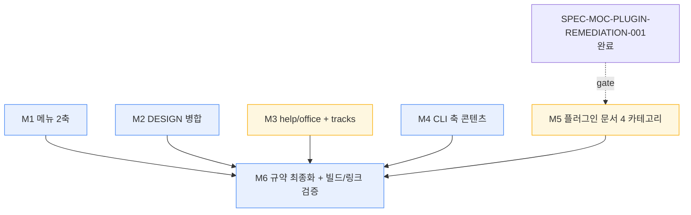

# SPEC-MOC-SITE-IA-001 — 구현 계획 (plan.md)

## §A. Context (위치 + 산출물 + 기준선)

- **작업 위치**: `/Users/goos/MoAI/claude.mo.ai.kr` (project root), 소유 트리 `www/**` 전용.
- **SPEC 산출물**: `.moai/specs/SPEC-MOC-SITE-IA-001/{spec.md, plan.md, acceptance.md, progress.md}`.
- **Tier**: L (제안). 실측 규모 > 15 파일(신규 CLI ~25-30p + 플러그인 재작성 33p + DESIGN 병합 21p + 메뉴). 콘텐츠/문서 SPEC이므로 design.md/research.md는 본문 §C(설계 결정)에 인라인하고, 필요 시 오케스트레이터 판단으로 후속 추가 가능(§H 참조).
- **기준선(2026-07-02 실측, HEAD 6d78fbf)**: 콘텐츠 178 md / 11 flat 섹션, mermaid 139/178, aliases 선례 10p, **DESIGN 병합(흡수+alias) 이미 완료** — `content/design/`가 `/claude-design/*` alias 10 + 고유 `official-quickstart.md` 보유; `content/claude-design/`는 미삭제 근중복만 잔존 → **R2 잔여 = 디렉토리 삭제만**, `plugins/` 33p obsolete(4-카테고리 서브디렉토리 0 · `/plugins/` alias 0), `/cli/` 부재, in-scope 마커(`ia_in_scope: true`) 0, source-index 제한문구("다루지 않음") 4건·`/cli/` 참조 0, CLI 원천 13 섹션 존재.
- **PRESERVE 대상**: `www/hugo.toml`(version SSOT 불변), `www/themes/**`, `www/layouts/**`, `www/assets/**`, `releases/**`(38p 유지), `cookbook/**` 본문(39p 유지 — 메뉴 중복만 정리), `plugins/**` 소스(별도 SPEC 소관 — 문서화만).
- **EXTEND 대상**: `www/data/menu/main.yaml`(2축 재편), `www/content/help/source-index.md`(CLI 축 확장).

## §B. Known Issues (자동 주입 — 관련 카테고리만)

문서/콘텐츠 SPEC이므로 Go 빌드 관련(B1) 등은 비해당. 관련 카테고리:

- **B4 (Frontmatter Canonical Schema)**: spec.md 프론트매터는 canonical 12-field + `created:`/`updated:`/`tags:`(snake_case alias 금지). tier/depends_on/related_specs는 optional 필드로 허용. 참조: `.claude/rules/moai/development/spec-frontmatter-schema.md`.
- **B6 (spec-lint Out of Scope heading)**: `## Out of Scope`(h2) 단독은 `MissingExclusions` ERROR. `### Out of Scope — <topic>`(h3) sub-heading + `-` bullet 필수 → spec.md §E에 6개 H3 sub-section으로 충족.
- **B8/B10 (Working Tree Hygiene / Scope Discipline)**: `www/**` 외 변경 금지. `plugins/**` 소스, `moai-adk-go/**`, `.moai/state/**` 손대지 말 것. CLI 원천은 **읽기 전용** 참조.
- **B11 (Subagent Boundary)**: run-phase에서 사용자 결정 필요 시(예: chat 카테고리 A안 최종 확인, 아카이브 vs 삭제 정책) AskUserQuestion 대신 structured blocker report 반환.

## §C. Pre-flight Check List (착수 전 검증)

```bash
# 1. 소유 트리 및 브랜치 확인
git branch --show-current
git rev-parse HEAD

# 2. 기준선 재측정 (재편 delta 계산 기준)
find www/content -name '*.md' | wc -l                         # 178 기대
ls www/content/design/_index.md www/content/claude-design/_index.md   # 두 파일 존재
ls -d www/content/cli 2>&1                                     # 부재 기대(무충돌)
grep -rl '```mermaid' www/content --include='*.md' | wc -l    # 139 기준선

# 3. 의존 SPEC 상태 확인 (R3 게이트)
ls .moai/specs/SPEC-MOC-PLUGIN-REMEDIATION-001/ 2>&1          # 미존재 시 M5 보류

# 4. Hugo 빌드 baseline (재편 전 clean 확인)
cd www && hugo --gc --minify 2>&1 | tail -5

# 5. 링크 체커 존재 확인
ls www/scripts/ www/tools/ 2>&1
```

## §D. Constraints (DO NOT VIOLATE)

- **소유 경계**: `www/**` 만 편집. `plugins/**`·`moai-adk-go/**`·`.moai/state/**`·테마/레이아웃 코드 변경 금지.
- **버전 불변**: `www/hugo.toml` `params.version` 변경 금지(§E Out of Scope).
- **URL 보존**: 기존 섹션 URL 유지. 신규 prefix는 `/cli/` 단 하나만 허용(REQ-IA-022).
- **alias 의무**: 제거·이동되는 모든 경로에 `aliases:` 리다이렉트 부여(REQ-IA-006/010/016/023).
- **raw port 금지**: CLI 콘텐츠는 재저작(입문자 톤). moai-adk-go 원문 복붙 금지(REQ-IA-013).
- **R3 시퀀싱**: 플러그인 카테고리 페이지 최종화는 SPEC-MOC-PLUGIN-REMEDIATION-001 완료 이후(REQ-IA-011, §F M5 gate).
- **Conventional Commits**: `feat(SPEC-MOC-SITE-IA-001): M{N} <subject>` + `🗿 MoAI` trailer. `--no-verify`/`--amend`/force-push 금지.

## §E. Self-Verification Deliverables (완료 보고 시 포함)

run-phase 완료 시 manager-develop는 다음을 자기검증하여 보고한다:

- **E1. AC Binary PASS/FAIL Matrix** — acceptance.md AC-IA-001..023 각각 검증 명령 + 실제 출력.
- **E2. Hugo Build** — `cd www && hugo --gc --minify` → exit 0 (에러/broken link 0).
- **E3. 링크 검사** — www/scripts 링크 체커 또는 htmltest → broken internal 0.
- **E4. 메뉴 2축 grep** — `grep -nE '데스크탑|CLI 축|공통' www/data/menu/main.yaml` → 축 마커 매치.
- **E5. delta 측정** — `ls -d www/content/claude-design`(부재), `ls -d www/content/cli`(존재), `find www/content/plugins -maxdepth 1 -type d`(4 카테고리).
- **E6. per-page mermaid + 마커 완전성** — in-scope 페이지(신규 CLI + 재작성 plugins + 병합 DESIGN)에 대해 (i) mermaid 부재 페이지 0, (ii) **마커 완전성 자기검증**: 신규 `content/cli/**` 및 재작성 `content/plugins/{chat,cowork,design,code}/**`는 floor 가드(AC-IA-024b)로 전량 `ia_in_scope: true` 확인, 부분-재작성 DESIGN 트리는 실제 재작성한 페이지가 모두 마킹되었는지 개별 확인 보고(AC-IA-024c — marker-escape로 AC-IA-018/019/020 우회 방지).
- **E7. Branch HEAD + Push state** — 신규 commit SHA 목록 + push 결과.
- **E8. Blocker Report** — 위임 prompt 미명시 사용자 결정 필요 시 structured blocker(AskUserQuestion 금지).

## §F. Milestones (우선순위 기반 — 시간 추정 없음)

의존 무관 마일스톤(M1·M2·M3·M4)은 병렬 가능. M5는 REMEDIATION-001 게이트. M6은 교차 최종.

### M1 — 메뉴 2축 재편 + URL 전략 (Priority High) — R1, R7
- `www/data/menu/main.yaml`을 데스크탑 축 / CLI 축 / 공통 하단(도움말·쿡북·릴리스)으로 재정렬.
- 데스크탑 축 순서: 시작하기 → CHAT → COWORK → DESIGN → CODE → 🧩 MoAI 플러그인.
- CLI 축 자리 예약(플레이스홀더 섹션: 시작하기·핵심 개념·일상 사용·MoAI-ADK·레퍼런스; 콘텐츠는 M4에서 채움).
- 축 시각 마커(emoji/comment separator) 추가. cookbook/tracks 메뉴 중복 제거는 M3와 조율.
- 산출물: 재편된 main.yaml. 검증: AC-IA-001..004, AC-IA-022.

### M2 — DESIGN 병합 마무리 (Priority High) — R2
- **HEAD 상태: 흡수 + alias 이미 완료** (`design/`가 고유 `official-quickstart.md` + `/claude-design/*` alias 10 보유). run-phase 잔여는 아래 삭제·검증뿐 — **재흡수·재alias 금지**(중복 작업 방지, 회귀 위험만 유발).
- `content/claude-design/` 디렉토리 삭제(유일한 실질 변경).
- 삭제 후 회귀 확인: `design/` alias 커버리지 ≥ 10 유지 + 링크체커 broken 0(고유 콘텐츠 유실·alias 손실 검출).
- 메뉴 DESIGN 항목을 데스크탑 축 하 단일 섹션으로 정리.
- 산출물: `claude-design/` 삭제 + 단일 DESIGN 섹션. 검증: AC-IA-005/006(삭제 신호와 AND).

### M3 — help/office 통합 + tracks 중복 제거 (Priority Medium) — R5
- `office/`(2p)를 도움말 영역 하로 이동 + alias.
- cookbook/tracks 메뉴 중복(쿡북 ↔ 실전 트랙) 단일화.
- 산출물: 통합된 도움말 영역, 중복 제거된 메뉴. 검증: AC-IA-016/017.

### M4 — CLI 축 신규 콘텐츠 `/cli/` (Priority High, 최대 규모) — R4, R6
- `content/cli/` 신규 생성, 5 섹션(시작하기·핵심 개념·일상 사용·MoAI-ADK·레퍼런스).
- moai-adk-go docs-site ko 섹션 매핑 포팅+재저작(REQ-IA-013 표) + 공식 문서 보강.
- MoAI-ADK 섹션에 SPEC 라이프사이클 stateDiagram(PLAN→RUN→SYNC) 포함.
- 브리지 내러티브 + moai-code Tier 1~3 표 재사용(REQ-IA-015; Tier 표 확정은 BOOTSTRAP-DESKTOP-001 참조 — 미확정 시 blocker report).
- per-page 규약(prose-first / mermaid / 출처 블록 / CLI 톤) 적용.
- 산출물: ~25-30 신규 페이지. 검증: AC-IA-012..015, AC-IA-018..021.

### M5 — 플러그인 문서 현행화 4 카테고리 (Priority Medium, GATED) — R3
- **게이트**: SPEC-MOC-PLUGIN-REMEDIATION-001 완료 확인(REQ-IA-011). 미완료 시 M5 보류 + blocker report.
- 구 33p 아카이브(이동 또는 제거) + 각 경로 alias.
- 4 카테고리 생성: chat(문서 허브 A안 — `chat/skills-plugins.md` 승격), cowork/design/code(빌드 플러그인, 공통 스켈레톤 intro→install diagram→top-5 skills→full index→recipe links).
- 현행 마켓플레이스(3 플러그인) 반영.
- 산출물: 재작성된 plugins 섹션. 검증: AC-IA-007..011.

### M6 — 콘텐츠 규약 최종화 + source-index 확장 + 빌드/링크 검증 (Priority High, 교차 최종) — R6, R7
- in-scope 페이지 per-page mermaid/출처 블록/톤 최종 점검.
- `help/source-index.md`를 CLI 축까지 확장("개발자/CLI·SDK 미포함" 제한 제거).
- `hugo --gc --minify` exit 0 + 링크 검사 broken 0 최종 게이트.
- 산출물: 확장된 source-index, green 빌드. 검증: AC-IA-020, AC-IA-023.

### 마일스톤 의존 그래프



## §G. Anti-Patterns (피할 것)

- **raw port**: moai-adk-go 개발자 문체를 그대로 복사(REQ-IA-013 위반). 반드시 입문자 톤으로 재저작.
- **alias 누락**: `claude-design/`·구 `plugins/`·`office/` 경로 제거 후 alias 미부여 → 링크 파손(REQ-IA-023 위반).
- **URL prefix 남발**: `/cli/` 외 신규 prefix 추가 → REQ-IA-022 위반.
- **R3 선행**: REMEDIATION-001 미완료 상태에서 플러그인 카테고리 최종화 → obsolete 상태 재문서화 위험.
- **버전 임의 bump**: hugo.toml version 변경 → §E Out of Scope 위반.
- **기존 gap 소급 과잉**: 39p 기존 mermaid gap 전면 소급을 본 SPEC에 끌어들임 → 범위 초과(§E).
- **챗 플러그인 신설**: chat 카테고리를 빌드 플러그인으로 문서화 → REQ-IA-008 위반(A안 문서 허브만).

## §H. Cross-References

- 요구사항 SSOT: `spec.md` §B (REQ-IA-001..023).
- 수용 기준 SSOT: `acceptance.md` (AC-IA-001..023 + GWT).
- 진행 신호: `progress.md` §E.
- 의존: SPEC-MOC-PLUGIN-REMEDIATION-001(R3 게이트), SPEC-MOC-BOOTSTRAP-DESKTOP-001(Tier 1~3 표).
- 프론트매터 스키마: `.claude/rules/moai/development/spec-frontmatter-schema.md`.
- Tier 정의: `.claude/rules/moai/workflow/spec-workflow.md` § SPEC Complexity Tier.
- **Tier L 산출물 참고**: 관례상 Tier L은 5-file(+design.md/research.md). 본 SPEC은 콘텐츠 성격상 3-file + progress.md로 제출하며, 설계 결정을 spec.md §C에 인라인함. 오케스트레이터가 full Tier-L 처리를 원할 경우 design.md(축별 페이지 매트릭스)/research.md(CLI 원천 섹션 상세 매핑) 후속 추가 가능.
