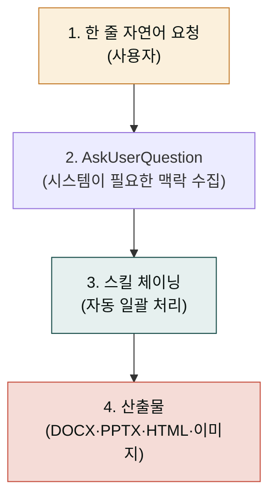

  
 ·  · cowork.mo.ai.kr

  <h1>업무에 바로 쓰는 AI 협업 스킬 152종.</h1>
  

    23개 분야에 걸친 MoAI-Cowork 플러그인 모음. Claude Code에서 슬래시 한 번으로 사업계획서·IR 덱·계약서·블로그·정부지원사업 신청서·이커머스 광고 풀세트·메타 광고 보고서 분석·한국 출판사 제출 원고·<strong>Claude Design 보조 5종</strong>까지 — 한국어로, 끝까지.
  

  

    <a class="btn btn--primary" href="/getting-started/quick-start/">5분 만에 시작 →</a>
    <a class="btn btn--ghost" href="/plugins/">플러그인 둘러보기</a>
  

  

    

152

총 스킬

    

23

분야 플러그인

    

78

문서 페이지

    



최신 릴리스

  

  

    

      모두의 AI 아카데미
      <h3 class="cw-academy-banner__title">강의로 가장 빠르게 익히기</h3>
    

    

      cowork-plugins를 실무에 적용하는 3일 강의입니다. 사업계획·이커머스·콘텐츠·디자인 트랙을 직접 따라 만들어 보며 한국어 도메인 워크플로우를 익힐 수 있습니다.
    

    <ul class="cw-academy-banner__points">
      <li>3일 집중 — 한국 도메인 트랙(B2B·이커머스·콘텐츠·디자인) 직접 실습</li>
      <li>실제 산출물 제작 — 사업계획·랜딩·카드뉴스·메타 광고 보고서까지</li>
      <li>강사 직강·소규모 정원 운영 — 1대1 피드백 가능</li>
    </ul>
    

      <a class="btn btn--primary" href="https://academy.mo.ai.kr/?utm_source=cowork-docs&utm_medium=banner&utm_campaign=docs-home" target="_blank" rel="noopener noreferrer">강의 안내 보기 →</a>
      <a class="btn btn--ghost" href="/cookbook/" >쿡북으로 먼저 둘러보기</a>
    

  

  <h2 id="how-it-works" style="margin:0">HOW이렇게 동작합니다</h2>
  긴 프롬프트를 직접 쓰는 도구가 아닙니다 · 짧게 말하면 시스템이 묻습니다

**예시**: 사용자가 "AI 영어 회화 앱 사업계획서 만들어줘"라고 한 줄 입력 → 시스템이 단계·조달목표·타깃·형식·저장경로를 인터뷰 → `strategy-planner → docx-generator → ai-slop-reviewer` 자동 실행 → DOCX 도착.

➡️ **[4가지 사용 패턴 자세히 보기](/cowork/patterns/)** — 단일 프롬프트 · 멀티턴 대화 · 배치 처리 · 스케줄 자동화

  <h2 id="quickstart" style="margin:0">START약 10분 빠른 시작</h2>

Claude Code에 MoAI-Cowork 마켓플레이스를 등록하고, 가장 자주 쓰는 플러그인 한두 개만 활성화하면 끝. 슬래시 명령으로 자연어처럼 호출됩니다.

  <a class="cw-qs-card" href="/getting-started/install/">
    
01 · 설치 (약 3분)

    
마켓플레이스 등록

    
Claude Desktop에서 cowork-plugins 마켓플레이스를 추가합니다.

  </a>
  <a class="cw-qs-card" href="/plugins/">
    
02 · 선택 (약 2분)

    
분야별 플러그인 활성화

    
22개 분야 중 필요한 것만 켭니다. moai-core는 필수.

  </a>
  <a class="cw-qs-card" href="/getting-started/first-task/">
    
03 · 첫 작업 (약 5분)

    
한 줄 명령으로 첫 산출물

    
/project init 으로 프로젝트 설정 → 짧은 자연어로 첫 결과물 받아보기.

  </a>
  <a class="cw-qs-card" href="/cookbook/tracks/">
    
04 · 트랙

    
실전 트랙으로 깊게

    
사업계획서·이커머스·법무 등 역할별 10개 워크플로우 가이드.

  </a>

  <h2 id="plugins-grid" style="margin:0">22분야별 플러그인</h2>
  총 143개 스킬 · 22개 도메인

  <a class="cw-card" href="/plugins/moai-business/">
    

비
10개 스킬

    

비즈니스v1.5

moai-business

    
사업계획서·IR·시장조사·정부지원사업

    
IR사업계획정부지원

  </a>
  <a class="cw-card" href="/plugins/moai-content/">
    

콘
12개 스킬

    

콘텐츠v2.2

moai-content

    
블로그·뉴스레터·SNS·카피라이팅·SEO + 한국어 AI 티 정밀 윤문 + HTML 보고서 + 상세페이지 기획

    
블로그SNShumanizehtml-reportdetail-planner

  </a>
  <a class="cw-card" href="/plugins/moai-marketing/">
    

마
11개 스킬

    

마케팅v2.5

moai-marketing

    
캠페인·퍼포먼스·CRM·광고 카피·이메일 시퀀스 + 광고 심리학 통합·랜딩 진단·픽셀 검증 + 메타 광고 보고서 분석(9 모듈·4D 교차·🟢🟡🔴 강도별 액션)

    
캠페인광고랜딩 진단픽셀메타 분석MCP

  </a>
  <a class="cw-card" href="/plugins/moai-media/">
    

미
4개 스킬

    

미디어v2.11

moai-media

    
이미지 프롬프트 텍스트 빌더 3종(GPT-image-2·Gemini 3·Midjourney v8 공식 가이드) + ElevenLabs 32개 언어 음성. 실제 이미지·영상 생성은 <strong>Higgsfield MCP</strong> 단일 통합

    
GPT Image 2Gemini 3Midjourney v8ElevenLabs

  </a>
  <a class="cw-card" href="/plugins/moai-commerce/">
    

커
35개 스킬

    

커머스v2.8

moai-commerce

    
한국 D2C 풀스택 35 스킬 — 시장조사·JTBD·상품명·채널 메시지·통합 전략·자동화 진단 + 쿠팡 광고 최적화·마진 계산 + LTV/CAC·프로모션·재구매·상품 이미지·리뷰·VOC·구독·인플루언서·얼리팬·트렌드·시즌

    
D2C 풀스택LTV/CAC프로모션재구매리뷰VOC구독

  </a>
  <a class="cw-card" href="/plugins/moai-office/">
    

오
5개 스킬

    

오피스

moai-office

    
DOCX·XLSX·PPTX·HWPX 자동 생성

    
DOCXXLSXPPTX

  </a>
  <a class="cw-card" href="/plugins/moai-research/">
    

연
5개 스킬

    

연구

moai-research

    
논문·문헌리뷰·특허·연구과제

    
논문문헌과제

  </a>
  <a class="cw-card" href="/plugins/moai-product/">
    

프
4개 스킬

    

프로덕트

moai-product

    
PRD·로드맵·UX 리서치·릴리스 노트

    
PRDUX로드맵

  </a>
  <a class="cw-card" href="/plugins/moai-data/">
    

데
3개 스킬

    

데이터

moai-data

    
공공데이터·SQL·시각화·분석 리포트

    
공공데이터SQL

  </a>
  <a class="cw-card" href="/plugins/moai-finance/">
    

재
6개 스킬

    

재무

moai-finance

    
세무·결산·예실·재무제표

    
세무결산예실

  </a>
  <a class="cw-card" href="/plugins/moai-legal/">
    

법
5개 스킬

    

법무

moai-legal

    
계약서·NDA·약관·컴플라이언스

    
계약서NDAGDPR

  </a>
  <a class="cw-card" href="/plugins/moai-hr/">
    

인
5개 스킬

    

인사

moai-hr

    
채용공고·평가·1:1·온보딩·HR 정책

    
채용평가온보딩

  </a>
  <a class="cw-card" href="/plugins/moai-operations/">
    

운
3개 스킬

    

운영

moai-operations

    
회의록·SOP·체크리스트·내부 공지

    
회의록SOP

  </a>
  <a class="cw-card" href="/plugins/moai-support/">
    

고
4개 스킬

    

고객지원

moai-support

    
FAQ·티켓·매크로·CSAT 리포트

    
FAQ티켓

  </a>
  <a class="cw-card" href="/plugins/moai-education/">
    

교
5개 스킬

    

교육v2.11

moai-education

    
강사·교수·교사 교육 콘텐츠 풀스택 — 강의안·평가지·학습자료·코호트 운영 + 1일~16주 모든 강의 형식 커리큘럼 설계 + 강의·연수·정규 강좌 후기 자산화

    
강의안커리큘럼후기 자산화

  </a>
  <a class="cw-card" href="/plugins/moai-career/">
    

커
4개 스킬

    

커리어

moai-career

    
이력서·자기소개서·포트폴리오·면접 대비

    
이력서면접

  </a>
  <a class="cw-card" href="/plugins/moai-lifestyle/">
    

라
3개 스킬

    

라이프스타일

moai-lifestyle

    
여행 일정·가계부·건강·취미

    
여행가계

  </a>
  <a class="cw-card" href="/plugins/moai-bi/">
    

B
1개 스킬

    

BI·임원 1pager

moai-bi

    
경영진·이사회용 1페이지 요약 (What / So What / Now What) — K-IFRS·DART·KOSIS 친화

    
1pagerK-IFRS임원 보고

  </a>
  <a class="cw-card" href="/plugins/moai-pm/">
    

P
1개 스킬

    

프로젝트 관리

moai-pm

    
한국 팀 주간보고(WBR) 자동 — 임원 격식체 + 팀 구어체 두 버전 동시. Notion·Linear·Asana·Slack MCP 활용

    
WBR격식체/구어체MCP fetch

  </a>
  <a class="cw-card" href="/plugins/moai-sales/">
    

S
1개 스킬

    

B2B 영업 제안

moai-sales

    
B2B 12섹션 제안서 — Three C's (Compliant·Complete·Compelling) + RFP 답변 + 컴플라이언스 체크리스트

    
제안서RFPThree C's

  </a>
  <a class="cw-card" href="/plugins/moai-book/">
    

책
8개 스킬

    

출판v2.10 NEW

moai-book

    
한국 출판사 제출용 원고 풀스택 — 컨셉서·페르소나·목차·저자 약력·제안서·출판사 매칭·본문·퇴고 8 단계. 4 장르 자동 분기 + 30+ 출판사 + 자비 출판 5 플랫폼 + KPIPA·국립국어원·도서정가제

    
출판 풀스택4 장르30+ 출판사자비 출판

  </a>
  <a class="cw-card featured" href="/plugins/moai-core/">
    

코
8개 스킬

    

코어 (필수)v2.3

moai-core

    
프로젝트 초기화·AI 슬롭 검수·스킬 관리·MCP 4커넥터 인증 — 반드시 먼저 설치

    
projectai-slopMCP 4커넥터

  </a>

  <h2 id="cookbook-tracks" style="margin:0">COOK실전 트랙</h2>
  분야별 워크플로우 가이드 · 6개 트랙

스킬을 어떻게 조합하느냐가 결과를 결정합니다. 자주 쓰는 6개 워크플로우를 트랙으로 정리했습니다.

  <a class="cw-track" href="/cookbook/tracks/track-documents/">
    
01

    

문서 트랙

사업계획서 · IR · 보고서

  </a>
  <a class="cw-track" href="/cookbook/tracks/track-marketing/">
    
02

    

마케팅 트랙

블로그 · SNS · 캠페인

  </a>
  <a class="cw-track" href="/cookbook/tracks/track-data/">
    
03

    

데이터 트랙

공공데이터 · 시각화

  </a>
  <a class="cw-track" href="/cookbook/tracks/track-legal/">
    
04

    

법무 트랙NEW

계약서 · NDA · 컴플라이언스

  </a>
  <a class="cw-track" href="/cookbook/tracks/track-finance/">
    
05

    

재무 트랙NEW

세무 · 결산 · 예실

  </a>
  <a class="cw-track" href="/cookbook/tracks/track-product/">
    
06

    

프로덕트 트랙NEW

PRD · 로드맵 · UX

  </a>

  <h2 id="release-summary" style="margin:0">v2.13최근 릴리스</h2>
  CHANGELOG.md 기반

  

    

      v2.15.0
      2026-05-30
      MINOR
    

    
Meta 공식 Ads AI Connectors + NotebookLM 슬라이드 프롬프트 신규 2 스킬

    
<a href="https://mcp.facebook.com/ads" target="_blank" rel="noopener">Meta Ads MCP (공식 OAuth 커넥터)</a>로 캠페인·광고세트·광고를 자연어 한 줄로 생성·수정·예산·온오프. <code>meta-ads-manager</code>는 신규 리소스 PAUSED 기본값·쓰기 동작 사용자 승인 필수(2단계 안전 제어). 또한 Google <a href="https://notebooklm.google.com" target="_blank" rel="noopener">NotebookLM</a>의 Video Overview·슬라이드용 한국어 소스·대본·구조를 설계한 <code>notebooklm-slide-prompt</code> + 슬라이드별 나노바나나 이미지 프롬프트 자동 생성. <strong>23 플러그인 · 150 → 152 스킬 · 동기화 지점 175 유지 · Breaking change 없음</strong>. Meta OAuth 2.0 정정(기존 정적 토큰·서드파티 3종 제거).

    <ul>
      <li><strong>meta-ads-manager (신규)</strong> — Meta 공식 <a href="https://mcp.facebook.com/ads" target="_blank" rel="noopener">Ads AI Connectors</a>(OAuth 커넥터) 직접 호출. 캠페인·광고세트·광고 CRUD + 예산·상태 온오프 · 자동 권장사항(타겟·입찰가·크리에이티브) · 성과 메트릭 조회(노출·클릭·ROAS) · 신규 리소스 기본값 PAUSED(실수 방지) · 쓰기 동작은 사용자 2단계 확인(AskUserQuestion)</li>
      <li><strong>notebooklm-slide-prompt (신규)</strong> — Google NotebookLM의 Video Overview·슬라이드 생성용 한국어 소스·대본·구조·타이밍 설계 + 슬라이드별 나노바나나 이미지 프롬프트(Nano Banana Pro/Light) 자동 생성 · 4·7·10·15·20 슬라이드 분량 확장 · 브랜드 톤·시각 스타일·폰트 옵션</li>
      <li><strong>Meta OAuth 2.0 정정</strong> — 기존 정적 토큰·서드파티 fallback 3종 제거 · 공식 OAuth 커넥터 단일 지원</li>
    </ul>
  

  

    

      v2.13.0
      2026-05-20
      MINOR
    

    
moai-media Higgsfield MCP 직접 호출 — higgsfield-image · higgsfield-video 신규 2 스킬

    
<a href="https://higgsfield.ai" target="_blank" rel="noopener">higgsfield.ai</a> 공식 11 이미지 모델 + 11 영상 모델 + 6 비디오 프리셋을 자연어 한 줄로 호출. <code>.mcp.json</code>에 Higgsfield hosted MCP(<code>https://mcp.higgsfield.ai/mcp</code>) + ElevenLabs MCP 2종 자동 등록. API 키 별도 발급 불필요(OAuth 1회). 23 플러그인 유지·148 → <strong>150 스킬</strong>·동기화 지점 173 → 175. Breaking change 없음.

    <ul>
      <li><strong>higgsfield-image (신규)</strong> — 공식 11 이미지 모델 자동 선택. Soul · Soul 2.0 · Soul Cinema · Nano Banana · Nano Banana Pro · GPT Image · GPT Image 2 · Seedream 4.0 · Flux Kontext · Wan 2.2 Image · Wan 2.5. 글자·카드뉴스 1순위는 <strong>GPT Image 2</strong>(SOTA), 시네마틱은 Soul Cinema, 사진 사실성은 Flux Kontext</li>
      <li><strong>higgsfield-video (신규)</strong> — 공식 11 영상 모델 + 6 프리셋. Sora 2 · Google Veo 3 · Kling 2.1 Master / 2.5 Turbo / 3.0 · Kling Avatars 2.0(캐릭터 일관성) · Seedance 2.0 / Pro · Cinema Studio 3.5 · MiniMax Hailuo 02 · Wan 2.5. 프리셋: UGC · Unboxing · Product review · Hyper motion · TV spot · Wild Card</li>
      <li><strong>Soul Characters · Kling Avatars 2.0</strong> — 캐릭터 일관성 보장. 1차 생성 → reference UUID → 이후 동일 인물 다양한 포즈·씬</li>
      <li><strong>비동기 잡 폴링</strong> 자동 처리 — queued → in_progress → completed (이미지 5-15초·영상 10-90초)</li>
      <li><strong>references 보강</strong> — model-guide.md(11 모델 비교 매트릭스) + dop-motions.md(6 프리셋·모델별 톤·호출 예시)</li>
    </ul>
  

  

    

      v2.12.x
      2026-05-20
      MINOR + 3 PATCH
    

    
moai-design 신규 플러그인 + Claude Design 가이드 10페이지 + moai-office 모던 디자인 + card-news 보강

    
v2.12.0 (MINOR) + v2.12.1·v2.12.2·v2.12.3 (PATCH) 묶음. 22 → <strong>23 플러그인</strong>, 143 → <strong>148 스킬</strong>, 동기화 지점 167 → 173. Breaking change 없음.

    <ul>
      <li><strong>v2.12.0 — moai-design 신규 5 스킬</strong> — claude-design-brief 6요소 자동 채움 · claude-design-system-prep DESIGN.md 합성 · claude-design-prompt-builder 시니어 UX 10 패턴 · claude-design-handoff-reader Claude Code 핸드오프 분석 · claude-design-slop-check AI 슬롭 검수. docs-site에 <strong>클로드 디자인 섹션 10페이지</strong> 동시 신설(개요·시작·디자인 시스템·리파인먼트·협업·내보내기·사용 사례·BP·요금제·제한)</li>
      <li><strong>v2.12.1 — moai-office docx·pptx 모던 디자인 시스템</strong> — Claude 톤 색·6 문서 유형별 템플릿(공문서·기업 보고서·계약서·제안서·기획서·사업계획서) · 10 큐레이션 PPTX 팔레트 · 9 비즈니스 슬라이드 아키타입(Title·Agenda·Problem·Solution·Features·Stats·Team·CTA·Closing) · 5 폰트 페어링 · HTML-First 옵션 · 10단계 자동 QA</li>
      <li><strong>v2.12.2·v2.12.3 — moai-content:card-news 보강·정련</strong> — 10 구성 패턴(A·B 듀얼·순차 빌드·체크박스·궁금증·함정·첫 발·개념 사전·페인 솔루션·실전 사례·즉시 활용) + 5 디자인 톤(Soft Cream·Claude Modern·Corporate Trust·Playful Pop·Bold Dark) + 채널별 캡션(인스타·스레드·카카오·페이스북) + 4·7·10장 분량 확장</li>
    </ul>
  

  

    

      v2.11.1
      2026-05-18
      PATCH
    

    
v2.11.0 후속 정정 · fal-ai 완전 제거(Higgsfield 단일) · /project init Phase 2/4 · hugo.toml SSOT

    
v2.11.0 발행 후 사용자 보고 5건 정정 PATCH. fal-ai MCP 9 파일 32건 완전 제거(Higgsfield 단일 통합). <code>/project init</code> Phase 2 Inventory(cowork 22 화이트리스트) + Phase 4 Gap Detection(누락 감지+설치 안내) + Re-entry(<code>/project init resume</code>) 추가. hugo.toml SSOT로 좌측 사이드바·footer·badge 자동 반영. 22 플러그인·143 스킬 유지. Breaking change 없음.

    <ul>
      <li><strong>fal-ai 완전 제거</strong> — 이미지·영상 직접 생성은 Higgsfield MCP 단일 통합. 번들 MCP는 higgsfield+elevenlabs 2종</li>
      <li><strong>/project init Phase 2 Inventory</strong> — cowork-plugins 22 화이트리스트 필터 + 각 플러그인의 모든 SKILL.md 완전 스캔. 다른 마켓플레이스 출처는 완전 제외</li>
      <li><strong>/project init Phase 4 Gap Detection</strong> — 체인 누락 자동 감지 + AskUserQuestion 4 옵션(설치 안내·제외·대체·중단) + .moai/cache/init-progress.json 진행 상태 저장</li>
      <li><strong>/project init resume 신규</strong> — 누락 플러그인 설치 완료 후 진행 재개. 자연어 "이어서 진행" 발화도 지원</li>
      <li><strong>hugo.toml SSOT</strong> — [params] version 한 줄 갱신으로 좌측 사이드바·footer·version-badge 모든 표시 위치 자동 반영. 동기화 지점 166 → 167</li>
    </ul>
  

  

    

      v2.11.0
      2026-05-18
      MINOR
    

    
moai-media 정리(16→4) · 강의 컨텍스트 제거 · docs-site 일관성 정리

    
22 플러그인 유지, <strong>155 → 143 스킬</strong>, 동기화 지점 178 → 166. Breaking change 없음. moai-media wrapper 12개 제거(이미지·영상 직접 호출은 Higgsfield MCP, 음성은 ElevenLabs MCP에 위임). 특정 강의 컨텍스트가 SKILL.md·docs-site·README 전반에서 제거되어 본 저장소는 도메인 스킬 마켓플레이스 정체성으로 환원.

    <ul>
      <li><strong>moai-media 4 스킬 유지</strong> — gpt-image-2-prompt · gemini-3-image-prompt · midjourney-v8-prompt (3대 모델 공식 가이드 프롬프트 텍스트 빌더) + audio-gen (ElevenLabs 32개 언어 음성)</li>
      <li><strong>moai-education 범용화</strong> — "강사·교수·교사 교육 콘텐츠 풀스택"으로 재정의. 1일~16주 모든 강의 형식 지원</li>
      <li><strong>moai-career 한국 채용 2026 재설계</strong> — 팀핏 면접·핀셋 채용·AI 진정성·4 플랫폼 MAU·헤드헌터 5축·NCS·블라인드 반영</li>
      <li><strong>moai-bi html-report 중심 재정의</strong> — 단일 HTML 파일(이미지·CSS·JS 인라인)로 카톡 즉시 확인 + pdf/docx/pptx/hwpx 변환은 옵션</li>
      <li><strong>docs-site 정리</strong> — 물결 strikethrough 정정(266+ 파일), mermaid 가로→세로(67 파일), GOAL+AskUserQuestion+체이닝 공통 골격, 터미널 prompt shortcode 통일, 삭제 페이지 4종</li>
    </ul>
  

  

    

      v2.10.0
      2026-05-17
      MINOR
    

    
신규 플러그인 <strong>moai-book</strong> — 한국 출판사 제출용 원고 풀스택 8 스킬

    
도서 컨셉서·페르소나·목차·저자 약력·출판 제안서·출판사 매칭·본문·퇴고 8 단계가 단일 플러그인 안에서 체이닝. 실용서·인문·기술·소설 4 장르 자동 분기. KPIPA·국립국어원·도서정가제·교보문고·알라딘·예스24 + 30+ 한국 출판사 라이브러리 + 자비 출판 5 플랫폼. <strong>21 → 22 플러그인 · 147 → 155 스킬 · 동기화 지점 169 → 178</strong>.

    <ul>
      <li><strong>book-concept-planner / book-target-reader / book-outline-designer / book-author-bio</strong> — 컨셉서·USP·페르소나·JTBD·목차·저자 약력 (1-4 단계)</li>
      <li><strong>book-proposal-writer / book-publisher-matcher</strong> — A4 12-20장 출판 제안서 + 30+ 출판사 Top 5 추천 + 차순위 시나리오 (5-6 단계)</li>
      <li><strong>book-chapter-writer / book-revision-coach</strong> — 본문 집필(꼭지 5 요소) + 퇴고 7 단계 + 4 체인 검수(spell-check → revision-coach → humanize-korean → ai-slop-reviewer) (7-8 단계)</li>
      <li>8 스킬 4차원 루브릭 자가 평가 가중 평균 <strong>0.85</strong>, ai-slop APPROVE, frontmatter v2.0.0 정책 준수</li>
    </ul>
  

  

    

      v2.9.0
      2026-05-17
      MINOR
    

    
moai-media 이미지 프롬프트 빌더 3종 — GPT-image-2·Gemini 3 Pro·Midjourney v8

    
OpenAI Cookbook 6-Block, Google AI Developers 5-component, Midjourney v8.1 Parameter List 등 3대 모델의 공식 프롬프트 가이드를 그대로 적용한 빌더 스킬 3종. AskUserQuestion 프리셋(제품샷·인물·일러스트·풍경) + 미세조정 라운드로 컨텍스트 수집 후 3개 모델별 어조 동시 변환. 144 → <strong>147 스킬</strong>, 동기화 지점 166 → 169.

    <ul>
      <li><strong>gpt-image-2-prompt</strong> — 6-Block(Subject·Action·Scene·Composition·Lighting·Style&Text), 편집 시 Change/Preserve/Constraints 2열, 텍스트 verbatim·ALL CAPS·다국어(한·일·중·힌·벵골)</li>
      <li><strong>gemini-3-image-prompt</strong> — 5-component 영문 문장형, 카메라 하드웨어 지정, Reference image 14 슬롯, Search Grounding, Thinking vs Fast 모드, SynthID 워터마크</li>
      <li><strong>midjourney-v8-prompt</strong> — `--sref`/`--oref`/`--cw`/`--p` 3대 reference deep dive, 6대 비용 함정 자동 검사(`--hd --q 4` 16x cost, `--cref` deprecation 자동 교체)</li>
      <li>책임 경계 — <strong>프롬프트 텍스트 산출 전용</strong>. 실제 이미지 생성은 페어 스킬(`higgsfield-image`) 또는 외부(Discord/web alpha)</li>
    </ul>
  

  

    

      v2.8.0
      2026-05-16
      MINOR
    

    
moai-commerce 한국 D2C 완결 신규 7 스킬 — 리뷰·VOC·구독·인플루언서·얼리팬·트렌드·시즌

    
5채널 리뷰 통합 · VOC KTAS 5단계 분류 · 구독 4 모델 자기진단 · 인플루언서 5 티어 + 뒷광고 회피 · 충성 100명 30일 부트스트랩 · 네이버 데이터랩 상품명 자동 변환 · 30+ 시즌 이벤트 캘린더. 한국 D2C·CRM·LTV·법규 풀스택을 vault 1,329 노트 기반으로 완결. 137 → <strong>144 스킬</strong>, 동기화 지점 159 → 166. moai-commerce 22 → 35(+13).

    <ul>
      <li><strong>review-aggregator</strong> — 네이버·쿠팡·11번가·자사몰·SNS 5채널 리뷰 통합 + 감성 분석 + 키워드 클러스터링</li>
      <li><strong>voc-triage</strong> — 3축 KTAS 5단계 분류(긴급도·영향도·재발 가능성) + SLA 자동 산출 + 응대 템플릿 생성</li>
      <li><strong>subscription-strategist</strong> — 5질문 자기진단 + 4 모델(보충형·큐레이션·접근권·할인 묶음) 추천 + 한국 D2C 카테고리 적합도</li>
      <li><strong>influencer-collab</strong> — 5 티어 분류(나노·마이크로·미드·매크로·메가) + 협찬 vs 광고 구분 + 뒷광고 회피 체크리스트</li>
      <li><strong>early-fan-builder</strong> — 충성 고객 100명 30일 부트스트랩 + 1:1 응대 스크립트 + 추천 인센티브 설계</li>
      <li><strong>trend-namer</strong> — 네이버 데이터랩 트렌드 → 상품명·해시태그·검색 키워드 자동 변환</li>
      <li><strong>season-calendar</strong> — 30+ 한국 시즌 이벤트(설·추석·블프·빼빼로·발렌타인 등) D-30·D-7·D-day 자동 일정</li>
    </ul>
  

  

    

      v2.7.0
      2026-05-16
      MINOR
    

    
moai-commerce 신규 3 스킬 — 프로모션 기획·재구매 골든타임·상품 이미지 파이프라인

    
3대 프로모션 기획법(이슈화·얼리버드·한정) 전담 스킬 + 재구매 골든타임 3구간 모델 + 상품 이미지·영상 풀스택 파이프라인 오케스트레이터. 비플레인 '듣보잡' 스몰 D2C 12배 매출 케이스 실전 매뉴얼 포함. 134 → <strong>137 스킬</strong>, 동기화 지점 156 → 159.

    <ul>
      <li><strong>commerce-promotion-planner</strong> — 3대 프로모션 기획법(이슈화·얼리버드·한정) 전담. 브랜드 단계 × 목표 매트릭스 + 명목·스토리·혜택 3종 세트 + 노션 템플릿 페이지 구조 자동 생성. 비플레인 '듣보잡' 스몰 D2C 12배 매출 케이스 실전 매뉴얼</li>
      <li><strong>commerce-repurchase-timer</strong> — 재구매 골든타임 3구간 모델(리마인드 0.8T / 데드라인 1.1T / 휴면 1.5T) + 구간별 메시지 톤·채널 + 인센티브 강도 + 리드 스코어링 8개 행동 + 한국 10 카테고리 표준 주기 매트릭스</li>
      <li><strong>commerce-product-image-pipeline</strong> — 상품 이미지·영상 풀스택 파이프라인 오케스트레이터. character-mgmt → image-gen(Soul) → video-gen(DOP) → media-channel-ad-packager 4단계 체인 자동 호출. 비용 추정(₩2,300-4,000/상품 1건)</li>
    </ul>
  

  

    

      v2.6.0 + v2.6.1
      2026-05-16
      MINOR + PATCH
    

    
moai-commerce 신규 3 + Higgsfield MCP 정정 + 어트리뷰션 정책 변경

    
한국 정통망법 광고 메시지 자동 게이트(과태료 3,000만 원 회피) · 앱 푸시 4원칙·30+ 브랜드 레퍼런스 · LTV/CAC 6대 지표·D2C 벤치마크 등 moai-commerce 신규 3 스킬. Higgsfield MCP 설정·툴명·요금 표기 6건 정정. 130 → <strong>134 스킬</strong>, 동기화 지점 152 → 156.

    <ul>
      <li><strong>commerce-marketing-compliance-kr (신규)</strong> — 한국 정통망법 광고·정보성 메시지 자동 게이트(BLOCK/PASS). 6대 점검(광고성 판정·옵트인·야간 발송 21시-익일 8시·(광고) 표기·무료 수신거부·발신자 정보) + 위반 조항(제50조 1·3·4항·제76조). 1회 위반 최대 3,000만 원 + 책임자 1년 이하 징역 회피</li>
      <li><strong>commerce-push-planner (신규)</strong> — 앱 푸시 4원칙(왜/언제/누구에게/어떻게) + Timely·Personal·Actionable 3요소 + 카피 변형 3안(오늘만 vs 매일 / 누구나 vs 너에게만 / 숫자 vs 게이미피케이션) + 한국 30+ 브랜드 레퍼런스(토스·배민·오늘의집·쿠팡·에이블리·지그재그·29CM·인프런·야놀자·퍼블리·넷플릭스·듀오링고 등)</li>
      <li><strong>commerce-ltv-cac-architect (신규)</strong> — CAC→재구매율→구매주기→ARPU→공헌이익→LTV 6대 지표 연결 + LTV/CAC ratio 4구간(&lt;1·1-3·3-5·≥5) + 광고 의존도 진단(30%+ 위험 → 11-15% 정상) + 광고 의존도 탈출 6단계 로드맵 + 한국 D2C 카테고리 벤치마크(화장품·식품·패션·가전·펫·구독 SaaS)</li>
      <li><strong>Higgsfield MCP 정정 6건</strong> — character-mgmt MCP command + 요금 표기 정정, video-gen·speech-video MCP 툴명 `higgsfield.*` 네임스페이스 통일</li>
      <li><strong>v2.6.1 PATCH 보강 3</strong> — channel-message AARRR 5단계 × 한국 30+ 브랜드 풀스택, product-naming 6질문 + 데이터랩 4단계 워크플로우, market-research 4축 세분화 + USP 3 차별 축. 모두 새 섹션 추가, Breaking 없음</li>
      <li><strong>출처 정리</strong> — 외부 참고 자료의 공식 출처 표기를 정리하고 내용·구조는 보존</li>
    </ul>
  

  

    

      v2.5.0
      2026-05-13
      MINOR
    

    
"메타 광고 audit 3-Layer 인프라" — 신규 1 스킬 + 신규 1 MCP 서버

    
agricidaniel/claude-ads v1.5.1 (MIT, 4,815 stars) 50-check audit 방법론을 한국 시장 7 변화 영역(벤치마크·8 산업 카테고리·5 규제·5 사용자 그룹·표현 스타일·4 출력 형식·4D 분석)에 맞춰 차용. Layer 3 분석 스킬 + Layer 2 자체 MCP 서버 동시 출시.

    <ul>
      <li><strong>moai-marketing 신규 1</strong> — meta-ads-analyzer(.xlsx 보고서 1-6개 → 9 분석 모듈(퍼널·KPI·차원·매트릭스·누수·라이프사이클·학습·예산·시뮬) + 4D 교차(광고×지면×연령×성별) + 3 사용자 그룹 톤(인하우스/대행사/소규모, 명시 입력) + 4 출력 형식(HTML/DOCX/PPTX/MD, cowork 공용 디자인 토큰) + 🟢🟡🔴 강도별 액션 옵션). SKILL.md + 11 references 부록 = 12파일 1,829줄.</li>
      <li><strong>mcp-servers/moai-ads-audit/ 신규 자체 MCP 서버</strong> — Python uvx 패키지(MIT, v0.1.0). 가중치 스코어링 공식(S_total · Severity 5/3/1.5/0.5 · 카테고리 30/30/20/20 · A-F 등급) + 43 unique check matrix(Pixel/CAPI 10·Creative 12·Account 10·Audience 7·Andromeda 4) + 한국 벤치마크 8 카테고리 + 5 규제(PIPA·ITNA·전상법·표시광고법·식약처). 우선 3 도구 구현(audit_meta_account·audit_pixel_capi·calculate_health_score) + 50/50 pytest pass.</li>
      <li><strong>MCP 등록 인프라</strong> — moai-marketing/.mcp.json 신규(meta-ads hosted + moai-ads-audit local stdio 2 서버) + CONNECTORS.md 신규(META_ACCESS_TOKEN 발급 + Layer 1 fallback 옵션 4종)</li>
      <li>마켓플레이스 129 → <strong>130 스킬</strong>. 동기화 지점 152개 (marketplace 1 + plugin.json 21 + SKILL.md 130) 모두 v2.5.0</li>
      <li>인사이트 원전 — agricidaniel/claude-ads v1.5.1 (MIT) 방법론 차용 + 한국 시장 7 변화 영역 1차 시민 변환. attribution: NOTICE.md §agricidaniel/claude-ads (MIT)</li>
    </ul>
  

  

    

      v2.4.0
      2026-05-12
      MINOR
    

    
커머스 인사이트 통합 — 13건(신규 5 + 강화 8)

    
커머스 실전 운영 노하우와 광고 심리학을 분석해 13건(신규 5 + 강화 8) 통합. 마켓플레이스 124 → 129 스킬.

  

  

    

      v2.3.0
      2026-05-12
      MINOR
    

    
커머스 풀세트 통합 — 17 신규 + 6 강화 스킬

    
스마트스토어·자사몰 셀러가 외주 없이 신상품의 상세페이지·광고·SNS·동영상을 직접 제작·운영하도록 돕는 커머스 풀세트.

  

  

    

      v2.2.0
      2026-05-09
      MINOR
    

    
html-report 신규 스킬 — 마크다운 보고서를 단일 파일 HTML로 변환

    
Thariq Shihipar의 "unreasonable effectiveness of HTML" 사상 기반. 6 모드(status·incident·plan·explainer·financial·pr), 외부 의존성 0, 한글 폰트 CDN 1개만 예외. 12-25KB 산출물.

  

  

    

      v2.1.0
      2026-05-07
      MINOR
    

    
한국어 AI 티 정밀 윤문 도입 — humanize-korean 신규 스킬

    
epoko77-ai/im-not-ai (MIT, ⭐937) Fast 모드 포팅. 10대 카테고리 × 40+ AI 티 패턴 SSOT, 의미 100% 보존 가드(변경률 30/50%), A/B/C/D 등급 자동 판정. 권장 체인: ai-slop-reviewer (1차) → humanize-korean (2차).

  

  

    

      v2.0.0
      2026-05-04
      MAJOR
    

    
한국 B2B 시장 특화 6스킬 도입 (NomaDamas/k-skill 포팅)

    
인터넷등기소 등기부등본 일괄 발급·국토부 실거래가·식약처 안전·법원경매·KRX 시세·바른한글 맞춤법. 마켓플레이스 100 → 106 스킬, MAJOR이지만 Breaking change 없음.

  

  <a href="/releases/" style="color: var(--color-primary); font-weight: 600; font-size: 14px;">전체 릴리스 노트 보기 →</a>

---

### Sources

- [Claude Cowork 제품 페이지](https://claude.com/product/cowork)
- [Cowork research preview (blog)](https://claude.com/blog/cowork-research-preview)
- [modu-ai/cowork-plugins](https://github.com/modu-ai/cowork-plugins)
