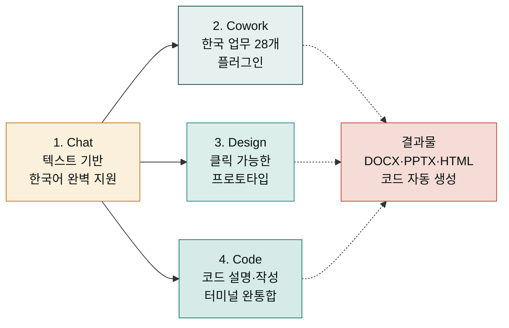
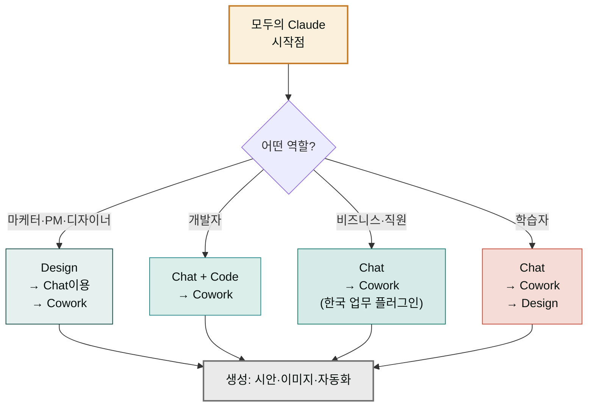

  
 ·  · claude.mo.ai.kr

  <h1>모두를 위한 Claude 완전 가이드</h1>
  

    Claude Desktop의 4가지 제품(Chat·Cowork·Design·Code)을 처음부터 끝까지 배웁니다. 코드를 몰라도, 디자이너가 아니어도, 누구나 따라할 수 있게 한국어로 정리했습니다.
  

  

    <a class="btn btn--primary" href="/getting-started/first-task/">5분 만에 시작 →</a>
    <a class="btn btn--ghost" href="/chat/">Chat부터 알아보기</a>
  

  

    

4

주요 제품

    

10+

가이드 섹션

    

50+

실전 예시

    



최신 버전

  

  

    

      모두의 Claude 아카데미 · 모집 중
      <h3 class="cw-academy-banner__title">강의로 가장 빠르게 익히기</h3>
    

    

      <strong>Claude Desktop으로 시작하는 AI 생활 — 코드 없이 2일.</strong> Chat·Cowork·Design·Code를 한두 가지만 알아도 하루를 20% 더 효율적으로 쓸 수 있습니다. 이 강의에서는 정말 필요한 기능들을 골라 실전 워크플로우로 배웁니다.
    

    <ul class="cw-academy-banner__points">
      <li>2일 집중 (7월 19-20일 토·일 · 10:00-18:00) — Claude Desktop 설치부터 첫 결과물까지</li>
      <li>직접 만드는 산출물 — 마크다운·슬라이드·이미지 생성·자동화 스크립트</li>
      <li>오프라인 정원 30석 · 강사 구스 · 수강 후 30일 운영 지원</li>
    </ul>
    

      <a class="btn btn--primary" href="https://academy.mo.ai.kr/?utm_source=claude-docs&utm_medium=banner&utm_campaign=docs-home" target="_blank" rel="noopener noreferrer">강의 안내 보기 →</a>
      <a class="btn btn--ghost" href="/chat/" >Chat부터 시작하기</a>
    

  

## Claude란 — 텍스트만으로 모든 것을 만드는 AI

Claude는 채팅처럼 말하면 알아듣고 시안·보고서·코드·이미지를 만드는 AI입니다. 다음과 같은 순간마다 써요.

- **Chat에서**: "이 계약서 검토해 줘" → 잠시 기다리면 검토 결과
- **Cowork에서**: "홈페이지 슬라이드 만들어 줘" → 28개 플러그인 중 필요한 것만 자동 호출
- **Design에서**: "이 시안의 색을 우리 브랜드로 바꿔 줘" → 클릭하는 시안이 실시간으로 변함
- **Code에서**: "이 함수 설명해 줘" → 코드 이해 + 리팩토링 제안까지 한 번에

이 문서는 이 4가지를 **처음부터 끝까지 정리한 한국어 가이드**입니다.

## 4가지 제품 — 누가 / 언제 쓸까

| 제품 | 시작 장소 | 누가 | 무엇을 | 결과 |
|---|---|---|---|---|
| **Chat** | claude.ai 또는 Desktop 사이드바 | 모두 | 질문·설명·검토 | 텍스트 회답 |
| **Cowork** | Claude Desktop | 지식 근로자 | 한국 업무(사업계획·IR·계약서·이메일) | 문서·슬라이드·보고서 자동 생성 |
| **Design** | claude.ai/design | 디자이너·PM·마케터 | UI·슬라이드·랜딩 페이지 시안 | 클릭 가능한 프로토타입 |
| **Code** | Claude Desktop 터미널 | 개발자·기술자 | 코드 설명·작성·리팩토링 | 코드 생성·수정·실행 |

## 빠른 시작 — 각 제품 5분

각 섹션으로 가면 처음 5분 안에 첫 결과물을 볼 수 있습니다.

  <a class="cw-qs-card" href="/chat/first-chat/">
    
01 · Chat

    
첫 대화 시작

    
Claude Desktop 켜기 → 한 줄 입력 → 회답 받기. 가장 간단합니다.

  </a>
  <a class="cw-qs-card" href="/cowork/install/">
    
02 · Cowork

    
한국 업무 플러그인

    
마켓플레이스 설치 → 플러그인 선택 → 한국 업무 자동화 시작.

  </a>
  <a class="cw-qs-card" href="/design/getting-started/">
    
03 · Design

    
시각적 프로토타입

    
claude.ai/design 진입 → 텍스트 설명 → 클릭 가능한 시안 생성.

  </a>
  <a class="cw-qs-card" href="/code/first-task/">
    
04 · Code

    
터미널에서 코딩

    
Claude Desktop 터미널 → 자연어 요청 → 코드 작성·설명·수정.

  </a>

## 학습 경로 — 어디서부터 시작할까

**처음 써 보는 사람**:  
Chat([첫 대화](chat/first-chat/)) → Cowork([설치](cowork/install/)) → 최종 목표로 Design이나 Code 선택

**Cowork 사용자 (한국 업무)**:  
Cowork([빠른 시작](cowork/install/)) → [플러그인 카탈로그](cowork/plugins/) → [쿡북](cowork/patterns/)

**비개발자 (디자이너·마케터·PM)**:  
Chat → Design([시작하기](design/getting-started/) + [디자인 시스템](design/design-system/))

**개발자**:  
Chat + Code([첫 작업](code/first-task/)) + Cowork([플러그인](cowork/plugins/)) 병행

## 특징 — 왜 Claude인가

| 특징 | 이점 |
|---|---|
| **한국어 완벽 지원** | 계약서·보고서·이메일을 정확하게 한국어로 생성·검토 |
| **멀티모달** | 텍스트만 아니라 이미지·슬라이드·코드도 함께 이해·생성 |
| **비전 기반 설계** | Design에서 손그림·스크린샷을 업로드하면 즉시 정돈된 시안으로 변환 |
| **실시간 협업** | 같은 조직 팀원과 시안·문서를 함께 수정·공유 |
| **자동 통합** | Chat → Design → Code로 매끄럽게 핸드오프 |

## 다음 단계

- **처음 써 보는 사람**: [Chat — 첫 대화 시작](chat/first-chat/)
- **Cowork 사용자**: [Cowork — 플러그인 설치](cowork/install/)
- **디자인 시안이 필요**: [Design — 시작하기](design/getting-started/)
- **코드 작업**: [Code — 첫 작업](code/first-task/)

---

### Sources

- [Claude Official Product Page](https://claude.ai)
- [Claude Desktop Documentation](https://support.claude.com/en/articles/8611976-installing-claude-for-desktop)
- [Claude Design Launch Announcement](https://www.anthropic.com/news/claude-design-anthropic-labs)
- [Cowork Research Preview](https://claude.com/blog/cowork-research-preview)
