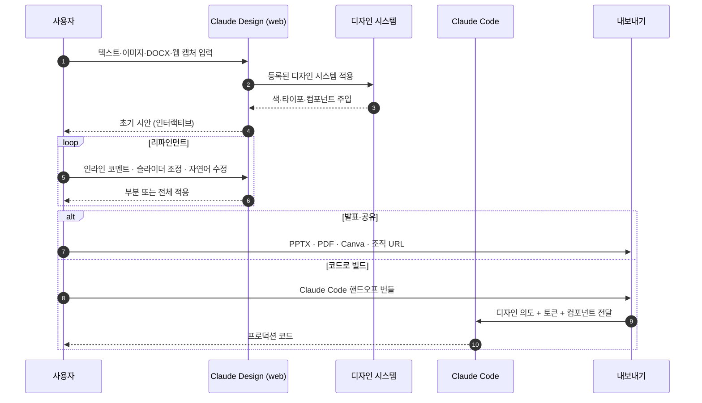

> "디자인 도구를 켜기 전에 머릿속 아이디어를 누군가에게 보여주고 싶다." Claude Design은 그 사이 공간을 채우는 도구입니다. 텍스트 설명·문서 업로드·코드베이스 연결만으로 인터랙티브 프로토타입과 피치덱을 만들고, 결과를 Canva·PPTX·HTML·Claude Code로 내보냅니다.

## 학습 목표

- Claude Design이 무엇이고 누가 어떤 플랜에서 쓸 수 있는지 알 수 있습니다.
- 디자인 시스템을 설정해 결과물이 일관된 브랜드를 유지하게 만들 수 있습니다.
- 프롬프트·리파인먼트·내보내기·핸드오프 4단계 워크플로우를 그릴 수 있습니다.
- 자주 깨지는 5가지 실패 패턴을 미리 점검할 수 있습니다.

## 한눈에 보기

| 항목 | 내용 |
|---|---|
| 출시 | 2026-04-17, Anthropic Labs |
| 진입 URL | [claude.ai/design](https://claude.ai/design) (웹 전용) |
| 베이스 모델 | Claude Opus 4.7 (비전 기반) |
| 상태 | Research Preview (점진 롤아웃) |
| 요금제 | Pro · Max · Team · Enterprise |
| Enterprise 기본값 | OFF — 관리자가 Organization 설정에서 활성화 |
| 사용량 한도 | 플랜별 채팅·Claude Code 한도와 **분리된 별도 쿼터**, 초과 시 extra usage 옵션 |
| Enterprise 사용량제 크레딧 | 약 20 프롬프트 일회성 크레딧 (2026-07-17 만료) |
| 출력 형식 | Canva · PDF · PPTX · 표준 HTML · ZIP · Claude Code 핸드오프 번들 |


**플러그인과 다릅니다.** `claude.ai/design`(이 페이지의 주제)은 비주얼 생성 제품이고, [`claude.com/plugins/design`](https://claude.com/plugins/design)은 Cowork에서 디자인 비평·UX 카피·접근성 감사를 돕는 **별도 플러그인**입니다. 두 도구는 함께 쓸 수 있지만 같은 도구가 아닙니다.


## 작동 방식

## 시작하기 — 입력 4종

Claude Design 프로젝트는 다음 4가지 중 하나로 시작합니다.

| 입력 | 언제 쓰나 | 결과물 품질을 높이는 팁 |
|---|---|---|
| **텍스트 프롬프트** | 빈 화면에서 아이디어를 빠르게 시각화 | 청중·목적·톤·참고 URL을 한 문단으로 함께 주기 |
| **이미지·문서 업로드** (DOCX · PPTX · XLSX · 이미지) | 기존 보고서를 시각 자료로 변환 | 표지·헤더·로고가 있는 깨끗한 원본 사용 |
| **코드베이스 연결** (GitHub repo · 로컬 폴더) | 기존 디자인 시스템을 자동 추출 | 컴포넌트가 정리된 모노레포·UI 패키지 권장 |
| **웹 캡처 도구** | 운영 중인 사이트의 실제 UI 요소를 가져와 재사용 | 본인 또는 권한 있는 사이트만 캡처 |


**첫 프롬프트는 6가지를 채워 보세요.**
*Project*(1줄 설명) · *Audience*(구체적 사용자) · *Pages*(필요한 페이지·목적) · *Tone*(형용사 3-5개) · *Reference*(Dribbble·경쟁사 URL) · *Constraints*(모바일·데스크톱·디자인 시스템).


## 디자인 시스템 — 가장 중요한 한 가지

Claude Design 사용자의 가장 흔한 실패는 **디자인 시스템 설정을 건너뛴 채 바로 프롬프트를 던지는 것**입니다. 결과가 학습 데이터의 평균값에 수렴해 "AI가 만든 것 같은" 일반적 디자인이 나옵니다.

### 업로드 가능한 자산

- **코드**: React·Vue 컴포넌트 라이브러리, CSS 토큰 파일, GitHub 저장소 링크
- **디자인 파일**: Figma `.fig` 익스포트, Sketch 파일, 컴포넌트 스크린샷
- **브랜드 자산**: 로고, 색 팔레트 이미지, 타이포 샘플, 스타일 가이드 PDF
- **실물**: 운영 중인 웹사이트 URL, 잘 만든 PPTX 덱, 최근 마케팅 사이트
- **사전 빌트인**: Apple · Linear · Stripe 등 오픈 라이선스 시스템에서 시작

### 셋업 절차

1. **claude.ai/design** 진입 → 좌하단 조직 이름 클릭 → 온보딩 흐름 시작.
2. 자산 업로드 — 코드·Figma·PPTX·로고 중 가능한 만큼 다 올립니다. **사양서보다 완성된 실물 1개가 더 강한 시그널**을 줍니다.
3. Claude가 색 팔레트·타이포·컴포넌트·레이아웃 패턴을 자동 추출해 UI 키트로 정리.
4. **테스트 프롬프트로 검증** — "마케팅 랜딩 페이지" "사이드바 있는 설정 페이지" 같은 일반 프롬프트를 돌려 결과가 브랜드처럼 보이는지 확인.
5. 어긋나면 자산 추가 업로드 또는 채팅으로 시스템을 손봅니다 — "간격을 조금 더 넓게" "보조색을 빼" 같은 자연어 지시 가능.
6. 통과하면 디자인 시스템 설정에서 **Published 토글 ON** — 이후 조직 홈에서 만드는 모든 프로젝트가 자동 적용됩니다.

### 멀티 디자인 시스템

팀당 디자인 시스템 여러 개를 운영할 수 있습니다. 예: B2B 제품용 · 컨슈머 브랜드용 · 이벤트 마이크로사이트용을 따로 발행해두고 프로젝트 시작 시 선택.

## 리파인먼트 — 4가지 조작

| 조작 | 사용 시점 | 비유 |
|---|---|---|
| **자연어 수정** | 전체 방향 전환 | 디자이너에게 말로 부탁 |
| **인라인 코멘트** | 특정 요소를 콕 집어 수정 | Figma 코멘트 |
| **직접 텍스트 편집** | 카피·라벨을 바로 손봄 | 워드 편집 |
| **조정 노브 (sliders)** | 간격·색·레이아웃을 live tweak | InDesign 패널 |

조정 결과는 **현재 화면에만 적용** 또는 **모든 화면에 일괄 적용** 중 선택. 일관성을 위해 일괄 적용을 권장합니다.

## 협업과 공유

- **조직 범위(Org-scoped) 공유** — 외부 공개 링크는 없습니다. 같은 조직의 사용자에게만 공유 가능.
- **공유 권한 3종**: Private · View-only · Edit access.
- **그룹 대화** — 여러 명이 같은 문서에서 Claude와 함께 채팅하며 디자인을 수정.
- 공유 후 수정 이력은 조직 단위로 추적됩니다.

## 내보내기 — 6가지 경로

| 형식 | 추천 시점 |
|---|---|
| **조직 URL** | 사내 리뷰·승인 회람 (인증 필요) |
| **PDF** | 외부 발송용 정적 산출물 |
| **PPTX** | 발표 직전 최종 손질이 필요할 때 (PowerPoint·Keynote에서 편집) |
| **Canva** | 마케팅 팀이 후속 편집·공동작업 |
| **표준 HTML** | 단발성 랜딩·이벤트 사이트 |
| **Claude Code 핸드오프 번들** | 프로덕션 코드로 빌드 — 디자인 의도·토큰·컴포넌트를 한 번에 전달 |


**ZIP/PDF 백업을 핸드오프 전에 한 번 받아 두세요.** 후속 수정 중 결과물이 의도와 어긋나면 백업으로 빠르게 되돌릴 수 있습니다.


## 역할별 사용 사례

| 역할 | 대표 워크플로우 | 시간 단축 사례 |
|---|---|---|
| **창업자** | 거친 아이디어 → 온브랜드 피치덱 → PPTX 내보내기 → 투자자 미팅 | 디자이너 의뢰·대기 단계 생략 |
| **PM** | 기능 플로우 스케치 → 디자이너·개발팀에 와이어프레임 공유 → Claude Code 핸드오프 | Datadog 사례: 1주일 → 1번의 대화 |
| **디자이너** | 정적 목업 → 인터랙티브 프로토타입 → 사용자 테스트 → 디자인 시스템에 역피드백 | Brilliant 사례: 복잡 페이지 20+ 프롬프트 → 2 프롬프트 |
| **마케터** | 캠페인 비주얼·랜딩·SNS 에셋 일괄 → Canva로 후속 편집 | 디자인 백로그 없이 캠페인 출시 |
| **창업 초기 팀** | 사업계획·시안·랜딩을 한 도구에서 일관된 비주얼로 운영 | 외주 의존 감소 |

## 베스트 프랙티스 — 10가지

1. **디자인 시스템부터.** 첫 프롬프트 전에 30분만 투자해 자산 업로드와 테스트 프롬프트를 끝냅니다. 이후 모든 작업이 일관됩니다.
2. **역할을 명시한 프롬프트.** "12년차 시니어 UX 아키텍트 관점에서…"처럼 구체적 역할을 부여하면 결과 분산이 30-40% 줄어듭니다.
3. **AI 슬롭 회피 문구를 기본 프롬프트에 포함.** Inter·Roboto·Arial 같은 진부한 폰트, 흰 배경의 보라색 그라데이션, 천편일률 카드 레이아웃을 명시적으로 금지하세요.
4. **컨텍스트 누적을 활용.** 같은 프로젝트 내에서는 IA → 디자인 시스템 → 온보딩 → 대시보드 순으로 단계를 쌓습니다. 후속 프롬프트가 앞 결과를 자연스럽게 상속합니다.
5. **실물 예시가 사양서보다 강함.** "톤은 미니멀하고 모던…"보다 잘 만든 경쟁사 사이트 URL 1개 + 자사 마케팅 페이지 스크린샷 2장이 훨씬 명확합니다.
6. **토큰 비용을 의식.** 디자인 시스템 자체 생성에는 큰 토큰이 듭니다. 가능한 한 기존 자산을 업로드하거나 사전 빌트인(Apple·Linear·Stripe) 시스템에서 출발하세요.
7. **단계마다 백업.** 핸드오프 전에 ZIP 또는 PDF로 한 번 백업. 후속 수정으로 결과가 어긋나도 빠르게 복구.
8. **개인정보·기밀 자산 업로드 전 익명화.** 업로드된 자산은 Anthropic 엔터프라이즈 보존 정책에 따라 저장됩니다. 개인 식별 정보·고객 데이터는 익명화 후 올리세요.
9. **개발 핸드오프는 짧은 지시 1개로.** Claude Design이 만든 번들을 Claude Code에 넘길 때는 "이 번들대로 프로덕션 코드를 작성, 기존 디자인 시스템 토큰 유지"처럼 한 줄로 시작합니다.
10. **인터랙션·애니메이션은 별도 라운드로.** 첫 시안은 정적 UI로 받고, 마이크로 인터랙션은 별도 프롬프트("이 버튼에 호버 시 0.2s 페이드와 그림자 강화")로 추가합니다.

## 자주 겪는 실수

- **디자인 시스템을 건너뜀** → 결과가 평균값에 수렴해 "AI 티"가 납니다. 30분 셋업으로 결과 품질이 한 단계 점프합니다.
- **불완전한 디자인 시스템 업로드** → 폰트·색이 누락되면 Claude가 대체 글꼴을 임의 선택해 브랜드가 흐트러집니다. 발행 전 테스트 프로젝트로 검증.
- **데스크톱 앱에서 시도** → 현재 웹 전용입니다. 브라우저(claude.ai/design)에서 진행하세요.
- **민감 자산 업로드** → 고객 데이터·내부 매출이 박힌 PPTX를 그대로 올리면 안 됩니다. 익명화 또는 더미 데이터로 치환.
- **너무 많은 변화를 한 번에 요청** → "전체 톤을 바꿔주고 그리드도 바꾸고 카피도 다듬어줘"는 결과가 흐트러집니다. 한 번에 하나씩.
- **핸드오프 후 디자인을 또 수정** → Claude Code가 받은 번들과 어긋나 코드와 디자인이 비동기화. 핸드오프 시점을 분명한 체크포인트로 삼으세요.

## Cowork와의 관계

Claude Design은 Anthropic Labs의 **별개 제품**이지만 같은 Claude 계정·요금제를 공유합니다. 동선은 다음과 같습니다.

- **아이디어 → 시안**: Claude Design (claude.ai/design)
- **시안 → 코드**: Claude Design 핸드오프 번들 → Claude Code
- **시안 검토·UX 카피·접근성 감사**: [Claude Design 플러그인](https://claude.com/plugins/design) (Cowork 플러그인 마켓에서 설치)
- **반복 작업 자동화·문서 생성**: Cowork 본체 + 스킬·플러그인

같은 Anthropic 계정으로 로그인된 모든 디바이스에서 결과물을 이어 받을 수 있습니다.

## 요금제와 한도

- **Pro · Max** — 개인 가입자. 일반 채팅·Claude Code와 **분리된 별도 주간 한도**가 적용됩니다.
- **Team · Enterprise** — 조직 단위. Enterprise는 기본 OFF, 관리자가 활성화. RBAC으로 부서·그룹별 단계적 롤아웃 권장.
- **Enterprise 사용량제** — 약 20 프롬프트 일회성 크레딧 제공 (2026-07-17 만료). 이후 통상 사용량 정책 적용.
- **Extra usage** — 플랜 한도 초과 시에도 옵션을 켜면 추가 사용 가능.

플랜별 정확한 한도는 [Claude Design 도움말](https://support.claude.com/en/articles/14604406-claude-design-admin-guide-for-team-and-enterprise-plans)을 확인하세요.

## 제한 사항 (Research Preview)

- **웹 전용** — Claude 데스크톱 앱·모바일 앱에서는 아직 사용 불가.
- **점진 롤아웃** — 활성화된 사용자부터 단계적으로 열립니다. 가입 직후 즉시 보이지 않을 수 있어요.
- **큰 코드베이스 ingestion 지연** — 모노레포·대형 UI 라이브러리는 분석에 시간이 걸립니다.
- **3D · 음성 · 비디오** — 프론티어 기능은 초기 단계. 단순 정적·인터랙티브 UI가 가장 안정적입니다.
- **Figma 대체가 아닙니다** — UI/UX 디자인 시장의 80-90%를 차지하는 Figma는 디자인 시스템 운영·디자이너 협업의 표준입니다. Claude Design은 디자이너가 아닌 사람도 시각 자료를 만들 수 있게 하는 **저변 확대 도구**로 위치합니다.

## 다음 단계

- [Cowork 안전 가이드](../cowork/safety/) — 민감 자산 업로드 전 점검
- [Cowork 권한 모델](../cowork/permissions/) — 핸드오프 결과를 작업 폴더로 받을 때
- [Cowork 커넥터·MCP](../cowork/connectors-mcp/) — 디자인 결과를 Notion·Google Drive에 자동 저장
- [쿡북 — IR 덱 자동화](../cookbook/ir-deck/) — Claude Design + Cowork 조합 예시
- [플러그인 카탈로그](../plugins/) — moai-content·moai-media 등 디자인과 결합 가능한 플러그인

---

### Sources

- [Introducing Claude Design by Anthropic Labs](https://www.anthropic.com/news/claude-design-anthropic-labs) — 공식 출시 공지 (2026-04-17)
- [Claude for Creative Work](https://www.anthropic.com/news/claude-for-creative-work) — Adobe·Affinity·Autodesk 등 창작 도구 통합 맥락
- [Design — Claude Plugin](https://claude.com/plugins/design) — Cowork 디자인 플러그인 (별개 제품)
- [Set up your design system in Claude Design](https://support.claude.com/en/articles/14604397-set-up-your-design-system-in-claude-design) — 공식 도움말
- [Claude Design admin guide for Team and Enterprise plans](https://support.claude.com/en/articles/14604406-claude-design-admin-guide-for-team-and-enterprise-plans) — 관리자 가이드
- [Anthropic launches Claude Design (TechCrunch)](https://techcrunch.com/2026/04/17/anthropic-launches-claude-design-a-new-product-for-creating-quick-visuals/) — 출시 분석
- [Claude Design: Complete Guide for Non-Designers (BuildFastWithAI)](https://www.buildfastwithai.com/blogs/claude-design-anthropic-guide-2026) — 비디자이너 베스트 프랙티스
- [How to Use Claude Design for UX/UI (DesignerUp)](https://designerup.co/blog/how-to-use-claude-design-for-ux-ui/) — 디자이너 관점 워크플로우
- [From Prompt to Production (Design Systems Collective)](https://www.designsystemscollective.com/from-prompt-to-production-a-designers-step-by-step-workflow-with-claude-design-claude-code-a7705daad026) — Claude Design + Claude Code 핸드오프
- [10 Advanced Prompts for Claude Design](https://pasqualepillitteri.it/en/news/1486/claude-design-prompts-senior-ux-designer-guide) — 시니어 UX 프롬프트 패턴
- [Claude Design Starter Guide (Claudia + AI)](https://claudiaplusai.substack.com/p/claude-design-starter-guide-and-examples) — 디자인 시스템 발행 절차
