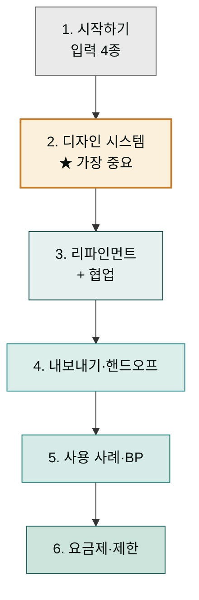
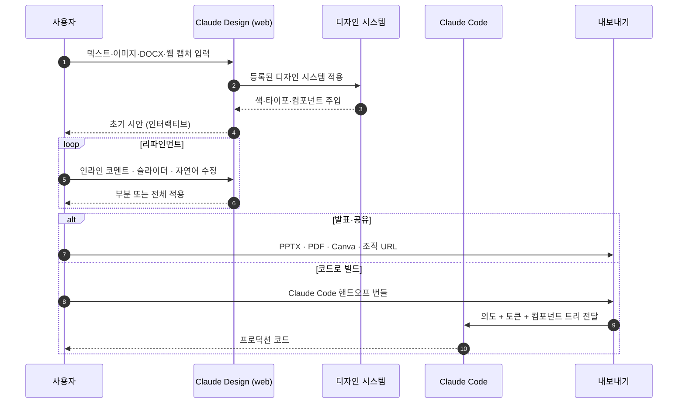
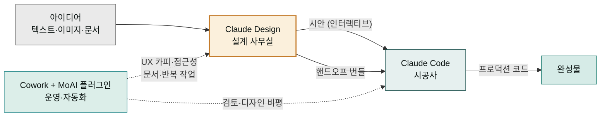

> Claude Design은 텍스트·문서·코드베이스를 입력으로 받아 인터랙티브 프로토타입과 발표 자료를 만드는 Anthropic Labs 제품입니다. 이 섹션은 9개 페이지로 정리한 한국어 가이드입니다. 각 페이지 끝의 **Sources**가 원문 공식 문서로 연결됩니다.

## Claude Design이란 — 눈으로 만드는 실시간 디자인 스튜디오

인테리어 디자인 스튜디오를 떠올려 보세요. 손님이 "우리 매장 분위기에 맞는 카운터를 그려줘"라며 사진과 글로 요청하면, 디자이너는 그 자리에서 3D 모형과 견본을 만들어 보여줍니다. 손님이 "나무 톤을 좀 더 따뜻하게", "선반을 하나 더 달아줘" 같은 코멘트를 던지면 디자이너는 즉시 고쳐서 다시 보여줍니다. Claude Design이 바로 이런 **실시간 디자인 스튜디오**의 디지털 버전입니다.

차이점은 디자이너가 사람이 아니라 Claude라는 점, 그리고 손님이 "텍스트와 이미지"로만 요청해도 Claude가 그것을 읽고(이것을 **비전 기반** — 그림·사진·문서를 눈으로 보듯 이해하는 능력이라 합니다) 클릭할 수 있는 화면 시안으로 만들어낸다는 점입니다. 결과물은 그림 파일이 아니라 **인터랙티브 프로토타입**(버튼을 누르면 화면이 넘어가는 등 실제로 조작해 볼 수 있는 시안)입니다. "랜딩 페이지 하나 만들어줘"라고 말하면 당장 브라우저에서 클릭해 볼 수 있는 화면이 뜹니다.

"Anthropic Labs"와 "Research Preview"라는 표현이 자주 보입니다. **Anthropic Labs**는 Anthropic이 새 기능을 빠르게 실험해 보는 조직 단위이고, **Research Preview**는 "완성된 정식 제품이 아니라 공개적으로 시험 중인 단계"를 뜻합니다. 즉 Claude Design은 안정화가 계속 진행 중인, 쓸 만하지만 발전 중인 도구입니다.

## 학습 경로

| 단계 | 페이지 | 도달 역량 |
|---|---|---|
| 1. 입문 | [시작하기](getting-started/) | 첫 프로젝트 생성 + 입력 4종 활용 |
| 2. 코어 | [디자인 시스템 설정](design-system/) ★ | 브랜드 일관성 확보 + Published 시스템 운영 |
| 3. 작업 | [리파인먼트](refinement/), [협업과 공유](collaboration/) | 시안 다듬기 + 팀 공동 작업 |
| 4. 내보내기 | [내보내기와 핸드오프](export-handoff/) | Canva·PPTX·Claude Code 등 6가지 산출 경로 |
| 5. 적용 | [역할별 사용 사례](use-cases/), [베스트 프랙티스](best-practices/) | 실전 워크플로우 + 10대 원칙 |
| 6. 운영 | [요금제와 한도](pricing-limits/), [제한 사항과 로드맵](limitations/) | 도입 의사결정 + Research Preview 위치 이해 |

## 한눈에 보기

| 항목 | 내용 |
|---|---|
| 출시 | 2026-04-17, Anthropic Labs |
| 진입 URL | [claude.ai/design](https://claude.ai/design) (웹 전용) |
| 베이스 모델 | Claude Opus 4.7 (비전 기반) |
| 상태 | Research Preview (점진 롤아웃) |
| 요금제 | Pro · Max · Team · Enterprise |
| Enterprise 기본값 | OFF — 관리자가 Anthropic Labs 설정에서 활성화 |
| 사용량 한도 | 일반 채팅·Claude Code와 **분리된 별도 쿼터** |
| Enterprise 사용량제 크레딧 | 약 20 프롬프트 일회성 (2026-07-17 만료) |
| 출력 형식 | **Canva(네이티브 파트너십)** · PDF · PPTX · 표준 HTML · ZIP · Claude Code 핸드오프 번들 |


**플러그인과 다릅니다.** `claude.ai/design`(이 섹션의 주제)은 비주얼 생성 제품이고, [`claude.com/plugins/design`](https://claude.com/plugins/design)은 Cowork에서 디자인 비평·UX 카피·접근성 감사를 돕는 **별도 플러그인**입니다. 두 도구는 함께 쓸 수 있지만 같은 도구가 아닙니다.


## 작동 방식

## 왜 디자인 시스템이 필수인가 — 브랜드 가이드북이 없으면 매장마다 분위기가 제각각

햄버거 프랜차이즈를 생각해 봅니다. 본사가 "우리 매장 톤은 따뜻한 갈색, 글씨체는 이것, 버튼은 둥근 형태"라고 정해둔 매뉴얼이 없으면 매장마다 분위기가 제각각이 됩니다. 어떤 곳은 차가운 파란색, 어떤 곳은 빨간 글씨. 손님은 같은 브랜드인지 헷갈립니다. 이 매뉴얼이 **브랜드 가이드북**입니다.

Claude Design에서도 똑같습니다. 우리 회사의 색·글씨체·버튼 모양을 **디자인 시스템**(한 번 정해두면 모든 시안에 일관되게 적용되는 스타일 규칙 묶음)으로 미리 알려주지 않으면, Claude는 세상에 널린 수많은 디자인의 **"평균적인 모습"**을 뱉어냅니다. 쉽게 말해 인터넷에서 가장 흔하게 보이는 무난한 회색빛 디자인 — 누가 봐도 "AI가 만든 것 같은" 그 느낌입니다. 이를 **학습 데이터 평균값으로 수렴한다**고 표현합니다. Claude가 학습한 방대한 웹사이트들의 중간값으로 결과가 쏠린다는 뜻입니다.

반대로 디자인 시스템을 먼저 등록하면 어떻게 될까요. 우리 브랜드 색과 글씨체가 시안에 일관되게 묻어납니다. 매장마다 분위기가 같아지는 것처럼, 어떤 페이지를 만들든 우리 회사 느낌이 유지됩니다. 그래서 학습 경로 두 번째 단계에 ★ 표시가 붙어 있고, "디자인 시스템 페이지를 반드시 통과할 것"을 권장하는 것입니다. 한두 단계 건너뛰면 결과가 AI 냄새 나는 일반적 디자인으로 퇴색합니다.

## 누구를 위한 가이드인가

| 역할 | 어떤 페이지부터 읽을지 |
|---|---|
| 처음 써 보는 모든 사용자 | [시작하기](getting-started/) → [디자인 시스템](design-system/) |
| 디자이너 | [디자인 시스템](design-system/) → [리파인먼트](refinement/) → [내보내기·핸드오프](export-handoff/) |
| PM / 창업자 | [시작하기](getting-started/) → [역할별 사용 사례](use-cases/) → [내보내기](export-handoff/) |
| 마케터 | [시작하기](getting-started/) → [역할별 사용 사례](use-cases/) → [협업·공유](collaboration/) |
| 엔지니어 (핸드오프 받는 쪽) | [내보내기·핸드오프](export-handoff/) → [디자인 시스템](design-system/) (역방향 이해) |
| 조직 관리자 (Team·Enterprise) | [요금제·한도](pricing-limits/) → [협업·공유](collaboration/) → [제한 사항](limitations/) |

## Cowork와의 관계 — 세 도구가 나눠 맡은 역할

건축 프로젝트에 세 전문가가 있다고 상상해 보세요. 첫째 **설계 사무실**은 건축가가 아이디어를 스케치하고 모형을 만듭니다. 둘째 **시공사**는 그 설계도를 받아 실제 건물을 짓습니다. 셋째 **인테리어 코디네이터·운영 담당**은 공사가 끝난 뒤 자재 주문, 문서 정리, 반복되는 잡무를 처리합니다. 세 사람은 각자 다른 구간을 맡지만 도면과 산출물을 주고받으며 하나의 건물을 완성합니다.

Claude 생태계도 이와 같습니다. 세 도구는 목적이 다르고 다른 구간을 담당합니다.

- **Claude Design** (`claude.ai/design`) — 설계 사무실. 아이디어와 참고 자료를 받아 클릭할 수 있는 화면 시안을 만듭니다. 비주얼(눈에 보이는 것)이 중심.
- **Claude Code** — 시공사. 시안을 받아 실제로 동작하는 코드(프로덕션 빌드)로 짓습니다. Claude Design의 결과물을 **핸드오프 번들**(설계 의도와 컴포넌트 구조를 담은 전달 묶음) 형태로 넘겨받습니다.
- **Cowork + MoAI 플러그인** — 운영·자동화 담당. 설계와 시공 사이사이에서 UX 카피 작성, 접근성 검사, 디자인 비평, 반복 문서 생성, 발행 자동화를 보조합니다.

즉 "아이디어 → 시안 → 코드 → 검토·자동화"라는 흐름에서 Claude Design은 앞쪽(아이디어를 시안으로), Claude Code는 중간(시안을 코드로), Cowork는 양쪽을 잇는 보조 구간을 맡습니다. 같은 Anthropic 계정으로 로그인된 모든 디바이스에서 결과물을 이어 받을 수 있습니다.

자세한 동선은 [내보내기와 핸드오프](export-handoff/)·[역할별 사용 사례](use-cases/) 페이지에서.

## 보조 플러그인 — `moai-design`

이 섹션의 운영 원칙·베스트 프랙티스를 자동화한 [`moai-design`](../plugins/moai-design/) 플러그인이 v2.12.0부터 마켓플레이스에 정식 등록되어 있습니다. Cowork에서 자연어로 호출하면 AskUserQuestion으로 정보를 모은 뒤 claude.ai/design 채팅에 그대로 붙여 넣을 수 있는 산출물을 만들어 줍니다.

| 단계 | 스킬 | 결과물 |
|---|---|---|
| 디자인 시스템 셋업 | `claude-design-system-prep` | DESIGN.md + 자산 정리 |
| 시안 작성 | `claude-design-brief` | 6요소 복붙용 프롬프트 |
| 특정 영역 | `claude-design-prompt-builder` | 시니어 UX 10 패턴 프롬프트 |
| 결과 검수 | `claude-design-slop-check` | AI 슬롭 검수 + 수정안 |
| 핸드오프 | `claude-design-handoff-reader` | 번들 요약 + Claude Code 지시 |

## 다음 단계

먼저 [시작하기](getting-started/)에서 첫 프롬프트와 입력 4종을 익히세요. 그다음 [디자인 시스템 설정](design-system/) ★ 페이지를 반드시 통과하는 것을 권장합니다. 디자인 시스템 셋업을 건너뛰면 결과 품질이 학습 데이터 평균값으로 수렴해 "AI가 만든 것 같은" 일반적 디자인이 나옵니다.

---

### Sources (섹션 공통)

- [Introducing Claude Design by Anthropic Labs](https://www.anthropic.com/news/claude-design-anthropic-labs) — 공식 출시 공지 (2026-04-17)
- [Using Claude Design for prototypes and UX (Anthropic Tutorial)](https://claude.com/resources/tutorials/using-claude-design-for-prototypes-and-ux) — 공식 튜토리얼
- [Set up your design system in Claude Design](https://support.claude.com/en/articles/14604397-set-up-your-design-system-in-claude-design) — 디자인 시스템 설정 도움말
- [Claude Design admin guide for Team and Enterprise plans](https://support.claude.com/en/articles/14604406-claude-design-admin-guide-for-team-and-enterprise-plans) — 관리자 가이드
- [Design — Claude Plugin](https://claude.com/plugins/design) — Cowork 디자인 플러그인 (별개 제품)

페이지별 추가 출처는 각 페이지 하단의 Sources 섹션에 정리되어 있습니다.
