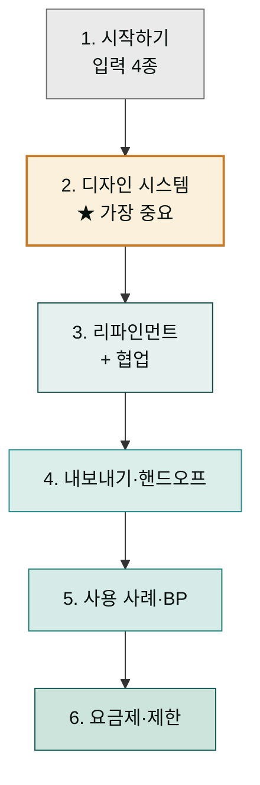
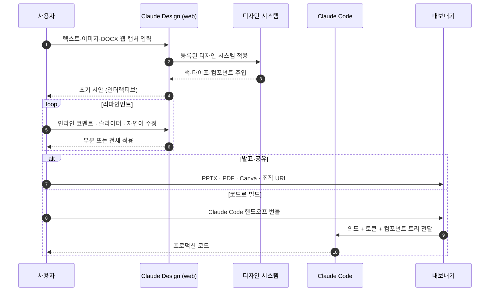

> Claude Design은 텍스트·문서·코드베이스를 입력으로 받아 인터랙티브 프로토타입과 발표 자료를 만드는 Anthropic Labs 제품입니다. 이 섹션은 9개 페이지로 정리한 한국어 가이드입니다. 각 페이지 끝의 **Sources**가 원문 공식 문서로 연결됩니다.

## 학습 경로

| <span style="white-space:nowrap">단계</span> | 페이지 | 도달 역량 |
|---|---|---|
| <span style="white-space:nowrap">1. 입문</span> | [시작하기](getting-started/) | 첫 프로젝트 생성 + 입력 4종 활용 |
| <span style="white-space:nowrap">2. 코어</span> | [디자인 시스템 설정](design-system/) ★ | 브랜드 일관성 확보 + Published 시스템 운영 |
| <span style="white-space:nowrap">3. 작업</span> | [리파인먼트](refinement/), [협업과 공유](collaboration/) | 시안 다듬기 + 팀 공동 작업 |
| <span style="white-space:nowrap">4. 내보내기</span> | [내보내기와 핸드오프](export-handoff/) | Canva·PPTX·Claude Code 등 6가지 산출 경로 |
| <span style="white-space:nowrap">5. 적용</span> | [역할별 사용 사례](use-cases/), [베스트 프랙티스](best-practices/) | 실전 워크플로우 + 10대 원칙 |
| <span style="white-space:nowrap">6. 운영</span> | [요금제와 한도](pricing-limits/), [제한 사항과 로드맵](limitations/) | 도입 의사결정 + Research Preview 위치 이해 |



## 한눈에 보기

| 항목 | 내용 |
|---|---|
| 출시 | 2026-04-17, Anthropic Labs |
| 진입 URL | [claude.ai/design](https://claude.ai/design) (웹 전용) |
| 베이스 모델 | Claude Opus 4.7 (비전 기반) |
| 상태 | Research Preview (점진 롤아웃) |
| 요금제 | Pro · Max · Team · Enterprise |
| Enterprise 기본값 | OFF — 관리자가 Anthropic Labs 설정에서 활성화 |
| 사용량 한도 | 일반 채팅·Claude Code와 **분리된 별도 쿼터** |
| Enterprise 사용량제 크레딧 | 약 20 프롬프트 일회성 (2026-07-17 만료) |
| 출력 형식 | Canva · PDF · PPTX · 표준 HTML · ZIP · Claude Code 핸드오프 번들 |


**플러그인과 다릅니다.** `claude.ai/design`(이 섹션의 주제)은 비주얼 생성 제품이고, [`claude.com/plugins/design`](https://claude.com/plugins/design)은 Cowork에서 디자인 비평·UX 카피·접근성 감사를 돕는 **별도 플러그인**입니다. 두 도구는 함께 쓸 수 있지만 같은 도구가 아닙니다.


## 작동 방식



## 누구를 위한 가이드인가

| 역할 | 어떤 페이지부터 읽을지 |
|---|---|
| 처음 써 보는 모든 사용자 | [시작하기](getting-started/) → [디자인 시스템](design-system/) |
| 디자이너 | [디자인 시스템](design-system/) → [리파인먼트](refinement/) → [내보내기·핸드오프](export-handoff/) |
| PM / 창업자 | [시작하기](getting-started/) → [역할별 사용 사례](use-cases/) → [내보내기](export-handoff/) |
| 마케터 | [시작하기](getting-started/) → [역할별 사용 사례](use-cases/) → [협업·공유](collaboration/) |
| 엔지니어 (핸드오프 받는 쪽) | [내보내기·핸드오프](export-handoff/) → [디자인 시스템](design-system/) (역방향 이해) |
| 조직 관리자 (Team·Enterprise) | [요금제·한도](pricing-limits/) → [협업·공유](collaboration/) → [제한 사항](limitations/) |

## Cowork와의 관계

Claude Design은 별개의 Anthropic Labs 제품이지만 같은 Claude 계정·요금제를 공유합니다. 일반 동선:

```
아이디어  →  Claude Design (claude.ai/design)
시안     →  Claude Code 핸드오프 번들
검토·UX 카피·접근성  →  Cowork 마켓의 "Design 플러그인"
반복 자동화·문서 생성  →  Cowork 본체 + MoAI 플러그인
```

같은 Anthropic 계정으로 로그인된 모든 디바이스에서 결과물을 이어 받을 수 있습니다. 자세한 동선은 [내보내기와 핸드오프](export-handoff/)·[역할별 사용 사례](use-cases/) 페이지에서.

## 보조 플러그인 — `moai-design`

이 섹션의 운영 원칙·베스트 프랙티스를 자동화한 [`moai-design`](../plugins/moai-design/) 플러그인이 v2.12.0부터 마켓플레이스에 정식 등록되어 있습니다. Cowork에서 자연어로 호출하면 AskUserQuestion으로 정보를 모은 뒤 claude.ai/design 채팅에 그대로 붙여 넣을 수 있는 산출물을 만들어 줍니다.

| 단계 | 스킬 | 결과물 |
|---|---|---|
| 디자인 시스템 셋업 | `claude-design-system-prep` | DESIGN.md + 자산 정리 |
| 시안 작성 | `claude-design-brief` | 6요소 복붙용 프롬프트 |
| 특정 영역 | `claude-design-prompt-builder` | 시니어 UX 10 패턴 프롬프트 |
| 결과 검수 | `claude-design-slop-check` | AI 슬롭 검수 + 수정안 |
| 핸드오프 | `claude-design-handoff-reader` | 번들 요약 + Claude Code 지시 |

## 다음 단계

먼저 [시작하기](getting-started/)에서 첫 프롬프트와 입력 4종을 익히세요. 그다음 [디자인 시스템 설정](design-system/) ★ 페이지를 반드시 통과하는 것을 권장합니다. 디자인 시스템 셋업을 건너뛰면 결과 품질이 학습 데이터 평균값으로 수렴해 "AI가 만든 것 같은" 일반적 디자인이 나옵니다.

---

### Sources (섹션 공통)

- [Introducing Claude Design by Anthropic Labs](https://www.anthropic.com/news/claude-design-anthropic-labs) — 공식 출시 공지 (2026-04-17)
- [Using Claude Design for prototypes and UX (Anthropic Tutorial)](https://claude.com/resources/tutorials/using-claude-design-for-prototypes-and-ux) — 공식 튜토리얼
- [Set up your design system in Claude Design](https://support.claude.com/en/articles/14604397-set-up-your-design-system-in-claude-design) — 디자인 시스템 설정 도움말
- [Claude Design admin guide for Team and Enterprise plans](https://support.claude.com/en/articles/14604406-claude-design-admin-guide-for-team-and-enterprise-plans) — 관리자 가이드
- [Design — Claude Plugin](https://claude.com/plugins/design) — Cowork 디자인 플러그인 (별개 제품)

페이지별 추가 출처는 각 페이지 하단의 Sources 섹션에 정리되어 있습니다.
