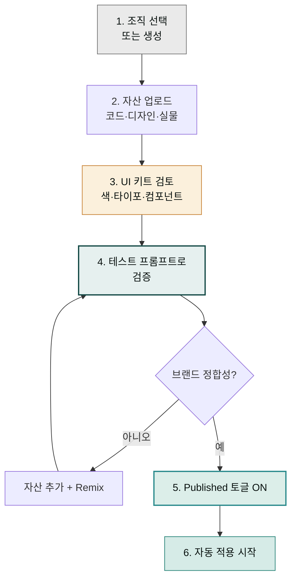

> "디자인 시스템 셋업을 건너뛴 채 바로 프롬프트를 던지는 것"이 Claude Design 사용자의 가장 흔한 실패 패턴입니다. 결과가 학습 데이터의 평균값에 수렴해 일반적인 "AI 디자인"이 됩니다. 30분만 투자하면 이후 모든 작업의 품질이 한 단계 점프합니다.

## 왜 디자인 시스템이 가장 중요한가

Claude Design은 비전 기반 모델(Claude Opus 4.7)이 학습한 일반적 UI 패턴을 기본값으로 사용합니다. 디자인 시스템을 등록하면:

- **색 팔레트**가 브랜드 정의로 고정 (primary·secondary·accent + 100-900 스케일)
- **타이포그래피**가 브랜드 폰트 패밀리·사이즈·웨이트로 고정
- **컴포넌트**가 실제 라이브러리(React·Vue·Tailwind 컴포넌트)와 매칭
- **레이아웃 패턴**이 spacing·grid·페이지 구조로 고정
- 모든 신규 프로젝트가 **자동 적용** — 매번 다시 업로드할 필요 없음

핸드오프 시점에도 같은 시스템이 그대로 전달되므로 Claude Code가 **기존 컴포넌트**로 코드를 작성합니다.

## 업로드 가능한 자산 5종

| 자산 유형 | 예시 | Claude가 추출하는 것 |
|---|---|---|
| **코드** | GitHub repo · 로컬 폴더 · UI 패키지 | React·Vue·Svelte 컴포넌트, CSS 변수, Tailwind 설정, Storybook 스토리 |
| **디자인 파일** | Figma `.fig` 익스포트, Sketch 파일 | 색 팔레트, 타이포 스케일, 컴포넌트 라이브러리 구조 |
| **브랜드 자산** | 로고 SVG·PNG, 색 팔레트 이미지, 타이포 샘플, 스타일 가이드 PDF | 색·타이포·로고 사용 규칙 |
| **실물** | 운영 중인 웹사이트 URL, 잘 만든 PPTX 덱, 최근 마케팅 사이트 | 실제 사용 중인 컴포넌트·간격·voice |
| **사전 빌트인** | Apple · Linear · Stripe 등 오픈 라이선스 시스템 | 시작점 — 이후 우리 브랜드로 커스터마이즈 |


**사양서보다 실물 1개가 더 강한 시그널.** "톤은 미니멀하고 모던" 같은 문장보다 **잘 만든 자사 마케팅 페이지 URL 1개 + 경쟁사 스크린샷 2장**이 훨씬 정확한 가이드를 줍니다.


## 6단계 셋업 절차



### 단계 1 — 조직 선택 또는 생성

1. [claude.ai/design](https://claude.ai/design) 진입
2. 화면 좌하단의 조직 이름 클릭 → 드롭다운에서 대상 조직 선택
3. 신규 조직이면 "Create organization" → 온보딩 플로우 시작
4. 기존 조직이면 **Organization settings > Design systems**로 이동

### 단계 2 — 자산 업로드

업로드 가능한 만큼 다 올리는 것이 권장됩니다. 한 가지 소스만으로도 시작은 가능하지만, 여러 소스를 함께 주면 Claude가 더 정확한 시스템을 추출합니다.

**우선순위 (가장 강한 시그널 → 약한 시그널)**:
1. 운영 중인 프로덕션 코드 (UI 패키지)
2. 잘 정리된 Figma 파일
3. 실제 운영 사이트 URL
4. PPTX·PDF 스타일 가이드
5. 로고·색 팔레트·타이포 단편 이미지

**Pro tip — 사전 합성**:
```
1. Claude Code(또는 Cowork)에 브랜드 자산 폴더를 보여주고
   "DESIGN.md를 만들어 줘. 색·타이포·컴포넌트 패턴·voice·레이아웃을 정리"
   요청.
2. 생성된 DESIGN.md를 Claude Design 온보딩에 업로드.
```
이 절차는 토큰 비용을 크게 줄여 줍니다.

### 단계 3 — UI 키트 검토

업로드가 끝나면 Claude가 5-15분 안에 다음을 추출합니다.

| 추출 항목 | 검토 포인트 |
|---|---|
| 색 팔레트 | primary·secondary·accent + 100-900 변형 · 시맨틱 토큰(success·warning·error) |
| 타이포 | 패밀리·사이즈 스케일·웨이트·라인하이트 |
| 컴포넌트 | 버튼·카드·네비·모달·폼 — 기존 코드 컴포넌트 이름과 매칭되는지 |
| 레이아웃 | 간격 스케일·그리드·페이지 구조 |
| 시맨틱 | 컴포넌트 간 관계(어떤 카드는 어떤 섹션에 쓰이는가) |

브랜드와 어긋난 항목이 보이면 **그대로 다음 단계로**. 검증 프롬프트에서 다시 잡습니다.

### 단계 4 — 테스트 프롬프트로 검증

발행(Publish) 전에 반드시 **테스트 프로젝트**를 만들어 일반 프롬프트를 실행합니다. 시스템의 약점은 일반 프롬프트에서 드러납니다.

**권장 검증 프롬프트 4종**:

```
1. "마케팅 랜딩 페이지를 디자인해 줘 — 새 제품 출시용"
2. "사이드바와 3개 콘텐츠 섹션이 있는 설정 페이지"
3. "Hero · Feature grid · CTA로 구성된 SaaS 홈"
4. "어드민 대시보드 — 5개 KPI 카드, 차트 2개, 최근 활동 테이블"
```

각 결과를 보면서 다음을 확인합니다.

| 점검 항목 | 어긋났을 때 |
|---|---|
| 색이 브랜드와 같은가 | 보조색·강조색 자산 추가 업로드 |
| 폰트가 브랜드와 같은가 | 폰트 파일 또는 폰트 이름이 명시된 자산 추가 |
| 간격이 시원한가/타이트한가 — 우리 톤과 일치하는가 | 채팅으로 "간격을 조금 더 넓게" "타이트하게" 지시 |
| 컴포넌트 모양이 우리 라이브러리와 닮았는가 | UI 패키지 추가 연결 |
| 전체적으로 "우리 브랜드" 느낌인가 | 잘 만든 자사 페이지 URL 또는 PPTX 추가 |

### 단계 5 — Remix 또는 Published 토글

검증이 끝나면:

- **수정이 필요**: 디자인 시스템 상세 화면 → **Remix** 버튼 → 채팅 인터페이스에서 "보조색을 빼" "간격을 더 시원하게" 같은 자연어 지시
- **OK**: **Published** 토글 ON → 이후 조직 홈에서 만드는 모든 신규 프로젝트가 자동 적용

### 단계 6 — 자동 적용 시작

Published 이후:

- 조직 홈에서 만드는 모든 프로젝트가 시스템 자동 적용
- 프로젝트 시작 시 시스템 선택 가능 (멀티 시스템 운영 시)
- 기존 프로젝트는 그대로 — 시스템 변경의 영향을 받지 않음 (안전망)

## Figma 연결 — 자세히

Figma는 한국 디자이너 환경에서 가장 흔한 소스입니다. 권장 절차:

1. Figma에서 **공통 스타일·컴포넌트** 페이지로 이동
2. 색 스타일·타이포 스타일·컴포넌트 정리되어 있는지 확인 (Auto Layout 권장)
3. File > **Export local components** 또는 페이지 단위 `.fig` 익스포트
4. Claude Design 온보딩에 업로드
5. Claude가 5-10분 내 추출 완료

**Figma에서 자주 어긋나는 것**:
- 색 스타일 이름이 임의(예: `Frame 24/Fill`)면 Claude가 시맨틱 매핑을 못 함 → 색 이름을 `primary/500`처럼 정돈
- 컴포넌트가 Auto Layout이 아니면 간격 토큰 추출이 약함
- 텍스트 스타일 이름이 일관되지 않으면 타이포 스케일 추출이 약함

## GitHub repo 연결 — 자세히

코드베이스 연결은 가장 강력한 시그널입니다. 다만 모노레포 전체는 피하세요.

**권장 연결 패턴**:

```
✓  packages/ui/        ← UI 컴포넌트 라이브러리
✓  apps/marketing/src/styles/  ← CSS 토큰
✓  tokens/             ← Style Dictionary 출력
✓  .storybook/         ← Storybook 설정

✗  레포 루트 전체 (.git, node_modules, dist, build 포함)
✗  서버 사이드 코드 (백엔드 라우트, ORM 모델)
```

**연결 후 Claude가 인식하는 것**:
- React·Vue·Svelte 컴포넌트 소스
- CSS-in-JS 또는 CSS Modules 토큰
- Tailwind `tailwind.config.{ts,js}`
- Storybook 스토리(있는 경우)
- 컴포넌트 prop 이름 → 핸드오프 시 그대로 사용

## CSS 토큰 파일 형식

Claude Design은 다음 토큰 형식을 인식합니다.

```css
/* CSS Custom Properties */
:root {
  --color-primary-500: #2a8a8c;
  --color-secondary-500: #c47b2a;
  --font-sans: "Inter", system-ui, sans-serif;
  --space-4: 1rem;
}
```

```json
// Style Dictionary / Design Tokens W3C draft
{
  "color": {
    "primary": { "500": { "value": "#2a8a8c" } }
  },
  "font": {
    "sans": { "value": "Inter, system-ui, sans-serif" }
  }
}
```

```javascript
// Tailwind config
module.exports = {
  theme: {
    colors: {
      primary: { 500: "#2a8a8c" },
    },
    fontFamily: {
      sans: ["Inter", "system-ui", "sans-serif"],
    },
  },
};
```

세 형식 모두 인식되지만, 일관된 1개 형식만 두는 것이 가장 정확합니다.

## 멀티 디자인 시스템 운영

팀당 디자인 시스템을 여러 개 운영할 수 있습니다.

| 시나리오 | 권장 시스템 구성 |
|---|---|
| 컨슈머 + B2B 양면 제품 | 컨슈머용 1개 + B2B용 1개 |
| 본사 + 서브 브랜드 | 본사용 1개 + 서브 브랜드별 각 1개 |
| 이벤트·캠페인 마이크로사이트 | 본 시스템 + 캠페인별 임시 시스템 |
| 인터널 어드민 + 외부 마케팅 | 마케팅용 1개 + 어드민(차분한)용 1개 |

프로젝트 생성 시점에 **어떤 시스템을 쓸지 선택**할 수 있습니다. 시스템 간 컴포넌트 공유는 현재 미지원이므로 공통 토큰(예: 회사 컬러)은 각 시스템에 중복 설정합니다.

## Published 토글 메커니즘

| 상태 | 효과 |
|---|---|
| **Draft** (기본) | 같은 조직의 디자인 시스템 관리자만 볼 수 있음. 신규 프로젝트에 자동 적용 안 됨 |
| **Published** | 조직 홈의 모든 사용자가 신규 프로젝트 시 선택 가능. 자동 적용 |

Published 이후에도 **수정은 항상 가능**합니다. 다만 라이브 시스템을 수정하면 직후 생성되는 프로젝트부터 변경 사항이 반영됩니다. 기존 프로젝트는 영향을 받지 않습니다.

## 자주 겪는 실수 — 디자인 시스템 측면

| 실수 | 증상 | 복구 |
|---|---|---|
| **시스템 셋업 건너뜀** | 결과가 평균값에 수렴, "AI 티" | 30분 셋업으로 즉시 해결 |
| **불완전한 폰트 업로드** | Claude가 대체 글꼴 임의 선택 | 폰트 파일 추가 또는 폰트 이름 명시 자산 업로드 |
| **모노레포 전체 연결** | ingestion 5분 이상, 시스템 인식 어긋남 | UI 패키지 디렉토리만 재연결 |
| **색 이름 임의(`Frame 24/Fill`)** | 시맨틱 매핑 약함 | `primary/500` 같은 표준 이름으로 정돈 후 재업로드 |
| **검증 없이 Published** | 라이브 사용자가 잘못된 시스템 사용 | 빠르게 다시 Draft로 전환 → 검증 후 재발행 |
| **시스템 1개만 운영하려고 무리** | 마케팅·어드민·캠페인이 한 시스템에 혼재 | 시나리오별로 분리 |

## 디자인 시스템 — 유지보수

브랜드는 변합니다. 라이브 제품에서 색·폰트가 바뀌면:

1. 디자인 시스템 상세 → **Remix** 버튼
2. 채팅으로 "주 색상을 #2a8a8c → #1c7c70으로" 자연어 지시
3. 또는 변경된 자산 추가 업로드
4. 테스트 프롬프트로 재검증
5. Published 유지 — 라이브로 즉시 반영

**브랜드 변경의 빈도가 높다면**: 분기에 한 번 정기 점검 일정을 잡는 것을 권장합니다.

## 다음 단계

- **다음 페이지**: [리파인먼트](../refinement/) — 시스템이 셋업된 후 시안을 다듬는 방법
- 참고: [내보내기·핸드오프](../export-handoff/) — 시스템이 핸드오프 번들에 어떻게 실리는지
- 깊이: [베스트 프랙티스](../best-practices/) — 디자인 시스템 셋업 관련 4가지 원칙

---

### Sources

- [Set up your design system in Claude Design (Anthropic Help)](https://support.claude.com/en/articles/14604397-set-up-your-design-system-in-claude-design)
- [Using Claude Design for prototypes and UX (Anthropic Tutorial)](https://claude.com/resources/tutorials/using-claude-design-for-prototypes-and-ux)
- [Claude Design Starter Guide (Claudia + AI)](https://claudiaplusai.substack.com/p/claude-design-starter-guide-and-examples)
- [How to Use Claude Design for UX/UI (DesignerUp)](https://designerup.co/blog/how-to-use-claude-design-for-ux-ui/)
- [10 Advanced Prompts for Claude Design](https://pasqualepillitteri.it/en/news/1486/claude-design-prompts-senior-ux-designer-guide)
