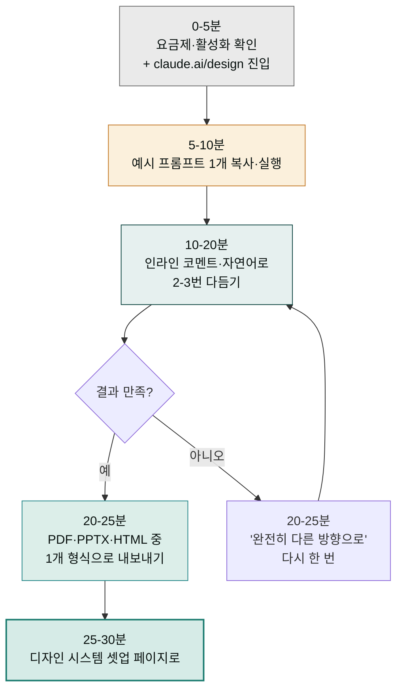

> Claude Design은 "디자인 도구를 켜기 전" 단계에 머릿속 아이디어를 화면에 띄우는 도구입니다. 이 페이지는 처음 30분 안에 첫 결과물을 받아 보는 것을 목표로 합니다.

## 접근 가능 여부 확인

| 항목 | 확인 방법 |
|---|---|
| 요금제 | Pro · Max · Team · Enterprise 중 하나로 로그인 |
| Enterprise | 조직 관리자가 **Anthropic Labs > Claude Design**을 활성화했는지 확인 |
| 브라우저 | Chrome·Safari·Firefox·Edge 최신 (데스크톱·모바일 앱 미지원) |
| 진입 URL | [claude.ai/design](https://claude.ai/design) |
| 롤아웃 | Research Preview, 점진 활성 — 가입 직후 즉시 보이지 않을 수 있음 |


**Enterprise는 기본 OFF.** 보이지 않는다면 IT/조직 관리자에게 "Anthropic Labs 토글에서 Claude Design 활성화"를 요청하세요. [요금제·한도 페이지](../pricing-limits/) 참고.


## 첫 프로젝트 — 4가지 시작 방법

Claude Design 프로젝트는 다음 4가지 중 하나로 시작합니다. 처음에는 **텍스트 프롬프트**가 가장 단순합니다.

### 1. 텍스트 프롬프트

빈 화면에 자연어로 원하는 결과를 설명합니다.

```
명상 앱의 모바일 첫 화면을 디자인해 줘.
- 청중: 직장인 30-40대, 출퇴근길 5분 명상
- 톤: 차분한, 자연 친화적, 미니멀
- 색: 부드러운 파스텔 그린·베이지
- 컴포넌트: 큰 시작 버튼, 오늘의 가이드 카드, 진행 스트릭 표시
- 다크모드 토글 포함
```

### 2. 이미지·문서 업로드

DOCX·PPTX·XLSX·PNG·JPG를 업로드해 시각 자료로 변환합니다.

| 업로드 | 결과 예시 |
|---|---|
| 기존 사업계획서 DOCX | 같은 내용을 발표용 PPTX로 |
| 표가 많은 XLSX | 핵심 지표를 강조한 대시보드 시안 |
| 손그림 와이어프레임 사진 | 정돈된 디지털 와이어프레임 |
| 경쟁사 스크린샷 | 우리 브랜드로 톤을 바꾼 동일 구조 시안 |

### 3. 코드베이스 연결

GitHub repo 또는 로컬 폴더를 연결하면 Claude가 기존 컴포넌트·디자인 토큰을 자동 인식합니다.

```
연결: GitHub repo URL 또는 폴더 업로드
인식 항목: React·Vue·Svelte 컴포넌트, CSS 토큰, Tailwind 설정, 기존 페이지
첫 프롬프트 효과: "기존 Button 컴포넌트로 구성된 설정 페이지 디자인"
```


**모노레포 전체 연결은 피하세요.** 빌드 산출물·node_modules·.git까지 읽으면 ingestion이 매우 느려집니다. UI 패키지 디렉토리만 연결하는 것을 권장합니다.


### 4. 웹 캡처 도구

운영 중인 웹사이트의 특정 요소를 직접 캡처해 새 디자인의 시작점으로 활용합니다.

- 본인 사이트 또는 권한 있는 사이트만 사용
- 헤더·푸터·카드·폼 같은 단위로 캡처
- 캡처 후 "이 카드 디자인을 우리 브랜드 톤으로 다시" 같은 프롬프트로 변형

## 첫 프롬프트 6요소 템플릿

비디자이너가 가장 자주 실패하는 지점은 "막연한 톤만 적는 것"입니다. 다음 6요소를 채우면 결과가 한 단계 점프합니다.

```
Project:     [한 줄 설명 — 무엇을 만드는가]
Audience:    [구체적 사용자 — 예: B2B AI 거버넌스 담당 CCO]
Pages:       [필요한 페이지·섹션 목록 + 각 목적]
Tone:        [형용사 3-5개 — 예: 신뢰감 있는, 미니멀, 데이터 중심]
Reference:   [Dribbble·경쟁사·자사 잘 만든 페이지 URL]
Constraints: [모바일·데스크톱, 디자인 시스템, 특정 컴포넌트, 제약]
```

**채워 본 예시**:

```
Project:     B2B 마케팅 자동화 SaaS의 가격 페이지
Audience:    20-100명 규모 스타트업의 그로스 리드·마케팅 매니저
Pages:       Hero(가치 제안) · 3티어 가격 카드 · 비교표 · FAQ · CTA
Tone:        신뢰감 있는, 데이터 중심, 미니멀, 약간의 활기
Reference:   linear.app/pricing, stripe.com/pricing 톤
Constraints: 데스크톱 우선, 디자인 시스템은 기존 React 컴포넌트, 결제 정보 입력 X
```

## Hello World 예시 6종

복사해 그대로 써 보세요. 디자인 시스템을 아직 셋업하지 않았어도 작동합니다.

### 1. SaaS 설정 페이지

```
어드민 도구의 설정 페이지를 다음 섹션 순서로 디자인해 줘:
사용자 · 연동 · 결제 · 보안 · API 키.
깔끔한 SaaS 톤, 좌측 사이드바 + 우측 콘텐츠 영역 구성.
각 섹션은 헤더 + 짧은 설명 + 주요 액션 버튼 1개 포함.
다크 모드 지원, 모바일에서는 사이드바를 햄버거로 접기.
```

### 2. 발표용 피치덱 (10슬라이드)

```
한국어 SaaS 스타트업의 시드 라운드 피치덱을 10슬라이드로 만들어 줘.
구조: Cover · Problem · Solution · Demo · Market · Business model ·
Traction · Team · Ask · Q&A. 각 슬라이드에 발표자 노트 1-2문장 포함.
톤은 진지하고 신뢰감 있게, 그러나 너무 차갑지 않게.
```

### 3. 마케팅 랜딩 페이지

```
국내 헬스케어 스타트업 랜딩 페이지. Hero는 "수면의 질을 측정하는
웨어러블"이라는 가치 제안. 섹션: Hero · How it works (3-step) ·
Feature grid (6) · Social proof (병원 로고) · Plan comparison · CTA.
한글 카피 중심, 모바일 우선 반응형.
```

### 4. 인터랙티브 와이어프레임

```
이커머스 결제 플로우를 3페이지 와이어프레임으로:
Cart → Address & shipping → Payment & review.
각 페이지 상단에 진행 단계 표시. 모바일 화면 우선. 인터랙티브로 만들어
줘 — 버튼 클릭 시 다음 화면으로 이동.
```

### 5. 한 장 비주얼 요약

```
첨부한 블로그 글(URL/텍스트)을 한 장(1080×1920px, SNS용) 비주얼
요약으로 만들어 줘. 핵심 인사이트 3개를 카드 형태로, 헤드라인은
한 줄 12자 이내, 출처와 작성자 정보를 푸터에.
```

### 6. 코드 기반 인터랙티브 프로토타입 (셰이더·3D·웹 오디오)

```
다음 중 하나를 시연용 인터랙티브 프로토타입으로:
- WebGL 셰이더 풀스크린 배경 (마우스 위치에 따라 색 그라데이션이 흐름)
- Three.js 3D 제품 시연 (.glb 업로드 → 드래그로 회전·확대·축소)
- Web Audio API 사운드 보드 (8개 패드, 키보드 단축키)
모두 인터랙티브 HTML+JS로 출력. 모바일에서는 정적 fallback.
React 컴포넌트로 추출 가능하게.
```

Anthropic 공식 발표(2026-04-17)에서 강조된 *"code-based prototypes including audio, video, shaders, and 3D"* 카테고리입니다. **독립 비디오 파일(.mp4)이 아니라 인터랙티브 코드**로 출력됩니다 — 자세한 한계는 [제한 사항](../limitations/#4-코드-기반-프로토타입--공식-지원-vs-실제-한계) 참고.

## 처음 30분 워크플로우



처음 30분의 목표는 **완성된 결과물**이 아니라 **도구의 입력·출력 사이클 한 바퀴**를 도는 것입니다. 결과 품질을 본격적으로 끌어올리는 작업은 [디자인 시스템 설정](../design-system/) 페이지에서 시작됩니다.

## 자주 묻는 첫 질문

**Q. 일반 채팅 한도를 먹나요?**
A. 아니요. Claude Design은 별도 쿼터를 씁니다. 채팅·Claude Code 사용량과는 분리되어 있습니다.

**Q. 결과물 저작권은?**
A. 사용자가 만든 결과물에 대한 권리는 사용자에게 있습니다. 다만 업로드한 자산이 제3자 권리를 침해하지 않아야 합니다.

**Q. 한국어 프롬프트가 가능한가요?**
A. 네. 프롬프트·결과물 카피 모두 한국어 지원. UI 자체는 일부 영문이 섞일 수 있습니다.

**Q. 다른 사람과 공유는 어떻게 하나요?**
A. 같은 조직 안에서 link 공유 + 권한 3종. 외부 공개 링크는 없습니다. [협업·공유 페이지](../collaboration/) 참고.

**Q. Claude Code로 어떻게 넘기나요?**
A. Export 메뉴에서 "Hand off to Claude Code" 또는 "Hand off to Claude Code Web". 자세한 절차는 [내보내기·핸드오프 페이지](../export-handoff/).

## Cowork 플러그인 연계

v2.12.0부터 Cowork에 [`moai-design`](../../plugins/moai-design/) 플러그인이 정식 등록되어 있습니다. Cowork 채팅에서 자연어로 호출하면 위 6요소를 자동으로 채워 줍니다.

```
"마케팅 자동화 SaaS 가격 페이지 브리프 만들어 줘"
→ Cowork의 /claude-design-brief 스킬이 자동 호출
→ 누락된 요소를 AskUserQuestion으로 보완
→ 완성된 프롬프트를 claude.ai/design에 복붙
```

자세한 동선은 [moai-design 플러그인 페이지](../../plugins/moai-design/) 참고.

## 다음 단계

- **다음 페이지**: [디자인 시스템 설정](../design-system/) ★ — 결과 품질이 한 단계 점프합니다
- 참고: [한눈에 보기·작동 방식](../) — 섹션 홈
- 깊이: [베스트 프랙티스 10가지](../best-practices/)
- 자동화: [`moai-design` 플러그인](../../plugins/moai-design/) — 6요소를 자동으로 채워주는 Cowork 스킬

---

### Sources

- [Introducing Claude Design by Anthropic Labs](https://www.anthropic.com/news/claude-design-anthropic-labs)
- [Using Claude Design for prototypes and UX (Anthropic Tutorial)](https://claude.com/resources/tutorials/using-claude-design-for-prototypes-and-ux)
- [Claude Design Starter Guide (Claudia + AI)](https://claudiaplusai.substack.com/p/claude-design-starter-guide-and-examples)
- [Claude Design: Complete Guide for Non-Designers (BuildFastWithAI)](https://www.buildfastwithai.com/blogs/claude-design-anthropic-guide-2026)
- [Anthropic launches Claude Design (TechCrunch)](https://techcrunch.com/2026/04/17/anthropic-launches-claude-design-a-new-product-for-creating-quick-visuals/)
