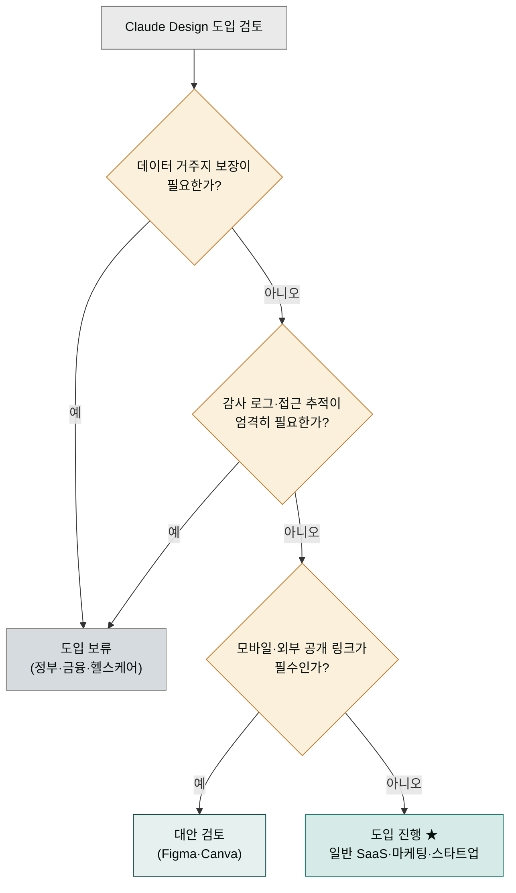

> Claude Design은 현재 Beta 단계입니다. 핵심 기능은 안정적이지만 엔터프라이즈 기능은 계속 개선 중입니다. 현재 무엇이 안 되는지, 무엇이 곧 될 것 같은지, 대안 도구가 더 나은 경우는 언제인지를 정확히 정리합니다.

## Beta 단계란 — 핵심은 안정, 엔터프라이즈 기능은 진행 중

새로 지은 건물에 입주한다고 상상해 보세요. 골조는 완성됐고 대부분의 층은 쓸 수 있지만, 아직 공사판이 서 있는 층도 있고, 엘리베이터가 잠시 멈추기도 하고, 일부 창호는 덧칠 예정입니다. 이럴 때 중요한 것은 "이 건물은 못 쓴다"가 아니라 "어디는 쓸 수 있고, 어디는 조심해야 하고, 언제 다 완성되나"를 정확히 아는 것입니다.

Claude Design의 **Beta** 단계가 바로 이런 공사 중 건물입니다. 핵심 기능(텍스트로 시안 만들기, 디자인 시스템 적용, Claude Code로 핸드오프)은 이미 안정적으로 쓸 수 있지만, 감사 로그·데이터 거주지·모바일 같은 엔터프라이즈 기능은 계속 개선 중입니다. 이 페이지는 "지금 확실히 안 되는 것"과 "곧 될 가능성이 있는 것"을 구분해, 도입 전에 미리 점검할 수 있게 정리합니다. 아래 결정 트리를 한 번 훑으면, 우리 조직이 지금 당장 써도 되는지 1분 안에 판단할 수 있습니다.



## 현재 상태 한눈에

| 차원 | 상태 |
|---|---|
| 출시 단계 | **Beta** (2026년 6월 기준) |
| 사용 가능 디바이스 | 웹 전용 — claude.ai/design |
| Claude Code 진입 경로 | claude.ai/design, Desktop 사이드바, Claude Code 터미널 `/design` |
| 모바일 앱 지원 | 미지원 |
| 데스크톱 앱 지원 | 미지원 |
| 데이터 거주지 | 미지원 |
| 감사 로그 | 미제공 |
| 사용량 대시보드 | 제한적 |
| 외부 공개 링크 | 없음 |
| API 접근 | 없음 (UI 전용) |
| SSO | Anthropic 일반 정책 (별도 기능 아님) |

## 제한 사항 9가지

### 1. 웹 전용

Claude·Cowork 데스크톱 앱과 모바일 앱에서는 작동하지 않습니다. 브라우저(Chrome·Safari·Firefox·Edge 최신)에서만 사용.

**영향**:
- 오프라인·이동 중 작업 불가
- 모바일에서 빠른 시안 확인 어려움
- 데스크톱 앱 사용자는 브라우저 별도 실행 필요

**대안**: 결과물 PDF·PPTX·HTML로 내보내 모바일에서 확인.

### 2. 큰 코드베이스 ingestion 지연

```
증상: 모노레포 전체 또는 enterprise 규모 코드베이스 연결 시 5분 이상 지연
원인: 디자인 시스템 추출 과정에서 모든 파일을 스캔
```

**복구**:
- UI 패키지 디렉토리만 연결 (예: `packages/ui`)
- `.git`·`node_modules`·`dist`·`build` 제외 확인
- DESIGN.md를 Claude Code에서 사전 합성 후 업로드

### 3. Beta 단계의 점진 기능 추가

가입자 모두에게 즉시 활성화되지 않습니다.

| 가입 유형 | 일반적 활성화 시점 |
|---|---|
| 신규 Pro 가입자 | 가입 직후 또는 며칠 내 |
| 기존 Pro 사용자 | 점진 — 기준 비공개 |
| Enterprise | 관리자 활성화 필수 |
| 신규 지역 | 미국·EU 우선, 다른 지역은 후속 |

가입 직후 보이지 않더라도 **며칠 기다리거나 Anthropic 지원 문의**.

### 4. 코드 기반 프로토타입 — 공식 지원 vs 실제 한계

Anthropic 공식 발표(2026-04-17)는 음성·비디오·셰이더·3D를 포함한 **코드 기반 프로토타입**을 공식 지원한다고 명시했습니다. 원문: *"code-based prototypes including those with audio, video, shaders, and 3D"*.

| 영역 | 상태 |
|---|---|
| WebGL 셰이더 데모·Three.js 3D 씬·Web Audio API 음성·CSS 애니메이션 | 공식 지원 — 인터랙티브 HTML+JS 코드로 출력 |
| 독립 비디오 파일(.mp4) | 미지원 — "비디오 옵션"도 ZIP·HTML·PDF·PPTX 형식으로만 출력 (사용자 보고) |
| 복잡한 3D 씬 (외부 자산 의존)·다국어 음성 합성 | 초기 단계 |
| 복잡한 게임 로직·AR/VR 디바이스 빌드·실시간 외부 데이터 시각화 | 미지원 |

핵심 구분: **인터랙티브 코드 기반 프로토타입**은 가능 (셰이더·웹 오디오·3D 씬 데모). **표준 비디오 파일**이 필요하면 외부 도구(Higgsfield·Veo·Sora 등) 사용 권장.

### 5. Figma 대체가 아님

```
Figma가 더 강한 영역:
- 디자이너 협업·실시간 공동 작업
- 정교한 디자인 시스템 운영 (variables, components, libraries)
- 디자인 ↔ 코드 양방향 (Dev mode)
- 플러그인 생태계
- 외부 공개 링크·프로토타입 공유
- 전문 디자이너 워크플로우 (vector edit·constraints·prototyping)
```

Figma는 UI/UX 디자인 시장의 80-90%를 차지하며 디자인 시스템 운영의 표준입니다. Claude Design은 **저변 확대 도구** (디자이너가 아닌 사람도 시각 자료를 만들 수 있게)로 위치합니다.

### 6. 디자인 ↔ 코드 양방향 — `/design-sync`로 부분 강화됨

```
강함: 디자인 → 코드 (Claude Code 핸드오프 번들)
강화됨: 코드 → 디자인 (Claude Code 터미널 /design-sync로 디자인 시스템 import 가능)
약함: 양방향 실시간 동기화 (코드 수정 후 자동 반영)
```

**실제 사용 패턴**: 
- Claude Design에서 시안 작성 → Claude Code로 핸드오프 (강함)
- Claude Code에서 빌드한 컴포넌트 → `/design-sync`로 Claude Design 시스템에 import (F7)
- 코드 결과 스크린샷 → Claude Design에 입력해 비교·추가 수정

양방향 흐름이 가능하지만 자동 동기화는 아니며, 수동 import/export 단계가 필요합니다.

### 7. 사용량 추적·감사 로그 미제공

| 운영 기능 | 상태 |
|---|---|
| 멤버별 사용량 대시보드 | 제한적 |
| 감사 로그 (누가 무엇을 만들었는가) | 미제공 |
| 프로젝트별 토큰 사용량 | 미제공 |
| 사용량 알림 (임계치 도달 시) | 미제공 |

엄격한 거버넌스가 필요한 조직(금융·정부)은 도입 시 이 점을 고려.

### 8. 데이터 거주지 미지원

EU·한국 등 지역 데이터 거주지 요구가 있는 산업에는 적합하지 않습니다.

- 개인정보·금융·의료 데이터는 업로드 자체를 피해야 함
- Enterprise DPA는 서명 가능하지만 데이터 거주지 보장은 아님
- 자세한 데이터 처리 정책은 Anthropic Trust Center 또는 Sales 문의

### 9. PPTX 변환의 한계

```
증상: PPTX 내보내기 시 캔버스 HTML 버전보다 레이아웃이 간소화됨
특히: 배경 그라데이션·복잡한 일러스트·인터랙티브 요소가 단순화 또는 누락
```

**대응**: 정밀한 발표 자료가 필요하면 PDF + HTML을 함께 받아 비교.

## 추가 알려진 이슈 (사용자 보고 기반)

| 이슈 | 빈도 | 우회 |
|---|---|---|
| 인라인 코멘트가 처리 전에 사라짐 | 가끔 | 코멘트 내용을 채팅에 복사·붙여넣기 |
| Compact 뷰에서 저장 에러 | 가끔 | Full 뷰로 전환 |
| 사용량이 대시보드보다 빠르게 소진 | 자주 (사용자 인지) | 디자인 시스템 자체 생성 비용 의식 |
| 큰 시안에서 인터랙션 누락 | 가끔 | 인터랙션을 별도 라운드로 분리 요청 |

## 향후 로드맵 — Anthropic 공식 단기 (2026-04-17 발표 명시)

Anthropic이 출시 공지에서 **직접 명시한** 단기 우선순위입니다.

| 영역 | 시점 | 출처 |
|---|---|---|
| 외부 도구 통합 빌더 (Claude Design ↔ 외부 도구 연동 간소화) | "coming weeks" | [Anthropic 공식 출시 공지](https://www.anthropic.com/news/claude-design-anthropic-labs) |

원문: *"Over the coming weeks, we'll make it easier to build integrations with Claude Design, so you can connect it to more of the tools your team already uses."*

이 한 줄이 의미하는 것: Slack·Notion·Figma·Linear 같은 외부 도구로 Claude Design 결과물·핸드오프 번들을 자동으로 흘릴 수 있는 빌더 도구가 곧 제공될 가능성. Cowork 사용자는 이 빌더가 나오면 기존 Cowork MCP 커넥터(Notion·Drive·Slack)와 결합해 풀스택 자동화가 가능해집니다.

## 향후 로드맵 — 외부 추정 (Anthropic 비공식)

위 공식 단기 외에는 출시 공지·인터뷰·사용자 피드백을 종합한 외부 추정입니다.

| 영역 | 추정 우선순위 |
|---|---|
| 활성화 점진 롤아웃 → 전면 가용 | 가장 빠를 가능성 |
| 데스크톱 앱 통합 | 중기 |
| 감사 로그·사용량 대시보드 | 엔터프라이즈 도입 가속에 필요 → 중기 |
| 데이터 거주지 | EU·아시아 도입 가속에 필요 → 중기 |
| 모바일 앱 | 후순위 (디자인 작업이 모바일에 부적합) |
| 3D·음성·비디오 강화 | 장기 |
| API 접근 | 장기 |
| 디자인 → 코드 양방향 | 장기 (복잡도 큼) |

**중요**: 이 표는 외부 추정이며 Anthropic 공식 약속이 아닙니다. 실제 로드맵은 Anthropic 공식 채널을 확인하세요.

## 경쟁·대체 도구 비교

### Figma Make · v0 · Lovable · Bolt와의 차이

| 도구 | 강점 | 약점 | Claude Design 대비 |
|---|---|---|---|
| **Figma** | 디자이너 협업·시스템 운영 | 프로토타입에서 코드까지 손이 많이 감 | 디자이너 협업·정교한 운영은 Figma, 빠른 시안·핸드오프는 Claude Design |
| **Figma Make** | Figma 내장, 디자이너 친숙 | 별도 디자인 도구와 분리, Figma 안에서 동작 | Figma 사용자에게 Make가 자연스럽지만, 핸드오프·다양한 출력은 Claude Design |
| **v0 (Vercel)** | Next.js·shadcn 컴포넌트, 코드 출력 직접 | UI 위주, 정교한 디자인 시스템 약함 | v0는 빠른 코드·앱 배포, Claude Design은 디자인 단계 탐색·핸드오프 |
| **Lovable** | 한 번에 배포 가능한 앱 | 코드 품질·디자인 시스템 약함 | Lovable은 즉시 배포, Claude Design은 우리 코드베이스·시스템과 통합 |
| **Bolt** | 빠른 풀스택 앱 생성 | 디자인 변형 탐색 약함 | Bolt는 같은 날 배포, Claude Design은 디자인 탐색·발표 자료 |

### 언제 어떤 도구를 쓰나

```
디자이너 협업 + 정교한 시스템 운영           → Figma
빠른 디자인 탐색 + Claude Code 핸드오프       → Claude Design ★
같은 날 풀스택 앱 배포                       → Lovable·Bolt·v0
마케팅 비주얼 다량 생산                      → Canva
프로토타입 → 본격 디자인 도구로 옮기기        → Claude Design → Figma
```

## 보안·규제 관점 위치 정리

| 산업·맥락 | 권장 사용 범위 |
|---|---|
| 일반 SaaS·이커머스 | 자유롭게 사용 가능 |
| 마케팅·미디어 | 자유롭게 사용 가능 |
| 한국 일반 스타트업 | 자유롭게 사용 가능 (개인정보 익명화 후) |
| 한국 핀테크 | 마케팅 자료까지만, 결제·고객 정보는 더미로 |
| 한국 헬스케어 | 환자 데이터·임상 자료 업로드 금지, 일반 마케팅까지만 |
| 정부·공공 | 데이터 거주지·감사 로그 요구 충족 안 됨 — 도입 보류 권장 |
| 군사·국방 | 도입 부적합 |

## Beta 단계에서의 운영 권장

```
□ 모든 결과물에 백업 ZIP을 따로 유지
□ 디자인 시스템 변경 이력을 별도 기록 (감사 로그 없음)
□ 멤버별 사용량을 자율 보고 채널로 추적
□ Anthropic 공지·도움말을 분기 1회 점검 (기능 변동 가능)
□ 외부 발송용 자료에 대해 별도 리뷰 경로
□ "이게 안 된다"는 단점이 발견되면 사내 위키에 기록 — 다음 도입자가 참고
```

## 정말 안 되는 것 — 도입 전 결정 사항

이 중 하나라도 핵심 요구사항이면 **현재 Claude Design은 적합하지 않습니다**.

```
✗ 데이터 거주지 보장이 필요한가
✗ 감사 로그·접근 추적이 엄격하게 요구되는가
✗ 디자이너 협업이 핵심이며 Figma 같은 양방향 도구가 필수인가
✗ 모바일·태블릿에서 디자인 작업이 필요한가
✗ 외부 공개 링크가 필요한가 (PR·이벤트 페이지를 공개 URL로)
✗ 3D·AR·VR 콘텐츠가 주요 산출물인가
✗ API로 디자인 생성을 자동화해야 하는가
```

위 7가지가 모두 No이면 도입 진행 가능. 1개라도 Yes이면 도입 보류·대안 검토.

## 다음 단계

- 참고: [요금제·한도](../pricing-limits/) — Beta 단계의 운영 고려사항
- 참고: [협업·공유](../collaboration/) — 거버넌스 기능 부재 대응
- 섹션 홈: [클로드 디자인 개요](../) — 전체 학습 경로

---

### Sources

- [Introducing Claude Design by Anthropic Labs](https://www.anthropic.com/news/claude-design-anthropic-labs)
- [Claude Design admin guide for Team and Enterprise plans](https://support.claude.com/en/articles/14604406-claude-design-admin-guide-for-team-and-enterprise-plans)
- [Anthropic launches Claude Design (TechCrunch)](https://techcrunch.com/2026/04/17/anthropic-launches-claude-design-a-new-product-for-creating-quick-visuals/)
- [Claude Design Starter Guide (Claudia + AI)](https://claudiaplusai.substack.com/p/claude-design-starter-guide-and-examples)
- [Claude Design: Complete Guide for Non-Designers (BuildFastWithAI)](https://www.buildfastwithai.com/blogs/claude-design-anthropic-guide-2026)
- [Using Claude Design for prototypes and UX (Anthropic Tutorial)](https://claude.com/resources/tutorials/using-claude-design-for-prototypes-and-ux)
