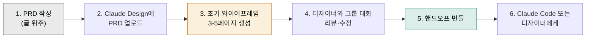

> "Claude Design을 가장 잘 쓰는 사람은 디자이너가 아니라 디자인 도구를 켤 일이 없던 사람"이라는 말이 있습니다. 역할별로 실제 워크플로우와 시간 단축 사례를 정리했습니다.

## 역할별 워크플로우 한눈에

| 역할 | 주된 사용 패턴 | 대표 결과물 | 핸드오프 여부 |
|---|---|---|---|
| **창업자** | 텍스트 → 피치덱 | 투자자용 10-15슬라이드 | 보통 X (PDF·PPTX로 끝) |
| **PM** | 기능 플로우 → 와이어프레임 | 결제·온보딩·설정 3-5페이지 | O (Claude Code 또는 디자이너에게) |
| **디자이너** | 정적 목업 → 인터랙티브 프로토타입 | 사용자 테스트 가능한 데모 | O (Claude Code) |
| **마케터** | 캠페인 컨셉 → 다채널 비주얼 | 랜딩·배너·SNS·이메일 | X (Canva로 후속) |
| **창업 초기 팀** | 모든 비주얼 작업을 한 도구로 | 사업계획·랜딩·시안 일괄 | 상황별 |

## 1. 창업자 — 피치덱·내부 보고

### 시나리오: 시드 라운드 피치덱 작성

```
배경: 솔로 창업자, 디자이너 없음, 다음 주 투자자 미팅 5건
기존 방식: Google Slides에서 텍스트만 정리 → 디자인 외주 1-2일 + 80만원
Claude Design: 텍스트 브리프 → 10슬라이드 → 외주 없이 2시간
```

**프롬프트 예시**:

```
한국어 B2B SaaS 스타트업의 시드 피치덱을 10슬라이드로 만들어 줘.

회사: [회사명] - [한 줄 가치 제안]
시장: [시장 규모와 성장률]
제품: [핵심 기능 3가지]
트랙션: [지표 - 사용자 수, MRR, 성장률]
팀: [핵심 멤버 약력]
경쟁: [경쟁사 3개와 우리의 차별점]
재무: [12개월 ARR 계획]
요청: [라운드 규모 + 사용처]

톤은 신뢰감 있게, 데이터 중심. 각 슬라이드에 발표자 노트 1-2문장.
표지·문제·해법·데모·시장·BM·트랙션·팀·요청·Q&A 순서.
```

내보내기는 PPTX (발표 전 텍스트 미세 수정) 또는 PDF (이메일 첨부).

### 시나리오: 보드 미팅용 분기 보고

```
입력: 분기 KPI 엑셀 + 텍스트 브리핑
출력: 5장 비주얼 보고서 — 표지, KPI 대시보드, 분기 하이라이트, 다음 분기 계획, Q&A
시간: 30분 (이전: 디자이너 1일 또는 본인 4시간)
```

## 2. PM — 와이어프레임·기능 플로우

### 시나리오: 새 기능 명세 + 와이어프레임

PM의 가장 흔한 마찰: "글로만 적은 PRD를 디자이너가 와이어프레임으로 옮기는데 1주일"

**Claude Design 패턴**:



**프롬프트 예시**:

```
첨부한 PRD를 와이어프레임으로:
- 기능: [기능 이름]
- 사용자 플로우: [Step 1 → Step 2 → ... → Step N]
- 각 페이지의 핵심 요소만 (상세 시각은 디자이너가 채움)
- 인터랙티브 — 버튼 클릭 시 다음 화면으로
- 데스크톱 우선

엣지 케이스도 포함: 빈 상태, 에러, 로딩.
```

### 시나리오: A/B 테스트 후보 시안 빠르게 생성

```
프롬프트: "현재 결제 페이지 스크린샷 첨부. 컨버전 개선 가설 3개:
1) 가격을 한 줄로 강조
2) 신뢰 배지(고객 로고) 추가
3) 결제 단계를 1페이지로 압축
각 가설별로 A/B 후보 시안을 생성"

결과: 3개 시안, 인터랙티브 프로토타입 — 사용자 테스트 즉시 가능
```

## 3. 디자이너 — 인터랙티브 프로토타입·탐색

### 시나리오: 정적 목업 → 인터랙티브 프로토타입

디자이너가 가장 시간을 쓰는 부분 중 하나: 정적 시안을 사용자 테스트 가능하게 만드는 것.

```
배경: Figma 정적 시안 5페이지, 사용자 테스트 다음 주
기존: Figma 프로토타입 모드 + 인터랙션 일일이 설정 → 1.5일
Claude Design: Figma 익스포트 업로드 + "인터랙티브로" 지시 → 30분
```

### 시나리오: 빠른 방향 탐색 — 5가지 시안 비교

디자이너는 보통 1-2개 방향만 탐색합니다 (시간 부족). Claude Design은 **수십 개 방향을 빠르게 생성**할 수 있어 탐색 폭을 넓힙니다.

```
프롬프트:
"동일한 SaaS 홈을 5가지 완전히 다른 디자인 방향으로:
1) 미니멀·여백 강조
2) 데이터·차트 강조
3) 일러스트·따뜻한 톤
4) 다크 모드·하이테크
5) 텍스트 중심·블로그 톤

각 방향마다 save this version. 비교 후 1개 선정."
```

내부 데모에서 Claude Design 디자이너 1명이 12개 프롬프트로 **비디오 콘텐츠 한 편**을 만든 사례가 보고됐습니다.

### 시나리오: 프론티어 미디어 프로토타입 (셰이더·3D·웹 오디오)

Anthropic 공식 발표(2026-04-17)에서 강조한 **코드 기반 프로토타입** 영역입니다. WebGL 셰이더, Three.js 3D 씬, Web Audio API 사운드 UI, 복잡한 CSS 애니메이션 같은 인터랙티브 HTML+JS 데모를 직접 생성할 수 있습니다.

```
프롬프트: "제품 페이지 Hero용 WebGL 셰이더 배경.
마우스 위치에 따라 색 그라데이션이 흐름.
모바일 fallback은 정적 이미지.
React 컴포넌트로 추출 가능하게 — Storybook 호환."
```

활용처: 제품 페이지 Hero, 3D 제품 시연, 사운드 보드 UI, 인터랙티브 데이터 시각화 프로토타입. 단, **독립 비디오 파일(.mp4)은 미지원** — 발표용 동영상은 외부 도구(Higgsfield·Veo·Sora) 사용 권장. 자세한 한계는 [제한 사항](../limitations/#4-코드-기반-프로토타입--공식-지원-vs-실제-한계) 참고.

### Brilliant 사례 — 20+ → 2 프롬프트

> "복잡한 페이지를 다른 도구에서 만들려면 20+ 프롬프트가 필요했는데, Claude Design에서는 2 프롬프트로 동일한 결과." — Brilliant (Olivia Xu)

핵심은 **디자인 시스템을 미리 등록**해 둔 것입니다. 시스템이 잘 셋업되면 첫 프롬프트가 거의 완성 수준으로 나옵니다.

## 4. 마케터 — 캠페인·랜딩·SNS

### 시나리오: 캠페인 비주얼 일괄 생성

마케터의 가장 큰 마찰: "캠페인 하나에 랜딩 1개 + 배너 5개 + SNS 카드 10개 + 이메일 1개를 디자인 백로그에 넣고 2-4주 기다림".

```
Claude Design 패턴:
1. 캠페인 컨셉을 한 문단으로 작성
2. "이 컨셉으로 다음 5종을 일괄 생성":
   - 랜딩 페이지 (Hero·기능·CTA)
   - 인스타그램 정사각 카드 3종 (1080×1080)
   - 인스타그램 스토리 1종 (1080×1920)
   - 이메일 헤더 1종 (600px 너비)
   - 페이스북 광고 배너 1종
3. 각각 PNG·PDF로 내보내기
4. Canva 전송 → 마케팅 팀이 후속 미세 조정
```

### 시나리오: 다국어 변형

```
프롬프트: "이 랜딩 페이지의 한국어 버전을 그대로 영어·일본어로 변환.
카피만 번역, 비주얼은 동일 유지. 일본어는 폰트를 Noto Sans JP로."
```

## 5. 창업 초기 팀 — 모든 비주얼을 한 도구로

5인 미만 팀에서 가장 큰 효과를 봅니다. 기존에 여러 도구·외주로 흩어지던 작업이 **한 디자인 시스템 안에서 일관성** 있게 모입니다.

### 한 주간 워크플로우 예시 (5인 SaaS 스타트업)

| 요일 | 작업 | 소요 |
|---|---|---|
| 월 | 사업계획서 분기 업데이트 (PDF) | 1시간 |
| 화 | 신기능 출시 페이지 (랜딩 HTML) | 2시간 |
| 수 | 보드 미팅 자료 (PPTX) | 1시간 |
| 목 | SNS 캠페인 비주얼 5종 | 2시간 |
| 금 | 신규 기능 와이어프레임 + 핸드오프 (Claude Code로) | 3시간 |

모두 동일한 디자인 시스템에서 만들어져 브랜드 일관성이 유지됩니다.

## 파트너 사례 — 공식 인용

### Brilliant (EdTech)

> "복잡한 페이지를 다른 도구에서 만들려면 20+ 프롬프트가 필요했지만 Claude Design에서는 2 프롬프트로 충분했습니다. 핸드오프 번들에 디자인 의도를 포함시키니 프로토타입에서 프로덕션까지의 점프가 매끄러웠습니다." — Olivia Xu, Brilliant

### Datadog

> "거친 아이디어를 회의실을 나가기 전에 작동하는 프로토타입으로 만들 수 있었습니다. 이전에는 1주일이 걸렸던 브리프·목업 사이클이 한 번의 대화로 압축됐어요." — Aneesh Kethini, Datadog

### Canva

> "Claude Design에서 Canva로 자연스럽게 아이디어와 초안을 가져올 수 있게 협업을 확장하고 있습니다." — Melanie Perkins, Canva CEO

## 한국 SaaS·이커머스 적용 시나리오

### 한국 B2B SaaS 스타트업

```
가장 큰 효과: 시드~프리A 단계, 디자이너 0-1명
- 매주 1-2회 피치덱·보고서 업데이트
- 분기마다 랜딩 페이지 리뉴얼
- 컨퍼런스·전시 자료 (1-3건/분기)
디자인 시스템: 자사 운영 코드 + 마케팅 사이트 URL
주요 산출: PPTX, PDF, 가끔 Claude Code 핸드오프
```

### 한국 D2C 이커머스 (10-30명)

```
가장 큰 효과: 캠페인 사이클이 빠른 패션·뷰티
- 신상품 출시마다 상세페이지·SNS·이메일 (월 5-10건)
- 이벤트 마이크로사이트 (월 1-2건)
- 광고 크리에이티브 (주 단위)
디자인 시스템: 브랜드 가이드 PDF + 이전 잘 만든 상세페이지 스크린샷
주요 산출: HTML(상세페이지·랜딩), Canva(SNS), PNG(광고)
```

### 한국 사내 도구·어드민

```
가장 큰 효과: 외부 디자이너 의뢰가 비효율적인 내부 도구
- 사내 어드민·운영 대시보드
- 사내 인트라넷 페이지
디자인 시스템: 회사 컬러 + Material·Tailwind 같은 표준
주요 산출: Claude Code 핸드오프 → React 어드민
```

## 역할별 추천 학습 경로

| 역할 | 1순위 | 2순위 | 3순위 |
|---|---|---|---|
| 창업자 | [시작하기](../getting-started/) | [내보내기·핸드오프](../export-handoff/) | [협업·공유](../collaboration/) |
| PM | [시작하기](../getting-started/) | [리파인먼트](../refinement/) | [내보내기·핸드오프](../export-handoff/) |
| 디자이너 | [디자인 시스템](../design-system/) ★ | [리파인먼트](../refinement/) | [내보내기·핸드오프](../export-handoff/) |
| 마케터 | [시작하기](../getting-started/) | [디자인 시스템](../design-system/) | [협업·공유](../collaboration/) |
| 엔지니어 (수신 측) | [내보내기·핸드오프](../export-handoff/) | [디자인 시스템](../design-system/) | [제한 사항](../limitations/) |
| 조직 관리자 | [요금제·한도](../pricing-limits/) | [협업·공유](../collaboration/) | [제한 사항](../limitations/) |

## 다음 단계

- **다음 페이지**: [베스트 프랙티스 10가지](../best-practices/) — 어느 역할이든 공통으로 적용되는 원칙
- 참고: [내보내기·핸드오프](../export-handoff/) — 결과물을 어디로 흘릴지
- 깊이: [요금제·한도](../pricing-limits/) — 사용량 관리

---

### Sources

- [Introducing Claude Design by Anthropic Labs](https://www.anthropic.com/news/claude-design-anthropic-labs)
- [Claude for Creative Work](https://www.anthropic.com/news/claude-for-creative-work)
- [Anthropic launches Claude Design (TechCrunch)](https://techcrunch.com/2026/04/17/anthropic-launches-claude-design-a-new-product-for-creating-quick-visuals/)
- [Claude Design: Complete Guide for Non-Designers (BuildFastWithAI)](https://www.buildfastwithai.com/blogs/claude-design-anthropic-guide-2026)
- [Using Claude Design for prototypes and UX (Anthropic Tutorial)](https://claude.com/resources/tutorials/using-claude-design-for-prototypes-and-ux)
