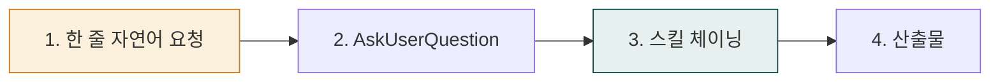
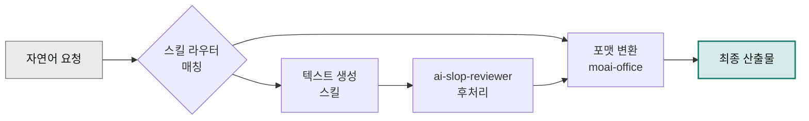

# Cowork 쿡북

> Claude Cowork와 moai 플러그인을 **실제 업무에 어떻게 엮는지** 시나리오 묶음으로 정리한 쿡북입니다.

## 사용 방식 (v2.8.0+)

**핵심 원칙**: 사용자가 짧은 한 줄 요청 → 시스템이 AskUserQuestion으로 맥락 수집 → 스킬 체이닝 자동 일괄 처리. 사용자가 매번 긴 옵션 프롬프트를 작성하지 않습니다.

➡️ **[사용 패턴 가이드 (4가지 표준 패턴)](../cowork/patterns/)** — 단일 프롬프트 · 멀티턴 대화 · 배치 처리 · 스케줄 자동화

## 어디서 시작하나요?

- **역할이 명확하면 → [실전 트랙](./tracks/)** — 10개 트랙 + 부록 (문서·콘텐츠·광고·이커머스·HR·운영·법무·재무·데이터·프로덕트)
- **구체적 시나리오를 찾는다면 → 아래 쿡북 목록**
- **개념부터 익힌다면 → [스킬 체이닝 가이드](./skill-chaining/)**

## 공통 포맷 (모든 쿡북 항목)

각 예제는 다음 구성으로 제공합니다.

- **사용자 입력** — 한 줄 자연어 요청 (✅ 권장 패턴)
- **시스템 인터뷰** — AskUserQuestion이 묻는 항목
- **자동 체인** — 시스템이 호출하는 스킬 순서 (mermaid)
- **산출물** — 최종 결과물 미리보기
- **변형 시나리오** — 한 줄 요청 변경으로 다른 결과 얻기
- **자주 겪는 이슈** — 실패 케이스와 우회법

## 먼저 읽으면 좋은 글

- [스킬 체이닝 가이드](./skill-chaining/) — 쿡북 전반에서 공통으로 쓰는 체인 패턴 입문
- [플러그인 빠른 시작](../plugins/quick-start/) — 마켓플레이스 등록부터 첫 호출까지

## 예제 목록

- [스킬 체이닝 가이드](./skill-chaining/) — 체인 설계 기초
- [베스트 프랙티스](./best-practices/) — 실패 패턴 10선, 프롬프트 점검표
- [자동화 레시피](./automation-recipes/) — 바로 쓰는 20개 체인 모음
- [블로그 파이프라인](./blog-pipeline/) — 초안→검수→썸네일
- [주간 보고서 자동화](./report-automation/) — 상태 집계→XLSX→DOCX
- [마케팅 트랙](./track-marketing/) — 브랜딩·SEO·캠페인 8주
- [문서 트랙](./track-documents/) — Office 산출물 자동화 8주
- [데이터 트랙](./track-data/) — 분석·공공데이터 8주
- [사업계획서 자동화](./business-plan/) — 전략→산업분석→PPT
- [IR 덱 제작](./ir-deck/) — 투자자 관점 슬라이드
- [계약서 검토 리포트](./contract-review/) — NDA 트리아지·리스크 점검
- [AI 사원 설계](./ai-employee-design/) — 역할→체인→KPI
- [AI 사원 실습 1 — 재무](./ai-employee-lab-1/) — 월말 마감 자동화
- [AI 사원 실습 2 — 품질·SCM](./ai-employee-lab-2/) — 이상 감지 알림
- [트러블슈팅](./troubleshooting/) — 체인 실패 진단·재시도
- [최종 프로젝트](./final-project/) — 본인 업무 1건을 체인으로

## 공통 원칙

- **텍스트 산출물은 무조건 `ai-slop-reviewer`로 마무리합니다.** 보고서·블로그·이메일·자소서·계약서 수정안이 모두 해당합니다.
- **숫자·차트·코드는 `ai-slop-reviewer`를 생략합니다.** 재무제표 엑셀, 차트 HTML, 스크립트는 검수 대상이 아닙니다.
- **포맷 변환은 `moai-office`에 위임합니다.** 내용 생성 스킬은 초안만 만들고 `docx-generator` / `xlsx-creator` / `pptx-designer` / `hwpx-writer`가 실제 파일을 만듭니다.
- **Windows 사용자는 파일명을 짧게 유지합니다.** MAX_PATH(260자) 제한 때문에 `보고서.docx`처럼 짧은 한글 이름을 권장합니다.

---

### Sources
- [modu-ai/cowork-plugins](https://github.com/modu-ai/cowork-plugins)
- [docs.claude.com — Cowork](https://docs.claude.com)
