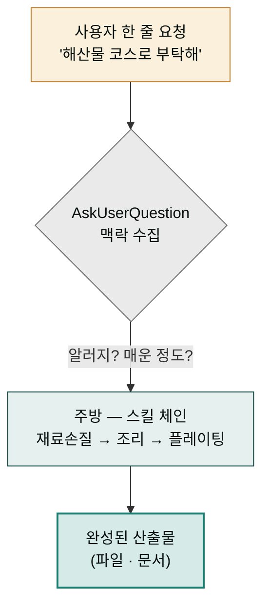
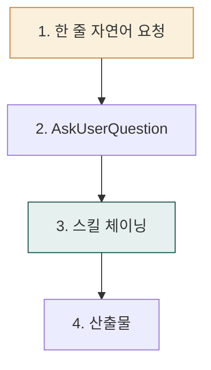
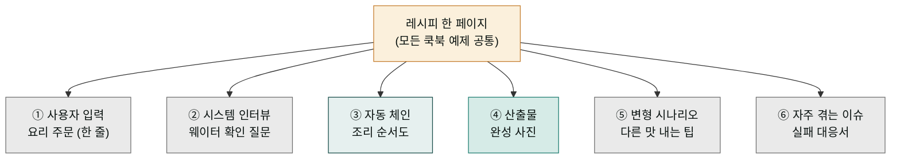
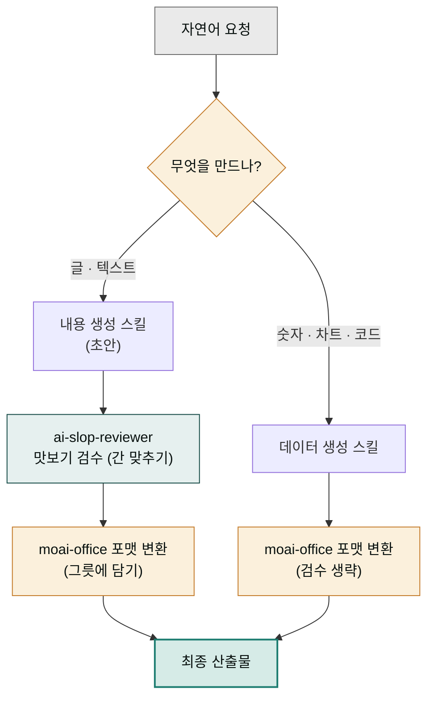
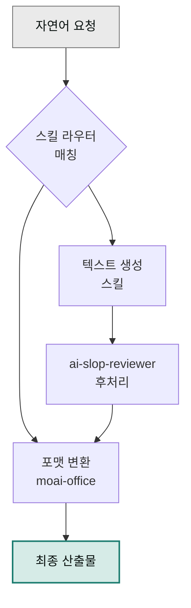

# Cowork 쿡북

> Claude Cowork와 moai 플러그인을 **실제 업무에 어떻게 엮는지** 시나리오 묶음으로 정리한 쿡북입니다.

## 사용 방식

**핵심 원칙**: 사용자가 짧은 한 줄 요청 → 시스템이 AskUserQuestion으로 맥락 수집 → 스킬 체이닝 자동 일괄 처리. 사용자가 매번 긴 옵션 프롬프트를 작성하지 않습니다.

## 한 줄이 산출물이 되기까지

고급 레스토랑에 앉은 것과 같습니다. 손님은 "오늘 해산물 코스로 부탁해"라는 한 줄만 말하면, 웨이터가 "알러지 있으세요? 매운 정도는?"처럼 필요한 질문만 골라 묻고, 그 답을 주방으로 넘깁니다. 주방은 재료 손질 → 조리 → 플레이팅을 차례로 진행해 완성된 요리를 내옵니다. 손님이 레시피를 외우거나 주방 순서를 직접 지시할 필요가 없습니다.

쿡북도 같은 구조로 돌아갑니다. **AskUserQuestion**이란 시스템이 사용자에게 맥락을 물어보는 구조화된 질문 상자입니다 — 선택지가 함께 나오는 작은 팝업이라고 생각하면 됩니다. **스킬 체이닝**이란 여러 전문 스킬을 순서대로 이어 파이프라인(한 방향으로 흘러가는 작업 연결선)을 만드는 방식입니다. 사용자는 "블로그 글 써줘"라는 한 줄만 던지면, 시스템이 독자·분량·말투를 AskUserQuestion으로 묻고, 그 답을 받아 내용 생성 → 검수 → 파일 변환이 차례로 이어지며 최종 산출물이 완성됩니다.

핵심은 사용자가 매번 긴 옵션 프롬프트를 외워 쓰지 않아도 된다는 점입니다. 시스템이 필요한 순간에 필요한 질문만 골라 묻기 때문에, 초보자도 전문가처럼 정교한 산출물을 얻을 수 있습니다.

➡️ **[사용 패턴 가이드 (4가지 표준 패턴)](../cowork/patterns/)** — 단일 프롬프트 · 멀티턴 대화 · 배치 처리 · 스케줄 자동화

## 어디서 시작하나요?

- **역할이 명확하면 → [실전 트랙](./tracks/)** — 10개 트랙 + 부록 (문서·콘텐츠·광고·이커머스·HR·운영·법무·재무·데이터·프로덕트)
- **구체적 시나리오를 찾는다면 → 아래 쿡북 목록**
- **개념부터 익힌다면 → [스킬 체이닝 가이드](./skill-chaining/)**

## 공통 포맷 (모든 쿡북 항목)

각 예제는 다음 구성으로 제공합니다.

- **사용자 입력** — 한 줄 자연어 요청 (✅ 권장 패턴)
- **시스템 인터뷰** — AskUserQuestion이 묻는 항목
- **자동 체인** — 시스템이 호출하는 스킬 순서 (mermaid)
- **산출물** — 최종 결과물 미리보기
- **변형 시나리오** — 한 줄 요청 변경으로 다른 결과 얻기
- **자주 겪는 이슈** — 실패 케이스와 우회법

## 같은 틀로 읽는 법

요리책의 레시피 한 페이지를 상상하면 됩니다. 각 쿡북 예제는 동일한 6단 레시피 틀을 따릅니다. **사용자 입력**은 요리 주문(한 줄), **시스템 인터뷰**는 웨이터의 확인 질문, **자동 체인**은 조리 순서도, **산출물**은 완성 사진, **변형 시나리오**는 같은 레시피로 다른 맛 내는 팁, **자주 겪는 이슈**는 "소금 너무 많이 넣었을 때 대처법" 같은 실패 대응서입니다.

매 예제마다 이 틀이 고정되어 있어, 한 번 익숙해지면 어떤 예제든 같은 자리에서 같은 정보를 찾을 수 있습니다. 산출물을 확인하고 싶으면 항상 네 번째 단락을 보면 되고, 실패했을 때 대처법이 필요하면 항상 마지막 단락을 보면 됩니다.

## 먼저 읽으면 좋은 글

- [스킬 체이닝 가이드](./skill-chaining/) — 쿡북 전반에서 공통으로 쓰는 체인 패턴 입문
- [플러그인 빠른 시작](../plugins/quick-start/) — 마켓플레이스 등록부터 첫 호출까지

## 예제 목록

- [스킬 체이닝 가이드](./skill-chaining/) — 체인 설계 기초
- [베스트 프랙티스](./best-practices/) — 실패 패턴 10선, 프롬프트 점검표
- [자동화 레시피](./automation-recipes/) — 바로 쓰는 20개 체인 모음
- [블로그 파이프라인](./blog-pipeline/) — 초안→검수→썸네일
- [주간 보고서 자동화](./report-automation/) — 상태 집계→XLSX→DOCX
- [마케팅 트랙](./track-marketing/) — 브랜딩·SEO·캠페인 8주
- [문서 트랙](./track-documents/) — Office 산출물 자동화 8주
- [데이터 트랙](./track-data/) — 분석·공공데이터 8주
- [사업계획서 자동화](./business-plan/) — 전략→산업분석→PPT
- [IR 덱 제작](./ir-deck/) — 투자자 관점 슬라이드
- [계약서 검토 리포트](./contract-review/) — NDA 트리아지·리스크 점검
- [트러블슈팅](./troubleshooting/) — 체인 실패 진단·재시도

## 공통 원칙

- **텍스트 산출물은 무조건 `ai-slop-reviewer`로 마무리합니다.** 보고서·블로그·이메일·자소서·계약서 수정안이 모두 해당합니다.
- **숫자·차트·코드는 `ai-slop-reviewer`를 생략합니다.** 재무제표 엑셀, 차트 HTML, 스크립트는 검수 대상이 아닙니다.
- **포맷 변환은 `moai-office`에 위임합니다.** 내용 생성 스킬은 초안만 만들고 `docx-generator` / `xlsx-creator` / `pptx-designer` / `hwpx-writer`가 실제 파일을 만듭니다.
- **Windows 사용자는 파일명을 짧게 유지합니다.** MAX_PATH(260자) 제한 때문에 `보고서.docx`처럼 짧은 한글 이름을 권장합니다.

## 세 규칙이 지키는 것 — 맡은 일만 하게 하기

요리에 비유하면, 위 세 규칙은 모두 "맡은 일만 하게 하라"는 한 원칙에서 나옵니다.

첫째, 텍스트 산출물은 **ai-slop-reviewer**라는 맛보기 검수관을 반드시 거칩니다. AI가 쓴 글은 육수가 덜 우러난 듯한 기계적 어투가 남아 있어, 사람이 읽기 좋게 간을 다시 맞춰야 합니다. 보고서·블로그·이메일·자소서·계약서 수정안이 모두 이 단계를 거칩니다.

둋째, 숫자·차트·코드는 맛이 아니라 영양표 같은 것이라 검수할 어투가 없습니다. 재무제표나 차트에 "사람 냄새"를 넣을 필요가 없으므로 `ai-slop-reviewer`를 생략합니다.

셋째, 요리(내용 생성)와 플레이팅(포맷 변환)은 분업합니다. 내용 생성 스킬은 맛있는 요리 초안만 만들고, **moai-office**의 `docx-generator` / `xlsx-creator` / `pptx-designer` / `hwpx-writer`가 그릇에 담아 실제 파일로 완성합니다. 한 명이 요리와 플레이팅을 동시에 하면 둘 다 흐트러집니다.

---

### Sources
- [modu-ai/cowork-plugins](https://github.com/modu-ai/cowork-plugins)
- [docs.claude.com — Cowork](https://docs.claude.com)
