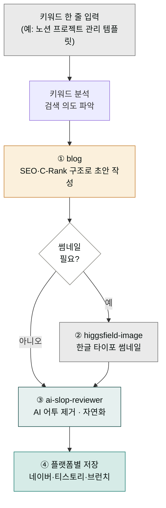

> **목표** — 키워드 한 줄에서 시작해 네이버·티스토리·브런치에 바로 올릴 수 있는 2500자 블로그 글까지, 한 번의 지시로 완성합니다.

## 블로그 파이프라인이란

블로그 파이프라인은 "글 하나 써줘"라는 한 줄 요청이 여러 스킬(각자 한 가지 일에 특화된 절차 묶음)을 거치면서 완성된 글이 되기까지의 흐름을 말합니다. 처음에는 "스킬 하나면 충분히 글을 쓰지 않나?" 하겠지만, 실제로는 두 가지 일이 별개로 일어납니다. 첫째, 글의 뼈대를 잡는 일 — 키워드를 본문 어디에 배치할지, 제목과 첫 문단을 어떻게 쓸지, 문단을 몇 단으로 나눌지를 정합니다. 둘째, 그렇게 쓴 글에서 AI 특유의 기계적인 어투를 걷어내는 일입니다. 한 스킬 안에서 두 일을 동시에 하면 어느 하나가 희생됩니다. 그래서 글을 쓰는 스킬(`blog`)과 어투를 다듬는 스킬(`ai-slop-reviewer`)을 나눠 세우고, 그 사이에 썸네일 이미지를 얹는 단계를 끼워 넣습니다.

요리에 비유하면 이해가 쉽습니다. 손님에게 내놓기 전에 (1) 재료로 요리를 만들고 — `blog` 스킬이 맞춤법·문단 구조·검색 노출을 고려해 초안을 씁니다. (2) 플레이팅을 다듬고 — `ai-slop-reviewer`가 "AI가 쓴 것처럼 딱딱한 문장"을 "사람이 쓴 것처럼 매끄러운 문장"으로 솎아냅니다. (3) 필요하면 garnish(장식)로 썸네일 이미지를 얹습니다 — `higgsfield-image`가 한글 타이포가 들어간 썸네일을 만듭니다. 한 냄비에 다 때려 넣고 끓이는 게 아니라, 단계마다 맛을 점검하며 다듬는 구조입니다. 이때 끝 단계의 품질 검수(`ai-slop-reviewer`)가 항상 마지막에 와야 "사람이 쓴 글"처럼 보입니다. 이미지를 만든 뒤에 어투 검수를 거쳐야 이미지 설명 문구까지 자연스러워집니다.

여기서 자주 보이는 용어를 먼저 짚고 가겠습니다. **SEO**(Search Engine Optimization, 검색 엔진 최적화)는 내 글이 네이버·구글 검색 결과 위쪽에 노출되도록 글을 구성하는 작업입니다. **C-Rank**는 네이버가 사용자의 체류시간(글에 들어와서 머무는 시간)을 보고 "이 글을 더 위로 올려주자"고 판단하는 알고리즘입니다. **D.I.A.**는 네이버의 딥러닝 기반 의미 분석이고, **GEO**(Generative Engine Optimization)는 최근 AI 검색 서비스가 답을 생성할 때 내 글을 인용하도록 만드는 최적화입니다. 이 셋 모두 "읽는 사람이 오래 머무르도록, 글이 무엇에 관한 것인지 명확하게" 써야 한다는 공통 원리를 가집니다.




## 대상 독자

블로그·콘텐츠 마케터, 1인 미디어 운영자, 기업 블로그 담당자.

## 사전 준비

- 플러그인: `moai-content`, `moai-core:ai-slop-reviewer`
- (선택) 이미지 — `moai-media`의 `higgsfield-image` (한국어 타이포 SOTA) 또는 `image-gen`
- 입력: **타깃 키워드**, **플랫폼**(네이버·티스토리·브런치 등), **대상 독자**

## 스킬 체인

```
blog → (이미지가 필요하면 higgsfield-image) → ai-slop-reviewer
```

`blog` 스킬이 C-Rank/D.I.A./GEO 알고리즘을 고려한 글을 쓰고, 마지막에 `ai-slop-reviewer`로 AI 티를 벗겨냅니다.

## 단계별 실행

### 1. 플러그인이 설치되어 있는지 확인


> /plugin installed


목록에 `moai-content`와 `moai-core:ai-slop-reviewer`가 보여야 합니다. 없다면:


> /plugin install moai-content
/plugin install moai


### 2. 단일 프롬프트로 파이프라인 지시

여기서 핵심은 **스킬 체인**을 한 줄 프롬프트 안에 담아내는 것입니다. 스킬 체인이란 여러 스킬을 순서대로 이어 붙여 하나의 파이프라인으로 만드는 구성을 말합니다. 흔히 "스킬을 세 번 따로 부르는 거 아닌가?"라고 생각하지만, 그럴 필요가 없습니다. 프롬프트 안에 "이런 글을 써줘"라는 본문 요청과 "다 쓰고 나서 ai-slop-reviewer로 다듬어줘"라는 후속 지시를 한 줄로 묶어두면, Cowork가 각 지시를 인식해 알아서 스킬 단계로 쪼개고 순서대로 실행합니다.

식당에서 주문할 때를 생각해보면 직관적입니다. "된장찌개에 공기밥 추가, 밑반찬은 김치로, 매운맛 조금만 빼주세요"라고 한 번에 말하면 점원이 주방에 전체 조리 순서를 전달합니다. 손님이 된장찌개가 끝날 때마다 다시 주방에 와서 "이제 공기밥 주세요"라고 말하지 않습니다. 여기서도 "네이버 블로그에 올릴 포스팅, 키워드는 이것, 분량 2500자, 마지막에 ai-slop-reviewer로 다듬어"라고 한 줄로 던지면 Cowork가 각 지시를 스킬 단계로 자동 분해해 순서대로 실행합니다. 스킬 하나하나를 따로 부를 필요 없이 한 번의 주문으로 전체 요리 과정이 돌아갑니다.

아래 예시에서 눈여겨볼 부분은 "C-Rank 친화, 도입-본론 3단-결론 구조"와 "다 쓰고 나서 ai-slop-reviewer로 마지막에 다듬어줘"라는 두 지시어입니다. 앞의 것은 글의 구조를 정하는 지시로 `blog` 스킬이 받아 처리하고, 뒤의 것은 품질 검수 단계를 트리거하는 지시로 `ai-slop-reviewer`가 받아 처리합니다. 이렇게 구조 지시와 품질 지시를 한 프롬프트에 함께 두면 자연어 한 줄이 자동으로 체인이 됩니다.


> 네이버 블로그에 올릴 포스팅 써줘.
> - 키워드: "노션 프로젝트 관리 템플릿"
> - 대상: 30대 직장인, 노션 입문
> - 분량: 2500자 내외
> - C-Rank 친화, 도입-본론 3단-결론 구조
>
> 다 쓰고 나서 ai-slop-reviewer로 마지막에 다듬어줘.


### 3. 중간 점검

초안이 나왔다고 곧바로 발행하면 안 됩니다. 그 전에 두 가지를 직접 눈으로 확인해야 합니다. 첫째, **키워드가 H2(글의 중간 크기 큰 제목, `##`로 표시하는 문단 제목)에 두 곳 이상 자연스럽게 등장하는가**. 둘째, **첫 문단이 질문형이나 공감형으로 시작하는가**. 이 두 가지가 왜 중요한지 원리를 알아야 기계적으로 따라하지 않고 상황에 맞게 판단할 수 있습니다.

가게 간판과 진열대에 비유하면 쉽습니다. 키워드가 H2에 여러 번 자연스럽게 보이는 건, 지나가는 손님이 진열대에서 상품을 여러 번 눈에 담게 하는 것과 같습니다. 글을 읽는 사람과 검색 봇(bot, 검색 결과를 수집하는 프로그램) 모두 "이 글이 이 키워드에 관한 글이구나"를 빨리 인식합니다. 그리고 첫 문단을 질문형으로 시작하는 건 가게 입구에서 손님에게 "혹시 이런 고민 있으세요?" 하고 말을 거는 것과 같아서, 들어온 사람이 더 오래 머물게 됩니다. 이 "머무는 시간"이 바로 앞서 말한 **C-Rank 체류시간**입니다. 머무는 시간이 길수록 네이버 검색이 "이 글을 더 위로 올려주자"라고 판단합니다. 따라서 키워드 배치와 첫 문단 형태는 단순한 문서 꾸미기가 아니라 검색 노출과 직결된 확인 사항입니다.

Claude가 초안을 보여주면 다음 두 가지를 체크합니다:

- **키워드가 본문 H2 두 곳 이상에** 자연스럽게 등장하는가
- **첫 문단이 질문형/공감형**으로 시작하는가 (네이버 C-Rank 체류시간에 영향)

어색하다면 "도입 첫 2문단만 다시" 식으로 부분 재요청합니다.

### 4. (옵션) 썸네일 이미지 추가


> 방금 글 제목으로 카드뉴스 썸네일 한 장 만들어줘.
higgsfield-image로 한글 타이포 들어가게. 3:4 비율.


### 5. 최종본 저장


> 완성본을 my-blog-post.md 로 저장해줘.


## 자주 겪는 이슈


**이슈 1 — 네이버에 붙였더니 줄바꿈이 뭉침.**
네이버 에디터는 `\n\n` 두 줄 공백을 한 문단 사이로 인식합니다. Markdown 그대로 복사하면 괜찮지만 한 줄 공백은 합쳐질 수 있습니다.



**이슈 2 — 브런치 업로드 시 이미지가 너무 큼.**
`higgsfield-image` 기본 출력이 1536px 인 경우가 있으므로 "브런치용 1024px 로 리사이즈" 한 번 더 지시하세요.



**이슈 3 — AI 어투가 남음.**
`ai-slop-reviewer`가 생략된 경우가 많습니다. 최종본을 보고 나서 "이 글 ai-slop-reviewer로 한 번 더 돌려줘"라고 명시하세요.


## 응용 변형

- **일괄 발행** — 같은 키워드로 네이버·티스토리·링크드인 3버전을 한 번에 뽑으려면 플랫폼별로 세 번 호출 후 마지막에 `ai-slop-reviewer`.
- **시리즈 글** — `content-calendar` 스킬(`moai-content`)로 월간 계획을 먼저 짠 뒤 매주 이 파이프라인을 돌리세요.

---

### Sources
- [modu-ai/cowork-plugins › moai-content](https://github.com/modu-ai/cowork-plugins)
- [네이버 검색 공식 블로그 — C-Rank](https://blog.naver.com/naver_search)
