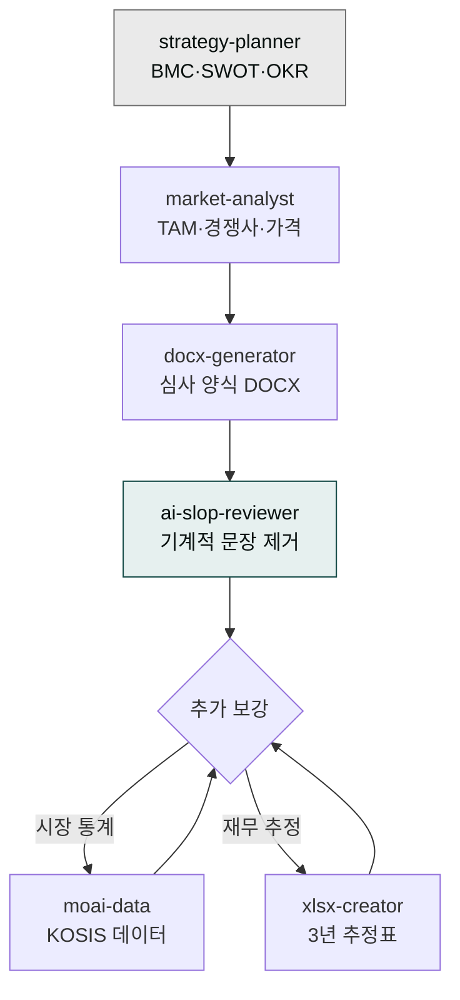
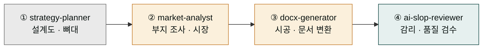
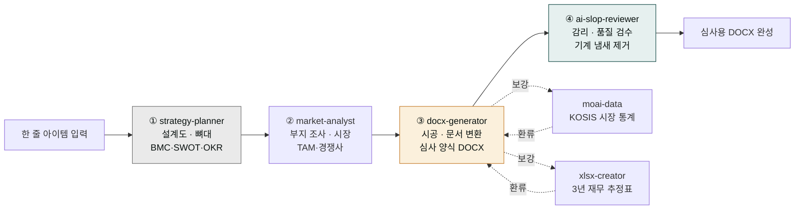

> **목표** — 아이템 아이디어에서 시작해 심사위원이 받을 수 있는 수준의 DOCX 사업계획서까지, 1-2시간 이내로 완성합니다.



## 대상 독자

예비창업패키지·TIPS 등 정부 지원사업에 제출할 사업계획서를 준비하는 창업가·중소기업 기획자.

## 사전 준비

- 플러그인: `moai-business`, `moai-office`, `moai-core:ai-slop-reviewer`
- (선택) `moai-data` — 시장 규모·통계 인용이 필요한 경우
- 입력: **아이템 한 줄 요약**, **타깃 고객**, **매출 모델**, **제출 양식**(자유 / 예비창업패키지 / TIPS 등)

## 스킬 체인이 4단계로 나뉘는 이유

이 가이드에서는 사업계획서 한 권을 만들기 위해 네 개의 스킬을 차례로 통과시킵니다. 한 스킬로 끝내지 않는 이유는, 집을 짓는 일에 비유하면 쉽게 이해됩니다. 건축은 혼자 다 하는 게 아닙니다. 먼저 **설계도**(전략)를 그리는 설계사가 있고, 다음 **부지 조사**(시장 분석)를 하는 측량 전문가가 있고, 그 위에 **시공사**(문서 변환)가 도면대로 실제 집을 세우고, 마지막으로 **감리**(품질 검수)가 다 된 집을 돌며 흠집을 잡습니다. 사업계획서도 똑같습니다.

각 단계는 서로 다른 일을 가장 잘하는 전문가에게 맡기는 구조입니다. `strategy-planner`는 "이 사업의 뼈대는 무엇인가"를 짜는 데 강하지만 파일로 저장하지는 못합니다. `market-analyst`는 시장 규모와 경쟁사를 조사하는 데 강하지만 글을 다듬지는 못합니다. `docx-generator`는 심사 양식에 맞춰 문서 파일로 뽑아내는 데 강하지만 전략을 기획하지는 못합니다. `ai-slop-reviewer`는 기계가 쓴 흔적을 사람 글처럼 다듬는 데만 쓰입니다. 한 스킬이 이 네 가지를 다 잘할 수는 없기 때문에, 각자의 장점만 순서대로 이어받는 파이프라인(작업이 한 방향으로 흘러가는 연결선)으로 조립합니다.



이 순서를 바꾸면 결과가 흔들립니다. 검수 스킬을 맨 앞에 두면 검사할 글이 아직 없고, 문서 변환을 뼈대보다 먼저 돌리면 빈 양식만 나옵니다. 도메인(분야 전문)이 먼저, 포맷(문서 형식)이 중간, 품질 검수가 마지막이라는 3원칙을 따르는 것이 사업계획서 품질을 안정적으로 지키는 핵심입니다.



## 스킬 체인

```
strategy-planner → market-analyst → docx-generator → ai-slop-reviewer
```

- `strategy-planner` — BMC·SWOT·OKR로 뼈대 작성
- `market-analyst` — TAM/SAM/SOM·경쟁사·가격 전략
- `docx-generator` — 심사 양식에 맞는 DOCX 변환
- `ai-slop-reviewer` — 기계적 문장 제거

## 단계별 실행

### 1. 아이템을 한 문단으로 정리


> 한 문단 아이템 설명:
> "50대 이상 1인 가구를 위한 반찬 정기구독 서비스. 주 2회 냉장 배송,
> 월 9만원부터. 영양사 1:1 식단 상담 포함."
>
> 타깃: 서울·경기 50대 1인 여성, 도보 15분 내 편의점 없는 지역
> 매출 모델: 월정액 + 영양 상담 유료 옵션
> 제출 양식: 예비창업패키지 2026 상반기


## 분석 프레임워크 용어 풀이

뼈대 생성 단계에서 BMC, SWOT, 4P, TAM·SAM·SOM 같은 약자가 계속 등장합니다. 비개발자 창업가에게는 낯선 말이지만, 사업을 사람으로 치면 "어떤 질문을 던져 건강 상태와 가능성을 점검할까"를 정해둔 질문 리스트라고 보면 됩니다. 각 약자가 어떤 질문을 던지는지 한 줄씩 풀어둡니다.


**자주 쓰는 약자 한 줄 해설**

- **BMC**(Business Model Canvas, 사업 모형 화보) — 사업 전체를 한 장의 명함처럼 요약하는 9칸 표. 누구에게 무엇을 어떻게 팔고 돈은 어디서 버는지를 한눈에.
- **SWOT**(강점·약점·기회·위협) — 사업의 건강검진표 네 칸. 안쪽(강점·약점)과 바깥쪽(기회·위협)을 가른다.
- **4P**(Product·Price·Place·Promotion) — 무엇을, 얼마에, 어디서, 어떻게 알릴지 정하는 마케팅 네 기둥.
- **TAM·SAM·SOM**(시장 규모 단계) — 전체 시장 바다(TAM) 중 우리가 접근할 수는 있는 바다(SAM), 그 안에서 실제로 낚을 수 있는 물고기 크기(SOM). TAM이 아무리 커도 우리가 건질 수 있는 SOM이 중요하다.
- **OKR**(목표·핵심 결과) — "이번 분기에 무엇을, 어떤 숫자로 달성할 것인가"를 적는 목표 설정 틀.


이 약자들이 어려워 보여도 `strategy-planner`와 `market-analyst`가 알아서 칸을 채워줍니다. 초보자는 "어떤 질문에 답하고 있는지"만 이해해도 뼈대가 믿을 수 있는 이유가 보입니다.

### 2. 뼈대 생성


> 위 아이템으로 BMC·SWOT·4P·경쟁사 맵을 짜줘.
> strategy-planner 와 market-analyst 를 순서대로 써.


### 3. 심사 양식에 맞춰 DOCX로


> 방금 뼈대를 2026 예비창업패키지 양식에 맞게 DOCX로 만들어줘.
  - 표지, 목차, 문제 인식, 실현가능성, 성장전략, 팀 구성, 재무계획
  - 표·그림 포함
  - 폰트는 맑은고딕, 본문 10pt

docx-generator 스킬로 실제 파일 만들어줘.


## 왜 마지막 검수가 빠지면 안 되는가

내용은 다 준비됐고, 심사 양식에도 맞췄는데도 마지막 단계가 한 번 더 남습니다. 면접 복장 점검에 비유하면 왜 필요한지가 보입니다. 면접을 앞두고 양복을 골라 입었더라도, 거울로 한 번 더 보지 않으면 봇자국이나 어색한 주름이 그대로 남습니다. 심사위원이 면접자를 보는 첫 인상이 "옷은 잘 입었는데 어딘가 어설프다"가 되면, 내용이 좋아도 신뢰가 흔들립니다.

AI가 쓴 사업계획서 글도 똑같습니다. 내용은 충실해도 문장 어디엔가 '기계가 쓴 글이다'라는 흔적이 남습니다. "본 사업은...", "...을 선도하는", "패러다임의 전환을..." 같은 표현이 그런 봇자국입니다. 이 흔적을 AI 슬롭(AI 특유의 기계적 어투)이라 부르고, 심사위원은 이걸 보는 순간 "자료를 직접 공들여 만든 게 아니라 기계에 돌렸구나"라고 의심하게 됩니다. 사업계획서 심사에서 그 의심 하나가 감점으로 이어집니다.

`ai-slop-reviewer`는 이 봇자국을 사람이 쓴 것처럼 다듬는 마지막 손질입니다. 내용과 숫자는 그대로 둔 채, 어색한 어투와 상투적 표현만 솎아냅니다. 그래서 품질 검수 단계는 항상 문서 변환 뒤, 산출물이 거의 완성된 시점에 와야 합니다.

### 4. AI 슬롭 검수


> 방금 만든 사업계획서 본문 섹션별로 ai-slop-reviewer 돌려줘.
> 특히 "패러다임", "본 사업은", "선도적" 같은 표현 잡아줘.


### 5. (선택) 시장 통계 보강


> 1인 가구 통계가 필요해. moai-data 의 public-data 로 KOSIS에서
최근 5년 서울 1인 가구 추이 가져와서 5장 "시장 분석" 에 표와 그래프로 추가해줘.


### 6. 재무 추정표 별도 엑셀


> 3년 매출·비용 추정 엑셀 만들어줘. xlsx-creator 로.
  - 가정: 월 500명 출발, 월 10% 성장, CAC 4만원, LTV 36만원
  - 손익계산서·월별 현금흐름·BEP 시트 포함


## 자주 겪는 이슈


**이슈 1 — 심사 양식 페이지 수 제한 초과.**
예비창업패키지는 본문 30장 내외. 초과하면 `docx-generator` 호출 시 "30장 이내로 압축" 명시.



**이슈 2 — 재무 추정이 비현실적.**
`strategy-planner`는 낙관적 가정을 쓰는 경향이 있습니다. 월 성장률 10%를 넘는 가정은 심사에서 감점 요인이므로 직접 조정하세요.



**이슈 3 — 팀 구성원 이력이 빈칸.**
팀원 이력서를 PDF로 업로드한 뒤 "팀 구성원 경력 요약을 docx 에 삽입" 지시하세요.


## 응용 변형

- **정부 지원사업 매칭** — `kr-gov-grant` 스킬로 내 아이템에 맞는 공고를 먼저 찾고 그 양식에 맞춰 진행합니다.
- **피칭 덱 변환** — 완성된 DOCX를 `investor-relations + pptx-designer`로 IR 덱으로 변환 → [IR 덱 제작](../ir-deck/) 참고.

---

### Sources
- [modu-ai/cowork-plugins › moai-business](https://github.com/modu-ai/cowork-plugins)
- [창업진흥원 — 예비창업패키지](https://www.k-startup.go.kr)
