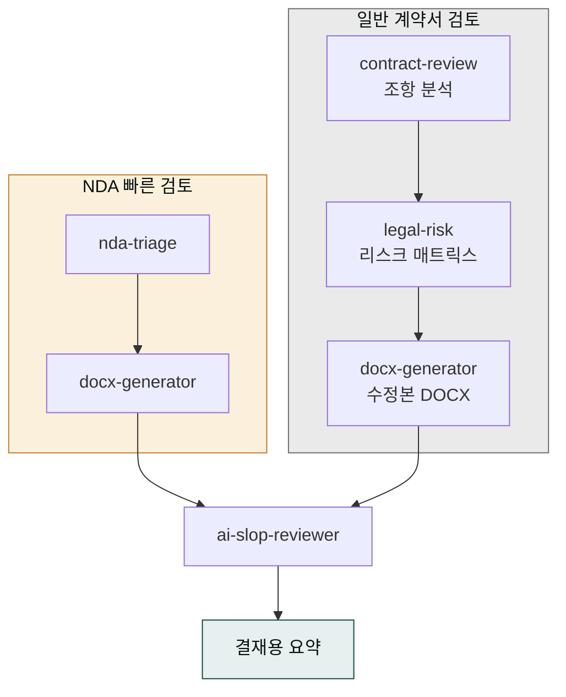
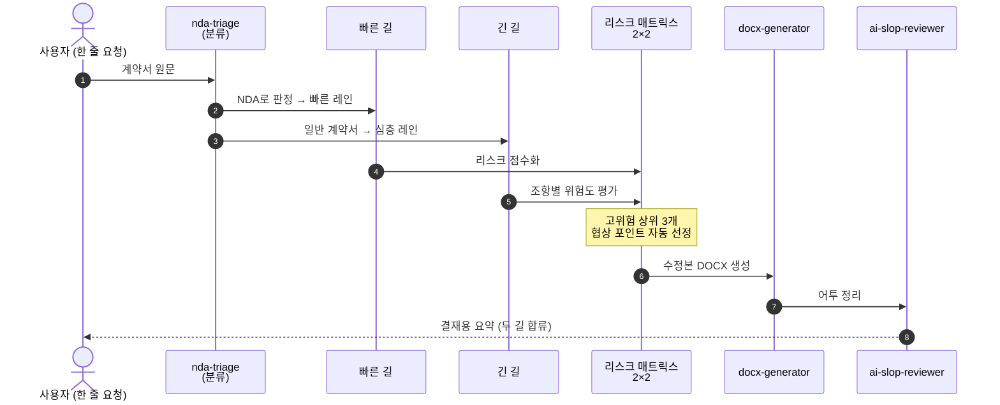
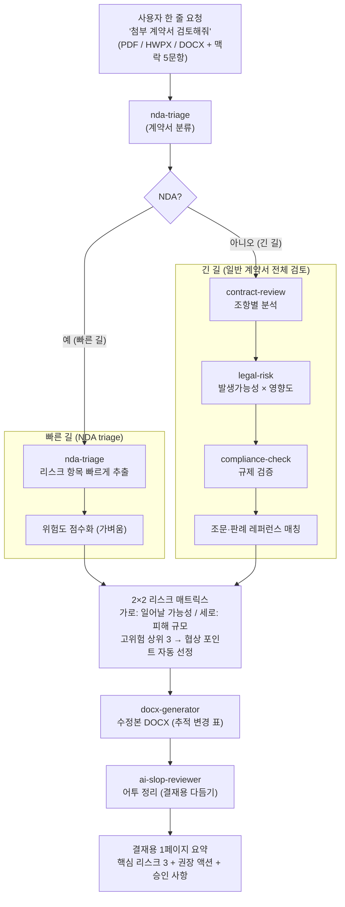
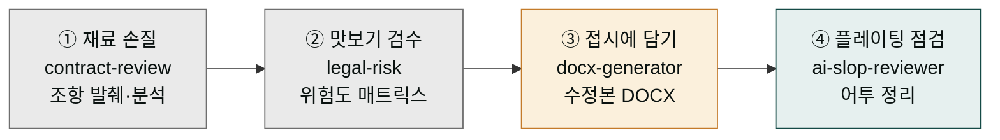
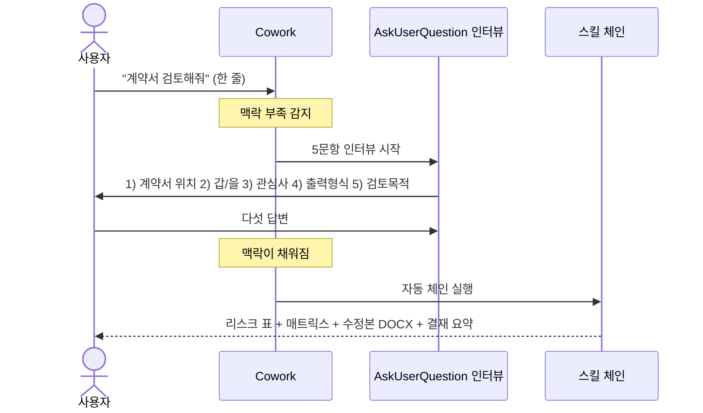
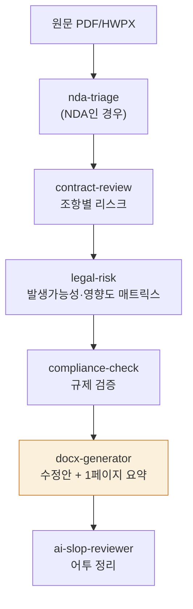

> **목표** — 상대측이 보낸 계약서·NDA를 **리스크 항목별로 표 정리** → 수정본 DOCX → 1페이지 결재용 요약까지 자동으로 만듭니다.



## 빠른 길과 긴 길 — NDA 분기와 리스크 매트릭스

이 파이프라인은 한 줄로 들어온 뒤 두 갈래로 나뉘었다가 다시 합쳐집니다. 어떤 계약서냐에 따라 빠른 길(NDA triage)과 긴 길(일반 계약서 전체 검토)로 갈라집니다. 두 길 모두 마지막에는 같은 도착점인 결재용 요약과 어투 정리에서 합쳐집니다.

공항 보안 검색대에 비유하면 구조가 보입니다. 짧은 국내선 승객(NDA 빠른 검토)은 빠른 레인 한 단계만 통과하고, 장거리 국제선(일반 계약서 전체 검토)은 X-ray·세관·심층 검사까지 여러 단계를 거칩니다. 둘 다 마지막에는 같은 탑승구에서 합쳐집니다. 계약서 한 장짜리 비밀유지약정(NDA)은 리스크 항목이 적어 빠른 길이면 충분하지만, 수십 조항의 본계약서는 조항 분석부터 규제 검증까지 깊이 들어가야 합니다.

리스크 매트릭스는 보안 위험도 평가표와 같습니다. 가로축은 "일어날 가능성", 세로축은 "터졌을 때 피해 규모"입니다. 각 조항을 이 가로세로 평면 위에 점 하나로 찍습니다. 그러면 오른쪽 위, 즉 "자주 터지고 피해도 큰" 영역에 고위험 점들이 모입니다. 시스템은 이 영역의 위쪽 세 개를 "협상 때 꼭 손봐야 할 것"으로 자동 뽑아냅니다.






**법률 자문의 최종 결정은 반드시 변호사가 해야 합니다.** 이 파이프라인은 초안·1차 스크리닝·협상 포인트 정리용입니다. [Cowork 안전 사용](../../cowork/safety/) 참고.


## 대상 독자

계약서·NDA 1차 리뷰가 자주 필요한 사업개발·법무 담당자, 스타트업 대표.

## 사전 준비

- 플러그인: `moai-legal`, `moai-office`, `moai-core:ai-slop-reviewer`
- (선택) `korean-law` MCP — 조문·판례 레퍼런스 필요 시
- 입력: 계약서 원문 (PDF / DOCX / HWPX), **계약 유형**, **내 포지션**(을·발주·라이선시 등)

## 스킬 체인

```
contract-review → legal-risk → docx-generator → ai-slop-reviewer
```

(NDA 빠른 검토만 필요하면: `nda-triage → docx-generator → ai-slop-reviewer`)

## 왜 한 스킬로 끝내지 않고 4단계로 쪼개나

계약서 검토를 처음 쓰는 분은 "AI가 계약서 한 번에 다 검토해주면 되는 거 아닌가?"라고 생각하기 쉽습니다. 하지만 실제로는 한 스킬이 모든 일을 하지 않습니다. 각 스킬은 요리의 한 단계처럼 딱 한 가지 역할만 맡고, 그 결과물을 다음 스킬로 넘깁니다. 한 스킬이 두 역할을 동시에 맡으면 둘 다 반쯤 나옵니다.

요리에 비유해 보겠습니다. 계약서 검토는 한 냄비에 재료를 다 넣고 끓이는 요리가 아니라 순서가 있는 조리 과정입니다. 먼저 **재료 손질** 단계(`contract-review`)에서 계약서 원문의 조항들을 하나씩 발췌해 분석합니다. 그다음 **맛보기 검수** 단계(`legal-risk`)에서 각 조항의 위험도를 매트릭스(가로세로 표)로 점검합니다. 셋째 **접시에 담기** 단계(`docx-generator`)에서 수정안을 워드 파일로 만들어 접시에 올립니다. 마지막으로 **플레이팅 점검** 단계(`ai-slop-reviewer`)에서 AI 특유의 기계적 어투를 솎아내 결재용으로 다듬습니다. 여기서 스킬이란 각 단계를 담당하는 "조리 과정 하나"이고, 체인(chain, 사슬)이란 이 과정들을 화살표로 이어 하나의 파이프라인으로 조립한 것입니다. 순서가 품질을 결정하므로 품질 검수는 항상 마지막에 옵니다.



## 사용 방식 — 한 줄 요청

> **사용자가 직접 스킬을 순서대로 호출하지 않습니다.** 짧은 한 줄을 입력하면 시스템이 AskUserQuestion으로 필요 정보를 묻고, 자동 체이닝으로 끝까지 처리합니다. ([4가지 사용 패턴](../../cowork/patterns/) 참조)

## 왜 한 줄만 쳤는데 다섯 가지를 되묻나

한 줄만 치면 바로 결과가 나올 거라 기대하는데, 시스템은 오히려 다섯 가지 질문을 되묻습니다. 이 역방향 인터뷰가 왜 일어나는지를 이해하면 질문이 귀찮지 않습니다. 계약 유형과 내 입장(갑/을)을 모르면 리스크 기준이 완전히 달라지기 때문입니다. 충분한 맥락 없이 파이프라인을 돌리면 위험도 표, 매트릭스, 수정안이 모두 엉뚱한 방향으로 나옵니다.

병원 접수에 비유하면 쉽습니다. 환자가 "아파요" 한마디로 오면 접수 간호사가 "어디가, 언제부터, 약 먹었나, 알레르기 있나, 응급인가" 다섯 가지를 묻습니다. 환자는 "그냥 진료해 달라"고 하지만, 그 다섯 답이 없으면 의사가 잘못된 진단을 내립니다. Cowork의 다섯 가지 인터뷰 질문도 같은 원리입니다. 먼저 정확히 이 다섯 가지만 확인한 뒤 파이프라인을 돌립니다.

인터뷰에 쓰이는 법률 용어를 미리 풀어두겠습니다. **갑**은 일을 맡기는 쪽(위탁자)이고, **을**은 일을 받는 쪽(수탁자)입니다. **지재권 귀속**(지식재산권 귀속)은 계약 중 만든 결과물의 권리가 누구에게 돌아가는지를 뜻합니다. **준거법**은 분쟁이 났을 때 적용할 나라의 법이고, **관할**은 어느 법원이 재판을 담당하는지입니다. 이 네 용어는 질문의 선택지에 자주 등장하니 알아두면 답변이 빨라집니다.



### 사용자 입력


> 첨부 계약서 검토해서 위험도 + 1페이지 결재용 요약 만들어줘


### 시스템 인터뷰 (AskUserQuestion)

1. **계약서 첨부 위치** (PDF/HWPX/DOCX)
2. **내 포지션**: 갑 (위탁자) / 을 (수탁자) / 양자
3. **관심사 우선순위**: 손해배상 상한 / 지재권 귀속 / 해지 조항 / 준거법·관할 / 기타
4. **출력 형식**: 리스크 표 / 매트릭스 / 수정안 DOCX / 1페이지 결재 요약 / 전부
5. **검토자 향후 사용**: 변호사 자문 전 1차 / 사내 결재용 / 협상용

### 자동 체인



### 산출물

- **리스크 표**: 조항 번호 · 요약 · 리스크 · 우리측 대응 (자동)
- **2×2 영향도 매트릭스**: 발생가능성 × 영향도. 상위 3개 협상 포인트 자동 표시
- **수정본 DOCX**: 원문 인용 + 수정안 + 근거 (조문·판례), 추적 변경 형식 표
- **1페이지 결재 요약**: 핵심 리스크 3개 + 권장 액션 + 승인 필요 사항
- **자동 면책 문구**: "본 보고서는 1차 검토 가이드이며 최종 법률자문은 변호사 검토를 거쳐야 합니다"

### 변형 시나리오 — 한 줄로 다양하게

| 한 줄 요청 | 자동 체인 분기 |
|---|---|
| "이 NDA 위험도만 알려줘" | nda-triage → legal-risk (요약만) |
| "조항별 표만 만들어줘" | contract-review → docx-generator |
| "협상용 수정안만 필요해" | contract-review → 수정안 DOCX |
| "경영진 결재용 1페이지" | 1페이지 요약만 |

## 자주 겪는 이슈


**이슈 1 — HWPX 원본이 깨짐.**
한글 파일은 `hwpx-writer`로 변환한 뒤 `contract-review`에 입력합니다. 표·각주가 있는 계약서는 특히 중요합니다.



**이슈 2 — 조항 번호가 틀리게 인용된다.**
스캔 PDF는 OCR 오류가 많습니다. 번호 인용은 최종 검토자가 반드시 크로스체크하세요.



**이슈 3 — 판례 레퍼런스가 허구.**
`legal-risk`가 가상 판례를 만드는 경우가 있습니다. 국가법령정보센터에서 실제 존재하는지 확인하거나 `korean-law` MCP를 연결하세요.


## 응용 변형

- **대량 표준계약서 심사** — 같은 포맷 계약서가 월 수십 건이라면 슬래시 명령으로 묶어 `/contract-review` 하나로 실행합니다.
- **이력 관리** — 수정본마다 `xlsx-creator`로 차수별 변경점 표를 누적합니다.

---

### Sources
- [modu-ai/cowork-plugins › moai-legal](https://github.com/modu-ai/cowork-plugins)
- [국가법령정보센터](https://law.go.kr)
