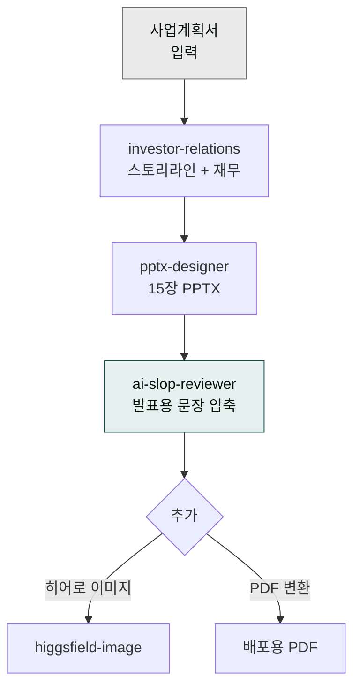
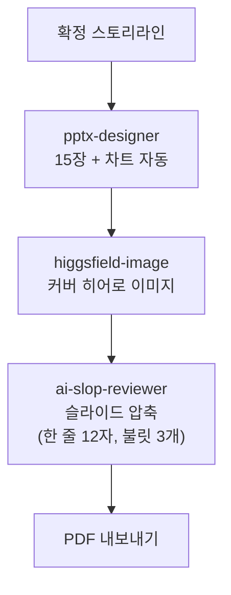

> **목표** — 사업계획서 내용을 받아 투자자 앞에서 15분 안에 끝낼 수 있는 **15장 PPT 피칭 덱**을 만듭니다.



## 대상 독자

Seed·Series A·B 투자 유치를 준비하는 스타트업 창업가.

## 사전 준비

- 플러그인: `moai-business`, `moai-office`, `moai-core:ai-slop-reviewer`
- (선택) `moai-media` — 히어로 이미지·아이콘 커스텀
- 입력: 사업계획서(DOCX 또는 텍스트), **시리즈 단계**(Seed / Series A / B), **목표 조달액**, **밸류에이션 가정**

## 스킬 체인

```
investor-relations → pptx-designer → ai-slop-reviewer
```

- `investor-relations` — 재무 모델·밸류에이션·스토리라인
- `pptx-designer` — Pretendard + 명조 한국형 PPT 코드
- `ai-slop-reviewer` — 발표용 문장 다듬기(짧고 자연스럽게)

## 15장 표준 구조

| # | 슬라이드 | 핵심 |
|---|---|---|
| 1 | 커버 | 서비스명 + 한 줄 카피 |
| 2 | 문제 | 고객 Pain 3가지 |
| 3 | 솔루션 | 우리 제품이 어떻게 해결하는가 |
| 4 | 데모 | 스크린샷·영상 캡처 |
| 5 | 시장 | TAM/SAM/SOM |
| 6 | 비즈니스 모델 | 단가·CAC·LTV |
| 7 | 경쟁 | 2×2 포지셔닝 |
| 8 | 성장 지표 | MRR·MoM·리텐션 |
| 9 | Go-to-Market | 채널·캠페인 |
| 10 | 로드맵 | 12-18개월 마일스톤 |
| 11 | 팀 | 대표·핵심 인력 |
| 12 | 재무 추정 | 3년 매출·손익 |
| 13 | 이번 라운드 | 조달액·밸류·용도 |
| 14 | Exit·비전 | 5년 뒤 모습 |
| 15 | Thank You | 연락처 |

## 사용 방식 — 한 줄 요청 (패턴 2: 멀티턴 대화)

> **사용자가 6단계를 순차 호출하지 않습니다.** 짧은 한 줄로 시작 → 시스템이 인터뷰 후 스토리라인 초안 제시 → 사용자 검토·수정 → PPT·이미지·PDF 자동 생성. ([4가지 사용 패턴 - 패턴 2](../../cowork/patterns/#패턴-2--멀티턴-대화-multi-turn-dialog))

### 사용자 입력


> 시리즈 A IR 덱 15장 만들고 싶어


### 시스템 인터뷰 (AskUserQuestion)

1. **사업계획서 첨부** (DOCX) 또는 한 줄 비즈니스 설명
2. **시리즈·조달 목표**: Seed / Series A / B (기본 15장) · 조달액 · 프리머니 밸류
3. **타깃 투자자**: 엔젤 · VC · 전략적 투자자
4. **차트·이미지 자동 포함**: 예/아니오 (시장·재무 차트 + 히어로 이미지)
5. **출력 형식**: PPTX (기본 + PDF 자동 내보내기)

### Turn 1 — 스토리라인 초안

시스템이 **15장 스토리라인 + 각 장 핵심 메시지(1문장)** 를 먼저 제시. 사용자는 본문 작성 전에 스토리 흐름을 검토.

### Turn 2 — 사용자 수정 요청


> Slide 4(BM)에 SaaS 매출 모델 추가하고, Slide 7(팀)에 자문단 1장 추가해줘


시스템이 스토리라인 수정 → 사용자 확정.

### Turn 3 — 본 PPT 생성 (자동)



### 산출물

- `90_Output/ir-deck.pptx` — 15장 본 PPT (16:9, Pretendard, 본문 18pt)
- `90_Output/ir-deck.pdf` — 투자자 공유용
- 5·12장 차트 자동 (recharts 스타일)
- 히어로 이미지 (브랜드 컬러 자동 매핑)

### 변형 시나리오

| 한 줄 요청 | 결과 |
|---|---|
| "Seed 라운드 5장 짧게 만들어줘" | 5장 압축 버전 (Pitch deck format) |
| "Series B 25장 본격 IR" | 25장 디테일 버전 + 재무 모델 5장 |
| "투자자 1대1 미팅용 10장" | 1대1 톤 + Q&A 슬라이드 |

## 자주 겪는 이슈


**이슈 1 — 문장이 여전히 길다.**
`pptx-designer`가 DOCX 원문을 그대로 복사하는 경우가 있습니다. 반드시 **압축 지시**를 한 번 더 하세요.



**이슈 2 — 폰트가 기본 Calibri 로 나온다.**
Pretendard가 시스템에 없으면 Calibri로 폴백됩니다. 배포 전 "Pretendard 임베드" 또는 PDF로 전환하세요.



**이슈 3 — 재무 차트가 어색하다.**
`pptx-designer`가 그리는 기본 차트보다 **엑셀에서 그린 차트를 캡처해 이미지로 삽입**하는 편이 더 예쁩니다. 필요하면 `xlsx-creator`로 추정표를 먼저 만드세요.


## 응용 변형

- **투자자별 맞춤** — 심사역이 특정 산업 포커스라면 2·5·7장을 해당 산업 용어로 다시 쓰세요.
- **원페이저** — 15장 요약본을 `docx-generator`로 A4 한 장 티저로 먼저 뿌리면 미팅 약속이 잘 잡힙니다.

---

### Sources
- [modu-ai/cowork-plugins › moai-business](https://github.com/modu-ai/cowork-plugins)
- [Sequoia Capital — Pitch Deck Template](https://www.sequoiacap.com/article/writing-a-business-plan/)
