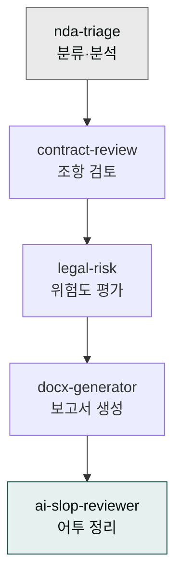
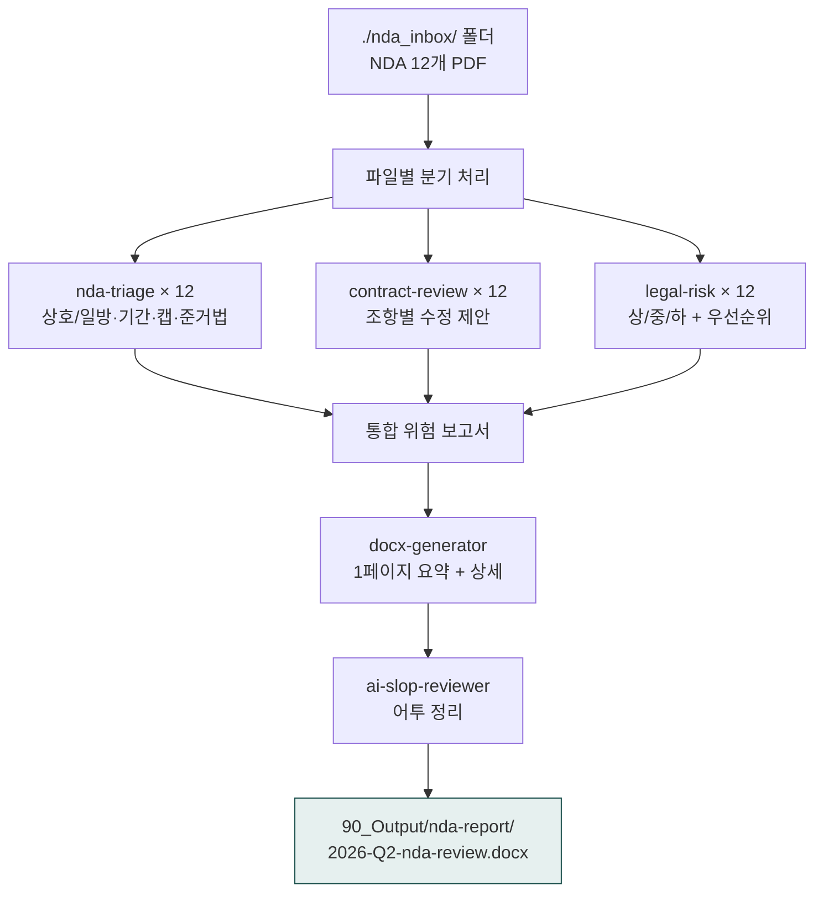

> **목표** — `./nda_inbox/` 폴더의 NDA PDF 12건을 분류·검토하고, 건별 위험도(상/중/하)와 수정 제안이 들어간 위험 보고서를 docx로 생성합니다.



## 대상 독자

스타트업 법무팀(인하우스 1-3명), 법무법인 어소시에이트, 사업개발 PM이 NDA를 자체 검토할 때.

## 사전 준비

- 플러그인: `moai-legal`, `moai-office`, `moai-core:ai-slop-reviewer`
- 입력: `./nda_inbox/` 폴더(NDA PDF 다수), 회사명·핵심 영업비밀 카테고리
- 산출물 위치: `./90_Output/nda-report/`

## 스킬 체인

```
nda-triage → contract-review → legal-risk → docx-generator → ai-slop-reviewer
```

| 단계 | 스킬 | 역할 |
|---|---|---|
| 1 | `nda-triage` | 분류 — 상호/일방, 기간, 손해배상 캡, 준거법 |
| 2 | `contract-review` | 조항별 정밀 검토, 수정 제안 마크업 |
| 3 | `legal-risk` | 종합 위험도 평가 (상/중/하), 우선순위 부여 |
| 4 | `docx-generator` | 위험 보고서 docx 생성 |
| 5 | `ai-slop-reviewer` | 보고서 어투 정리 |

## 사용 방식 — 한 줄 요청 (패턴 3: 배치 처리)

> **위험한 안티 패턴**: 사용자가 모든 옵션(회사명·영업비밀·5단계 스킬·저장 경로·면책 문구)을 매번 직접 작성하는 것은 권장되지 않습니다. 시스템이 가진 자동 인터뷰 + 체이닝을 무력화합니다. ([4가지 사용 패턴 - 패턴 3](../../cowork/patterns/#패턴-3--배치-처리-batch-processing))

### ✅ 올바른 한 줄 요청


> ./nda_inbox/ 폴더의 NDA 12개 위험도 검토해서 한 페이지로 정리해줘


### 시스템 인터뷰 (AskUserQuestion)

1. **회사 정보**: 회사명 + 핵심 영업비밀 3개 (한국 영업비밀보호법 §2 기준 자동 적용)
2. **보고서 형식**: 1페이지 경영진 요약 / 상세 (NDA별 1-2페이지) / 둘 다
3. **부록 포함**: 표준 NDA 템플릿 비교표 / 통계 차트 / 둘 다
4. **저장 경로** (기본: `90_Output/nda-report/`)
5. **면책 문구 자동 삽입** 여부 (기본: 예 — "본 보고서는 1차 검토 가이드이며 최종 법률자문은 변호사 검토를 거쳐야 합니다")

### 자동 체인



### 산출물

- **1페이지 경영진 요약**: 위험도 분포 차트 + Top 3 위험 NDA
- **NDA별 상세**: 1건당 1-2페이지 (분류·핵심 리스크·수정 제안)
- **부록**: 표준 NDA 템플릿 비교표 (자동)
- **자동 면책 문구** 삽입

## 자주 겪는 이슈


**이슈 1 — PDF가 10페이지를 넘으면 Read가 느림.**
대용량 NDA는 페이지 범위를 명시하세요: "이 PDF는 1-15 페이지만 검토". 자세한 파일 읽기 한도는 [제약과 한도](../../cowork/constraints/)를 참고.



**이슈 2 — 한국 영업비밀보호법 §2 누락.**
`contract-review`가 미국식 trade secret 기준을 적용하면 한국 영업비밀보호법(부정경쟁방지 및 영업비밀보호에 관한 법률) 기준 보호요건(비밀관리성·경제성·비공지성)이 빠질 수 있습니다. 프롬프트에 "한국 영업비밀보호법 §2 기준 적용"을 명시하세요.



**이슈 3 — 면책 문구 누락.**
법률 자문이 아닌 1차 검토임을 명시하지 않으면 책임 경계가 불명확해집니다. 위 프롬프트의 "면책 문구 자동 삽입" 지시는 필수입니다.


## 응용 변형

- **계약서 일괄 검토** — `nda-triage` 대신 `contract-review` 단독으로 시작, 계약 유형별 분류 필요 시 직접 폴더로 분리
- **팀 합의 워크플로우** — 검토 후 `compliance-check`(개인정보보호법) 추가, 사내 정책 위반 여부 별도 점검
- **반복 사용** — 슬래시 명령으로 저장: `/nda-batch`로 한 번에 전체 체인 실행

## 다음 단계

- [계약서 검토](../contract-review/) — 단건 정밀 검토
- [moai-legal 플러그인](../../plugins/moai-legal/)
- [트러블슈팅](../../cowork/troubleshooting/)

---

### Sources
- [modu-ai/cowork-plugins — moai-legal](https://github.com/modu-ai/cowork-plugins/tree/main/moai-legal)
- 부정경쟁방지 및 영업비밀보호에 관한 법률 (국가법령정보센터)
