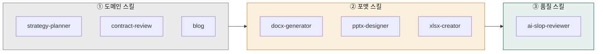
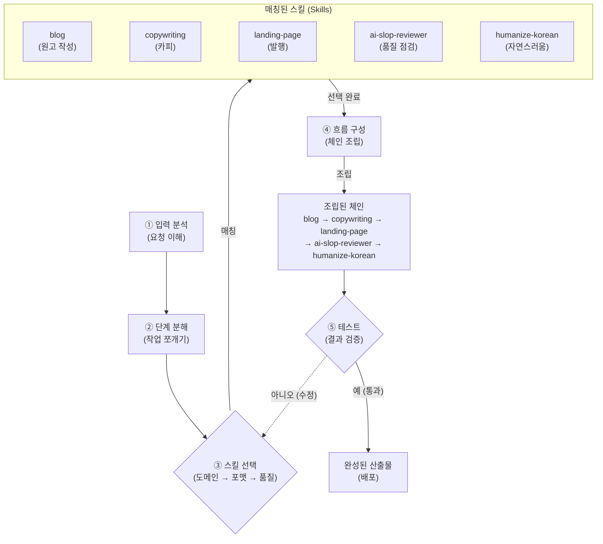

> Cowork에서 가장 중요한 실무 기술. 단일 스킬보다 2-4개를 엮은 체인이 결과 품질을 10배 좌우합니다.

## 왜 체인인가

스킬 하나하나는 한 분야에 특화되어 폭이 좁습니다. 예를 들어:

- `strategy-planner`는 **전략 초안**을 잘 쓰지만 DOCX로 저장하지 못합니다.
- `docx-generator`는 **파일을 잘 만들지만** 전략을 기획하지 못합니다.
- 생성된 글은 대부분 **AI 특유의 기계적 어투**가 남아 있습니다.

셋을 엮으면 각 스킬의 장점만 결합한 하나의 파이프라인이 됩니다.

```
strategy-planner → docx-generator → ai-slop-reviewer
```

## 체인 설계 3원칙: 한 번에 끝나지 않는 일을 단계로 쪼개 조립하기

체인 설계는 "블로그 글 하나 발행해줘" 같은 한 줄 요청을 여러 스킬이 차례로 이어받는 파이프라인(작업이 한 방향으로 흘러가는 연결선)으로 설계하는 방법입니다. 요리에 비유하면 한 냄비에 다 넣고 끓이는 게 아니라, 재료 손질 → 볶기 → 플레이팅 → 맛보기 순서로 요리 단계를 나누는 것과 같습니다. 순서가 있어야 결과가 일관되게 맛있듯, 스킬에도 순서가 있어야 산출물 품질이 흔들리지 않습니다.

설계는 다섯 단계로 진행됩니다. 먼저 **입력 분석**으로 "무엇을, 누구에게 만들 것인가"를 정합니다. 그다음 **단계 분해**로 큰 일을 작업 조각으로 쪼갭니다(예: 블로그 발행 → 주제 선정 → 원고 작성 → 발행 → 품질 점검). 셋째 **스킬 선택**에서 각 조각에 맞는 스킬을 골라 매칭합니다 — 이때 3원칙인 "도메인(분야 전문) → 포맷(문서 형식) → 품질(검수)" 순서를 따릅니다. 넷째 **흐름 구성**으로 스킬들을 화살표로 연결해 하나의 체인으로 조립합니다. 마지막 **테스트**에서 결과를 검증하고, 부족하면 스킬 선택 단계로 돌아가 조정합니다.

예를 들어 블로그 발행 체인은 `blog → copywriting → landing-page → ai-slop-reviewer → humanize-korean`처럼 조립됩니다. 도메인 스킬(blog)이 내용을 만들고, 포맷 스킬(landing-page)이 형태를 갖추고, 품질 스킬(ai-slop-reviewer, humanize-korean)이 AI 특유 어투를 솎아내는 구조입니다. 이 3원칙 순서를 지키면 품질 단계가 항상 마지막에 와 산출물이 사람이 쓴 것처럼 자연스러워집니다.



1. **도메인 → 포맷 → 품질**

   항상 도메인 스킬이 먼저, 포맷 변환이 중간, 품질 검수가 마지막입니다.

   ```
   (도메인: moai-business / moai-legal / moai-content 등)
      → (포맷: moai-office 의 docx/xlsx/pptx/hwpx)
        → (품질: ai-slop-reviewer)
   ```

2. **숫자·차트·코드는 품질 스킬 생략**

   재무제표, 데이터 차트, 스크립트 코드는 AI 어투를 검출할 게 없으므로 `ai-slop-reviewer`를 생략합니다.

3. **같은 체인을 슬래시 명령으로 저장**

   자주 쓰는 체인은 슬래시 명령으로 만들면 한 번의 지시로 실행됩니다. 예: `/weekly-report`는 `status-reporter → xlsx-creator → docx-generator → ai-slop-reviewer`를 한 번에.




## 자주 쓰는 체인 12종

각 체인의 출처 플러그인을 함께 표기했습니다. 설치 시 참고하세요.

| 용도 | 체인 | 사용 플러그인 |
|---|---|---|
| 블로그 글 | 1. `blog`<br>2. `ai-slop-reviewer` | moai-content, moai-core |
| 보도자료 | 1. `target-script`<br>2. `docx-generator`<br>3. `ai-slop-reviewer` | moai-marketing, moai-office, moai-core |
| 사업계획서 | 1. `strategy-planner`<br>2. `docx-generator`<br>3. `ai-slop-reviewer` | moai-business, moai-office, moai-core |
| IR 덱 | 1. `investor-relations`<br>2. `pptx-designer`<br>3. `ai-slop-reviewer` | moai-business, moai-office, moai-core |
| 월말 결산 | 1. `close-management`<br>2. `xlsx-creator`<br>3. `docx-generator` | moai-finance, moai-office |
| NDA 검토 | 1. `nda-triage`<br>2. `docx-generator(수정본)`<br>3. `ai-slop-reviewer` | moai-legal, moai-office, moai-core |
| 계약서 리뷰 | 1. `contract-review`<br>2. `legal-risk`<br>3. `docx-generator` | moai-legal, moai-office |
| 주간 보고서 | 1. `status-reporter`<br>2. `xlsx-creator`<br>3. `docx-generator`<br>4. `ai-slop-reviewer` | moai-operations, moai-office, moai-core |
| 카드뉴스 | 1. `card-news`<br>2. `higgsfield-image(이미지)`<br>3. `pptx-designer` | moai-content, moai-media, moai-office |
| 쇼츠 영상 | 1. `social-media(스크립트)`<br>2. `audio-gen(TTS)`<br>3. `higgsfield-video(영상)` | moai-content, moai-media |
| 연구 논문 | 1. `paper-search`<br>2. `paper-writer`<br>3. `docx-generator`<br>4. `ai-slop-reviewer` | moai-research, moai-office, moai-core |
| 면접 준비 | 1. `job-analyzer`<br>2. `interview-coach`<br>3. `interview-coach(모의)` | moai-career |

## 체인을 깨뜨리는 흔한 실수


**실수 1 — `ai-slop-reviewer`를 맨 앞에 둔다.**
검수할 원문이 없으므로 의미가 없습니다. 마지막에 오는 스킬입니다.



**실수 2 — 포맷 스킬을 여러 번 호출한다.**
docx 생성 후 다시 docx로 변환하면 포맷이 깨집니다. 한 번만 통과시키세요.



**실수 3 — 도메인 스킬 2개를 같은 프롬프트에 섞는다.**
`strategy-planner`와 `market-analyst`를 동시에 요청하면 한쪽이 약해집니다. 필요하면 두 번 나눠 호출한 뒤 `docx-generator`에서 합치세요.


## 디버깅 체크리스트

- 결과가 너무 짧다 → 도메인 스킬에 **구체 맥락**(독자·목적·분량)을 추가로 넣어 재실행.
- AI 티가 난다 → `ai-slop-reviewer` 실행했는지 확인. 생략됐다면 마지막 산출물에 대해 수동 호출.
- 포맷이 이상하다 → `docx-generator` 로그에서 어느 섹션이 빠졌는지 확인 후 원문을 보강.
- 파일이 안 열린다 (Windows) → 파일명·폴더 경로가 260자 넘지 않는지 확인.

## 다음 단계

- [블로그 파이프라인](../blog-pipeline/)
- [사업계획서 자동화](../business-plan/)

---

### Sources
- [modu-ai/cowork-plugins](https://github.com/modu-ai/cowork-plugins)
- [docs.claude.com — Skills](https://docs.claude.com/en/docs/agents/skills)
