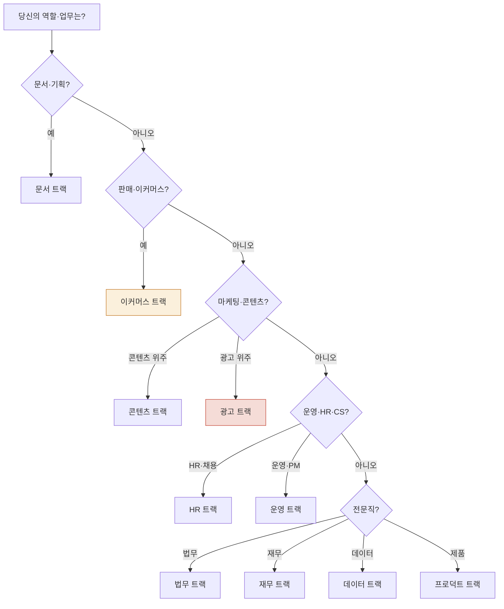

> 트랙은 **역할·도메인별 표준 워크플로우**입니다. 각 트랙은 [사용 패턴 가이드](../../cowork/patterns/)의 4가지 표준 패턴(단일 프롬프트·멀티턴·배치·스케줄)을 적용한 구체적 시나리오를 보여줍니다.

## 트랙 선택 가이드



## 10개 트랙 카탈로그

### 비즈니스 + 문서

| 트랙 | 대상 | 한 줄 요청 예시 | 주요 플러그인 |
|---|---|---|---|
| [문서 트랙](track-documents/) | 기획·컨설팅·PM | "AI 영어 회화 앱 사업계획서 만들어줘" | moai-business · moai-office · moai-bi |

### 콘텐츠 + 마케팅

| 트랙 | 대상 | 한 줄 요청 예시 | 주요 플러그인 |
|---|---|---|---|
| [콘텐츠 트랙](track-content/) | 콘텐츠 크리에이터·블로거 | "비건 카페 오픈 블로그 시리즈 5편 써줘" | moai-content · moai-media · moai-marketing |
| [광고 트랙](track-advertising/) | 퍼포먼스 마케터 | "신상품 메타 광고 3주차 보고서 분석해줘" | moai-marketing · moai-media · moai-ads-audit-mcp |

### 이커머스

| 트랙 | 대상 | 한 줄 요청 예시 | 주요 플러그인 |
|---|---|---|---|
| [이커머스 트랙](track-commerce/) | D2C 셀러·이커머스 운영자 | "신상품 상세페이지·광고 영상·시즌 캘린더 한 번에 만들어줘" | moai-commerce (30) · moai-media · moai-content |

### 운영 + HR

| 트랙 | 대상 | 한 줄 요청 예시 | 주요 플러그인 |
|---|---|---|---|
| [HR·커리어 트랙](track-hr/) | 인사 담당자 · 구직자 | "데이터분석가 채용공고 + JD 만들어줘" | moai-hr · moai-career |
| [운영 트랙](track-operations/) | 운영팀·PM·CS·B2B 영업 | "매주 금요일 우리 팀 주간보고 자동화해줘" | moai-operations · moai-pm · moai-support · moai-sales |

### 전문 영역

| 트랙 | 대상 | 한 줄 요청 예시 | 주요 플러그인 |
|---|---|---|---|
| [법무 트랙](track-legal/) | 법무·컴플라이언스 | "NDA 12개 위험도 검토 한 페이지로 정리해줘" | moai-legal |
| [재무 트랙](track-finance/) | 재무·세무·회계 | "Q1 변동분석 + K-IFRS 보고서 만들어줘" | moai-finance · moai-bi |
| [데이터 트랙](track-data/) | 데이터 분석가 | "통계청 인구 데이터로 5년 트렌드 시각화" | moai-data · moai-bi |
| [프로덕트 트랙](track-product/) | PM · UX 디자이너 | "결제 모듈 PRD 초안 + 사용자 인터뷰 가이드" | moai-product |

### 부록

| 영역 | 대상 | 다루는 플러그인 |
|---|---|---|
| [부록 트랙](track-appendix/) | 연구자 · 교육자 · 일반 사용자 | moai-research · moai-education · moai-lifestyle |

---

## 모든 트랙의 공통 구조

10개 트랙 + 부록은 같은 골격을 따릅니다 — 트랙 간 일관성으로 학습 비용을 낮추기 위함.

```
1. 트랙 소개 (대상·전제·예상 산출물·소요 시간)
2. 사용 패턴 시각화 (mermaid flowchart)
3. 한 줄 요청 예시 (3-5개)
4. 핵심 스킬 체이닝 다이어그램
5. 실전 시나리오 (각 시나리오: 사용자 한 줄 + AskUser 응답 + 산출물)
6. AskUserQuestion 슬롯 정의 (시스템이 묻는 항목)
7. 자주 묻는 질문
8. 다음 단계 (관련 쿡북·플러그인)
```

> **공통 원칙**: 모든 시나리오는 **사용자가 한 줄로 시작**합니다. 시스템 내부 구조(스킬명·체인 순서)를 사용자가 미리 알 필요 없음. AskUserQuestion이 필요한 맥락을 자동 수집합니다. ([사용 패턴 가이드 참조](../../cowork/patterns/))

---

## 다음 단계

- **[사용 패턴 가이드](../../cowork/patterns/)** — 4가지 표준 사용 패턴
- **[쿡북](../)** — 트랙 외의 30+ 구체적 시나리오
- **[플러그인 카탈로그](../../plugins/)** — 28 플러그인 177 스킬 전체

---

### Sources

- [modu-ai/cowork-plugins README](https://github.com/modu-ai/cowork-plugins)
