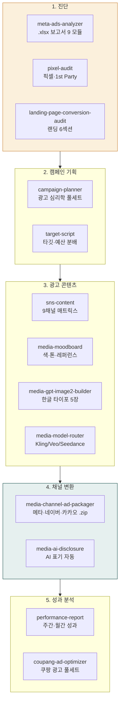
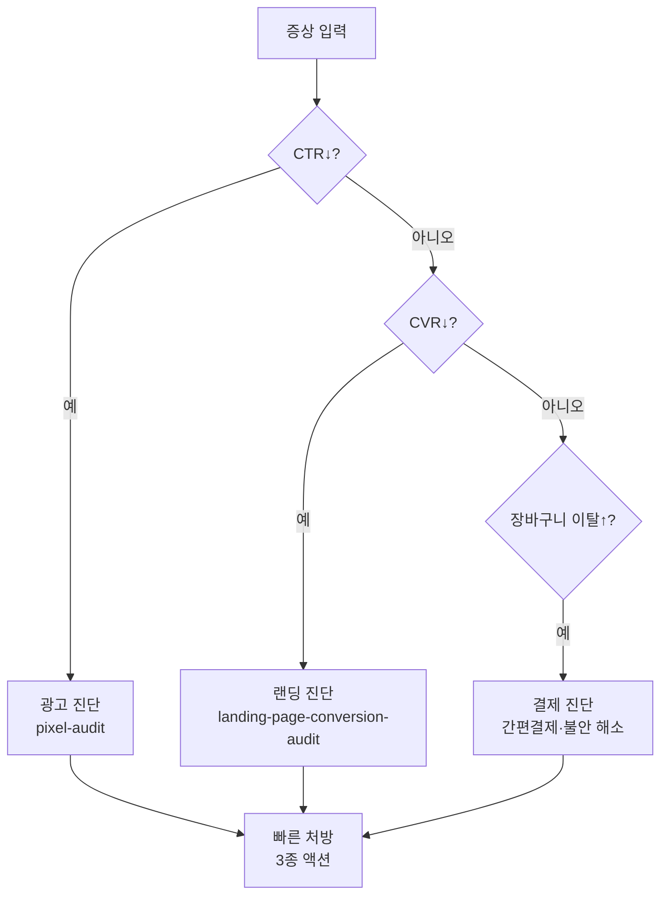

> **대상**: 메타·구글·쿠팡 광고 운영자, 퍼포먼스 마케터, 광고 대행사
> **전제**: moai-core · moai-marketing 활성화 + (선택) `META_ACCESS_TOKEN` · moai-ads-audit-mcp 자동 설치
> **소요**: 시나리오당 약 5-15분

## 무엇을 할 수 있나



## 한 줄 요청 예시 4종

| # | 한 줄 요청 | 자동 체인 |
|---|---|---|
| 1 | "신상품 메타 광고 3주차 보고서 분석해줘" | meta-ads-analyzer → 9 모듈 분석 → DOCX |
| 2 | "광고 떨어지는데 뭐가 문제야? 픽셀·랜딩 진단해줘" | pixel-audit → landing-page-conversion-audit → 진단 리포트 |
| 3 | "스킨케어 메타 광고 영상 풀세트 만들어줘" | media-moodboard → gpt-image2-builder → model-router → channel-ad-packager |
| 4 | "쿠팡 광고 최적화 가이드 짜줘" | coupang-ad-optimizer → 3 캠페인 분류 → 자동규칙 3종 |

---

## 시나리오 ① 메타 광고 .xlsx 보고서 분석 (약 10분)

**상황**: 메타 광고관리자에서 추출한 3개월 .xlsx 보고서 분석.

### 사용자 입력


> 케어밀 3개월 메타 광고 보고서 분석해줘. .xlsx 첨부.


### 시스템 인터뷰

1. **사용자 그룹** (HARD 명시 입력, 자동 추정 없음): 인하우스 / 대행사 / 소규모
2. **분석 모드**: 단일 캠페인 / 통합 분석 / 다중 월 비교 / 다중 캠페인 일괄
3. **출력 형식**: HTML(Recharts) / DOCX(8섹션) / PPTX(10-15장) / MD
4. **강도별 액션 옵션** 표시: 🟢 보수안 / 🟡 중도안 / 🔴 적극안 모두 / 권장만

### 자동 체인

`meta-ads-analyzer` → 9 모듈 (퍼널·KPI·차원·매트릭스·누수·라이프사이클·학습·예산·시뮬레이션) → 4D 교차 (광고×지면×연령×성별) → `moai-ads-audit-mcp` (43 check matrix) → 출력 4 형식

### 산출물

- 7-Level 출력 계층 (한 줄 요약 → 영역별 진단 → 강도별 액션 → 시나리오 시뮬)
- 한국 벤치마크 매핑 (CPC ₩500-1,500, ROAS 1.5-2.5, 케어밀 1.80 reference)
- 5 규제 검사 (PIPA · ITNA · 전상법 · 표시광고법 · 식약처)

---

## 시나리오 ② 광고 떨어지는데 원인 찾기 (약 8분)

### 사용자 입력


> 메타 광고 CTR 1% 미만 떨어졌어. 원인 찾아줘


### 시스템 인터뷰

1. **현황**: 캠페인명 · 기간 · 예산 · 현재 ROAS
2. **진단 범위**: 픽셀 / 랜딩 / 카피 / 타깃
3. **장바구니 이탈률** 알고 있는가?

### 자동 진단 분기



### 자동 체인

`pixel-audit` (메타·구글 픽셀 설치 검증 + 3종 실수 점검: 구매자 미제외/이벤트 파라미터/CAPI) → `landing-page-conversion-audit` (6섹션: 히어로·공감·증명·사회증거·CTA·FAQ) → 빠른 처방 3종

---

## 시나리오 ③ 광고 영상 풀세트 (약 15분)

### 사용자 입력


> 스킨케어 메타 광고 영상 풀세트 만들어줘. 의심차단형 후크


### 시스템 인터뷰

1. **카테고리** (자동 매핑: 의류=Kling 3 / 뷰티=Veo 3 / 식품=Kling 3 / 생활용품=Seedance)
2. **광고 목적**: 인지도 / 클릭 / 전환
3. **후크 유형**: 의심차단형 / 호기심 / 권위 / 사회증거
4. **채널**: 메타 1:1·9:16 / 네이버 GFA / 카카오모먼트 1:1·16:9

### 자동 체인 (광고 풀세트)

```text
[10:10 S1] media-moodboard         → 색 팔레트·톤·레퍼런스 5장
[11:08 S2] media-gpt-image2-builder → Hero+인포+라이프 2+CTA = 5장 한글 타이포
[14:08 S4] media-model-router       → 카테고리 매트릭스 자동 라우팅 + 메인 영상 5~10초 + 보조 2컷
[16:20 S6] media-channel-ad-packager → 4채널 .zip 패키지
[17:40 S7] media-canva-magic-layer   → 시즌 재사용 가이드 (재호출 ↓90%)
```

`media-ai-disclosure` 자동 체인 (광고심의·소비자보호법 대응)

### 산출물 + 비용

- 5장 한글 타이포 이미지 + 1 메인 영상 + 2 보조 영상 + 4채널 변환 .zip
- 비용 추정: ₩2,300-4,000/상품 1건

---

## 시나리오 ④ 쿠팡 광고 풀세트 최적화 (약 10분)

### 사용자 입력


> 쿠팡 광고 최적화 가이드 짜줘. 우리 광고비 3.6억


### 시스템 인터뷰

1. **3 캠페인 유형**: AI스마트 / 매출최적화 / 수동키워드
2. **검색영역 vs 비검색영역**: 매출 분리 분석 (CPM 167배 차이)
3. **현재 ROAS·CTR·CVR**
4. **엔드 ROAS(본전 ROAS)** 자동 계산

### 자동 체인

`coupang-ad-optimizer` → 3 캠페인 분류 + 자동규칙 3종 가이드 (골든타임/350%이상 증액/100%미만 알림) + 상품별 의사결정 분기

### 산출물

- 쿠팡 광고 월 매출 분석 + 최적화 로드맵 + 자동규칙 설정 가이드
- 검색·비검색 영역 분리 분석 + 본전 ROAS 기반 의사결정 분기

---

## AskUserQuestion 표준 슬롯 (광고 트랙 공통)

| 슬롯 | 예시 값 |
|---|---|
| 사용자 그룹 | 인하우스 / 대행사 / 소규모 (HARD 명시) |
| 카테고리 | 식품·뷰티·건강기능식품·IT·가정용품·교육·B2B·기타 |
| 분석 기간 | 1주 / 4주 / 12주 / 6개월 |
| 출력 형식 | HTML / DOCX / PPTX / MD |
| 강도별 액션 | 🟢 보수 / 🟡 중도 / 🔴 적극 / 권장만 |
| 규제 검사 자동 | PIPA·ITNA·전상법·표시광고법·식약처 |

---

## 자주 묻는 질문

### Q. `META_ACCESS_TOKEN` 없이도 분석 가능한가요?

예. **`.xlsx` 업로드 fallback** 자동 동작. Meta 공식 MCP는 OAuth 필요하지만 비활성 환경에서도 모든 분석 가능.

### Q. 한국 벤치마크 출처는 정확한가요?

`moai-ads-audit-mcp` 내장 한국 벤치마크는 일반 참고용. 자사 카테고리·시장 데이터로 보정 권장.

### Q. 식약처 광고 심의 자동 검출되나요?

예. 카테고리가 식품·건강기능식품이면 `commerce-marketing-compliance-kr`이 자동 활성화됩니다.

---

## 다음 단계

- **[사용 패턴 가이드](../../../cowork/patterns/)**
- **[콘텐츠 트랙](../track-content/)** — 광고용 콘텐츠 생성
- **[이커머스 트랙](../track-commerce/)** — 광고 + 상품 통합
- **[moai-marketing 플러그인](../../../plugins/moai-marketing/)**
- **[moai-ads-audit-mcp 서버](https://github.com/modu-ai/cowork-plugins/tree/main/mcp-servers/moai-ads-audit)**

---

### Sources

- [agricidaniel/claude-ads v1.5.1 (MIT)](https://github.com/AgriciDaniel/claude-ads) — 50-check matrix 방법론
- [Meta for Developers](https://developers.facebook.com/) — 공식 MCP
- [정보통신망법 + 표시광고법 + 식약처 광고 심의](https://www.law.go.kr) — 5 규제
