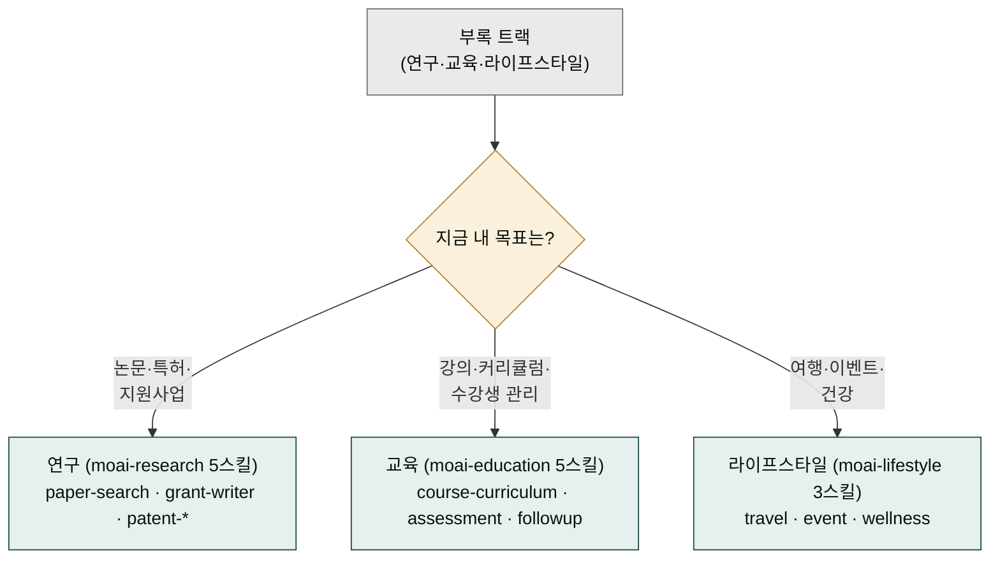

> **대상**: 연구자 (대학원생·교수·R&D), 교육자 (강사·튜터), 일반 사용자 (여행·이벤트·웰니스)
> **전제**: moai-core 활성화 + 필요한 플러그인
> **소요**: 시나리오당 약 5-15분

## 왜 부록 트랙이 세 부문으로 나뉘나 — 도서관 참고실의 세 코너

대형 도서관에 가면 '참고실'이라는 넓은 공간이 있습니다. 그 안은 다시 세 코너로 나뉩니다. 논문과 학술지를 뒤지는 **학술 코너**, 교재와 강의 자료를 모아둔 **교육 코너**, 여행·취미·건강 책이 있는 **생활 코너**. 이 셋은 모두 '일상에 당장 필요한 지식'을 다룬다는 점은 같지만, 찾는 사람과 쓰임새가 전혀 다릅니다.

이 부록 트랙이 바로 그 참고실입니다. 앞선 본부 트랙(콘텐츠·광고·이커머스)이 사업의 '메인 무대'라면, 부록 트랙은 연구자·교육자·일반 사용자가 각자의 목적으로 찾는 보조 무대입니다. 논문을 정리하든, 강의 커리큘럼을 짜든, 가족 여행 일정을 잡든 — 한 줄 요청 한 번이면 각 부문의 전문 스킬이 자동으로 이어집니다. 어느 코너로 가야 할지는 아래 분기를 보면 바로 알 수 있습니다.

## 한 줄 요청 예시 6종

| # | 한 줄 요청 | 자동 체인 | 도메인 |
|---|---|---|---|
| 1 | "AI 윤리 논문 정리해줘. 최근 3년" | paper-search → paper-writer → docx | 연구 |
| 2 | "이공계 정부지원사업 신청서 만들어줘" | grant-writer → 평가표 매핑 → docx | 연구 |
| 3 | "코딩 부트캠프 12주 커리큘럼 짜줘" | curriculum-designer → assessment-creator → pptx | 교육 |
| 4 | "수강생 후속 시퀀스 30일 자동화해줘" | course-followup-sequence → email-sequence | 교육 |
| 5 | "도쿄 4박 5일 일정 만들어줘. 부모님 동반" | travel-planner → docx | 라이프스타일 |
| 6 | "사내 송년회 100명 기획해줘" | event-planner → docx + xlsx (예산) | 라이프스타일 |

---

## 연구 (moai-research 5스킬)

### 시나리오 ① 논문 검색 + 통합 (약 10분)


> AI 윤리 분야 최근 3년 논문 정리해줘


시스템 인터뷰: KCI/RISS/DBpia/Google Scholar 우선순위 · 언어(한국어/영문) · 분류 기준 · 출력 형식

자동 체인: `paper-search` (4 DB 통합 검색) → `paper-writer` (구조화 요약) → `docx-generator` → `ai-slop-reviewer`

### 시나리오 ② 정부지원사업 신청서


> 이공계 정부지원사업 신청서 만들어줘


자동 체인: `grant-writer` (평가표 자동 매핑) → 한국 평가위원 톤 보강 → `docx-generator` → `humanize-korean`

### 시나리오 ③ 특허 분석

자동 체인: `patent-search` (KIPRIS / USPTO 통합) → `patent-analyzer` (선행기술 분석 + 청구항 비교) → 회피 설계 가이드

---

## 교육 (moai-education 5스킬)

### 시나리오 ④ 강의 커리큘럼 자동 설계


> 코딩 부트캠프 12주 커리큘럼 짜줘


시스템 인터뷰: 학습자 레벨 · 과목 · 주당 시간 · 평가 방식

자동 체인: `curriculum-designer` (12주 차주별 학습 목표·실습·평가) → `assessment-creator` (퀴즈·과제·시험) → `pptx-designer` (강의 슬라이드 자동)

### 시나리오 ⑤ 수강생 후속 시퀀스 (스케줄)

자동 체인: `course-followup-sequence` → `email-sequence` (moai-marketing) → 매일 자동 발송

---

## 라이프스타일 (moai-lifestyle 3스킬)

### 시나리오 ⑥ 여행 일정 자동 설계


> 도쿄 4박 5일 일정 만들어줘. 부모님 동반


시스템 인터뷰: 일정 길이 · 동행자 · 선호 (음식·문화·쇼핑) · 예산

자동 체인: `travel-planner` (일자별 시간표 + 동선 최적화) → `docx-generator` (체크리스트 포함)

### 시나리오 ⑦ 이벤트 기획

자동 체인: `event-planner` (체크리스트 + 일정 + 예산) → `xlsx-creator` (RSVP·좌석 배치) → `docx-generator`

### 시나리오 ⑧ 웰니스 계획

자동 체인: `wellness-coach` (식단·운동·수면 통합) → 주간 체크리스트

---

## AskUserQuestion 표준 슬롯 (부록 트랙 공통)

| 슬롯 | 예시 값 |
|---|---|
| 학술 DB 우선순위 | KCI · RISS · DBpia · Google Scholar |
| 정부 지원사업 평가 톤 | 평가위원 친화 · 학술 격식 · 사업화 강조 |
| 강의 학습자 레벨 | 입문 · 초급 · 중급 · 고급 |
| 여행 동행자 | 혼자 · 커플 · 가족 (어린이/노인) · 단체 |
| 예산 범위 | 저예산 · 중간 · 프리미엄 |

---

## 자주 묻는 질문

### Q. 논문 PDF 직접 다운로드되나요?

검색·메타데이터는 자동. PDF 다운로드는 각 DB의 접근 권한에 따라 제한 (대학 도서관 IP 또는 구독 필요).

### Q. 정부지원사업 평가표가 정확한가요?

`grant-writer` 내장 평가표는 일반 표준. 특정 사업(K-스타트업·IRIS·BTAS)별 양식은 사업 공고문 첨부 시 자동 매핑.

### Q. 여행 일정 동선 최적화는?

`travel-planner`는 Google Maps API (선택) 또는 내장 지오코딩으로 동선 최적화. API 없어도 인기 코스 데이터로 기본 일정 생성.

---

## 다음 단계

- **[사용 패턴 가이드](../../../cowork/patterns/)**
- **[moai-research 플러그인](../../../plugins/moai-research/)** · **[moai-education](../../../plugins/moai-education/)** · **[moai-lifestyle](../../../plugins/moai-lifestyle/)**

---

### Sources

- KCI (한국학술지인용색인) · RISS (학술연구정보서비스) · DBpia · Google Scholar
- KIPRIS (한국특허정보검색서비스) · USPTO
- 한국 정부지원사업 평가표 (K-스타트업 · IRIS · BTAS 기준)
