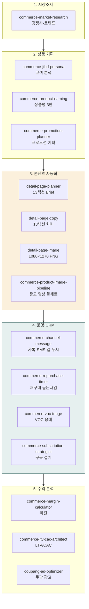
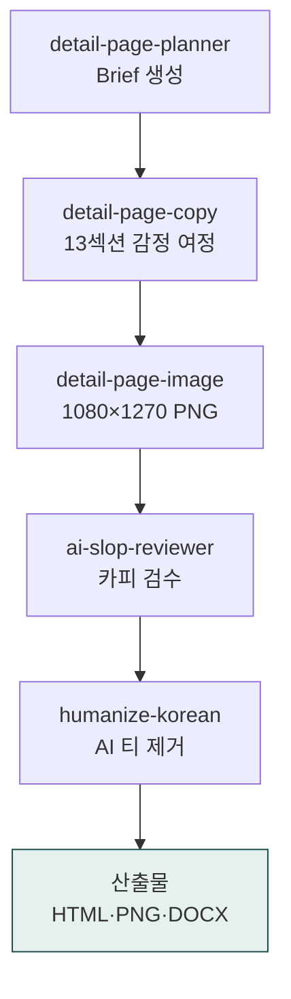

> **대상**: 스마트스토어·쿠팡·자사몰·크라우드펀딩 운영자, D2C 브랜드 PM, 이커머스 마케터
> **전제**: moai-core · moai-commerce · moai-media 활성화 + (선택) `GEMINI_API_KEY` · `HIGGSFIELD_API_KEY` 등록
> **소요**: 시나리오당 약 5-20분 (산출물 종류에 따라)

## 무엇을 할 수 있나



## 한 줄 요청 예시 5종

| # | 한 줄 요청 (사용자) | 자동 체인 (시스템) |
|---|---|---|
| 1 | "신상품 상세페이지 만들어줘" | detail-page-planner → copy → image → ai-slop-reviewer |
| 2 | "이번 시즌 프로모션 기획해줘" | commerce-promotion-planner → channel-message → marketing-compliance-kr |
| 3 | "재구매 캠페인 자동 설계해줘" | commerce-repurchase-timer → commerce-channel-message |
| 4 | "리뷰 5채널 통합 분석해줘" | commerce-voc-triage (리뷰 집계 모드) → docx-generator → ai-slop-reviewer |
| 5 | "우리 D2C 광고비 30% 의존도 탈출 전략 짜줘" | commerce-ltv-cac-architect → margin-calculator → integrated-strategy |

---

## 시나리오 ① 신상품 상세페이지 — 첫 출시 (약 15분)

**상황**: 무선 이어폰을 스마트스토어 + 자사몰에 출시.

### 사용자 입력


> 무선 이어폰 상세페이지 만들어줘


### 시스템이 묻는 항목 (AskUserQuestion)

1. **상품 정보**: 카테고리·가격대·핵심 USP 3개 (예: 노캔·60시간·한국어 음성)
2. **타깃**: 직장인·학생·운동러 등 페르소나
3. **채널**: 스마트스토어 / 쿠팡 / 자사몰 / 와디즈 (다중 선택)
4. **이미지**: 보유 사진 폴더 경로 (없으면 생성)
5. **참고 경쟁사**: 0-3개 URL

### 자동 체인



### 산출물

- `90_Output/products/wireless-ear/detail.html` — 13섹션 HTML (Next.js + shadcn/ui)
- `90_Output/products/wireless-ear/detail-1080x1270.png` — 단일 합성 이미지
- `90_Output/products/wireless-ear/copy-personas.md` — 페르소나 2세트 비교

---

## 시나리오 ② 시즌 프로모션 — 11월 빼빼로 데이 (약 10분)

### 사용자 입력


> 11월 빼빼로 데이 프로모션 기획해줘


### 시스템 인터뷰

1. **카테고리·브랜드 단계**: 화장품/식품/... · 신생/스몰/중대형
2. **목표**: 인지도 / 충성고객 / 즉각매출
3. **할인율 한도**: 0-15% / 16-30% / 31%+
4. **채널 우선순위**: 인스타·카톡·앱 푸시·이메일
5. **시즌 캘린더 자동 매핑**: D-30 / D-60 / D-90 사전 준비

### 자동 체인

`commerce-season-calendar` → `commerce-promotion-planner` → `commerce-channel-message` (AARRR 5단계, 카톡·SMS·앱 푸시) → `commerce-marketing-compliance-kr` (정통망법 게이트) → `ai-slop-reviewer`

### 산출물

- 노션 프로모션 템플릿 페이지 8섹션 (이슈화·얼리버드·한정 3종 세트)
- 카톡 친구톡 + 앱 푸시 카피 3안 (Timely·Personal·Actionable)
- 정통망법 BLOCK/PASS 사전 검증 표

---

## 시나리오 ③ 재구매 자동화 — 화장품 평균 주기 45일 (약 5분)

### 사용자 입력


> 화장품 재구매 메시지 시퀀스 설계해줘


### 시스템 인터뷰

1. **카테고리** + **평균 구매 주기 T** (자동: 화장품=45일)
2. **재구매율 현황** (선택)
3. **채널**: 앱 푸시 / 카톡 / 이메일
4. **인센티브 강도**: 골든타임 3구간 자동 매핑 가능?

### 자동 체인

`commerce-repurchase-timer` → 3구간 산출 (D+36 리마인드 / D+50 데드라인 / D+68 휴면) → `commerce-channel-message` (구간별 톤) → `commerce-marketing-compliance-kr`

### 산출물

```text
[D+36 리마인드 — 앱 푸시, 0-5% 인센티브, 가벼운 톤]
"세럼 다 쓰셨나요? 다음 주 신상 알려드릴게요 ✨"

[D+50 데드라인 — 카톡 친구톡, 10-15% 인센티브, 긴급 톤]
"이번주만 — 단골 할인 15% 자동 적용 (~5/24)"

[D+68 휴면 — 카톡 + SMS, 25-40% + 사은품, 위닝백 톤]
"오랜만이에요. 30% + 신제품 미니어처 동봉 — 5/30까지"
```

---

## 시나리오 ④ 멀티채널 리뷰 통합 분석 (약 8분)

### 사용자 입력


> 우리 비건 세럼 5채널 리뷰 통합 분석해줘


### 시스템 인터뷰

1. **채널 + API 키 보유 여부**: 네이버·쿠팡·자사몰·YouTube·인스타
2. **분석 기간**: 30/90/180일
3. **출력 형식**: JSON · DOCX · PPT (미리캔버스)
4. **VOC 응대 가이드 동봉**: 예/아니오

### 자동 체인

`commerce-voc-triage` (리뷰 집계 모드 — 5채널 감정·키워드·인사이트·액션플랜 4단 분석) → `docx-generator` → `ai-slop-reviewer`

### 산출물 미리보기

```json
{
  "total_reviews": 1247,
  "sentiment": {"positive": 78, "negative": 12, "neutral": 10},
  "insights": {
    "strengths": ["흡수력·발림성", "비건 인증 신뢰", "용기 디자인"],
    "weaknesses": ["향 호불호", "용량 부족", "가격 부담"]
  },
  "action_plan": [
    {"priority": 1, "term": "즉각", "action": "상세페이지 향 정보 보강"},
    {"priority": 2, "term": "단기", "action": "100ml SKU 추가"}
  ]
}
```

---

## 시나리오 ⑤ LTV/CAC 광고 의존도 탈출 (약 12분)

### 사용자 입력


> 우리 D2C 광고비 30% 의존도 탈출 전략 짜줘


### 시스템 인터뷰

1. **카테고리** (한국 D2C 벤치마크 자동 매칭)
2. **6대 지표 입력** (또는 산정): CAC·재구매율·구매주기·ARPU·공헌이익·LTV
3. **현재 ROAS·광고 비중**
4. **세그먼트별 분해 원하는 정도**

### 자동 체인

`commerce-ltv-cac-architect` (6대 지표 진단) → `commerce-margin-calculator` (손익분기 ROAS) → `commerce-early-fan-builder` (충성 100명 부트스트랩) → `commerce-integrated-strategy` (Month 1-6 로드맵)

### 산출물

- **현황 진단표**: LTV/CAC ratio (3+ 건강 / <1 손실) · Payback Period · 광고 의존도 (30%+ 위험)
- **탈출 6단계 로드맵** (Month 1-6, 광고 비중 30% → 11-15% 목표)
- **세그먼트별 재구매율 분해** + 광고 vs 추천 vs 자연유입 매트릭스

---

## 광고 영상 풀스택 (보너스, 약 15분)

이커머스 셀러가 상품 광고 영상까지 한 번에 만드는 시나리오. `commerce-product-image-pipeline`이 Higgsfield MCP 기반 4단계 체인을 자동 실행합니다.


> 스킨케어 상품 광고 영상 풀세트 만들어줘. 메타 + 네이버 GFA + 카카오 채널 변환까지


자동 체인: `commerce-product-image-pipeline` — 캐릭터 일관성(선택) → 이미지 생성 (Soul, 5축: Hero·Lifestyle·Detail·Use-case·Result) → 영상 생성 (DOP, 모션 프리셋 자동) → 메타·네이버·카카오 채널 규격 변환

**비용 추정**: ₩2,300-4,000/상품 1건 (1 캐릭터 + 5 이미지 + 1 메인 영상 + 채널 3 변환)

---

## AskUserQuestion 표준 슬롯 (이커머스 트랙 공통)

이커머스 시나리오에서 시스템이 자주 묻는 항목 — 한 번 답하면 `.moai/project/profile.md`에 저장되어 다음부터 자동 참조:

| 슬롯 | 예시 값 | 저장 위치 |
|---|---|---|
| 브랜드 단계 | 신생 / 스몰 / 중대형 | profile.md |
| 카테고리 | 화장품·식품·패션·반려동물 등 | profile.md |
| 주요 판매 채널 | 스마트스토어·쿠팡·자사몰·와디즈 | profile.md |
| 핵심 페르소나 | 직장인·학생·운동러 등 | profile.md |
| 광고 예산·ROAS 목표 | 월 100만 · ROAS 3+ | profile.md |
| 영업비밀·제외 키워드 | 알고리즘·고객사 명단 등 | .moai/secrets.md |

---

## 자주 묻는 질문

### Q. 30개 스킬을 다 외워야 하나요?

아니오. **사용자는 짧은 한 줄만 입력**하면 시스템이 자동으로 적절한 스킬을 선택해 체이닝합니다. 예: "재구매 메시지 짜줘" → 시스템이 `commerce-repurchase-timer + commerce-channel-message + commerce-marketing-compliance-kr`를 자동 호출.

### Q. 광고 영상 만들 때 비용이 걱정됩니다.

`commerce-product-image-pipeline`은 상품 1건당 **₩2,300-4,000** 예상. 무드보드 단계에서 스토리보드를 확정한 후 최종 생성하므로 재생성 비용 최소화. 무료 모드(이미지만)도 가능.

### Q. 정통망법 위반 위험은 자동 차단되나요?

예. **`commerce-marketing-compliance-kr`** 가 모든 마케팅 메시지 워크플로우에 자동 게이트로 들어갑니다. 야간 21시-익일 8시 발송, (광고) 표기 누락, 수신거부 미명시 등 6대 위반 자동 BLOCK. 과태료 1회 최대 3,000만원 회피.

### Q. 시스템이 인터뷰하는 게 귀찮으면?

`.moai/project/profile.md`에 브랜드 정보·카테고리·페르소나를 한 번 저장하세요. 다음부터는 시스템이 자동 참조하므로 인터뷰가 1-2개로 줄어듭니다.

---

## 다음 단계

- **[사용 패턴 가이드](../../../cowork/patterns/)** — 4가지 표준 사용 패턴
- **[moai-commerce 플러그인](../../../plugins/moai-commerce/)** — 30스킬 전체 카탈로그
- **[moai-media 플러그인](../../../plugins/moai-media/)** — 이미지·영상 생성 미디어 6스킬
- **[광고 트랙](../track-advertising/)** — 메타·구글 광고 진단·최적화
- **[법무 트랙](../track-legal/)** — 표시광고법·정통망법 컴플라이언스

---

### Sources

- [moai-commerce 디렉터리](https://github.com/modu-ai/cowork-plugins/tree/main/moai-commerce)
- 커머스 실무 노트 기반 통합 가이드
- [정보통신망법 제50조](https://www.law.go.kr/법령/정보통신망이용촉진및정보보호등에관한법률)
- 한국 D2C 카테고리 벤치마크: commerce-ltv-cac-architect 내장 데이터
