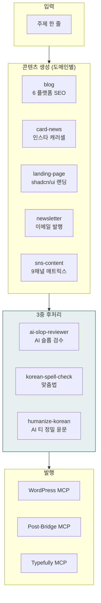
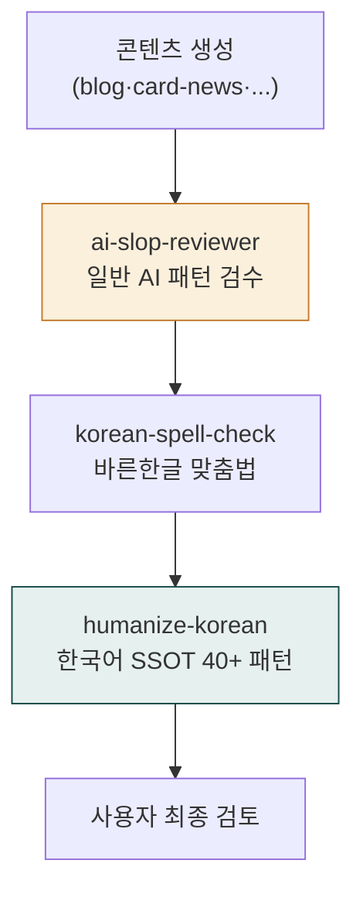

> **대상**: 1인 콘텐츠 크리에이터, 마케터, 블로거, 인플루언서, 뉴스레터 발행자
> **전제**: moai-core · moai-content 활성화 + (선택) moai-media·moai-marketing
> **소요**: 시나리오당 약 3-10분

## 무엇을 할 수 있나

## 한 줄 요청 예시 4종

| # | 한 줄 요청 | 자동 체인 |
|---|---|---|
| 1 | "비건 카페 오픈 블로그 시리즈 5편 써줘" | blog × 5 → ai-slop → korean-spell-check → humanize-korean |
| 2 | "프리랜서 세금 카드뉴스 8장 만들어줘" | card-news → higgsfield-image → ai-slop |
| 3 | "AI 영어 회화 앱 랜딩 페이지 만들어줘" | landing-page (shadcn/ui 인터뷰) → ai-slop |
| 4 | "월간 뉴스레터 발행해줘. 구독자 500명" | newsletter → ai-slop → korean-spell-check → 이메일 발송 |

---

## 시나리오 ① 네이버 블로그 시리즈 발행 (약 10분)

### 사용자 입력


> 비건 카페 오픈 시리즈 블로그 5편 써줘


### 시스템 인터뷰

1. **플랫폼**: 네이버 / 티스토리 / 브런치 / WordPress / Ghost
2. **편당 분량**: 1500자 / 2000자 / 3000자
3. **시리즈 구성**: 자동 5편 분류 (오픈 소식 → 메뉴 → 인테리어 → 운영 → 후기) 확인
4. **키워드**: 자동 추출 + 사용자 추가 입력
5. **이미지 첨부**: WordPress MCP 자동 업로드 / 로컬 저장

### 자동 체인

`blog × 5편` → `ai-slop-reviewer` (1차 일반) → `korean-spell-check` (바른한글) → `humanize-korean` (한국어 정밀 윤문, A/B/C/D 등급) → (선택) WordPress MCP 발행

### 산출물

- 5편 본문 (네이버 C-Rank·D.I.A. 알고리즘 친화)
- 각 편 SEO 최적화 메타데이터 + 추천 키워드
- 한국어 윤문 보고서 (변경률 + 등급)

---

## 시나리오 ② 인스타 카드뉴스 (약 6분)

### 사용자 입력


> 프리랜서 3.3% 원천징수 카드뉴스 8장 만들어줘


### 시스템 인터뷰

1. **슬라이드 수**: 6-10장
2. **톤**: 친근 / 격식 / 유머
3. **이미지 비율**: 1:1 / 4:5 / 9:16 (스토리)
4. **AI 이미지 생성**: 예/아니오 (`higgsfield-image` 호출)

### 자동 체인

`card-news` → `higgsfield-image` (Nano Banana 계열 — 한국어 타이포) → `ai-slop-reviewer`

---

## 시나리오 ③ 랜딩 페이지 — shadcn/ui (약 8분)

### 사용자 입력


> AI 영어 회화 앱 랜딩 페이지 만들어줘


### 시스템 인터뷰 (소크라테스식 테마 인터뷰)

1. **베이스 팔레트**: Neutral / Zinc / Stone / Slate
2. **컬러 모드**: Light / Dark / System / Auto Toggle
3. **모서리 반경**: Sharp - Pill
4. **효과**: Fade-up · Scroll Reveal · Parallax · Chart

### 자동 체인

`landing-page` (Next.js 15 + shadcn/ui + Tailwind v4 + OKLCH 토큰) → `ai-slop-reviewer` → `humanize-korean`

### 산출물

- `90_Output/landing/index.tsx` — Next.js App Router 컴포넌트
- 히어로·CTA·FAQ·소셜 프루프 6섹션
- Framer Motion 애니메이션 옵션

---

## 시나리오 ④ AI 슬롭 3중 검수 (모든 텍스트 산출물 공통)

콘텐츠 트랙의 핵심 — 모든 텍스트는 **반드시 3중 후처리** 거침:

| 후처리 | 범위 | 정량 메트릭 |
|---|---|---|
| ai-slop-reviewer | 일반 AI 슬롭 (영어 표현, 과한 형용사, hype 어휘) | — |
| korean-spell-check | 띄어쓰기·맞춤법 (부산대 바른한글 표면) | 오류 N건 |
| humanize-korean | 10대 카테고리 × 40+ 패턴 (번역투·관용구·형식명사) | 변경률 % + A/B/C/D 등급 |

**HARD 가드**: humanize-korean 변경률 30% 초과 → 경고 / 50% 초과 → 강제 중단·전체 롤백 (의미 100% 보존)

---

## AskUserQuestion 표준 슬롯 (콘텐츠 트랙 공통)

| 슬롯 | 예시 값 |
|---|---|
| 플랫폼 | 네이버·티스토리·브런치·WordPress·Ghost |
| 분량 | 1500/2000/3000자 |
| 톤 | 친근·격식·유머·전문 |
| 키워드 | 자동 추출 + 사용자 추가 |
| 이미지 자동 생성 | 예/아니오 (higgsfield-image 호출) |
| 발행 자동화 | WordPress MCP / Post-Bridge MCP / 수동 |

---

## 자주 묻는 질문

### Q. 12개 스킬 중 어떤 걸 호출해야 할까요?

**사용자는 호출 안 함**. 시스템이 한 줄 요청을 분석해 자동 선택. 예: "블로그" → `blog`, "랜딩" → `landing-page`, "카드뉴스" → `card-news`.

### Q. 윤문(humanize-korean)을 끄고 싶어요.

AskUserQuestion에서 "AI 검수 강도" 선택 시 "기본" (3중) / "약함" (ai-slop만) / "끄기" 옵션 제공.

### Q. WordPress 자동 발행이 안 됩니다.

[WordPress MCP](https://mcp.wordpress.com/mcp) 커넥터 등록 필요. Settings → Connectors → WordPress 활성화.

---

## 다음 단계

- **[사용 패턴 가이드](../../../cowork/patterns/)**
- **[광고 트랙](../track-advertising/)** — 콘텐츠 + 광고 결합
- **[moai-content 플러그인](../../../plugins/moai-content/)** — 12스킬 전체
- **[블로그 파이프라인 쿡북](../../blog-pipeline/)** — 발행 시퀀스 심화

---

### Sources

- [moai-content 디렉터리](https://github.com/modu-ai/cowork-plugins/tree/main/moai-content)
- [epoko77-ai/im-not-ai (MIT)](https://github.com/epoko77-ai/im-not-ai) — humanize-korean 원본
- [NomaDamas/k-skill (MIT)](https://github.com/NomaDamas/k-skill) — korean-spell-check 원본
