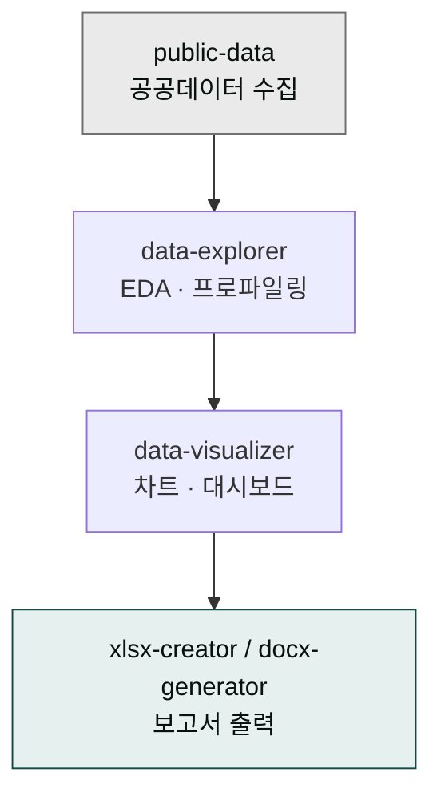

> **사용 방식**: 사용자가 짧은 한 줄 요청만 하면 시스템이 AskUserQuestion으로 맥락 수집 → 자동 체인 실행. [4가지 사용 패턴 참조](../../../cowork/patterns/)

**데이터 분석 트랙**은 공공데이터 수집부터 분석, 시각화, 보고서 생성까지 완결된 데이터 워크플로우를 제공합니다. 데이터 분석가·리서치·기획자의 데이터 처리 작업을 자연어 한 줄 → 자동 체인으로 자동화합니다.



## 트랙 개요

### 목적
- 데이터 처리 과정 전체 자동화
- 시각화 품질 및 정확성 보장
- 실용적인 보고서 자동 생성

### 적용 대상
- 공공데이터 분석 리포트
- 시장 조사 및 트렌드 분석
- 경영 분석 및 KPI 모니터링
- 정책 영향도 분석

### 사용 플러그인
- **moai-data**: 공공데이터 수집 및 분석
- **moai-office**: 데이터 시각화 및 보고서 생성
- **moai-core**: AI 품질 검수

## 표준 체인

```
public-data → data-explorer → data-visualizer → xlsx-creator → ai-slop-reviewer
```

| Phase | 스킬 | 역할 |
|---|---|---|
| 1 | `public-data` | 공공데이터 API 호출·정제·기본 통계 |
| 2 | `data-explorer` | EDA·통계·상관분석·패턴 발견 |
| 3 | `data-visualizer` | 차트·대시보드·시각적 스토리텔링 |
| 4 | `xlsx-creator` / `docx-generator` | 보고서 작성·요약·배포 문서화 |
| 5 | `ai-slop-reviewer` | 최종 품질 검수 |

---

## 실전 예시 1 ✦ 서울시 상권 분석 리포트


> 서울시 상권 데이터로 신규 진출 후보지 리포트 만들어줘


시스템 인터뷰: ① 분석 상권(강남·홍대·여의도 등) ② 기간(분기/연도) ③ 핵심 지표(매출·유동인구·점포 수) ④ 출력 형식(XLSX/DOCX) ⑤ 저장 경로

체인: `public-data → data-explorer → data-visualizer → xlsx-creator → ai-slop-reviewer`

**자동 생성물**:
- 상권 유형 분류 (상업·주거·혼합)
- 성장/침체 상권 식별 + 클러스터링
- 서울시 히트맵 · 분기별 추이 · 업종 비중 · 상관분석 차트
- 실행 요약 (1p) + 상세 분석 (10p) + 부록 (원본·코드)

---

## 실전 예시 2 ✦ 시장 조사 보고서


> 제조업 AI 도입 현황 시장 조사 보고서 써줘


시스템 인터뷰: ① 조사 대상 모수 ② 데이터 소스(KOSIS·공공데이터포털·설문) ③ 분석 항목(도입률·투자·성과) ④ 출력 형식

체인: `public-data → data-explorer → data-visualizer → docx-generator → ai-slop-reviewer`

**자동 생성물**: 업종별 세분화 + 경쟁 전략 + 성장 예측 + SWOT 분석

---

## 실전 예시 3 ✦ 분기 경영 분석 리포트


> 이번 분기 경영 분석 리포트 만들어줘


시스템 인터뷰: ① 데이터 소스(ERP·회계·영업) ② 분석 항목 ③ 수신자(경영진/부서) ④ 출력 형식

체인: `data-explorer → data-visualizer → xlsx-creator → ai-slop-reviewer`

**자동 생성물**: 재무 성과·영업 실적·운영 효율성 + 이상 감지 + 자동 차트 업데이트

---

## 확장 시나리오

- **실시간 데이터 연동**: 매일 09:00 자동 수집 → 대시보드 갱신 ([패턴 4: 스케줄 자동화](../../../cowork/patterns/))
- **예측 모델**: 시계열 데이터 → 다음 분기 예측 + 신뢰 구간
- **자동 리포팅**: 주간/월간 정기 발행 (Slack·이메일 자동 발송)

## 주의사항


공공데이터 분석 시 출처와 한계를 반드시 명시해야 합니다. 통계적 유의성을 검증하고 인과·상관관계를 구분해 오해를 방지해야 합니다.


- 데이터 출처 및 수집 방법 명시
- 통계적 유의성 검증
- 데이터의 시간적 한계 고려
- 개인정보보호 규정 준수

### Sources
- [moai-data 플러그인](../../../plugins/moai-data/)
- [moai-office 플러그인](../../../plugins/moai-office/)
- [공공데이터 포털](https://www.data.go.kr/)
