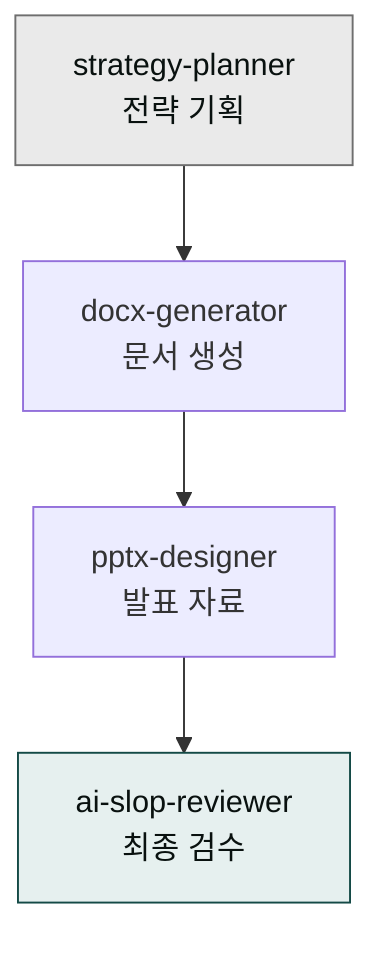

> **사용 방식**: 사용자가 짧은 한 줄 요청만 하면 시스템이 AskUserQuestion으로 맥락 수집 → 아래 스킬 체이닝 자동 실행. 사용자가 직접 스킬을 하나씩 호출할 필요 없음. [4가지 사용 패턴 참조](../../../cowork/patterns/)

**문서 작성 트랙**은 전략 기획부터 프레젠테이션 디자인, 최종 검수까지 완결된 문서 작업 워크플로우를 제공합니다. 기획자·컨설턴트·기획팀의 반복적인 문서 작업을 자연어 한 줄 → 자동 체인으로 자동화합니다.



## 트랙 개요

### 목적
- 전략 문서 작업의 전 과정을 자동화
- 일관된 품질의 프레젠테이션 생성
- 검수 프로세스 표준화

### 적용 대상
- 사업계획서 (Series A·B, 주주총회)
- IR 덱 (투자자 프레젠테이션)
- 주간·월간 보고서
- 경영진 회의 자료

### 사용 플러그인
- **moai-business**: 전략 기획·시장 분석
- **moai-office**: 문서·프레젠테이션 생성
- **moai-core**: AI 품질 검수

## 표준 체인

```
strategy-planner → pptx-designer → ai-slop-reviewer
```

| Phase | 스킬 | 역할 |
|---|---|---|
| 1 | `strategy-planner` | 사업 모델·타깃·경쟁사 분석 |
| 2 | `docx-generator` / `pptx-designer` | 문서·슬라이드 자동 생성 |
| 3 | `ai-slop-reviewer` | AI 패턴 수정·논리 일관성 검토 |

---

## 실전 예시 1 ✦ Series A IR 덱


> SaaS Series A IR 덱 만들어줘


시스템 인터뷰: ① 타깃 투자자(VC/CVC/엔젤) ② 조달 목표 ③ 핵심 가치 제안 ④ 시장(TAM/SAM/SOM) ⑤ 디자인 톤(Modern Tech/Corporate)

체인: `strategy-planner → pptx-designer → ai-slop-reviewer`

**자동 생성물**:
- 15-20장 슬라이드 (Problem·Solution·Market·Product·Traction·BM·Financials·Team·Ask)
- 사업 모델 캔버스 + TAM/SAM/SOM 분석 + 경쟁 우위 도출
- 브랜드 컬러 자동 적용 + 차트·아이콘 자동 생성
- 논리 일관성·데이터 정확성·전문 용어 검수 완료

---

## 실전 예시 2 ✦ 중견 기업 사업계획서


> 중견 기업 ERP 사업계획서 써줘


시스템 인터뷰: ① 기업 규모·업종 ② 보고 대상(내부 경영진/외부 투자자) ③ 기간(3년/5년 로드맵) ④ 기밀 등급

체인: `strategy-planner → docx-generator → ai-slop-reviewer`

**자동 생성물**: 3년 성장 로드맵 + 재무 계획 + 내부용·외부용 버전 자동 분기

---

## 실전 예시 3 ✦ 주간 보고서 자동화


> 매주 금요일 오후 4시 기획팀 주간 보고서 만들어줘


시스템 인터뷰: ① 데이터 소스(Salesforce·GA·Notion) ② 형식(KPI 대시보드+성과+다음 주 계획) ③ 수신자 ④ Slack 자동 발송 여부

체인: `weekly-report → docx-generator → ai-slop-reviewer → Slack 발송` (매주 자동 반복, [패턴 4](../../../cowork/patterns/) 적용)

**자동 생성물**: KPI 시각화·트렌드 분석·템플릿 기반 자동 생성

---

## 확장 시나리오

- **다국어 IR 덱**: 한·영·일 병행 생성
- **인터랙티브 프레젠테이션**: 웹 기반 동적 슬라이드
- **실시간 데이터 연동**: GA4·Salesforce 자동 갱신
- **발표 연습 지원**: 발표 스크립트 + AI 피드백

## 주의사항


IR 덱은 투자 유치의 핵심 도구입니다. AI 생성 내용은 반드시 실제 데이터와 검증되어야 하며, 투자자와의 전문 상담을 대체할 수 없습니다.


- 민감 재정 정보는 신중하게 처리
- 경쟁사 정보는 정확한 출처 확인 필수
- 시장 예측은 근거 있는 데이터 기반으로 작성

### Sources
- [moai-business 플러그인](../../../plugins/moai-business/)
- [moai-office 플러그인](../../../plugins/moai-office/)
