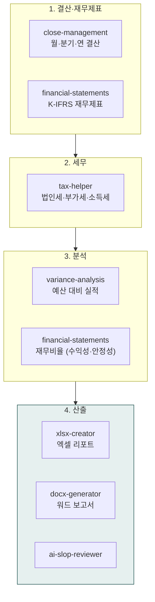
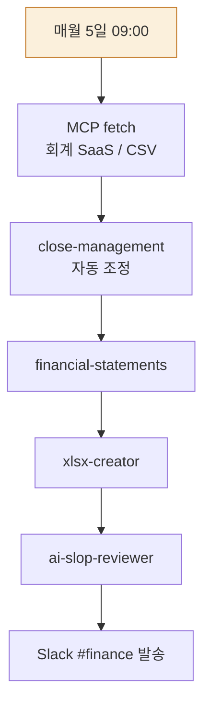

> **대상**: 사내 재무팀, 회계사, 재무 분석가, CFO, 스타트업 대표
> **전제**: moai-core · moai-finance · moai-office 활성화
> **소요**: 시나리오당 약 5-15분 (반복은 스케줄로 자동화)

## 무엇을 할 수 있나

## 시작 전 (최초 1회)

재무 자동화는 첫 사용 시 `/project init`으로 프로젝트 메모리를 한 번 세팅해 두면 이후 모든 시나리오에서 회사 정보·산업·회계 기간·데이터 소스를 자동 참조합니다. 매 시나리오마다 같은 인터뷰를 반복하지 않습니다.


> /project init "재무 자동화 프로젝트 시작"


시스템이 한 번 묻고 `.moai/project/profile.md`에 저장합니다.

- 회사 정보 (사명·법인격·사업자번호)
- 산업·업종 (제조·서비스·도소매·플랫폼·기타)
- 회계 기준 (K-IFRS·K-GAAP·USGAAP)
- 회계 기간 (1-12월·4-3월·기타)
- 데이터 소스 (더존·SAP·자체 SaaS·CSV·수기)

이후 시나리오 ①~④의 인터뷰 질문은 **첫 회만 묻고, 이후 자동 참조**됩니다.

---

## 한 줄 요청 예시 4종

| # | 한 줄 요청 | 자동 체인 |
|---|---|---|
| 1 | "Q1 변동분석 + K-IFRS 보고서 만들어줘" | financial-statements → variance-analysis → xlsx → docx → ai-slop |
| 2 | "법인세 신고서 작성해줘" | tax-helper(법인세 모드) → xlsx-creator → ai-slop |
| 3 | "월간 결산 자동화해줘" | close-management → financial-statements → xlsx (매월 자동) |
| 4 | "투자자용 재무 분석 보고서 만들어줘" | financial-statements(재무비율 분석) → variance-analysis → docx → ai-slop |

---

## 시나리오 ① 분기 결산 + K-IFRS 재무제표 (약 12분)

### 사용자 입력


> Q1 결산 + K-IFRS 재무제표 + 변동분석 만들어줘


### 시스템 인터뷰 (AskUserQuestion)

(첫 회만 묻고, 이후 자동 참조 — `/project init` 완료 시 생략)

1. **회사 단계**: 스타트업 / 중소 / 중견 / 대기업
2. **산업**: 제조 / 서비스 / 도소매 / 플랫폼
3. **회계 기간**: Q1 (1-3월) / Q2 / Q3 / Q4 / 연간
4. **데이터 소스**: 전표 엑셀 / 회계 SaaS 연동 / 수기 입력

### 자동 체인

`close-management`(자동 조정 항목 처리) → `financial-statements`(손익·대차·현금흐름 3종) → `variance-analysis`(전기·예산 대비) → `xlsx-creator`(차트 + 피벗) → `docx-generator`(경영진 요약) → `ai-slop-reviewer`

### 산출물

- `90_Output/finance/2026-Q1-statements.xlsx` — K-IFRS 표준 양식 3 시트
- `90_Output/finance/2026-Q1-variance.xlsx` — 부문별·항목별 편차 표
- `90_Output/finance/2026-Q1-summary.docx` — 경영진 1페이지 요약 (KPI 3개 + 주요 변동 5건)

---

## 시나리오 ② 법인세 신고서 자동 작성 (약 10분)

### 사용자 입력


> 2025 사업연도 법인세 신고서 작성해줘


### 시스템 인터뷰

1. **법인 정보**: 사명·사업자번호·업종
2. **과세표준**: 자동 계산 / 수동 입력
3. **세액공제 대상**: R&D / 고용증대 / 안전설비 / 없음
4. **출력**: 신고서 양식 / 요약 보고서 / 둘 다

### 자동 체인

`tax-helper`(법인세 모드, 세율 자동 적용) → 세액공제 매핑 → `xlsx-creator`(신고서 표준 양식) → `docx-generator`(임원 보고용 요약) → `ai-slop-reviewer`

### 산출물

- 법인세 신고서 (홈택스 호환 표준 양식)
- 납부 예상 세액 + 절세 가능성 5건
- 다음 분기 중간예납 추정

> **주의**: AI 산출물은 1차 초안용. 실제 신고는 세무사 검토 필수.

---

## 시나리오 ③ 월간 결산 스케줄 자동화 (패턴 4, 약 5분 설정)

### 사용자 입력


> 매월 5일 오전 9시에 전월 결산 자동 처리하고 결과 슬랙으로 보내줘


### 시스템 인터뷰

1. **데이터 소스**: 회계 SaaS(더존·SAP·자체) / CSV 업로드
2. **수신자**: CFO / 임원 / 재무팀 전체
3. **수신 채널**: 슬랙 채널·이메일·노션
4. **자동 발송 vs 검토 후 발송**

### 자동 체인 (매월 자동 반복)

### 산출물

- 매월 5일 09:00 자동 발송: 전월 손익·대차·현금흐름 3종 .xlsx
- Slack 알림 (썸네일 + 핵심 KPI 3개 — 매출·영업이익·현금잔고)

---

## 시나리오 ④ 투자자용 재무 분석 보고서 (약 10분)

### 사용자 입력


> 시리즈A IR용 재무 분석 보고서 만들어줘. 직전 3개년


### 시스템 인터뷰

1. **분석 기간**: 3년 / 5년 / TTM(직전 12개월)
2. **비교 대상**: 동종 산업 평균 / 글로벌 벤치마크 / 없음
3. **하이라이트**: 성장성·수익성·안정성 우선순위
4. **출력 형식**: DOCX(서술형) / PPT(투자자용) / 둘 다

### 자동 체인

`financial-statements`(3개년 통합 + 재무비율 분석: ROA·ROE·부채비율·유동비율 등) → `variance-analysis`(YoY 변동률) → `docx-generator` 또는 `pptx-designer` → `ai-slop-reviewer`

### 산출물

- 재무 비율 시계열 표 + 동종 산업 평균 대비
- 성장성·수익성·안정성 3축 레이더 차트
- 향후 12개월 예측 (회귀·시계열)

---

## AskUserQuestion 표준 슬롯 (재무 트랙 공통)

| 슬롯 | 예시 값 |
|---|---|
| 회사 단계 | 스타트업·중소·중견·대기업 |
| 산업 | 제조·서비스·도소매·플랫폼 |
| 회계 기준 | K-IFRS · K-GAAP · USGAAP |
| 데이터 소스 | 더존·SAP·자체 SaaS·CSV·수기 |
| 수신자 | CFO·임원·재무팀·이사회·투자자 |
| 자동화 주기 | 매일·매주·매월·분기·연간 |

---

## 자주 묻는 질문

### Q. 회계 SaaS 연동 없이도 가능한가요?

예. **CSV 업로드 fallback** 자동 동작. 전표·잔고·매출 CSV만 있으면 모든 분석 가능. MCP 연동 시 자동 fetch.

### Q. 세무 신고서를 그대로 제출해도 되나요?

**아니오.** 모든 세무 산출물은 **세무사 최종 검토 필수**. AI는 1차 초안·시뮬레이션·절세 가능성 탐색용. 실제 제출은 전문가 책임 하에.

### Q. K-IFRS와 K-GAAP 자동 변환되나요?

`financial-statements`는 K-IFRS 기본. AskUserQuestion에서 K-GAAP·USGAAP 선택 시 항목 매핑 자동 변환.

### Q. 환율·외화 환산은?

`financial-statements`는 한국은행 기준환율 자동 fetch (선택). 외화 거래 다수면 환산 시점·환산 방법(평균환율·기말환율) 인터뷰 추가.

---

## 주의사항


재무·세무 문서는 회사 의사결정과 법적 의무에 직접 영향을 미칩니다. AI 생성 결과는 1차 초안용이며, **공식 회계사·세무사 검토 후에만 사용**하세요. 신고·공시·감사용 산출물은 반드시 전문가 책임 하에 발행해야 합니다.


---

## 다음 단계

- **[사용 패턴 가이드](../../../cowork/patterns/)** — 특히 패턴 4 (스케줄 자동화)
- **[운영 트랙](../track-operations/)** — 주간보고·예산 운영
- **[문서 트랙](../track-documents/)** — IR Deck·사업계획서
- **[moai-finance 플러그인](../../../plugins/moai-finance/)** · **[moai-office](../../../plugins/moai-office/)**

---

### Sources

- [moai-finance 디렉터리](https://github.com/modu-ai/cowork-plugins/tree/main/moai-finance)
- [국세청 홈택스](https://hometax.nts.go.kr/)
- [한국공인회계사회](https://www.kicpa.or.kr/)
- [한국채택국제회계기준 K-IFRS](https://www.kasb.or.kr/)
