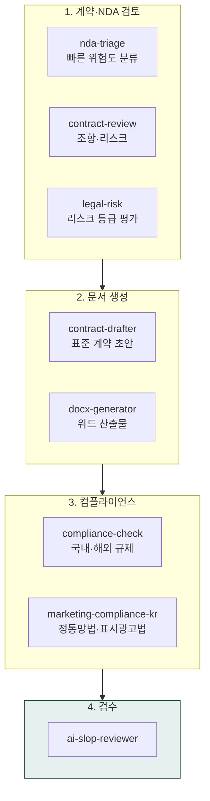

> **대상**: 사내 법무팀, 컴플라이언스 담당자, 스타트업 대표·CXO, 외부 자문 변호사
> **전제**: moai-core · moai-legal · moai-office 활성화
> **소요**: 시나리오당 약 3-15분

## 무엇을 할 수 있나

## 한 줄 요청 예시 4종

| # | 한 줄 요청 | 자동 체인 |
|---|---|---|
| 1 | "./nda_inbox/ 폴더 NDA 12개 위험도 검토해줘" | nda-triage(배치) → contract-review → legal-risk → docx |
| 2 | "공급 계약서 리뷰하고 개선안 만들어줘" | contract-review → contract-drafter → docx → ai-slop |
| 3 | "GDPR 준수 보고서 생성해줘" | compliance-check → docx-generator → ai-slop |
| 4 | "B2B SaaS 표준 NDA 한·영 동시에 만들어줘" | contract-drafter → docx (KR/EN 병렬) → ai-slop |

---

## 시나리오 ① NDA 12개 일괄 위험도 검토 (배치, 약 10분)

### 사용자 입력


> ./nda_inbox/ 폴더의 NDA 12개 위험도 검토해서 한 페이지로 정리해줘


### 시스템 인터뷰 (AskUserQuestion)

1. **회사 정보**: 자사 사명·업종·규모 (NDA 균형 평가용)
2. **핵심 영업비밀 카테고리**: 기술·고객 명단·가격·소스코드 등
3. **선호 면책 문구**: 자사 표준 / 상대방 표준 / 균형
4. **저장 경로**: 산출물 출력 폴더

### 자동 체인

`nda-triage`(12건 배치 분류) → 위험도 A/B/C 그룹화 → `contract-review`(상세) → `legal-risk`(등급 평가) → `docx-generator` → `ai-slop-reviewer`

### 산출물

- `90_Output/legal/nda-triage-2026-W17.docx` — 한 페이지 요약표 (회사명·위험도·핵심 이슈 3건)
- `90_Output/legal/nda-details/{회사명}.docx` × 12 — NDA별 조항별 코멘트
- 협상 제안 문구 자동 생성 (조항별 수정 카운터안)

---

## 시나리오 ② 공급 계약서 리뷰 + 개선안 (약 12분)

### 사용자 입력


> 공급 계약서 리뷰하고 우리에게 유리한 개선안 만들어줘


### 시스템 인터뷰

1. **계약 종류**: 공급·서비스·라이선스·총판
2. **자사 포지션**: 공급자 / 구매자 / 양방향
3. **금액·기간**: 월정액·일시불·자동갱신
4. **리스크 우선순위**: 가격·하자보증·해지·SLA·지식재산권

### 자동 체인

`contract-review`(조항별 리스크 분석) → `legal-risk`(A/B/C 등급) → `contract-drafter`(개선안 초안) → `docx-generator` → `ai-slop-reviewer`

### 산출물

- 리뷰 보고서: 고위험 조항·불균형 조항·누락 조항 + 개선 제안 10건
- 개선된 계약서 초안 (변경 부분 빨간색 트랙체인지)
- 협상 카드 (우리 양보 가능 vs 절대 양보 불가)

---

## 시나리오 ③ GDPR·국내 규제 컴플라이언스 (약 8분)

### 사용자 입력


> 우리 SaaS EU 진출 전 GDPR 준수 보고서 만들어줘


### 시스템 인터뷰

1. **데이터 처리 범위**: 처리량·국가·민감정보 포함 여부
2. **DPO(개인정보보호책임자) 임명 여부**
3. **현재 동의 절차**: 가입 시 동의 / 별도 약관
4. **이전·보관 정책**: EU 내 보관 / 한국 보관 (SCC 필요)

### 자동 체인

`compliance-check`(GDPR 7대 원칙 매핑) → `marketing-compliance-kr`(국내 정통망법 동시 검토) → `docx-generator` → `ai-slop-reviewer`

### 산출물

- GDPR 7대 원칙별 준수 여부 체크리스트
- DPA(데이터 처리 위탁 계약) 표준 양식
- 위반 시 과징금 예상 + 우선 조치 5건

---

## 시나리오 ④ 한·영 NDA 동시 작성 (약 5분)

### 사용자 입력


> B2B SaaS 표준 NDA 한·영 동시에 만들어줘


### 시스템 인터뷰

1. **상호 NDA / 일방 NDA**
2. **유효 기간**: 1·2·3·5년
3. **준거법**: 한국 / 미국 (델라웨어·캘리포니아) / 영국
4. **분쟁 해결**: 한국 법원 / 싱가포르 SIAC / ICC 중재

### 자동 체인

`contract-drafter`(한·영 병렬) → `docx-generator`(KR/EN 2 파일) → `ai-slop-reviewer`

### 산출물

- `nda-{회사}-ko.docx` + `nda-{회사}-en.docx`
- 한·영 조항 매칭 표 (번역 일치 검증)

---

## AskUserQuestion 표준 슬롯 (법률 트랙 공통)

| 슬롯 | 예시 값 |
|---|---|
| 자사 정보 | 사명·업종·규모 |
| 자사 포지션 | 공급자 / 구매자 / 양방향 |
| 영업비밀 카테고리 | 기술·고객 명단·가격·소스코드 |
| 준거법 | 한국·미국·영국·EU |
| 분쟁 해결 | 한국 법원·SIAC·ICC |
| 출력 형식 | DOCX·PDF·한·영 병렬 |

---

## 자주 묻는 질문

### Q. AI가 생성한 계약서를 그대로 서명해도 되나요?

**아니오.** 모든 법률 산출물은 변호사 최종 검토 필수. AI는 1차 초안 + 협상 카드 + 리스크 지도 작성용. `ai-slop-reviewer`는 표현 검수일 뿐, 법적 효력 보증 아님.

### Q. NDA 12개 일괄 처리 시 개인정보 처리는?

기본값: 회사명·서명자명 마스킹. AskUserQuestion에서 명시 변경 가능. 원본은 처리 후 자동 폐기.

### Q. 한국 정통망법·표시광고법 자동 검출되나요?

예. `marketing-compliance-kr`이 마케팅 관련 모든 워크플로우에 자동 게이트. 야간 발송·과대광고·식약처 위반 자동 BLOCK.

---

## 주의사항


법률 문서는 AI 생성만으로 완전한 법적 효력을 갖지 않습니다. 반드시 법무 전문가의 검토를 거쳐야 하며, AI는 보조 도구로만 활용하세요. 중요한 법적 문서는 반드시 법률 전문가와 상담하시기 바랍니다.


- AI 생성 결과는 예비 검토용으로만 활용
- 법무 전문가 최종 검토 필수
- 관련 법규 최신 정보 확인 (법령은 자주 개정)
- 사정에 맞는 맞춤화 필요

---

## 다음 단계

- **[사용 패턴 가이드](../../../cowork/patterns/)** — 4가지 표준 패턴
- **[운영 트랙](../track-operations/)** — 제안서·RFP 응답
- **[이커머스 트랙](../track-commerce/)** — 마케팅 컴플라이언스 게이트
- **[moai-legal 플러그인](../../../plugins/moai-legal/)**

---

### Sources

- [moai-legal 디렉터리](https://github.com/modu-ai/cowork-plugins/tree/main/moai-legal)
- [정보통신망법](https://www.law.go.kr/법령/정보통신망이용촉진및정보보호등에관한법률)
- [GDPR 공식 문서](https://gdpr.eu/)
- [대한변호사협회 계약서 작성 가이드](https://www.koreanbar.or.kr/)
