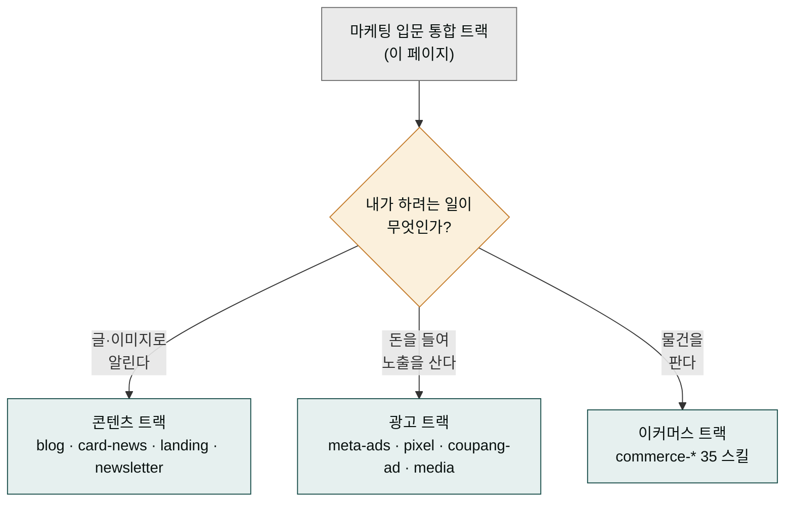

> **이 트랙은 입문 통합용입니다.** 구체적인 도메인별 워크플로우는 아래 분리된 트랙을 참조하세요:
>
> - **[콘텐츠 트랙](../track-content/)** — 블로그·카드뉴스·랜딩·뉴스레터·SNS 콘텐츠 생성
> - **[광고 트랙](../track-advertising/)** — 메타·쿠팡 광고 진단·기획·영상 풀세트
> - **[이커머스 트랙](../track-commerce/)** — 상품 출시·재구매·VOC·LTV 통합
>
> **대상**: 마케팅 입문자, 1인 브랜드, 콘텐츠 마케터, 브랜드 매니저
> **전제**: moai-core · moai-content 활성화 + (선택) moai-marketing · moai-media

## 왜 마케팅 트랙이 세 갈래로 갈라지나 — 큰 주방이 전문 조리대로 나뉘는 이유

음식점을 하나 열 때 주방 전체를 한 명에게 맡기지 않습니다. 본 요리(메인 디시)를 만드는 조리대, 메뉴판·간판 사진을 찍는 홍보 책상, 손님을 끌어모으는 쿠폰·이벤트 책상은 하는 일이 전혀 다릅니다. 마케팅도 똑같아서 "마케팅해줘" 한마디로 끝나지 않습니다. 글을 써서 알리는 일(콘텐츠), 돈을 들여 노출 자리를 사는 일(광고), 물건을 팔아 재구매를 끌어내는 일(이커머스)은 각자 쓰는 스킬과 접근법이 다릅니다.

이 트랙은 그 세 갈래가 갈라지기 **전**의 입문용 모임입니다. 처음에는 "내 마케팅이 어디에 해당하는가"를 한눈에 보여주고, 본격적으로 파고들 땐 갈래길 아래의 전용 트랙으로 넘어갑니다. 아래 다이어그램에서 세 갈래가 어디로 이어지는지 먼저 확인하면, 내 요청이 어느 트랙으로 가야 할지 헤매지 않습니다.

## 한 줄 요청 예시 4종

| # | 한 줄 요청 | 자동 체인 | 더 자세히 |
|---|---|---|---|
| 1 | "AI 도입 가이드 블로그 써줘" | blog → ai-slop → humanize-korean | [콘텐츠 트랙](../track-content/) |
| 2 | "신상품 광고 영상 풀세트 만들어줘" | moodboard → image-gen → video-gen → channel-packager | [광고 트랙](../track-advertising/) |
| 3 | "월간 캠페인 기획해줘" | campaign-planner → channel-message → ai-slop | [광고 트랙](../track-advertising/) |
| 4 | "이메일 시퀀스 3부작 짜줘" | email-sequence → ai-slop → korean-spell-check | [콘텐츠 트랙](../track-content/) |

---

## 시나리오 ① 블로그 콘텐츠 빠른 생성 (약 5분)

### 사용자 입력


> AI 도입 가이드 블로그 1편 써줘. 중소기업 대상


### 시스템 인터뷰

1. **플랫폼**: 네이버·티스토리·브런치·WordPress·Ghost
2. **분량**: 1500자 / 2000자 / 3000자
3. **톤**: 친절한 전문가 / 격식 / 유머
4. **키워드**: 자동 추출 + 사용자 추가

### 자동 체인

`blog` → `ai-slop-reviewer` → `korean-spell-check` → `humanize-korean` (3중 후처리)

### 산출물

- 본문 (선택 플랫폼의 SEO 알고리즘 최적화)
- 메타 정보 (태그·카테고리·키워드)
- 한국어 윤문 보고서 (변경률 + A/B/C/D 등급)

> **상세 워크플로우**: [콘텐츠 트랙 — 시나리오 ①](../track-content/#시나리오--네이버-블로그-시리즈-발행-약-10분)

---

## 시나리오 ② SNS 시리즈 (인스타·페북·링크드인)

### 사용자 입력


> AI 도입 가이드 인스타 캐러셀 5장 만들어줘


### 시스템 인터뷰

1. **플랫폼**: 인스타 / 페북 / 링크드인 / 멀티
2. **콘텐츠 유형**: 교육 / 사례 / 질문형 / Q&A
3. **이미지 자동 생성**: 예/아니오 (`higgsfield-image` 호출)
4. **해시태그**: 자동 추출 + 사용자 추가

### 자동 체인

`sns-content` (9채널 매트릭스) → `card-news` (캐러셀) → `higgsfield-image` (한국어 타이포) → `ai-slop-reviewer`

> **상세**: [콘텐츠 트랙](../track-content/) · [광고 트랙](../track-advertising/)

---

## 시나리오 ③ 이메일 캠페인 3부작 (약 7분)

### 사용자 입력


> 신규 구독자 환영 시퀀스 3부작 만들어줘


### 시스템 인터뷰

1. **목표**: 구매 유도 / 인지 / 신뢰 구축
2. **발송 간격**: D+0 / D+2 / D+5
3. **개인화 수준**: 이름만 / 행동 기반 / 세그먼트별
4. **CTA**: 단일 / 다중 / A/B 테스트

### 자동 체인

`email-sequence` → `copywriting` (PAS 카피 구조) → `ai-slop-reviewer` → `korean-spell-check`

### 산출물

- 3통 이메일 본문 (개인화 변수 포함)
- 제목 A/B 안 2종
- 발송 일정표

---

## 다음 단계 — 분리된 도메인 트랙으로

마케팅 트랙은 입문 통합용이며, **실제 운영은 도메인별 트랙에서 더 깊이 다룹니다**.

| 도메인 | 추천 트랙 | 핵심 스킬 |
|---|---|---|
| 블로그·SNS·랜딩·뉴스레터 | [콘텐츠 트랙](../track-content/) | blog · card-news · landing-page · newsletter · sns-content |
| 메타·쿠팡 광고 진단·영상 | [광고 트랙](../track-advertising/) | meta-ads-analyzer · pixel-audit · coupang-ad-optimizer · media-* |
| 상품 출시·재구매·VOC·LTV | [이커머스 트랙](../track-commerce/) | commerce-* 35스킬 |

---

## 자주 묻는 질문

### Q. 마케팅 콘텐츠는 어떤 후처리가 필수인가요?

모든 텍스트 산출물은 **3중 후처리** (`ai-slop-reviewer` → `korean-spell-check` → `humanize-korean`). HARD 규칙: humanize-korean 변경률 50% 초과 시 자동 롤백 (의미 100% 보존).

### Q. 브랜드 톤앤매너 학습은?

`.moai/project/brand-voice.md`에 브랜드 보이스 정의 시 모든 콘텐츠 스킬이 자동 참조. AskUserQuestion에서 톤 재정의 가능.

### Q. 법적 규제 자동 검출되나요?

예. `marketing-compliance-kr`이 마케팅 관련 모든 워크플로우에 자동 게이트. 야간 발송·과대광고·식약처 위반 자동 BLOCK.

---

### Sources

- [moai-content 디렉터리](https://github.com/modu-ai/cowork-plugins/tree/main/moai-content)
- [moai-marketing 디렉터리](https://github.com/modu-ai/cowork-plugins/tree/main/moai-marketing)
- [정보통신망법](https://www.law.go.kr/법령/정보통신망이용촉진및정보보호등에관한법률)
