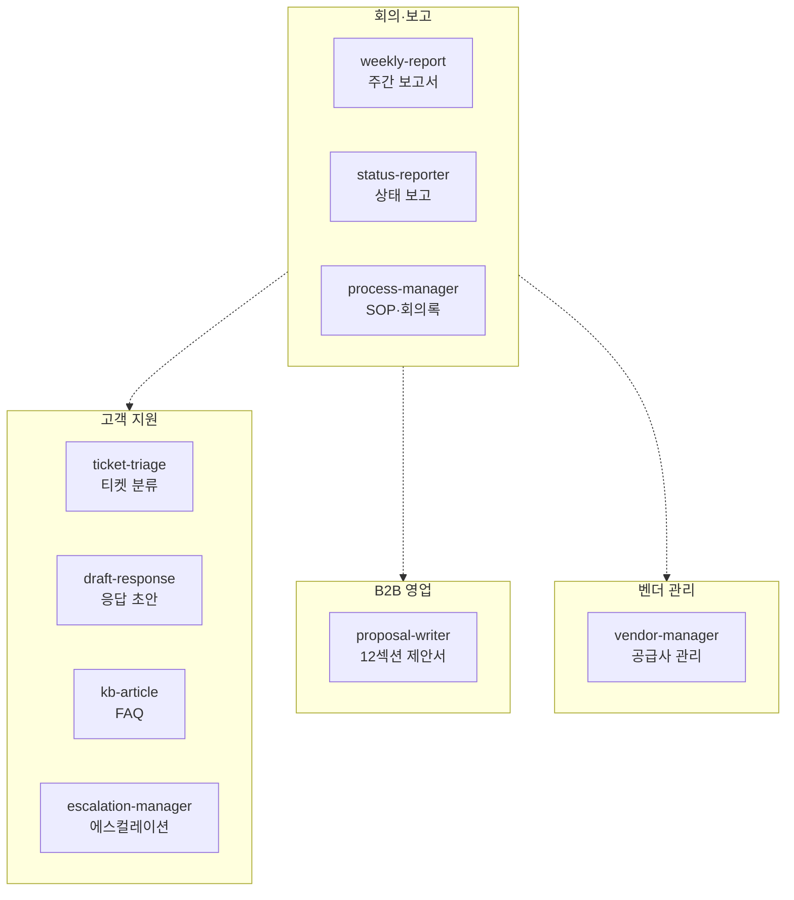
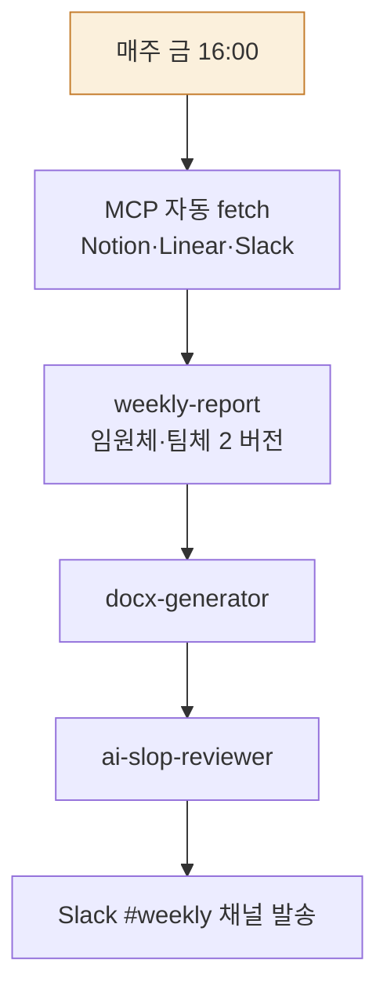

> **대상**: 운영팀, PM, 고객지원(CS) 매니저, B2B 영업 담당자, 사내 어시스턴트
> **전제**: moai-core 활성화 + (선택) moai-operations · moai-pm · moai-support · moai-sales 중 필요한 것
> **소요**: 시나리오당 약 3-10분 (반복은 스케줄로 자동화)

## 무엇을 할 수 있나



## 한 줄 요청 예시 4종

| # | 한 줄 요청 | 자동 체인 |
|---|---|---|
| 1 | "매주 금요일 우리 팀 주간보고 자동화해줘" | weekly-report → docx → ai-slop → Slack 발송 (스케줄) |
| 2 | "오늘 들어온 CS 티켓 50개 분류해줘" | ticket-triage → 우선순위 → draft-response |
| 3 | "RFP 첨부했어. B2B 제안서 만들어줘" | proposal-writer → docx-generator → ai-slop |
| 4 | "공급사 평가표 1분기 만들어줘" | vendor-manager → xlsx-creator |

---

## 시나리오 ① 주간 보고서 스케줄 자동화 (패턴 4, 약 5분 설정)

### 사용자 입력


> 매주 금요일 오후 4시에 우리 팀 주간보고 자동 발송해줘


### 시스템 인터뷰

1. **데이터 소스**: Notion · Linear · Asana · Slack MCP / CSV 업로드 / 수동 입력
2. **수신자**: 임원 (격식체) / 팀 (구어체) / 둘 다
3. **발송 채널**: 슬랙 채널·이메일·노션 페이지
4. **포함 섹션**: 이번 주 / 다음 주 / 이슈·블로커 / 도움 요청 (4분할 표준)
5. **자동 발송 vs 검토 후 발송**

### 자동 체인 (매주 자동 반복)



### 산출물

- 매주 금요일 16:00 자동 발송: `90_Output/wbr/2026-W17-{임원|팀}.docx` 2개
- Slack #weekly 채널 알림 (썸네일 + 핵심 KPI 3개)

---

## 시나리오 ② CS 티켓 일괄 분류·응답 (배치, 약 10분)

### 사용자 입력


> 오늘 들어온 CS 티켓 50개 분류해줘


### 시스템 인터뷰

1. **티켓 소스**: Zendesk · Intercom · CSV / 자유 텍스트
2. **분류 기준**: 긴급도 (KTAS 5단계) / 유형 (환불·배송·제품·기타)
3. **응답 자동 작성**: 예/아니오 (예 시 `draft-response` 자동 호출)
4. **에스컬레이션 기준**: VIP 고객 · 환불 거부 · 식약처 신고 위협

### 자동 체인

`ticket-triage` (KTAS 5단계 분류) → `commerce-voc-triage` (3축 점수, 이커머스인 경우) → `draft-response` (응답 초안 50건) → `ai-slop-reviewer` → `escalation-manager` (Level 1-2 자동 알림)

### 산출물

```text
Level 1 (즉시, <1시간): 3건 — 대표 직접 사과 + 환불 즉시
Level 2 (응급, <4시간): 8건 — CS팀장 응답 + 1:1 솔루션
Level 3 (긴급, <24시간): 18건 — CS 표준 응답 자동 발송
Level 4 (준응급, <72시간): 15건 — 자동 응답 + 72시간 처리
Level 5 (비응급, <1주): 6건 — 자동 응답 + 감사 표현
```

---

## 시나리오 ③ B2B 제안서 작성 (약 8분)

### 사용자 입력


> [고객사명] RFP 첨부했어. 제안서 만들어줘


### 시스템 인터뷰

1. **우리 솔루션 한 줄** + **핵심 차별점 3개**
2. **가격대 + 일정** (월 50만 30석 · 4주 PoC + 3개월 본 도입)
3. **레퍼런스 자료** 폴더 경로 (자동 인용)
4. **출력 형식**: DOCX 본문 / PPTX 발표 30장 / 둘 다

### 자동 체인

`proposal-writer` (12섹션 표준 목차 + Three C's: Compliant · Complete · Compelling) → `docx-generator` 또는 `pptx-designer` → `ai-slop-reviewer`

### 산출물

- 12섹션 제안서 본문 (표지·Exec Summary·회사 소개·시장·솔루션·기술 스펙·일정·운영·레퍼런스·가격·리스크·부록)
- Three C's 자동 체크 (RFP 누락 항목 경고 / 빈 섹션 표기 / 정량 수치 보강 제안)

---

## 시나리오 ④ 공급사 평가표 자동화 (약 5분)

### 사용자 입력


> 1분기 공급사 평가표 만들어줘. 공급사 12곳


### 시스템 인터뷰

1. **공급사 명단**: CSV / 폴더 / 자유 입력
2. **평가 기준**: 가격 · 품질 · 납기 · 응답성 · 안정성 (기본 5축, 사용자 추가 가능)
3. **가중치**: 자동 균등 / 사용자 명시
4. **출력 형식**: XLSX (자동 차트) / DOCX

### 자동 체인

`vendor-manager` (5축 평가 매트릭스) → `xlsx-creator` (조건부 서식 + 레이더 차트 + 종합 점수 순위)

---

## AskUserQuestion 표준 슬롯 (운영 트랙 공통)

| 슬롯 | 예시 값 |
|---|---|
| 데이터 소스 | Notion · Linear · Asana · Slack · CSV · 자유 텍스트 |
| 톤 | 임원체·팀체·격식·친근 |
| 발송 채널 | Slack 채널·이메일·노션·MS Teams |
| 자동화 주기 | 매일·매주·매월·이벤트 트리거 |
| 검토 단계 | 즉시 발송 / 사용자 컨펌 후 |

---

## 스케줄 자동화 — 운영 트랙 핵심

운영 트랙은 **패턴 4 (스케줄 자동화)** 활용 비중이 가장 높습니다.

```text
일일: 모닝 브리핑 (commerce-morning-brief) + 신규 주문 요약
매주: 주간보고 (weekly-report) + KPI 대시보드
매월: 월간 성과 (status-reporter) + 공급사 평가
분기: 인사평가 (performance-review) + OKR 점검
```

### 자동화 추가 명령


> 매일 오전 8시 우리 매장 어제 주문·문의·트렌드·ROAS 4영역 1줄 브리핑 슬랙으로 보내줘


→ `commerce-morning-brief` (MCP `dashboard_morning_brief`) 매일 자동 실행

---

## 자주 묻는 질문

### Q. Notion·Linear·Slack MCP 없이도 주간보고 가능한가요?

예. 자유 텍스트 입력 fallback 자동 동작. MCP 있으면 자동 수집, 없으면 사용자가 4분할(이번 주/다음 주/이슈/도움) 입력만 하면 됨.

### Q. CS 티켓 응답을 사용자 검토 없이 자동 발송하면 위험하지 않나요?

기본값: **Level 3-5 자동 발송 / Level 1-2 사용자 검토 후 발송**. AskUserQuestion에서 조정 가능. 모든 응답은 `ai-slop-reviewer` 후처리.

### Q. B2B 제안서 12섹션이 우리 회사에 안 맞아요.

`proposal-writer`는 표준 12섹션을 자동 채우지만, 본인 회사 양식 .docx 첨부 시 그 구조를 따라 자동 생성합니다.

---

## 다음 단계

- **[사용 패턴 가이드](../../../cowork/patterns/)** — 특히 패턴 4 (스케줄 자동화)
- **[문서 트랙](../track-documents/)** — 사업계획서·IR
- **[법무 트랙](../track-legal/)** — 계약·NDA
- **[moai-pm 플러그인](../../../plugins/moai-pm/)** · **[moai-support](../../../plugins/moai-support/)** · **[moai-sales](../../../plugins/moai-sales/)**

---

### Sources

- [moai-operations · moai-pm · moai-support · moai-sales 디렉터리](https://github.com/modu-ai/cowork-plugins)
- KTAS 응급실 5단계 분류 체계
- B2B 제안서 Three C's (Compliant · Complete · Compelling) 원칙
