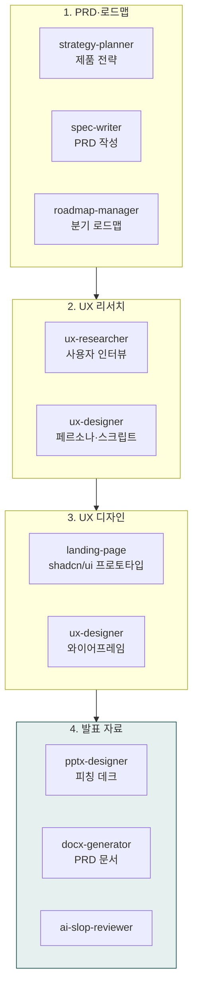

> **대상**: 제품 매니저(PM), UX 디자이너, 개발 매니저, 스타트업 창업자
> **전제**: moai-business · moai-product 활성화 + (선택) moai-office · moai-content · 사용자 정의 product-assistant 플러그인
> **소요**: 시나리오당 약 5-20분

## 무엇을 할 수 있나

## 한 줄 요청 예시 4종

| # | 한 줄 요청 | 자동 체인 |
|---|---|---|
| 1 | "결제 모듈 PRD 초안 + 인터뷰 가이드 만들어줘" | strategy-planner → spec-writer → ux-researcher → docx |
| 2 | "분기 로드맵 짜줘. 향후 12개월" | roadmap-manager → docx + xlsx (마일스톤) |
| 3 | "SaaS 랜딩 프로토타입 만들어줘" | landing-page → ai-slop → humanize-korean |
| 4 | "투자자용 피칭 데크 12장 만들어줘" | strategy-planner → pptx-designer → ai-slop |

---

## 시나리오 ① 신규 기능 PRD + 사용자 인터뷰 가이드 (약 12분)

### 사용자 입력


> 결제 모듈 PRD 초안 + 사용자 인터뷰 가이드 만들어줘


### 시스템 인터뷰 (AskUserQuestion)

1. **제품 단계**: 0-1 (MVP) / 1-10 (PMF 직전) / 10+ (확장)
2. **사용자 페르소나**: 페르소나 정의 / 자동 추출 / 없음
3. **우선순위 기준**: 매출·리텐션·LTV·신규 획득
4. **성공 KPI**: 전환율·재구매율·NPS·MAU

### 자동 체인

`strategy-planner`(제품 전략 정의) → `spec-writer`(PRD: 문제·해결·요구사항·인수기준) → `ux-researcher`(5-7개 핵심 질문 + STAR 후속 질문) → `docx-generator` → `ai-slop-reviewer`

### 산출물

- `90_Output/product/payment-prd.docx` — 8섹션 PRD (요구사항·인수기준·OKR 매핑)
- `90_Output/product/user-interview-script.docx` — 5-7개 핵심 질문 + 후속 프로브
- 우선순위 매트릭스 (MoSCoW + RICE 점수)

---

## 시나리오 ② 분기 로드맵 자동 작성 (약 8분)

### 사용자 입력


> 향후 4분기 제품 로드맵 짜줘


### 시스템 인터뷰

1. **기간**: 다음 1분기 / 4분기 / 12개월
2. **자원**: 개발자 수·디자이너·PM
3. **우선순위 기준**: 사용자 가치 / 매출 / 기술 부채
4. **출력 형식**: XLSX 간트 / DOCX 서술 / PPT 발표용

### 자동 체인

`roadmap-manager`(MoSCoW 우선순위) → 마일스톤·의존성 매핑 → `xlsx-creator`(간트 차트) → `docx-generator` 또는 `pptx-designer` → `ai-slop-reviewer`

### 산출물

- 분기별 마일스톤 표 + 의존성 매트릭스
- 자원 배분 시뮬레이션 (인력·시간·예산)
- 리스크 관리 5건 + 완화 계획

---

## 시나리오 ③ SaaS 랜딩 프로토타입 (약 8분)

### 사용자 입력


> AI 영어 회화 SaaS 랜딩 프로토타입 만들어줘


### 시스템 인터뷰 (소크라테스식 테마)

1. **베이스 팔레트**: Neutral / Zinc / Stone / Slate
2. **컬러 모드**: Light / Dark / System
3. **모서리**: Sharp - Pill
4. **효과**: Fade-up · Scroll Reveal · Parallax · Chart

### 자동 체인

`landing-page` (Next.js 15 + shadcn/ui + Tailwind v4 + OKLCH 토큰) → `ai-slop-reviewer` → `humanize-korean`

### 산출물

- `90_Output/landing/index.tsx` — Next.js App Router 컴포넌트
- 히어로·CTA·FAQ·소셜프루프 6섹션
- Framer Motion 애니메이션

> **상세**: [콘텐츠 트랙 — 시나리오 ③](../track-content/#시나리오--랜딩-페이지--shadcnui-약-8분)

---

## 시나리오 ④ 투자자용 피칭 데크 (약 10분)

### 사용자 입력


> 시리즈A 피칭 데크 12장 만들어줘


### 시스템 인터뷰

1. **단계**: 프리시드·시드·시리즈A·시리즈B
2. **목표 금액**: 5억 / 30억 / 100억+
3. **하이라이트 우선**: 팀·시장·기술·트랙션
4. **참고 자료**: 회사 소개·재무·트랙션 폴더 경로

### 자동 체인

`strategy-planner`(엘리베이터 피치) → `spec-writer`(12장 표준 목차) → `pptx-designer`(시각화) → `ai-slop-reviewer`

### 산출물

- 12장 피칭 데크 (Problem · Solution · Market · Product · Traction · Business Model · Competition · Team · Roadmap · Financials · Ask · Appendix)
- 발표 메모 스크립트 (장당 30-60초 발화 가이드)
- Q&A 예상 질문 10개 + 모범 답안

---

## AskUserQuestion 표준 슬롯 (제품 트랙 공통)

| 슬롯 | 예시 값 |
|---|---|
| 제품 단계 | 0-1 (MVP) · 1-10 (PMF) · 10+ (확장) |
| 페르소나 | 자동 추출 · 정의 입력 · 없음 |
| 우선순위 기준 | 사용자 가치·매출·LTV·기술 부채 |
| KPI | 전환율·재구매·NPS·MAU·ARR |
| 출력 형식 | DOCX·PPTX·XLSX(간트)·MD |
| 자원 | 개발자·디자이너·PM 인원 |

---

## 자주 묻는 질문

### Q. 사용자 정의 product-assistant 플러그인을 직접 만들어야 하나요?

**아니오.** 기본 `moai-business` (strategy-planner) + `moai-product` (spec-writer·ux-researcher·roadmap-manager) + `moai-office` (pptx·docx) + `moai-content` (landing-page)만으로 모든 시나리오 처리 가능. 더 깊은 자동화가 필요하면 [사용자 정의 플러그인 설정 가이드](../../../cowork/setup/)로 빌드.

### Q. UX 디자인 와이어프레임도 자동 생성되나요?

`landing-page`로 코드 기반 프로토타입 즉시 생성 가능. `ux-designer`(moai-product)로 페르소나·사용자 흐름·와이어프레임 기획 가능. Figma·Sketch 연동은 [커넥터 설정 가이드](../../../cowork/connectors-mcp/) 참조.

### Q. PRD 표준 양식은?

`spec-writer`는 EARS 형식 + 8섹션 표준 PRD (제품·시장·페르소나·요구사항·인수기준·KPI·로드맵·리스크). 회사 표준 양식 .docx 첨부 시 자동 매핑.

### Q. 투자자 피칭 데크는 어떤 양식?

기본값: Sequoia 12장 표준. AskUserQuestion에서 Y Combinator·a16z·자체 양식 선택 가능.

---

## 다음 단계

- **[사용 패턴 가이드](../../../cowork/patterns/)** — 4가지 표준 패턴
- **[문서 트랙](../track-documents/)** — 사업계획서·IR
- **[콘텐츠 트랙](../track-content/)** — 랜딩 페이지 심화
- **[운영 트랙](../track-operations/)** — RFP·제안서

---

### Sources

- [moai-core 디렉터리](https://github.com/modu-ai/cowork-plugins/tree/main/moai-core)
- [moai-office 디렉터리](https://github.com/modu-ai/cowork-plugins/tree/main/moai-office)
- [Nielsen Norman Group UX 리서치](https://www.nngroup.com/)
- [Marty Cagan Inspired Product Management](https://www.svpg.com/)
