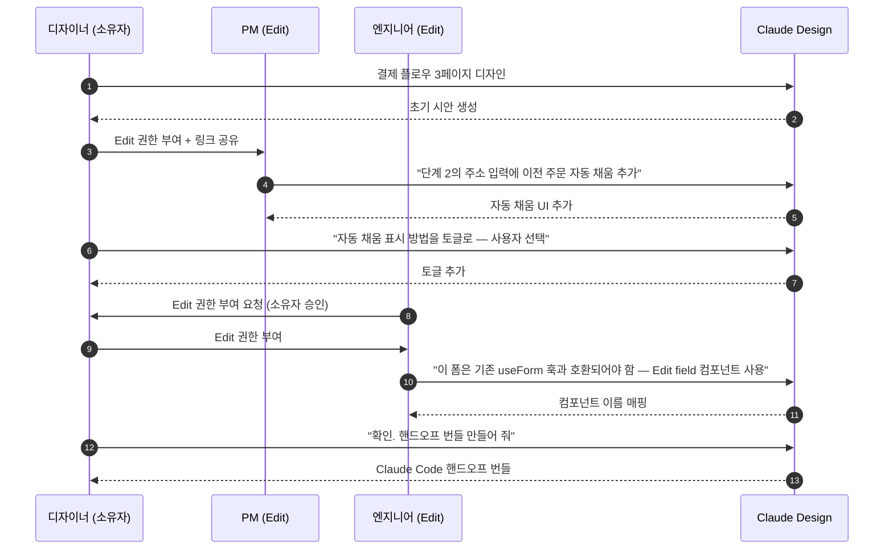

> Claude Design 문서는 **조직 범위**(Org-scoped)로만 공유됩니다. 외부 공개 링크는 없습니다. 같은 조직 내에서 디자이너·PM·엔지니어가 한 시안에서 Claude와 함께 대화하며 다듬는 구조입니다.

## 공유 모델 한눈에 보기

| 항목 | 내용 |
|---|---|
| 공유 범위 | **조직 범위** — 같은 Claude 조직의 멤버만 접근 가능 |
| 외부 공개 링크 | 없음. 외부 공유는 PDF·PPTX·HTML 내보내기 후 전달 |
| 권한 유형 | Private · View-only · Edit access (3종) |
| 그룹 대화 | 여러 멤버가 같은 문서에서 동시에 Claude와 대화 |
| 권한 변경 | 문서 소유자 또는 조직 관리자 |
| 감사 로그 | 현재 별도 audit log 미제공 (Beta 단계에서 개선 예정) |

## 권한 3종 — 상세


공유 메뉴에서 각 멤버별로 권한을 세밀하게 설정할 수 있습니다.

### Private (기본)

```
누가 볼 수 있나: 문서 소유자만
누가 수정할 수 있나: 문서 소유자만
언제 쓰나: 초기 탐색, 미완성 시안, 민감한 브랜드 작업
```

### View-only

```
누가 볼 수 있나: 링크를 받은 같은 조직 멤버
누가 수정할 수 있나: 문서 소유자만
누가 채팅할 수 있나: 없음 — 보기 전용
언제 쓰나: 리뷰·승인 회람, 발표 전 사전 공유, 외부 발송 전 내부 점검
```

### Edit access

```
누가 볼 수 있나: 링크를 받은 같은 조직 멤버
누가 수정할 수 있나: 권한받은 멤버
누가 채팅할 수 있나: 권한받은 멤버 — Claude와 함께 그룹 대화
언제 쓰나: 디자이너·PM·엔지니어가 함께 시안을 다듬을 때
```

## 그룹 대화 — 협업의 핵심

Edit access를 받은 여러 멤버가 같은 문서에서 동시에 Claude와 대화할 수 있습니다.

### 그룹 대화 흐름 예시



### 그룹 대화의 장점

- **결정 맥락이 자동 저장**: 채팅 히스토리에 "왜 사이드바 대신 탭으로 했는지" 같은 결정이 남아 핸드오프 시 Claude Code가 그대로 참고
- **여러 시각이 한 캔버스에**: PM의 비즈니스 우선순위 + 디자이너의 비주얼 + 엔지니어의 구현 제약이 같은 문서에서 충돌·합의
- **컨텍스트 스위칭 없음**: Figma·Slack·Notion 사이를 오갈 필요 없이 한 도구에서

### 그룹 대화 운영 규칙

- 동시에 여러 명이 채팅하면 **앞 메시지의 결과를 다음 메시지가 상속**합니다. 충돌이 우려되면 한 명씩 차례로 지시
- 큰 방향 전환은 **소유자 또는 디자이너 책임자가 일괄 처리**, 디테일 조정은 분산
- 새 멤버를 초대할 때 채팅 히스토리도 보이게 됩니다 — 민감 내용이 있다면 미리 정리

## 외부 공유 — 어떻게 하나

Claude Design 자체에는 외부 공개 링크가 없습니다. 외부와 공유하려면:

| 외부 공유 방법 | 결과 형식 |
|---|---|
| **PDF 내보내기** → 이메일·메신저 첨부 | 정적 PDF |
| **PPTX 내보내기** → 발표 또는 첨부 | 편집 가능한 PPTX |
| **표준 HTML 내보내기** → 사내 서버나 임시 정적 호스팅 | 자립 HTML 폴더 |
| **Canva 전송** → Canva에서 공개 링크 생성 | Canva 공유 |
| **스크린샷 캡처** → 외부 도구로 | 정적 이미지 |

자세한 형식별 절차는 [내보내기와 핸드오프](../export-handoff/) 페이지에서.

## 데이터 거버넌스

Claude Design은 업로드한 자산을 **Anthropic 엔터프라이즈 데이터 보존·삭제 정책**에 따라 저장합니다.

### Enterprise 계약 사항

| 항목 | 상태 |
|---|---|
| 데이터 보존·삭제 정책 | 다른 엔터프라이즈 Anthropic 제품과 동일 정책 적용 |
| DPA (Data Processing Agreement) | Enterprise 고객은 Anthropic Sales를 통해 서명 가능 |
| GDPR Article 28 | 데이터 처리자로서의 DPA 서명 가능 |
| 데이터 거주지(Data residency) | 현재 **미지원** — 지역 규제 데이터는 업로드 전 익명화 필요 |
| 감사 로그 | 현재 별도 audit log 미제공 |
| IP allowlist | 별도 안내 없음 |
| SSO 연동 | Anthropic 일반 SSO 정책 적용 (Claude Design 별도 기능 아님) |

### 한국 환경 메모

- **개인정보보호법(PIPA)**: 고객 개인정보·연락처·결제정보가 포함된 자산은 익명화 또는 더미 데이터로 치환 후 업로드
- **금융·의료 규제 데이터**: 데이터 거주지 미지원이므로 규제 자산 업로드는 권장하지 않음
- **저작권**: 외부 폰트·이미지를 자산으로 올릴 때 라이선스 확인

## 권한 관리 — 모범 사례

### 신규 멤버 초대

```
시점: 큰 방향이 잡힌 뒤 (1라운드 리파인먼트 후)
권한: View-only로 시작 → 적극 참여 의사 확인 시 Edit로 승격
초대 시 안내: "이 문서 채팅 히스토리에 [브랜드/제품] 정보 포함됨"
```

### 권한 회수

```
시점: 프로젝트 종료, 핸드오프 완료, 멤버 퇴사
방법: 문서 상세 → Share 메뉴 → 해당 멤버 권한 해제
멤버 퇴사 시: 조직 관리자가 일괄 해제 (계정 자체 비활성화)
```

### 민감 작업

```
- Private로 시작
- 핵심 시안이 잡히면 디자인 리드 1명에게만 View-only 추가
- 발표·승인 단계에서 결정권자에게 View-only
- 절대 Edit access 광범위 부여 금지
```

## 자주 겪는 실수 — 협업 측면

| 실수 | 증상 | 복구 |
|---|---|---|
| 초대 시 채팅 히스토리에 민감 정보 노출 | 의도치 않은 정보 공유 | 초대 전 채팅을 정리하거나 새 프로젝트로 분기 |
| Edit access를 전사 광범위 부여 | 충돌·예상치 못한 수정 | View-only 기본, Edit는 최소 인원 |
| 외부 공유를 위해 PDF 미내보내고 스크린샷만 | 인터랙티브 요소 손실 | HTML 내보내기로 인터랙티브 보존 |
| 그룹 대화에서 동시에 큰 방향 전환 요청 | 결과가 흐트러짐 | 큰 방향은 한 명, 디테일은 분산 |
| 외부에 공개 링크 요구가 들어옴 | 기능이 없음을 모르고 약속 | PDF·HTML 내보내기 + 사내 게시판 |

## Cowork·Slack과의 연동

직접 통합은 아니지만 결과물을 다음 경로로 흘릴 수 있습니다.

| 결과 → 도착지 | 방법 |
|---|---|
| Claude Design → Slack | PDF·이미지 내보낸 후 Slack 업로드 (Cowork의 Slack 커넥터 활용 가능) |
| Claude Design → Notion | PDF·PPTX 첨부 또는 HTML 임베드 |
| Claude Design → Google Drive | 내보낸 파일을 Cowork에서 Drive 커넥터로 업로드 |
| Claude Design → 사내 LMS·인트라넷 | 표준 HTML 내보내기 후 호스팅 |

Cowork에서 Slack·Drive·Notion 커넥터로 자동 업로드하려면 [Cowork 커넥터·MCP 가이드](../../cowork/connectors-mcp/) 참고.

## 다음 단계

- **다음 페이지**: [내보내기와 핸드오프](../export-handoff/) — Canva·PPTX·HTML·Claude Code 핸드오프 6가지 경로
- 참고: [요금제·한도](../pricing-limits/) — RBAC·관리자 절차
- 깊이: [제한 사항](../limitations/) — Beta 단계에서 계속 보강되는 거버넌스 기능

---

### Sources

- [Claude Design admin guide for Team and Enterprise plans](https://support.claude.com/en/articles/14604406-claude-design-admin-guide-for-team-and-enterprise-plans)
- [Introducing Claude Design by Anthropic Labs](https://www.anthropic.com/news/claude-design-anthropic-labs)
- [Using Claude Design for prototypes and UX (Anthropic Tutorial)](https://claude.com/resources/tutorials/using-claude-design-for-prototypes-and-ux)
- [Claude Design Starter Guide (Claudia + AI)](https://claudiaplusai.substack.com/p/claude-design-starter-guide-and-examples)
