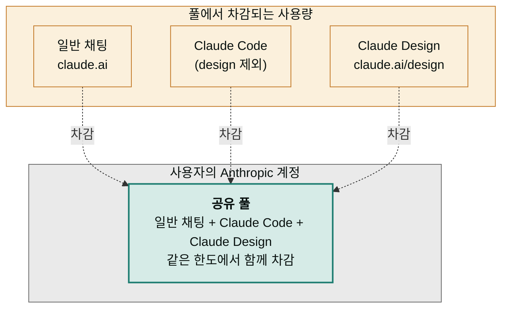
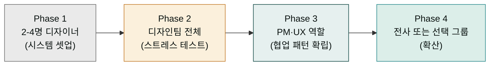

> Claude Design은 **공유 풀**(chat·Claude Code와 동일한 한도에서 차감)에서 사용량을 계산합니다. 별도 할당량은 없습니다. 따라서 Claude Design 사용이 늘면 일반 채팅 한도가 줄어듭니다. Extra usage를 활성화하면 한도 초과분도 계속 사용 가능합니다. 다만 디자인 시스템 생성과 큰 프로젝트는 토큰을 빠르게 소비합니다.

## 플랜별 요약

| 플랜 | Claude Design 접근 | 한도 메커니즘 | Extra usage | 비고 |
|---|---|---|---|---|
| Free | ✗ | — | — | — |
| Pro | ✓ | 공유 풀(chat·Claude Code와 동일) | 옵션 활성화 시 가능 | — |
| Max | ✓ | 공유 풀(chat·Claude Code와 동일, Pro보다 큼) | 옵션 활성화 시 가능 | — |
| Team | ✓ | 공유 풀(멤버별 + 조직 합산) | 옵션 활성화 시 가능 | — |
| Enterprise | ✓ (기본 OFF) | 공유 풀(조직 단위, 관리자 활성화 필요) | 옵션 활성화 시 가능 | — |


정확한 한도 수치는 Anthropic이 공개하지 않으며 Beta 단계에서 변동될 수 있습니다. 한도 변화는 [공식 도움말](https://support.claude.com/en/articles/14604406-claude-design-admin-guide-for-team-and-enterprise-plans)을 주기적으로 확인하세요.


## 공유 풀 메커니즘 (과거 별도 쿼터에서 변경됨)

Claude Design은 **일반 채팅·Claude Code와 동일한 공유 풀**에서 사용량을 차감합니다. 별도 할당량은 없습니다 (2026년 6월 정책 변경).



**중요**: Claude Design 사용량이 늘면 일반 채팅 한도가 줄어듭니다. 같은 풀이기 때문입니다. 한도를 초과하면 Extra usage를 활성화해야 계속 사용 가능합니다.

## 무엇이 쿼터를 빠르게 소비하나

| 활동 | 토큰 소비량 |
|---|---|
| 디자인 시스템 자체 생성 (자산 분석 + UI 키트 추출) | **매우 큼** |
| 큰 코드베이스 ingestion (수천 컴포넌트) | 큼 |
| 큰 PPTX·PDF 업로드·변환 | 중간 |
| 텍스트 프롬프트 + 디자인 시스템 적용 | 보통 |
| 인라인 코멘트·텍스트 편집 | 작음 |
| 조정 노브 사용 | 매우 작음 |

**가장 비싼 작업**: 디자인 시스템 자체 생성. 그래서 한 번 잘 만들고 Published 상태로 유지하는 게 중요합니다.

## Pro · Max — 개인 가입자

```
대상: 개인 디자이너·창업자·PM
활성화: 자동 — claude.ai/design로 접근하면 사용 가능
한도: 별도 주간 쿼터 (구체적 수치 비공개)
초과 시: Extra usage 옵션을 켜면 추가 사용 가능 (요금 별도)
```

**일반적 사용량 추정** (사용자 보고 기반):
- 1 디자인 시스템 생성
- 2-3 원페이저
- 1 피치덱
- 1 비디오 콘텐츠
- → 주간 쿼터 도달 → 다음 주 리셋 또는 Extra usage

## Team — 소규모 조직

```
대상: 5-50명 규모 팀
활성화: 자동 — 조직 멤버는 즉시 사용 가능
한도: 멤버별 한도 + 조직 합산
관리자 기능:
- 사용 현황 모니터링 (현재 제한적)
- Extra usage 활성화 결정
- 멤버 추가·삭제
```

## Enterprise — 대형 조직

Enterprise는 **기본 OFF**입니다. 관리자가 명시적으로 활성화해야 멤버가 사용 가능합니다.

### 활성화 절차

```
1. Anthropic 콘솔 로그인 (admin 계정)
2. Organization settings 진입
3. Capabilities 섹션으로 이동
4. Anthropic Labs 카테고리 펼침
5. Claude Design 토글 ON
6. (선택) 커스텀 역할로 접근 권한 세분화
```

### RBAC 단계적 롤아웃 — 권장 4단계



각 단계 사이에 1-2주 관찰 기간을 두는 것을 권장합니다.

### Enterprise 사용량제 크레딧 — 가용성 확인 필요

```
대상: Enterprise usage-based pricing 고객
크레딧: 도입 시점에 따라 다름 (과거: 약 20 프롬프트)
만료: 시점에 따라 상이 — 최신 정보는 Anthropic Sales 문의
적용: 자동 — 별도 신청 불필요
```

크레딧은 평가·도입 결정용입니다. 본격 도입 후에는 통상 사용량 정책이 적용됩니다. 정확한 크레딧 규모와 만료일은 Anthropic과 계약 시 협상되므로, 영업 팀에 문의하세요.


Enterprise 조직의 관리자는 Anthropic 콘솔에서 Claude Design 기능을 활성화하고 멤버의 접근 권한을 제어할 수 있습니다.

### 커스텀 역할 설계 예시

| 역할명 | 권한 | 대상 |
|---|---|---|
| Design System Admin | 시스템 생성·수정·Published 토글 | 디자인 시스템 책임자 1-2명 |
| Design User | 프로젝트 생성·공유, 시스템 사용 (수정 X) | 디자이너·PM·마케터 |
| Reviewer | View-only 권한만 받음, 채팅 불가 | 임원·외부 검토자 |
| No Access | Claude Design 비활성 | 사용 안 하는 부서 |

## Extra usage 옵션

별도 쿼터를 초과해도 작업을 계속하려면 **Extra usage**를 활성화합니다.

```
설정 위치: 계정 또는 조직 설정의 사용량 섹션
효과: 한도 초과분에 대해 추가 요금이 청구되며 작업 계속 진행
관리자 통제: Team·Enterprise는 관리자가 비활성화 가능 — 한도 도달 시 작업 중단
권장 운영: 분기 또는 월 단위로 한도·실제 사용량 모니터링 → Extra usage 활성/비활성 조정
```


**Extra usage를 켜둔 채 모니터링 없이 운영하면 예상치 못한 청구가 발생할 수 있습니다.** Team·Enterprise에서는 사용량 알림을 설정하거나 정기 점검 일정을 잡으세요. 사용량 대시보드 자체가 아직 제한적인 점도 고려.


## 한국 결제·운영 환경 메모

| 항목 | 메모 |
|---|---|
| **결제 통화** | USD 기준. 환율 변동에 따른 원화 청구 차이 가능 |
| **카드 결제** | 해외 결제 가능 카드 필요 (대부분 글로벌 신용카드 OK) |
| **세금** | VAT 별도 부과 (사업자 등록 시 사업자 정보 등록 가능) |
| **법인 결제** | Team 이상 플랜에서 법인 카드·송장 결제 옵션 (Sales 문의) |
| **데이터 거주지** | 현재 미지원 — 한국 데이터 거주지 요구가 있으면 사용 제한 |
| **고객지원 언어** | 영문 중심 (지원 티켓·도움말). 한국어 대응은 제한적 |
| **사업자 등록 활용** | Team·Enterprise 가입 시 사업자등록증 제출하면 세금 처리 간소화 |

## 사용량 추적 — 현재 제약

| 기능 | 상태 |
|---|---|
| 멤버별 사용량 대시보드 | 제한적 (Beta 단계) |
| 감사 로그 (누가 무엇을 만들었나) | 미제공 |
| 프로젝트별 토큰 사용량 | 미제공 |
| 사용량 알림 (특정 임계치 도달 시) | 미제공 |
| API 사용량 조회 | 미제공 (Claude Design 자체에 외부 API 없음) |

운영을 위한 임시 대책:
- 분기마다 샘플 프로젝트를 검토해 사용 패턴 파악
- 사내 슬랙·노션에 "Claude Design 작업 로그" 채널 만들어 자율 보고
- 한도 도달 시 멤버가 즉시 보고하도록 안내

## 도입 결정 — Yes/No 체크리스트

다음 조건에 해당하면 도입을 강력히 추천합니다.

```
✓ 디자이너 0-2명 또는 디자인 백로그가 항상 가득
✓ 매주 비주얼 산출물(피치덱·랜딩·SNS·와이어프레임)이 필요
✓ Claude Code를 이미 쓰고 있음 (핸드오프 효과 극대화)
✓ 기존 디자인 시스템이 있음 (또는 시스템 만들 시간이 있음)
✓ 외부 발송용 자료가 많음 (Canva·PPTX·PDF로 출력)
```

다음 조건이면 도입을 보류·검토하세요.

```
✗ 데이터 거주지 규제가 엄격한 산업(의료·금융·정부)
✗ 디자인 시스템이 매우 정교하고 Figma·Storybook으로 잘 운영 중
✗ 3D·음성·비디오 같은 프론티어 영역 위주 (아직 약함)
✗ 전사 SSO·감사 로그가 엄격하게 요구되는 환경
```

## 다음 단계

- **다음 페이지**: [제한 사항과 로드맵](../limitations/) — Beta 단계 현재 상태 정리
- 참고: [협업·공유](../collaboration/) — 권한 모델
- 깊이: [베스트 프랙티스](../best-practices/) — 조직 운영 체크리스트

---

### Sources

- [Get started with Claude Design (Support)](https://support.claude.com/en/articles/14604416-get-started-with-claude-design) — 공유 쿼터 설명, beta 상태
- [Claude Design admin guide for Team and Enterprise plans](https://support.claude.com/en/articles/14604406-claude-design-admin-guide-for-team-and-enterprise-plans)
- [Introducing Claude Design by Anthropic Labs](https://www.anthropic.com/news/claude-design-anthropic-labs) — 출시 발표
- [Claude Design: Complete Guide for Non-Designers (BuildFastWithAI)](https://www.buildfastwithai.com/blogs/claude-design-anthropic-guide-2026)
- [Using Claude Design for prototypes and UX (Anthropic Tutorial)](https://claude.com/resources/tutorials/using-claude-design-for-prototypes-and-ux)
