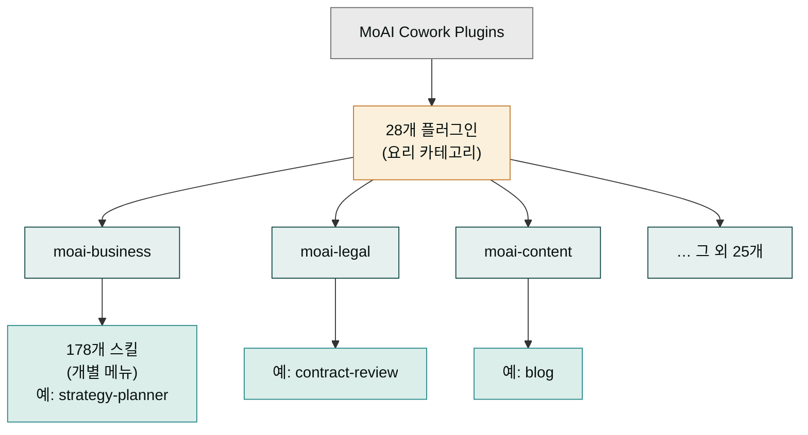
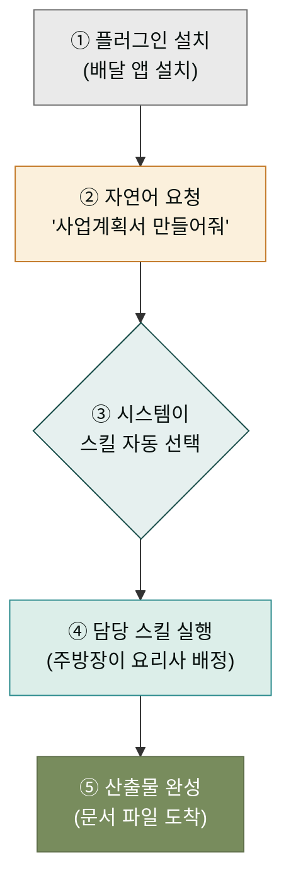

MoAI Cowork Plugins은 28개의 플러그인과 178개의 스킬로 구성된 Claude Cowork 전용 플러그인 제품군입니다. 이 가이드는 설치부터 첫 작업까지 세 가지 경로를 통해 빠르게 시작하는 방법을 안내합니다.

## 플러그인과 스킬: 큰 음식점의 메뉴 구조

큰 음식점에 들어서면 먼저 한식·중식·양식 같은 큰 코너가 눈에 들어옵니다. 그 코너 안에 가 보면 비빔밥·된장찌개·불고기처럼 개별 메뉴가 줄지어 있습니다. 손님은 "된장찌개 주세요"라고 메뉴 하나만 말하면 되고, 어느 코너 요리사가 만들지는 주방이 알아서 정합니다. MoAI Cowork Plugins도 이 구조와 같습니다.

여기서 **플러그인**(plugin)은 한식·중식·양식 같은 '요리 카테고리(코너)'입니다. 비즈니스·법무·콘텐츠·재무 같은 큰 분야를 묶어둔 단위로, 28개가 있습니다. **스킬**(skill)은 그 코너 안의 '개별 메뉴'입니다 — 사업계획서 쓰기, 계약서 검토하기, 블로그 원고 작성하기 같은 구체적인 일 하나하나가 스킬이며, 28개 코너 안에 모두 178개의 메뉴가 들어 있습니다.

사용자가 할 일은 메뉴 하나를 말하는 것뿐입니다. "사업계획서 만들어줘"라고 입력하면 시스템이 그 메뉴가 속한 코너(플러그인)와 담당 요리사(스킬)를 스스로 찾아 배정합니다. 메뉴판을 전부 외우거나 코너를 직접 고를 필요는 없습니다. 이때 시스템이 한 번에 읽어 들일 수 있는 주문서 분량의 한도를 **토큰**(token)이라고 부릅니다 — 토큰이 많을수록 더 긴 문맥을 기억하지만 비용도 커지므로, 스킬 설계는 처음엔 가볍게·필요할 때만 깊이 불러오도록 되어 있습니다.

## 사용자 여정: 한 줄 요청이 산출물이 되기까지

배달 앱으로 음식을 시키는 흐름을 떠올려 보세요. (1) 앱을 설치하고 → (2) "오늘 저녁엔 된장찌개"라고 주문을 넣으면 → (3) 주방장이 알아서 담당 요리사를 배정하고 → (4) 완성된 요리가 도착합니다. 요리법을 알 필요도, 누가 만들지 지정할 필요도 없습니다. MoAI Cowork Plugins에서 문서를 만드는 과정도 똑같이 흘러갑니다.

먼저 **플러그인을 설치**합니다(앱 설치). 그다음 대화창에 **자연어로 한 줄 요청**을 넣습니다 — "사업계획서 만들어줘"처럼 일상적인 말로 충분합니다. 시스템은 요청을 읽고 178개 메뉴 중 가장 알맞은 **스킬을 자동으로 선택**해 배정합니다(주방장의 요리사 배정). 마지막으로 스킬 본문이 실행되며 **문서 산출물**이 완성됩니다. 사용자는 요리법을 몰라도, 어느 스킬이 돌아가는지 몰라도 결과물을 받게 됩니다.

## 학습 경로

이 가이드는 **설치 → 빠른 시작(전체 조망) → 첫 작업(실습)** 순으로 진행하는 것을 권장합니다. 먼저 설치를 마치고, 빠른 시작에서 전체 동선과 대표 스킬을 한눈에 살펴본 뒤, 첫 작업에서 IR 덱 생성 실습으로 직접 손에 익히는 동선이 초보자에게 가장 자연스럽습니다.

아래 다이어그램은 사용자가 한 줄을 입력한 순간부터 산출물이 나오기까지 시스템 안에서 일어나는 일의 흐름을 보여줍니다. 앱 설치 → 자연어 주문 → 시스템의 스킬 자동 선택 → 결과물 도착까지, 배달 앱 주문과 같은 흐름입니다.

### 1. 설치 가이드
Claude Desktop에 MoAI Cowork Plugins을 설치하는 전체 과정을 단계별로 상세히 설명합니다.

### 2. 빠른 시작
설치 완료 후 즉시 사용할 수 있는 주요 스킬과 사용 패턴을 한눈에 숙지할 수 있습니다. 전체 동선과 대표 스킬을 먼저 조망한 뒤 실습으로 들어가면 훨씬 수월합니다.

### 3. 첫 작업
5분 만에 완료할 수 있는 실습 예제를 통해 IR 덱 생성 워크플로우를 직접 체험합니다.

**IR 덱(IR Deck)이란?** 기업이 투자를 받을 때 투자자에게 보여주는 발표 자료입니다. "우리 회사가 왜 투자 가치가 있는지, 돈을 받아 무엇을 할지"를 슬라이드 몇 장으로 정리한 일종의 사업 소개서 겸 자기소개서라고 생각하면 됩니다. 스타트업이 투자 유치를 준비할 때 가장 먼저 만들게 되는 핵심 문서라 첫 실습 주제로 자주 쓰입니다.

## 기대 효과

이 가이드를 따라 진행하면 다음과 같은 경험을 하게 됩니다:

- 🚀 **빠른 설치**: 5분 이내에 전체 환경 구축 완료
- 🎯 **실무 활용**: 실제 비즈니스 문제 해결에 바로 적용 가능
- 📊 **생산성 향상**: 반복적인 작업을 자동화하여 업무 효율 극대화
- 🔧 **확장성**: 다양한 도메인별 스킬을 조합한 맞춤형 워크플로우 구축

## 다음 단계

각 섹션의 상세 가이드를 따라 진행하시면 MoAI Cowork Plugins의 모든 기능을 완벽하게 활용하실 수 있습니다.

- [설치 가이드](install/) - Claude Desktop에 플러그인 설치하기
- [빠른 시작](quick-start/) - 전체 동선과 주요 스킬 한눈에 숙지하기
- [첫 작업](first-task/) - IR 덱 생성 체험하기

### Sources
- GitHub 저장소: [https://github.com/modu-ai/cowork-plugins](https://github.com/modu-ai/cowork-plugins)
- 온라인 문서: [https://cowork.mo.ai.kr](https://cowork.mo.ai.kr)
