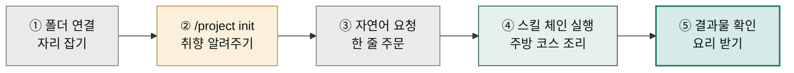
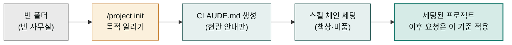
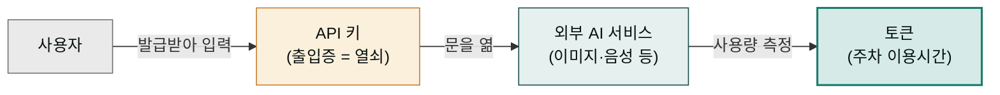
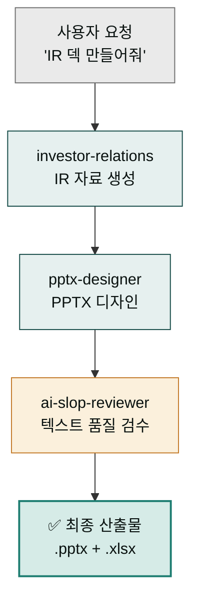
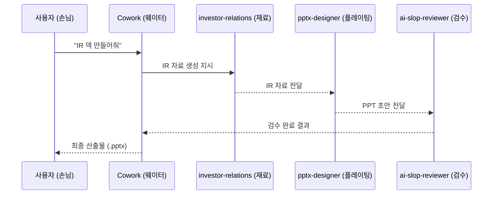

이 가이드는 MoAI Cowork Plugins을 사용하여 실제 비즈니스 문제를 해결하는 전체 과정을 약 5-7분에 체험할 수 있도록 설계되었습니다. **전제 조건**: [설치](../install/)와 플러그인 활성화가 이미 완료된 상태. Series A IR 덱을 생성하는 전체 워크플로우를 직접 경험해 보세요.

## 전체 흐름 한눈에 보기

"IR 덱을 5분에 만든다"는 약속이 무엇을 의미하는지, 막상 시작하려면 막막할 수 있습니다. 사용자가 직접 하는 일은 의외로 적습니다. 전체 여정은 크게 다섯 단계로 이어지는데, 외식 예약에 빗대어 생각하면 한눈에 들어옵니다.

먼저 **빈 폴더를 연결**합니다(자리 잡기). 그다음 **`/project init`으로 프로젝트 목적을 알려줍니다**(점원에게 취향 알려주기). 이어서 **자연어로 한 줄 요청을 던집니다**(메뉴 한 줄로 주문하기). 그러면 시스템이 **스킬 체인을 자동으로 실행**하고(주방에서 코스 요리를 차례로 조리), 마지막으로 **완성된 파일을 받아 확인**합니다(요리 받아보기). 사용자가 실제로 타이핑하는 것은 init 한 줄과 요청 한 줄뿐이고, 그 사이의 무거운 작업은 Cowork가 알아서 처리합니다.

여기서 **스킬 체인**(skill chain)이란 여러 전문 스킬이 한 방향으로 이어져 각자의 결과를 다음 단계로 넘기는 연결선을 말합니다. IR 덱의 경우 `investor-relations` 셰프가 자료를 다듬고 → `pptx-designer`가 PPT로 플레이팅하고 → `ai-slop-reviewer`가 맛보기 검수로 마무리하는 식입니다. 손님은 메뉴를 고르고 주문만 하면, 그 사이 주방이 알아서 하나의 코스를 완성합니다. 아래 다이어그램은 이 다섯 단계를 순서대로 보여줍니다.



각 단계에서 "사용자가 하는 일"과 "시스템이 하는 일"이 명확히 나뉩니다. 1·3단계는 사용자가 직접 손을 움직이고, 2단계는 질문 3개에 답하는 정도, 4단계는 사용자가 개입할 필요 없이 자동으로 진행됩니다. 이 분업 덕분에 5-7분 안에 결과물까지 도달할 수 있습니다.

## 목표

**약 5-7분 안에 완료할 수 있는 작업** (설치·플러그인 활성화 이미 완료 전제):
- SaaS Series A IR 덱 초안 생성
- 전문가 스킬 체인 자동 실행
- 결과물 파일로 확인

## 실행 절차

### 1단계: 프로젝트 생성 및 폴더 연결


**준비물**: 시스템에 Claude Desktop이 설치되어 있고, 작업할 빈 폴더가 필요합니다.


1. 새 폴더를 생성하고 Claude Desktop에 연결
2. Cowork 모드에서 해당 폴더 선택
3. 새 프로젝트가 생성되었음을 확인

### 왜 폴더 연결과 init이 필요한가

"빈 폴더를 연결하라"는 말은 명령은 있지만 이유가 없습니다. 왜 폴더를 연결해야 하고, 왜 `init`을 한 번 해야 하는지를 이해하면 이후 단계가 자연스럽게 이어집니다. 새 사무실에 입주하는 일에 비유해 보겠습니다.

먼저 **빈 폴더를 연결**하는 일은, 빈 사무실 열쇠를 받는 것과 같습니다. 아직 아무것도 세팅되지 않은 빈 공간입니다. 여기에 **`/project init`**으로 "우린 투자 관련 일 하는 팀이야"라고 알려주면, Cowork가 알아서 사무실에 맞는 비품을 세팅합니다. 산출물별로 쓸 **스킬 체인**(책상에 비유)을 갖춰두고, **CLAUDE.md**(현관 안내판에 비유)라는 한 장의 사용 설명서를 작성해 둡니다.

여기서 핵심은 **CLAUDE.md**입니다. 이 파일은 "이 사무실이 어떤 일을 하는가"를 적어둔 현관 안내판 역할을 합니다. init 한 번으로 자동 작성되며, 그 뒤로 이 사무실로 들어오는 모든 요청은 이 안내판을 기준으로 처리됩니다. 그래서 폴더를 연결하고 init을 한 번만 하면, 다음부터는 "IR 자료 써줘" 한 줄만 던져도 이 팀에 맞는 결과가 나옵니다. 매번 취향을 다시 알려줄 필요가 없는 이유입니다. 아래는 빈 폴더에서 init 한 번으로 "세팅된 프로젝트"가 만들어지는 흐름입니다.



### API 키와 토큰 — 초보자를 위한 짧은 사전

`/project init`을 진행하다 보면 Phase 6에서 **"API 키 등록(조건부)"**이라는 단계가 나옵니다. 여기서 처음 막히는 분이 많습니다. "API 키가 뭔데, 어디서 구하면 되지?"라는 질문이 생기는데, 본문 어디에도 설명이 없기 때문입니다. 짧게 짚고 넘어가겠습니다.

**API 키**는 멤버십 카페의 출입증에 비유하면 한눈에 들어옵니다. 카페(이미지·음성·문서 같은 외부 AI 서비스)에 들어가려면 "나는 정식 가입자다"를 증명하는 출입증 번호가 필요합니다. 이 출입증은 카페 홈페이지(서비스 제공사의 웹사이트)에서 직접 발급받아야 합니다. Cowork가 대신 발급해주지 않습니다. 따라서 API 키는 "문을 여는 열쇠"라고 생각하면 됩니다.

**토큰**은 출입증 그 자체가 아니라, 출입증을 찍고 들어간 뒤 "오늘 몇 시간까지 머물렀나"를 재는 단위입니다. 주차장 이용 시간과 비슷합니다. API 키로 문을 열어 서비스를 쓰고, 토큰은 그 서비스를 얼마나 썼는지를 측정합니다. 본 가이드의 다른 글에서 "약 100 토큰", "약 5,000 토큰"이라는 표현이 나오는데, 이는 "컴퓨터가 한 번에 읽는 텍스트 분량이 약 이만큼이다"를 뜻합니다. 즉 **API 키는 "누가 쓰는가"를 증명하는 것이고, 토큰은 "얼마나 썼는가"를 재는 것**입니다. 둘은 다릅니다.

그래서 Phase 6이 "조건부"인 것입니다. IR 덱 시나리오는 PPT와 텍스트를 다루기 때문에 별도의 API 키 없이 진행되지만, 이미지 생성(Higgsfield)이나 음성 합성(ElevenLabs) 같은 외부 서비스를 쓰는 플러그인을 선택했다면 그때만 해당 서비스 웹사이트에서 발급받은 키를 한두 번 입력하게 됩니다. 아래 다이어그램은 API 키와 토큰이 각각 무슨 역할을 하는지 정리합니다.



### 2단계: 프로젝트 초기화

`/project init` 뒤에 한 줄 자연어로 프로젝트 목적을 함께 알려주면 인터뷰가 더 정확해집니다:


> /project init "SaaS IR Deck Project 초기화 진행!!"


`/project init`은 **7 Phase 워크플로우**로 동작합니다(총 2-3분, AskUserQuestion 최대 6회). 이 중 사용자가 직접 답하는 인터뷰는 **Phase 1의 3질문**뿐이며, 나머지 Phase는 자동으로 진행됩니다.

| Phase | 동작 | 사용자 입력 |
|---|---|---|
| 1. 워크플로우 인터뷰 | 업무 유형·산출물·톤 3질문 | **3회 (필수)** |
| 2. 플러그인 자동 감지 | 설치된 moai-* 스캔 + Phase 1 답변 매칭 | 자동 |
| 3. 스킬 체인 설계 | 산출물별 실행 파이프라인 설계 | 자동 |
| 4. 설계 확인 | 체인 설계 승인/수정/취소 | 1회 |
| 5. CLAUDE.md 생성 | 템플릿(≤200라인) + 스킬 체인 주입 | 자동 |
| 6. API 키 등록 (조건부) | 선택된 플러그인에 필요한 키만 | 조건부 1-2회 |
| 7. 첫 실행 안내 | 설계된 체인 기반 예시 3개 제시 | 자동 |

**Phase 1 인터뷰 — 실제 질문과 선택지** (IR 덱 시나리오 기준 권장 답변):

**Q1. 이 프로젝트에서 어떤 일을 하시나요?** (복수 선택)

- ☑ **사업 기획·전략** — 사업계획서, 시장조사, IR, 투자제안서 ← 선택
- ☐ 콘텐츠 제작 — 블로그, 카드뉴스, 뉴스레터, SNS
- ☐ 문서·행정 — PPT, 한글, Word, Excel, 공문
- ☐ 제품·연구 — PM 문서, UX 리서치, 논문, 특허
- *(+ Other 자유 입력 가능)*

**Q2. 주로 만드는 산출물은 무엇인가요?** (자유 입력)

> 예시 답변: `"Series A 피칭 IR 덱(PPT), 시장 분석 리포트, 투자자 Q&A 자료"`

**Q3. 특별히 지키고 싶은 톤·형식이 있나요?**

- ☑ **산업별 전문 용어 사용** (법률·의료·금융·기술) ← 선택
- ☐ 공식·격식체 유지 (관공서·기업 보고)
- ☐ 캐주얼·대화체 (SNS·블로그·콘텐츠)
- ☐ 제약 없음 — 그때그때 지정

**Phase 4 — 설계 확인** (예시):

```
이 프로젝트의 실행 체인 설계

[주 산출물 1] IR 피칭덱
  체인: investor-relations → pptx-designer → ai-slop-reviewer
  트리거 예시: "IR 자료 써줘"

[보조 산출물 2] 시장조사 리포트
  체인: market-analyst → docx-generator → ai-slop-reviewer

위 스킬 체인 설계로 CLAUDE.md를 생성하시겠습니까?
  ○ 승인 (권장)
  ○ 수정
  ○ 취소
```


**자동 매칭**: Phase 1에서 "사업 기획·전략"을 선택하면 `moai-business`(strategy-planner·investor-relations)와 `moai-office`(pptx-designer)가 자동 매칭되고, 텍스트 산출물 체인 끝에 `ai-slop-reviewer`가 자동 부착됩니다. 스킬을 직접 선택할 필요는 없습니다.



**이름·회사·역할은 묻지 않습니다**(v1.3.0+). 글로벌 프로필 시스템이 제거되어 인터뷰는 "이번 프로젝트에서 뭘 어떻게 할지"에만 집중합니다. 필요하면 생성된 CLAUDE.md를 직접 편집하세요.


### 3단계: 첫 작업 요청

자연어로 Series A IR 덱 생성을 요청합니다. **본 문서의 모든 사용자 입력은 `> ` prefix와 함께 표기**합니다(실제 대화창에는 `>` 없이 본문만 입력하면 됩니다 — [표기 규약 자세히](../../cowork/skills/#스킬-호출-방식)).


> "SaaS Series A IR 덱 초안 만들어줘"



프로젝트가 준비되면 자연어로 원하는 작업을 요청합니다.

**요청 상세 내용**:
- 비즈니스 모델: SaaS 플랫폼
- 투자 단계: Series A
- 대상 투자사: 벤처 캐피털
- 포함 내용: 시장 분석, 재무 모델, 성장 전략

### 4단계: 스킬 체인 자동 실행

한 줄 요청이 어떻게 세 스킬의 순차 실행으로 바뀌는지를 이해하면, 결과물이 왜 이 흐름으로 나오는지 보입니다. 프랜차이즈 주방의 **콜벨트**에 비유해 보겠습니다.

손님이 "IR 덱 하나요" 하고 주문을 외치면(자연어 요청), 그 주문표가 주방으로 넘어가 세 명의 전문 요리사에게 차례로 전달됩니다. 첫 요리사(`investor-relations`)가 IR 재료를 다듬어 접시에 올리면 → 두 번째 요리사(`pptx-designer`)가 그 접시를 받아 PPT 디자인으로 플레이팅하고 → 세 번째 요리사(`ai-slop-reviewer`)가 맛보기 검수로 마무리합니다. 손님은 한 번 주문했을 뿐인데, 세 요리사가 각자의 결과물을 다음 사람에게 건네며 하나의 완성된 코스를 만듭니다.

여기서 중요한 점은 **앞 스킬의 결과가 뒷 스킬의 입력이 된다**는 것입니다. investor-relations가 만든 IR 자료가 없으면 pptx-designer는 디자인할 내용이 없고, pptx-designer의 결과물이 없으면 ai-slop-reviewer는 검수할 대상이 없습니다. 이렇게 한 방향으로 흐르는 연결을 **파이프라인**(pipeline)이라 부릅니다. 아래 다이어그램은 이 콜벨트 흐름을 보여줍니다.

요청을 받은 MoAI가 자동으로 전문 스킬 체인을 실행합니다:



위 흐름을 **시간 순서로 보면** 더 명확해집니다. 손님이 웨이터에게 "오늘 코스로 하나요"라고 한마디하면(자연어 요청), 웨이터가 주방에 "코스 1명"이라고 전하고(체인 해석), 세 요리사가 앞사람이 끝난 자리에서 바로 이어받아 각자의 접시를 다음 사람에게 넘깁니다. 손님은 한 번만 말했을 뿐인데 시간이 지나면 완성된 코스가 나옵니다. 아래 시퀀스는 "누가 누구에게 언제 메시지를 넘기는지"를 시간 축으로 보여줍니다.



1. **investor-relations 스킬** 실행:
   - 투자자 대상 IR 자료 생성
   - 시장 분석 및 경쟁사 대비 분석
   - 재무 모델 및 성장 지표 설정

2. **pptx-designer 스킬** 실행:
   - 생성된 내용을 기반으로 PPTX 디자인
   - 전문적인 IR 덱 레이아웃 적용
   - 데이터 시각화 및 차트 생성

3. **ai-slop-reviewer 스킬** 실행:
   - 전체 텍스트 품질 검수
   - AI 생성 패턴 검증 및 개선
   - 최종 결과물 다듬기


**스킬 체인**: 세 개의 전문 스킬이 순차적으로 실행되어 고품질의 결과물을 생성합니다. 각 스킬은 특정 도메인의 전문성을 가집니다.


### 5단계: 결과물 확인

작업이 완료되면 다음과 같이 결과물을 확인할 수 있습니다:


스킬 체인의 모든 단계가 완료되면 최종 IR 덱 파일이 생성되고, 프로젝트 폴더에서 바로 확인할 수 있습니다.

#### 생성된 파일
- `SaaS_Series_A_IR_Deck.pptx` - 최종 IR 덱 파일
- `analysis_report.md` - 분석 보고서
- `financial_model.xlsx` - 재무 모델 파일

#### 결과물 품질
- **전문적 구조**: Series A 투자 표준에 맞는 구조
- **데이터 시각화**: 그래프와 차트를 통한 명확한 데이터 전달
- **투자자 중심**: 투자사의 관심사를 반영한 내용
- **브랜딩**: 일관된 디자인 및 톤앤매너

## 실제 화면 예시


**스크린샷**: 실제 실행 시 화면은 Claude Desktop의 Cowork 모드에서 확인할 수 있습니다. 각 스킬 실행 시 진행 상황이 실시간으로 표시됩니다.


### 실행 전 상태
- 프로젝트 폴더: 비어있음
- 활성 스킬: 없음
- 생성 파일: 없음

### 실행 중 상태
- 스킬 체인 실행 표시
- 진행률: investor-relations → pptx-designer → ai-slop-reviewer
- 실시간 로그 표시

### 실행 후 상태
- 최종 파일: `SaaS_Series_A_IR_Deck.pptx`
- 파일 크기: 약 15-20MB
- 완료 메시지: "IR 덱 생성이 완료되었습니다!"

## 성공 요소

### 왜 이 방식이 효과적인가?

1. **전문성**: 각 스킬이 특정 도메인의 전문성을 제공
2. **자동화**: 수동 단계 없이 자동으로 최종 결과물 생성
3. **품질 보증**: ai-slop-reviewer로 고품질 결과물 보장
4. **일관성**: 표준화된 템플릿과 프로세스 적용

### 비교 표

| 방식 | 시간 | 품질 | 전문성 | 자동화 |
|------|------|------|--------|--------|
| 수동 제작 | 2-3일 | 중간 | 제한적 | 낮음 |
| 일반 AI 도구 | 30분 | 중간 | 일반적 | 중간 |
| **MoAI 체인** | **5분** | **높음** | **전문적** | **완전 자동** |

## 확장 활용

이 체인을 응용하여 다양한 작업을 자동화할 수 있습니다:

### 다양한 유형의 IR 덱
- Pre-seed 덱: 초기 단위 투자 대상
- Series B 덱: 성장 단계 투자
- IPO 준비 덱: 상장 준비 자료

### 다른 스킬 체인
- 블로그 생성: `blog` → `ai-slop-reviewer` → `higgsfield-image`
- 사업 계획서: `strategy-planner` → `pptx-designer` → `ai-slop-reviewer`
- 랜딩 페이지: `copywriting` → `landing-page` → `ai-slop-reviewer`

## 다음 단계

첫 작업을 성공적으로 완료했다면 이제 더 깊은 기능을 탐색할 준비가 되었습니다:

- [빠른 시작 가이드](../quick-start/) - 모든 주요 스킬 숙지하기
- [릴리스 정보](../../releases/) - 최신 기능 업데이트 확인하기
- [GitHub 저장소](https://github.com/modu-ai/cowork-plugins) - 직접 기여하기

### Sources
- GitHub 저장소: [https://github.com/modu-ai/cowork-plugins](https://github.com/modu-ai/cowork-plugins)
- investor-relations 스킬: [../../plugins/moai-business/](../../plugins/moai-business/)
- pptx-designer 스킬: [../../plugins/moai-office/](../../plugins/moai-office/)
- ai-slop-reviewer 스킬: [../../plugins/moai-core/](../../plugins/moai-core/)
