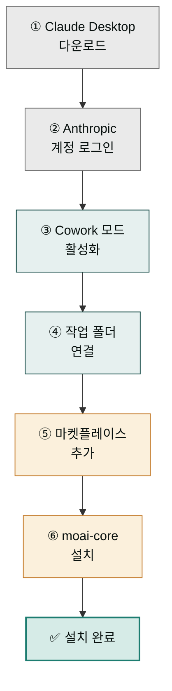
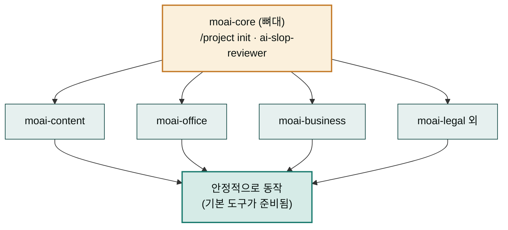

이 가이드는 MoAI Cowork Plugins을 Claude Desktop에 설치하는 전체 과정을 단계별로 상세히 안내합니다. 약 5-7분 (Claude Desktop이 이미 설치된 경우) 안에 마켓플레이스 등록 + moai-core 활성화까지 완료됩니다.

## 전체 설치 절차

전체 설치는 여섯 단계로 이어지며, 각 단계는 바로 앞 단계가 끝나야만 의미가 있습니다. 새 스마트폰을 처음 샀을 때 세팅하는 과정에 비유하면 순서가 왜 정해져 있는지 한눈에 보입니다. 박스를 개봉해 본체를 꺼내는(① 다운로드) 일부터 시작해, 주인이 누구인지 인증(② 로그인)을 하고, 그래야 비로소 사용 모드를 켤(③ Cowork 모드) 수 있습니다. 이어서 내 사진과 파일을 옮길 폴더를 고르고(④ 작업 폴더), 앱 스토어에 로그인해(⑤ 마켓플레이스) 필요한 필수 앱을 내려받는(⑥ 플러그인 설치) 순서입니다. 앱 스토어에 들어가려면 먼저 로그인이 되어 있어야 하듯, ⑤단계는 ③단계가 켜져 있어야 의미가 있고 ⑥단계는 ⑤단계가 끝나야 실행할 수 있습니다.

순서를 거꾸로 하거나 중간을 건너뛰면 흔히 "마켓플레이스가 안 보여요", "/project init이 안 돼요" 같은 문제로 이어집니다. 아래 흐름도는 여섯 단계가 어떻게 앞단계에 기대어 쌓이는지를 한 방향 화살표로 보여줍니다 — 회색은 준비, 초록은 환경 켜기, 노란색은 콘텐츠(마켓플레이스·플러그인) 채우기, 진한 초록은 최종 완료를 뜻합니다.

### 핵심 용어 3가지

이 가이드 전체에서 세 단어가 반복해서 등장합니다. 요리에 비유해 한 번에 짚고 갑니다.

- **Cowork 모드** — 주방에 들어가 요리를 시작할 수 있게 전원을 켜는 것과 같습니다. 켜기 전에는 Claude Desktop이 그저 대화창일 뿐, 파일을 읽거나 플러그인을 부를 수 없습니다. ③단계에서 켭니다.
- **마켓플레이스** — 레시피와 조리 도구를 한곳에 모아파는 "요리 용품점(앱 스토어)"입니다. 이 가이드에서는 `modu-ai/cowork-plugins`라는 한 가게에 접속합니다. 가게 자체는 ⑤단계에서 등록합니다.
- **플러그인** — 그 가게에서 사서 내 주방에 가져다 놓는 "특정 요리 키트/레시피 묶음"입니다. 한 플러그인 안에는 보통 여러 스킬(점원이 아는 요리법)이 들어 있습니다. `moai-core`는 그중 가장 기본이 되는 "기본 조리 도구 세트"라서 제일 먼저 깝니다(⑥단계).

### 1단계: Claude Desktop 다운로드


**시스템 요구사항**
- macOS 10.13 이상
- Windows 10 이상
- 8GB 이상 RAM
- 안정적인 인터넷 연결


공식 사이트에서 Claude Desktop을 다운로드합니다:

1. [claude.com/download](https://claude.com/download) 접속
2. 운영체제에 맞는 버전 다운로드
3. 다운로드된 파일 실행하여 설치 진행

1. **Desktop 앱** — 주요 다운로드 대상입니다. macOS와 Windows 버전을 선택할 수 있습니다.
2. **Chrome 확장 프로그램** — 브라우저에서 Claude를 사용할 수 있는 확장 프로그램입니다.
3. **Slack 통합** — Slack 워크스페이스에서 Claude를 연동합니다.
4. **Excel 통합** — Microsoft Excel과 연동하여 스프레드시트 작업을 보조합니다.
5. **PowerPoint 통합** — PowerPoint 프레젠테이션 제작을 보조합니다.
6. **Word 통합** — Word 문서 작성을 보조합니다.
7. **모바일 앱** — iOS/Android 모바일 앱입니다.

### 2단계: Anthropic 계정 로그인

Claude Desktop을 실행하고 Anthropic 계정으로 로그인합니다:

1. Claude Desktop 애플리케이션 실행
2. 로그인 화면에서 Anthropic 계정 정보 입력
3. 2단계 인증이 설정된 경우 인증 코드 입력


**중요**: 개인 계정 또는 조직 계정 모두 사용 가능하지만, 조직 계정의 경우 관리자 승인이 필요할 수 있습니다.


### 3단계: Cowork 모드 활성화

Cowork 모드를 활성화하여 플러그인 사용이 가능한 환경을 설정합니다:

1. Claude Desktop 왼쪽 사이바에서 **"Projects"** 선택
2. "Cowork mode"가 표시되지 않으면 설정 메뉴에서 활성화
3. Cowork 모드가 활성화되면 추가 기능 탭이 표시됩니다

1. **Cowork 탭** — 사이드바에서 Cowork 탭을 선택합니다.
2. **모델 선택기** — 사용할 AI 모델(Opus 4.7 등)을 선택합니다.
3. **직접 설정 토글** — 수동으로 설정을 제어하는 스위치입니다.
4. **프로젝트 선택기** — 작업 컨텍스트를 전환합니다.
5. **Info 드롭다운** — 현재 설정의 상세 정보를 확인합니다.

### 4단계: 로컬 작업 폴더 연결

사용할 작업 폴더를 Claude Desktop에 연결합니다:

1. **Customize** — 사이드바의 Customize 메뉴를 통해 폴더 연결 및 설정에 접근합니다
2. "Connect a local work folder" 버튼 클릭
2. 작업할 프로젝트 폴더 선택
3. 연결 확인 완료


**팁**: 기존 프로젝트 폴더를 연결하거나 새로운 폴더를 생성하여 사용할 수 있습니다.


### 5단계: 마켓플레이스 추가

MoAI Cowork Plugins 마켓플레이스를 추가합니다:

1. **+ 버튼** — 개인 폴더그룹을 추가합니다
2. **추가 버튼** — 새 폴더그룹을 생성합니다
3. **마켓플레이스 추가** — 하단 메뉴에서 마켓플레이스를 추가할 수 있습니다

4. **URL 입력 필드** — `modu-ai/cowork-plugins`을 입력하고 추가를 확인합니다

### 6단계: 필수 플러그인 설치

#### 왜 moai-core를 제일 먼저 깔아야 할까

가구 조립에 비유하면 `moai-core`는 책장의 "뼈대(프레임)"입니다. 뼈대 없이 선반판(다른 플러그인)부터 세우면 무너집니다. `moai-core` 안에는 프로젝트를 처음 세팅하는 `/project init`과, 글에서 AI 특유 어투를 솎아내는 `ai-slop-reviewer` 같은 가장 기본 동작이 들어 있습니다. 다른 모든 플러그인은 이 기본 동작 위에서 돌아간다고 가정합니다. 그래서 `moai-core`가 먼저 깔려 있지 않으면 `/project init`이 아예 실행되지 않고, 뒤이어 깐 콘텐츠·문서·마케팅 플러그인들이 "기본 도구를 찾을 수 없다"며 빈 결과를 내놓습니다.

아래 흐름도는 이 의존성 관계를 보여줍니다. `moai-core`가 기반 층에 깔리고, 그 위에 다른 플러그인들이 올라타야 안정적으로 동작합니다.

가장 먼저 `moai-core` 플러그인을 설치합니다:

1. **개인** 탭 — 설치된 플러그인 목록을 확인합니다
2. **cowork-plugins** 필터 — 마켓플레이스 플러그인만 표시합니다
3. **자동 추가** 토글 — 새 스킬 자동 포함 여부를 설정합니다
4. **+ moai-core** 버튼 — moai-core 플러그인을 추가합니다

5. **Moai core** — 사이드바에 설치된 moai-core 메뉴가 표시됩니다
6. **기능 카드** — 제공되는 스킬 목록을 확인합니다
7. **사용자 지정** 토글 — 개별 스킬 활성화/비활성화를 제어합니다


**필수 플러그인**: `moai-core`는 `/project init`과 `ai-slop-reviewer` 스킬을 포함한 핵심 기능을 제공하므로 반드시 먼저 설치해야 합니다.


## 설치 검증

설치가 완료되었는지 다음과 같이 확인합니다:

### 1. 플러그인 목록 확인

1. Claude Desktop에서 **"Plugins"** 탭 선택
2. 설치된 플러그인 목록에서 `moai-core` 확인
3. 상태가 "Active"로 표시되는지 확인

### 2. 스킬 테스트

간단한 명령어로 설치를 테스트합니다:

1. Cowork 모드에서 채팅창 열기
2. `/project init` 입력 후 실행
3. 7단계 인터뷰가 정상적으로 진행되는지 확인

## 문제 해결

### 자주 발생하는 문제

**Q: 마켓플레이스가 표시되지 않아요**
A: Claude Desktop 최신 버전인지 확인하고, 인터넷 연결 상태를 점검하세요.

**Q: moai-core 설치 실패**
A: 조직 계정 사용 시 관리자 승인이 필요할 수 있습니다. 관리자에게 문의하세요.

**Q: `/project init` 명령어가 작동하지 않아요**
A: moai-core 플러그인이 먼저 설치되었는지 확인하세요. 설치 순서가 중요합니다.

**Q: 스킬 목록이 나타나지 않아요**
A: Claude Desktop을 재시작하거나, 캐시를 초기화해보세요.

### 고급 문제 해결

**네트워크 문제**
- 프록시 설정 확인
- 방화벽에서 Claude Desktop 허용 목록 추가
- DNS 캐시 재시도

**권한 문제**
- 작업 폴더 읽기/쓰기 권한 확인
- macOS 보안 설정에서 Claude Desktop 권한 부여
- Windows Defender 실행 허용

## 다음 단계

설치가 완료되었다면 이제 첫 작업을 진행할 준비가 되었습니다:

- [첫 작업 가이드](../first-task/) - 약 5-7분 실습 예제 (설치 완료 후)
- [빠른 시작 가이드](../quick-start/) - 주요 스킬 빠르게 숙지하기

### Sources
- GitHub 저장소: [https://github.com/modu-ai/cowork-plugins](https://github.com/modu-ai/cowork-plugins)
- Claude Desktop 다운로드: [https://claude.com/download](https://claude.com/download)
- 온라인 문서: [https://cowork.mo.ai.kr](https://cowork.mo.ai.kr)
