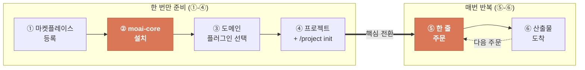
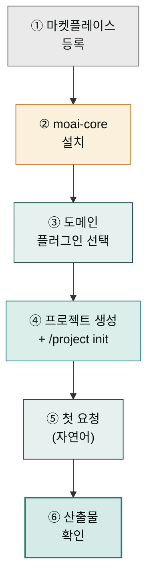
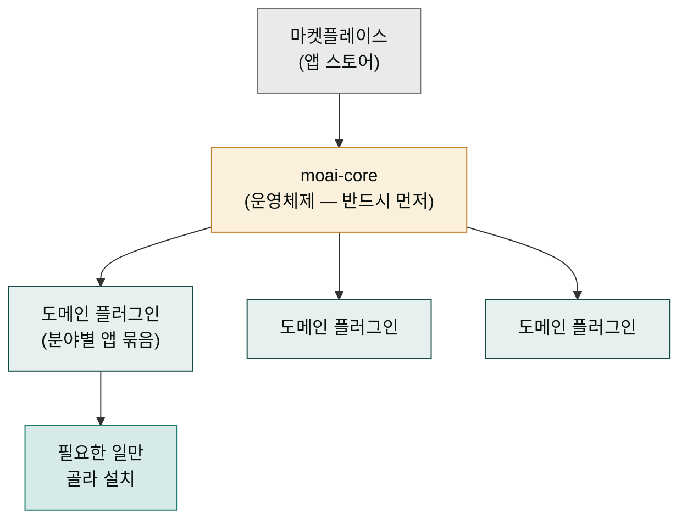
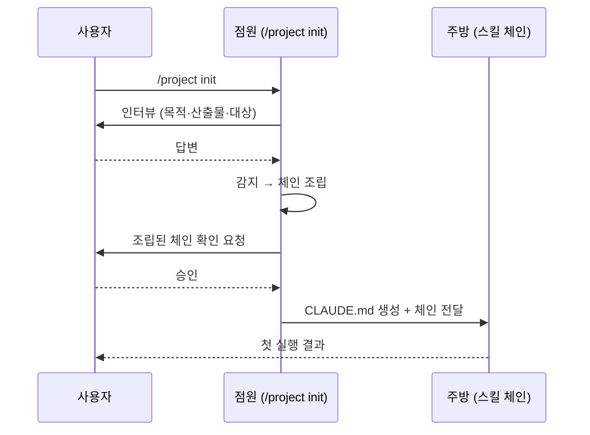
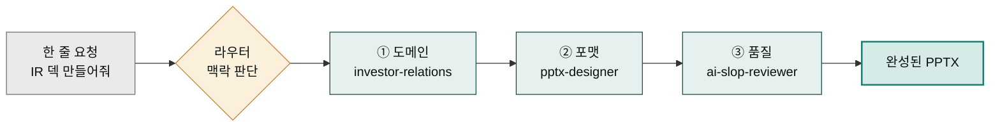

`modu-ai/cowork-plugins` 마켓플레이스를 Claude Cowork에 등록하고 첫 스킬 체인을 실행하기까지의 전체 흐름을 정리한 페이지입니다. 처음부터 끝까지 약 **10분** 소요됩니다.

## 사전 체크

- [Cowork 설치](../install/) 완료
- 작업할 **로컬 폴더** 하나 준비 (Windows에서는 짧은 경로를 권장합니다)

## 6단계가 한 줄로 이어지는 이유

이 페이지는 여섯 단계를 순서대로 안내하지만, 처음 보는 입장에서는 "왜 하필 이 순서인가"가 궁금할 수 있습니다. 음식 배달 앱에 빗대어 보면 한눈에 들어옵니다. **앱 스토어에서 배달 앱을 설치**하고(① 마켓플레이스 등록, ② 플러그인 설치), **집 주소와 결제수단을 한 번 등록**해 두면(④ 프로젝트 + `/project init`), 이후에는 **"오늘 저녁 한국식으로" 한 줄만 주문**하면(⑤ 자연어 요청) **주방에서 요리 순서대로 만들어 도착**합니다(⑥ 산출물). 즉 여섯 단계는 흩어진 작업이 아니라 "주문 한 번 → 완성품 도착"의 한 줄 파이프라인입니다.

처음 한 번만 준비(①②③④)해 두면, 그 뒤로는 ⑤ 한 줄 입력과 ⑥ 결과 확인만 반복하면 됩니다. 준비 단계가 앞에 있는 이유는 시스템이 "어떤 일을, 어떤 순서로, 어떤 품질 기준으로 만들지"를 알아야 주문 한 줄만으로 알아서 조립할 수 있기 때문입니다. 아래 흐름도는 사용자가 설치에서 첫 산출물까지 거치는 여정을 한 줄로 보여줍니다.

## 전체 흐름

## 마켓플레이스, 플러그인, core — 세 단어 정리

아래 1-3단계로 넘어가기 전에 처음 만나는 용어 네 개를 스마트폰에 빗대어 잡아둡니다. **마켓플레이스**는 앱 스토어(플레이스토어·앱스토어)처럼 "설치할 수 있는 앱 목록이 모여 있는 곳"입니다. **플러그인**은 그 스토어에서 하나하나 다운로드하는 앱 한 개입니다 — 사진 편집 앱, 배달 앱처럼 각자 쓰임이 정해져 있습니다. 여기서 **moai-core**는 운영체제(iOS·안드로이드) 같은 기반입니다. 운영체제 없이 앱이 켜지지 않듯, `moai-core` 없이는 다른 플러그인의 핵심 기능인 `/project init` 마법사와 `ai-slop-reviewer` 검수가 작동하지 않습니다. 그래서 반드시 `moai-core`를 먼저 설치합니다.

**도메인 플러그인**은 일을 분야별로 묶어 둔 앱 묶음입니다(비즈니스 묶음, 콘텐츠 묶음, 법무 묶음 등). 사진 편집을 안 한다면 그 앱은 내려받지 않아도 되듯, 28개 플러그인 중 지금 진행할 작업에 맞는 것만 골라 설치하면 됩니다. 토큰이란 컴퓨터가 한 번에 읽는 텍스트 분량의 단위인데, 설치를 최소한으로 유지하면 대화창이 한 번에 읽어야 할 분량도 줄어들어 반응이 가벼워집니다.

1. **마켓플레이스 등록**

   Cowork **좌측 사이드바 → 사용자 지정(Customize) → 개인 플러그인 → 플러그인 추가 → 마켓플레이스 추가**에서 다음 URL을 입력합니다.

   
> modu-ai/cowork-plugins
   

   동기화가 끝나면 28개 플러그인 목록이 표시됩니다.

2. **`moai-core` 설치**

   
   **반드시 `moai-core`부터** 설치합니다. 여기에 `/project init` 마법사와 모든 텍스트 체인에 필요한 `ai-slop-reviewer`가 포함되어 있습니다.
   

   `moai-core` 옆의 **+** 버튼을 클릭하면 설치가 완료됩니다.

3. **도메인 플러그인 선택**

   이번에 진행할 작업에 맞춰 플러그인을 추가합니다. 예시는 다음과 같습니다.

   - 사업계획서 → `moai-business`, `moai-office`
   - 블로그 발행 → `moai-content`, `moai-media`
   - 계약서 검토 → `moai-legal`, `moai-office`
   - 이미지 생성 → `moai-media` (+ `GEMINI_API_KEY` 필요)

   28개 모두를 한 번에 설치할 필요는 없습니다.

## `/project init`이 하는 일 — 점원이 주문을 받아 주방까지 전달

프로젝트를 만들고 `/project init`을 실행하는 단계는 식당에 들어가서 **점원이 인터뷰를 시작하는 순간**에 해당합니다. 손님이 자리에 앉으면 점원이 "몇 명이세요, 매운 거 괜찮으세요, 예산이 어떻게 되세요"라고 차례로 묻습니다. 점원은 그 답을 모아 알아서 앞채 → 메인 → 디저트 순서(체인)를 정하고 주방에 넘깁니다. 손님이 직접 요리 순서를 정하지 않아도 됩니다. `/project init`이 바로 이 점원 역할을 합니다.

구체적으로는 7단계 흐름(질문 → 감지 → 체인 조립 → 확인 → 생성 → API키 → 첫 실행)을 거칩니다. 먼저 프로젝트의 목적과 산출물을 **인터뷰**(질문)로 듣고, 그 답에서 **무슨 일인지를 감지**한 뒤, 알맞은 스킬들을 순서대로 이어 **체인**으로 조립합니다. 사용자가 **확인**하면 프로젝트 루트에 `CLAUDE.md`(이 프로젝트에서 일할 때 지켜야 할 규칙 모음)를 **생성**하고, 외부 서비스가 필요하면 **API 키** 등록을 안내한 뒤 **첫 실행**까지 이어갑니다. 이 일곱 단계가 끝나면 "어떤 일을, 어떤 순서로, 어떤 품질 기준으로"가 한 번에 정리됩니다.

4. **프로젝트 생성 및 `/project init`**

   Cowork에서 좌측 사이드바 **프로젝트** 섹션의 **+ 새 프로젝트**를 눌러 프로젝트를 만들고, 프로젝트 설정 화면에서 **작업 폴더 연결** 항목에 앞서 준비한 로컬 폴더를 지정합니다.

   

   1. **새 프로젝트 시작하기** — 새 프로젝트를 생성합니다
   2. **프로젝트 가져오기** — 기존 프로젝트를 Cowork로 가져옵니다
   3. **기존 프로젝트 사용** — 이미 생성된 프로젝트를 선택합니다

   

   4. **프로젝트 이름** — 프로젝트 이름을 입력합니다
   5. **설명** — 프로젝트에 대한 설명을 입력합니다 (선택)
   6. **파일 추가** — 프로젝트에 참고 파일을 추가합니다
   7. **저장 위치** — 프로젝트가 저장될 경로를 확인합니다

   프로젝트·폴더 개념이 낯설다면 [프로젝트와 메모리](../../cowork/projects-memory/) 페이지를 먼저 참고하세요. 이후 대화창에 다음을 입력합니다.

   
> /project init
   

   

   1. **명령어 입력** — 채팅창에 `/project init`을 입력합니다
   2. **프로젝트 유형** — 프로젝트 유형 드롭다운에서 적합한 항목을 선택합니다
   3. **모델 버전** — 사용할 AI 모델 버전을 확인합니다
   4. **제목 편집** — 프로젝트 제목을 수정할 수 있습니다
   5. **태스크 추가** — 프로젝트에 수행할 태스크를 추가합니다
   6. **스크립트 추가** — 실행할 스크립트를 추가합니다
   7. **연결된 스크립트** — 현재 연결된 스크립트 목록을 확인합니다
   8. **메모리 영역** — 프로젝트 메모리 컨텍스트를 확인합니다

   

   1. **실행 전 확인** — 인터뷰 시작 전 확인 드롭다운을 엽니다
   2. **자동 확인** — "못지 않고 확인"으로 자동 승인할 수 있습니다

   

   1. **프로젝트 설명** — 프로젝트에 대한 간단한 설명을 입력합니다
   2. **상세 정보** — 프로젝트의 세부 정보를 제공합니다
   3. **카테고리 선택** — 비즈니스 카테고리를 선택합니다 (예: 아동용품)
   4. **브랜드 선택** — 브랜드 정보를 선택합니다 (예: 기타)
   5. **이미지 형식** — 산출물 이미지 형식을 지정합니다
   6. **설명 방식** — 콘텐츠 설명 방식을 선택합니다
   7. **메뉴 항목** — 프로젝트에 포함할 메뉴 항목을 설정합니다
   8. **추가 옵션** — 필요에 따라 추가 옵션을 구성합니다
   9. **채널 설정** — 채널별 설정을 확인합니다
   10. **유효성 검사** — 입력값에 대한 유효성 검사가 자동 수행됩니다
   11. **카테고리 세부 선택** — 세부 카테고리를 지정합니다
   12. **브랜드 상세** — 브랜드 관련 상세 정보를 입력합니다
   13. **형식 지정** — 산출물 형식을 세부 지정합니다
   14. **완료 확인** — 모든 인터뷰 항목 입력 후 완료를 확인합니다

   `moai-core:project` 스킬이 실행되어 **7단계 흐름**(Interview → Detect → Chain → Confirm → Generate → APIKey → First Run)을 진행합니다. 자세한 내용은 [moai-core 상세](../../plugins/moai-core/)에서 확인할 수 있습니다. 약 3-5분 안에 프로젝트용 `CLAUDE.md`가 루트에 생성됩니다.

## 한 줄을 쓰면 체인이 저절로 조립되는 원리

`/project init`이 끝나면 이후에는 자연어 한 줄만 던지면 됩니다. "IR 덱 만들어줘"라고 쓰면 마치 "오늘 비즈니스 점심으로" 한마디만 했는데 점원이 알아서 적합한 세트메뉴를 조립해 오는 것과 같습니다. 사용자는 어떤 스킬을, 어떤 순서로 부를지 직접 정하지 않아도 됩니다.

이게 작동하는 까닭은 `moai-core`의 **라우터**가 한 줄 요청의 맥락을 읽어 "이 일은 도메인 → 포맷 → 품질 순서로 흘러가겠구나"를 판단하기 때문입니다. 도메인 스킬(예: `investor-relations`)이 내용을 만들면, 포맷 스킬(예: `pptx-designer`)이 PPTX로 옮기고, 품질 스킬(`ai-slop-reviewer`)이 마지막에 AI 특유 어투를 솎아냅니다. 이 세 단계가 한 줄에서 자동으로 연쇄 실행되므로, 사용자는 "무엇을 만들까"에만 집중하면 됩니다.

5. **첫 요청**

   이제 자연어로 요청하면 `moai-core`의 라우터가 적합한 스킬을 자동으로 호출합니다. **본 문서의 모든 사용자 입력은 `> ` prefix와 함께 표기**합니다(실제 입력 시 `>` 제외 — [표기 규약](../../cowork/skills/#스킬-호출-방식)).

   
> "우리 SaaS의 Series A용 IR 덱 초안 만들어줘. 타깃 고객은 한국 중소제조업체야."
   

   체인 예시: `investor-relations → pptx-designer → ai-slop-reviewer`

6. **산출물 확인**

   PPTX 파일이 작업 폴더에 저장되고, 대화창에 **진단 → 수정 → 주요 변경사항** 3블록의 AI 슬롭 검수 리포트가 함께 표시됩니다.

## API 키·커넥터 등록 (선택)

일부 플러그인은 외부 서비스 키가 필요합니다.

| 플러그인 | 필요한 키·커넥터 |
|---|---|
| `moai-media` | `GEMINI_API_KEY`, `HIGGSFIELD_API_KEY`, `HIGGSFIELD_SECRET`, `ELEVENLABS_API_KEY` |
| `moai-business` (DART 공시 연동) | DART MCP |
| `moai-data` | 공공데이터포털·KOSIS API 키 |
| `moai-content:blog` (WordPress 자동 업로드) | WordPress MCP |

키는 프로젝트 루트의 `.moai/credentials.env`에 저장됩니다. 절대 외부 저장소에 커밋하지 마세요.

## 잘 안 될 때

- **스킬이 자동으로 호출되지 않을 때**: `moai-core`가 설치돼 있는지, `/project init`이 실행됐는지 확인합니다.
- **Word·PPT 파일이 깨질 때**: `moai-office`가 설치돼 있는지, Python 의존성(`python-docx`, `python-hwpx` 등)이 갖춰졌는지 확인합니다.
- **AI 슬롭 검수가 실행되지 않을 때**: 요청에 "빠르게"라는 표현이 포함되면 검수가 스킵될 수 있습니다. "검수까지 돌려줘"라고 명시하세요.

## 주요 스킬 카탈로그 (177개)

아래는 28개 플러그인에 담긴 177개 스킬 중 자주 쓰이는 **대표 스킬**만 뽑은 것입니다. 전체 목록은 [플러그인 카탈로그](../../plugins/) 각 페이지에서 확인할 수 있습니다.

### moai-core (핵심 유틸리티)
- **ai-slop-reviewer**: 모든 텍스트 산출물의 AI 패턴 검수 및 개선
- **project**: 프로젝트 초기화 및 문서 생성 (`/project init`)
- **feedback**: 사용자 피드백 수집 및 GitHub 이슈 생성

### moai-content (콘텐츠 생성)
- **blog**: 블로그 포스팅 생성
- **card-news**: 뉴스 카드 생성
- **copywriting**: 마케팅 카피 작성
- **landing-page**: 랜딩 페이지 생성
- **newsletter**: 뉴스레터 생성
- **product-detail**: 제품 상세페이지 작성
- **detail-page-planner**: 상세페이지 기획
- **social-media**: SNS 콘텐츠 생성
- **content-calendar**: 콘텐츠 캘린더 기획
- **media-production**: 미디어 제품 기획
- **youtube-podcast-planner**: 유튜브·팟캐스트 기획
- **html-report**: 단일 파일 HTML 리포트 생성
- **humanize-korean**: 한국어 AI 티 제거 (윤문 후처리)
- **korean-spell-check**: 한국어 맞춤법 검사

### moai-business (비즈니스)
- **daily-briefing**: 일간 브리핑 생성
- **investor-relations**: 투자자 관계 문서 생성
- **market-analyst**: 시장 분석 보고서 작성
- **strategy-planner**: 전략 계획 수립
- **sbiz365-analyst**: 소상공인365 상권분석
- **kr-gov-grant**: 정부지원사업 통합 지원

### moai-office (오피스 문서)
- **docx-generator**: Word 문서 생성
- **pptx-designer**: PowerPoint 디자인
- **xlsx-creator**: Excel 생성
- **hwpx-writer**: 한글 문서 작성

### moai-legal (법률)
- **compliance-check**: 규정 준수 검사
- **contract-review**: 계약서 검토
- **legal-risk**: 법적 위험 평가
- **nda-triage**: NDA 우선순위 분류

### moai-finance (재무)
- **close-management**: 마감 관리
- **financial-statements**: 재무제표 생성
- **tax-helper**: 세무 도우미
- **variance-analysis**: 분석 차이

### moai-marketing (마케팅)
- **brand-identity**: 브랜드 정체성 생성
- **campaign-planner**: 캠페인 기획
- **email-sequence**: 이메일 시퀀스 작성
- **performance-report**: 성과 보고서
- **personal-branding**: 개인 브랜딩
- **seo-audit**: SEO 감사
- **sns-content**: SNS 콘텐츠
- **target-script**: 타겟 스크립트 생성

### moai-education (교육)
- **assessment-creator**: 평가 문제 생성
- **curriculum-designer**: 커리큘럼 설계
- **research-assistant**: 연구 보조

### moai-media (미디어)
- **higgsfield-image**: 이미지 생성 (Nano Banana Pro)
- **higgsfield-video**: 영상 생성
- **audio-gen**: 음성 생성 (ElevenLabs)
- **gpt-image-2-prompt** / **gemini-3-image-prompt** / **midjourney-v8-prompt**: 이미지 프롬프트 빌더 3종

### 그 밖의 도메인 플러그인
- **moai-design**: `design-system-library`, Claude Design 연동 스킬군
- **moai-book**: 책 기획·집필 8종 (`book-concept-planner`, `book-chapter-writer` 등)
- **moai-tutor**: 학습자 전용 3종 (`learning-project`, `tutor-research`, `learning-material`)
- **moai-product** (`ux-designer`), **moai-research**, **moai-commerce**, **moai-sales**, **moai-bi**, **moai-pm**, **moai-hr**, **moai-operations**, **moai-support**, **moai-career**, **moai-lifestyle**, **moai-wealth**, **moai-public-data**, **moai-comms**, **moai-productivity** 등

## 다음 단계

- [moai-core 상세](../../plugins/moai-core/)
- [moai-content 상세](../../plugins/moai-content/)
- [Cowork 플러그인 사용](../../cowork/plugins/) — Cowork 환경 통합 가이드

### Sources

- [modu-ai/cowork-plugins README](https://github.com/modu-ai/cowork-plugins)
- [Use plugins in Claude Cowork](https://support.claude.com/en/articles/13837440)
