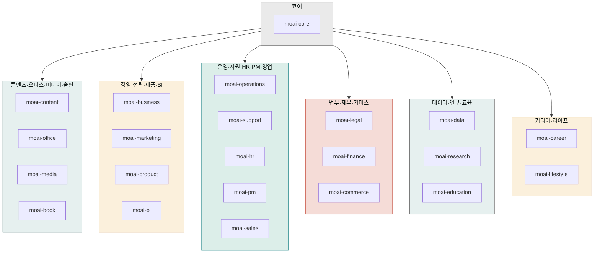

# `cowork-plugins` 카탈로그

[`modu-ai/cowork-plugins`](https://github.com/modu-ai/cowork-plugins)는 한국 업무 환경에 맞춰 설계된 **22개 플러그인 · 143개 스킬**의 커뮤니티 마켓플레이스입니다. 사업계획·IR·마케팅·법무·세무·HR·카드뉴스·PPT·이미지 프롬프트 빌더·이커머스 풀스택·**메타 광고 보고서 분석**·**한국 출판사 제출 원고**까지 도메인별로 묶여 있습니다.


**v2.11.0 업데이트 (최신)**: moai-media wrapper 12 스킬 제거(Higgsfield·ElevenLabs·fal-ai MCP가 직접 지원) → **이미지 프롬프트 빌더 3종 + audio-gen 4 스킬**로 정리. moai-commerce·moai-media·moai-education 페이지 범용 플러그인으로 재정의. moai-bi html-report 통합, moai-career 2026 한국 채용 데이터 반영. **22 플러그인 유지 · 155 → 143 스킬**. Breaking change 없음.

**v2.10.0**: 신규 플러그인 **`moai-book`** — 한국 출판사 제출용 원고 풀스택 8 스킬(컨셉서·페르소나·목차·저자 약력·제안서·출판사 매칭·본문·퇴고). 21 → 22 플러그인 · 147 → 155 스킬.


## 전제 조건

- Claude Desktop 앱 + Cowork 모드 진입 완료 → [Cowork 설치](../../cowork/install/)
- 마켓플레이스 설치 절차는 [빠른 시작](./quick-start/) 참고
- **`moai-core`는 가장 먼저 설치**해야 합니다 — `/project init` 마법사와 `ai-slop-reviewer`가 여기에 들어 있습니다

## 도메인별 플러그인

### 코어

- [`moai-core`](./moai-core/) — 프로젝트 초기화, 자연어 라우터, AI 슬롭 검수, 피드백 허브, MCP 4커넥터

### 콘텐츠·오피스·미디어·출판

- [`moai-content`](./moai-content/) — 블로그·카드뉴스·랜딩·뉴스레터·상세페이지·SNS 콘텐츠 + 한국어 AI 티 정밀 윤문 + HTML 보고서
- [`moai-office`](./moai-office/) — PPTX·DOCX·XLSX·HWPX·PDF 문서 자동 생성
- [`moai-media`](./moai-media/) — 이미지(나노바나나·Ideogram)·영상(Kling·Veo·Seedance)·음성(ElevenLabs) + Day 3 광고 풀세트 + **v2.9 프롬프트 빌더 3종**
- [`moai-book`](./moai-book/) **NEW v2.10** — 한국 출판사 제출용 원고 풀스택 8 스킬(컨셉서·페르소나·목차·저자 약력·제안서·출판사 매칭·본문·퇴고)

### 경영·전략·제품·BI

- [`moai-business`](./moai-business/) — 사업계획서·IR 덱·시장조사·일간 브리핑·상권분석·정부지원사업
- [`moai-marketing`](./moai-marketing/) — 브랜드 아이덴티티·SEO·SNS 캠페인·퍼포먼스 리포트 + **메타 광고 보고서 분석**
- [`moai-product`](./moai-product/) — PRD·기능 명세·로드맵·UX 리서치
- [`moai-bi`](./moai-bi/) — 경영진·이사회용 1페이지 임원 요약(K-IFRS·DART·KOSIS 친화)

### 운영·지원·HR·PM·영업

- [`moai-operations`](./moai-operations/) — SOP·조달·벤더 평가·주간 상태 보고
- [`moai-support`](./moai-support/) — 고객 티켓 분류·응답·지식베이스·에스컬레이션
- [`moai-hr`](./moai-hr/) — 채용·근로계약·평가·원격 근무 정책
- [`moai-pm`](./moai-pm/) — 한국 팀 주간보고(WBR) — 격식체/구어체 동시
- [`moai-sales`](./moai-sales/) — B2B 12섹션 제안서·RFP 답변·Three C's

### 법무·재무·커머스

- [`moai-legal`](./moai-legal/) — 계약서 검토·NDA·컴플라이언스·IP 리스크
- [`moai-finance`](./moai-finance/) — 세무·결산·K-IFRS 재무제표·예실 분석
- [`moai-commerce`](./moai-commerce/) — 한국 D2C 풀스택 (V6 6도구 + Wave 1-4 누적 — 리뷰·VOC·구독·인플루언서·얼리팬·트렌드·시즌)

### 데이터·연구·교육

- [`moai-data`](./moai-data/) — CSV 탐색·공공데이터·데이터 시각화
- [`moai-research`](./moai-research/) — 논문·특허(KIPRIS)·연구비 신청
- [`moai-education`](./moai-education/) — 커리큘럼·리서치 보조·시험 출제

### 커리어·라이프

- [`moai-career`](./moai-career/) — 자기소개서·이력서·면접 코칭·포트폴리오
- [`moai-lifestyle`](./moai-lifestyle/) — 여행·웰니스·이벤트·웨딩 기획

## 한 눈에 보는 스킬 수 (v2.11.0)

"대표 스킬 (일부)"는 각 플러그인에서 가장 자주 호출되는 스킬을 발췌한 것입니다. 전체 스킬 목록은 플러그인 이름을 클릭해 상세 페이지에서 확인하세요.

| 플러그인 | 스킬 수 | 대표 스킬 (일부) |
|---|---|---|
| [moai-core](./moai-core/) | 8 | project, ai-slop-reviewer, feedback, ai-diagnostic, mcp-connector-setup, skill-builder, skill-template, skill-tester |
| [moai-content](./moai-content/) | 12 | blog, card-news, landing-page, copywriting, humanize-korean, html-report, detail-page-planner +5종 |
| [moai-office](./moai-office/) | 5 | pptx-designer, docx-generator, xlsx-creator, hwpx-writer, pdf-writer |
| [moai-media](./moai-media/) | 4 | **gpt-image-2-prompt·gemini-3-image-prompt·midjourney-v8-prompt** (이미지 프롬프트 빌더 3종) · **audio-gen** (ElevenLabs MCP TTS·보이스 클로닝·다국어 더빙). v2.11에서 wrapper 12 스킬 제거(Higgsfield·ElevenLabs·fal-ai MCP 직접 지원) |
| [moai-book](./moai-book/) | 8 | **book-concept-planner·book-target-reader·book-outline-designer·book-author-bio·book-proposal-writer·book-publisher-matcher·book-chapter-writer·book-revision-coach (v2.10 신규)** |
| [moai-business](./moai-business/) | 10 | strategy-planner, investor-relations, sbiz365-analyst, kr-gov-grant, consulting-brief, sales-playbook, startup-launchpad +3종 |
| [moai-marketing](./moai-marketing/) | 11 | brand-identity, seo-audit, campaign-planner(광고 심리학 완전판), sns-content, target-script, landing-page-conversion-audit, pixel-audit, **meta-ads-analyzer (v2.5)** +3종 |
| [moai-commerce](./moai-commerce/) | 35 | 시장조사·JTBD·페르소나·상품명·통합전략·아침브리핑·주문집계(7), 광고·마진·자동화·법규 진단(4), LTV/CAC·푸시·프로모션·재구매·상세 이미지·리뷰·VOC·구독·인플루언서·초기 팬·트렌드·시즌(13), 마켓플레이스(쿠팡·네이버·D2C·크라우드펀딩·큐레이션) 등 풀스택 35 스킬 |
| [moai-product](./moai-product/) | 4 | spec-writer, roadmap-manager, ux-designer, ux-researcher |
| [moai-operations](./moai-operations/) | 3 | status-reporter, process-manager, vendor-manager |
| [moai-support](./moai-support/) | 4 | ticket-triage, draft-response, escalation-manager, kb-article |
| [moai-hr](./moai-hr/) | 5 | employment-manager, draft-offer, performance-review, people-operations, resume-screener |
| [moai-legal](./moai-legal/) | 5 | contract-review, nda-triage, compliance-check, legal-risk, iros-registry-automation |
| [moai-finance](./moai-finance/) | 6 | tax-helper, financial-statements, close-management, variance-analysis, court-auction-search, korean-stock-search |
| [moai-data](./moai-data/) | 3 | data-explorer, public-data, data-visualizer |
| [moai-research](./moai-research/) | 5 | paper-search, paper-writer, grant-writer, patent-search, patent-analyzer |
| [moai-education](./moai-education/) | 5 | curriculum-designer, assessment-creator, research-assistant, course-curriculum-design, course-followup-sequence |
| [moai-career](./moai-career/) | 4 | resume-builder, job-analyzer, interview-coach, portfolio-guide |
| [moai-lifestyle](./moai-lifestyle/) | 3 | travel-planner, event-planner, wellness-coach |
| [moai-bi](./moai-bi/) | 1 | executive-summary |
| [moai-pm](./moai-pm/) | 1 | weekly-report |
| [moai-sales](./moai-sales/) | 1 | proposal-writer |

전체 **143개 스킬 · 22개 플러그인** (v2.11.0 기준).

## 다음 단계

- [빠른 시작](./quick-start/) — 마켓플레이스 추가 → 플러그인 설치 → 첫 체인
- [`moai-core`](./moai-core/) — 반드시 가장 먼저 설치
- [Cowork 플러그인 사용](../../cowork/plugins/) — Cowork 환경 통합 가이드
- [강의로 배우기 (모두의 AI 아카데미 1기)](https://academy.mo.ai.kr/?utm_source=cowork-docs&utm_medium=referral&utm_campaign=docs-plugins-catalog) — 3일 · 정원 25명

---

### Sources

- [modu-ai/cowork-plugins](https://github.com/modu-ai/cowork-plugins)
- [cowork-plugins README](https://raw.githubusercontent.com/modu-ai/cowork-plugins/main/README.md)
- [v2.11.0 릴리스 (최신)](../releases/v2.11/) · [v2.10.0 릴리스](../releases/v2.10/) · [v2.9.0 릴리스](../releases/v2.9/)
