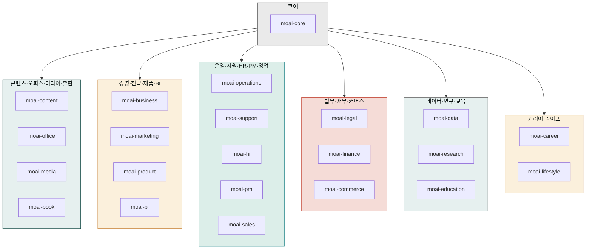

# `cowork-plugins` 카탈로그

[`modu-ai/cowork-plugins`](https://github.com/modu-ai/cowork-plugins)는 한국 업무 환경에 맞춰 설계된 **28개 플러그인 · 176개 스킬**의 커뮤니티 마켓플레이스입니다. 사업계획·IR·마케팅·법무·세무·HR·카드뉴스·PPT·이미지 프롬프트 빌더·이커머스 풀스택·메타 광고 운영·NotebookLM 슬라이드·한국 출판사 제출 원고·Claude Design 보조 풀스택·개인 재무·자기관리·직장 커뮤니케이션·**한국 공공·시세 데이터 조회**까지 도메인별로 묶여 있습니다.


**v2.20.0 업데이트 (최신)**: **학습자 전용 moai-tutor 플러그인 신규 (3 스킬)** — 가르치는 사람(moai-education)과 분리된 **배우는 사람(학습자·수강생)** 도메인. `learning-project`(학습 프로젝트·로드맵·진도) · `tutor-research`(context7 공식 문서 + 웹검색 **병렬** 조사·교차검증) · `learning-material`(도식·차트·수식·코드가 조건부로 들어간 단일 HTML 학습자료). context7 MCP 번들 + 2026 CDN 라이브러리 스택(Mermaid·ECharts·highlight.js·KaTeX·AOS) 큐레이션. **27 → 28 플러그인 · 173 → 176 스킬 · 기능적 비파괴 · Breaking change 없음**.

**v2.19.0**: **humanize-korean v2.0.0 포팅 + Cowork-safe 코디네이터 31종 재도입** — `moai-content:humanize-korean`을 upstream epoko77-ai/im-not-ai v2.0.0으로 정렬(번역투 8유형 계보 + 신규 패턴 A-16·A-18·A-19·E-7 + post-editese 14메트릭). Cowork-safe 코디네이터 31개(24 플러그인, Bash·WebFetch 배제)를 실측 근거로 선별 재도입. v2.18.0 `/project` Agent Synthesis와 공존. **27 플러그인 · 173 스킬 유지 · 기능적 비파괴 · Breaking change 없음**.

**v2.18.0**: **Cowork 에이전트 모델 전환** — v2.17.0이 도입한 플러그인 번들 코디네이터 sub-agent 14개를 전면 제거하고, **`/project`가 사용자 프로젝트에 맞춤 sub-agent를 직접 생성**하는 Agent Synthesis(Phase 3.5) 모델로 일원화했습니다. 프로젝트 에이전트는 고정 다단계·병렬 fan-out·빈번 반복 워크플로우에 한해 `.claude/agents/`에 생성되며, 플러그인 번들보다 우선순위가 높고 Cowork가 자동 로드하며 새 세션에서 활성화됩니다. moai-core:project 스킬 현대화(27 플러그인/173 스킬 정합 · Phase 2 화이트리스트 동적 도출 · bare `/project` 기본 동작) · moai-office 5 SKILL.md의 삭제된 doc-qa 참조 정정. **27 플러그인 · 173 스킬 유지 · 기능적 비파괴 · Breaking change 없음**.

**v2.17.0**: **Cowork-fit 재설계 마무리** — 한국 공공·시세 조회를 한곳에 모은 신규 **`moai-public-data`**(KRX 종목·법원경매·국토부 실거래가·공공데이터포털/KOSIS 4 조회, 모두 read-only·별도 API 키 불필요). 60여 스킬 `ai-slop-reviewer → humanize-korean` 후처리 체이닝 표준화 · 설명·트리거 STANDARD 정리 · moai-pm·moai-sales·moai-bi manifest 정직화 · 이미지·영상 Higgsfield 단일화 · WordPress 발행 wiring. **26 → 27 플러그인 · 170 → 173 스킬 · Breaking change 없음**.

**v2.16.0**: **개인·일잘러 도메인 3종 신규** — 직장인 개인이 매일 부딪히는 재무·자기관리·소통 영역을 vault 분석 기반 커버리지 공백 충전으로 채웠습니다. **`moai-wealth`**(개인 재무·재테크 6 — 재테크 로드맵·가계부·투자 입문·보험 설계·연말정산 절세·경제지표 읽기), **`moai-productivity`**(자기관리·생산성 7 — 회고·목표·시간·습관·자기돌봄·노션·주간보고), **`moai-comms`**(직장 커뮤니케이션 5 — 보고·회의·피드백·갈등·면담·협상). 법인 세무 moai-finance·팀 PM moai-product·공식 인사 moai-hr와 역할이 분리됩니다. **23 → 26 플러그인·152 → 170 스킬·동기화 지점 176 → 198·Breaking change 없음**.

**v2.15.0**: **Meta 공식 Ads AI Connectors + NotebookLM 슬라이드 프롬프트 신규 2 스킬** — `moai-marketing`에 **`meta-ads-manager`** 추가(Meta Ads MCP 공식 OAuth 커넥터로 캠페인·광고세트·광고 자연어 생성·수정·예산·온오프, 신규 리소스 기본값 PAUSED, 쓰기 동작 사용자 승인). `moai-office`에 **`notebooklm-slide-prompt`** 추가(Google NotebookLM Video Overview·슬라이드용 한국어 소스·대본·구조·나노바나나 이미지 프롬프트 설계). **23 플러그인·152 스킬·동기화 지점 175 유지·Breaking change 없음**. Meta OAuth 2.0 정정(정적 토큰·서드파티 3종 제거).

**v2.14.0**: **Claude Design 보조 docs·스킬 정합성 보완** — Anthropic 공식 발표(2026-04-17) 정확 반영. (A) 코드 기반 프로토타입(음성·비디오·셰이더·3D) 카테고리 명시, (B) Canva 네이티브 파트너십(CEO Melanie Perkins 인용)·마케팅 후속 워크플로우, (C) 통합 빌더 단기 로드맵 ("coming weeks") 분리, (D) Brilliant·Datadog 공식 도입 사례 인용. `claude-design-prompt-builder`에 프론티어 미디어 보조 패턴(WebGL 셰이더·Three.js 3D·Web Audio API·캔버스 애니메이션) + `claude-design-handoff-reader`에 두 경로 분기(Claude Code 빌드 vs Canva 마케팅 후속) 신규. **23 플러그인·150 스킬 유지 · 동기화 지점 175 유지 · Breaking change 없음**.

**v2.13.0**: `moai-media` 플러그인에 **`higgsfield-image`·`higgsfield-video`** 신규 2 스킬 도입 — higgsfield.ai 공식 11 이미지 모델(Soul 3종·Nano Banana 2종·GPT Image 2종·Seedream 4.0·Flux Kontext·Wan 2.2/2.5) + 공식 11 영상 모델(Sora 2·Veo 3·Kling 4종·Seedance 2종·Cinema Studio 3.5·MiniMax Hailuo 02·Wan 2.5) + 6 비디오 프리셋(UGC·Unboxing·Product review·Hyper motion·TV spot·Wild Card)을 자연어 한 줄로 호출. 캐릭터 일관성(Soul Characters·Kling Avatars 2.0)·비동기 잡 폴링 통합. **23 플러그인 유지 · 148 → 150 스킬**.

**v2.12.0**: 신규 플러그인 **`moai-design`** — Claude Design(claude.ai/design) 보조 풀스택 5 스킬(claude-design-brief 6요소 자동 채움 · claude-design-system-prep DESIGN.md 합성 · claude-design-prompt-builder 시니어 UX 10패턴 · claude-design-handoff-reader Claude Code 핸드오프 번들 분석 · claude-design-slop-check AI 슬롭 검수). docs-site에 클로드 디자인 섹션 10페이지 동시 신설. **22 → 23 플러그인 · 143 → 148 스킬**.

**v2.11.0**: moai-media wrapper 12 스킬 제거(이미지·영상은 Higgsfield MCP, 음성은 ElevenLabs MCP가 직접 지원) → 이미지 프롬프트 빌더 3종 + audio-gen 4 스킬로 정리.

**v2.10.0**: 신규 플러그인 **`moai-book`** — 한국 출판사 제출용 원고 풀스택 8 스킬. 21 → 22 플러그인 · 147 → 155 스킬.


## 전제 조건

- Claude Desktop 앱 + Cowork 모드 진입 완료 → [Cowork 설치](../../cowork/install/)
- 마켓플레이스 설치 절차는 [빠른 시작](./quick-start/) 참고
- **`moai-core`는 가장 먼저 설치**해야 합니다 — `/project` 마법사와 `ai-slop-reviewer`가 여기에 들어 있습니다

## 도메인별 플러그인

### 코어

- [`moai-core`](./moai-core/) — 프로젝트 초기화, 자연어 라우터, AI 슬롭 검수, 피드백 허브, MCP 4커넥터

### 콘텐츠·오피스·미디어·출판

- [`moai-content`](./moai-content/) — 블로그·카드뉴스·랜딩·뉴스레터·상세페이지·SNS 콘텐츠 + 한국어 AI 티 정밀 윤문 + HTML 보고서
- [`moai-office`](./moai-office/) — PPTX·DOCX·XLSX·HWPX·PDF 문서 자동 생성
- [`moai-media`](./moai-media/) — 이미지·영상 생성(Higgsfield MCP — Soul·Nano Banana·Kling·Veo·Seedance 계열)·음성(ElevenLabs) + 이미지 프롬프트 빌더 3종(GPT-image-2·Gemini 3 Pro Image·Midjourney v8)
- [`moai-book`](./moai-book/) **NEW v2.10** — 한국 출판사 제출용 원고 풀스택 8 스킬(컨셉서·페르소나·목차·저자 약력·제안서·출판사 매칭·본문·퇴고)

### 경영·전략·제품·BI

- [`moai-business`](./moai-business/) — 사업계획서·IR 덱·시장조사·일간 브리핑·상권분석·정부지원사업
- [`moai-marketing`](./moai-marketing/) — 브랜드 아이덴티티·SEO·SNS 캠페인·퍼포먼스 리포트 + **메타 광고 보고서 분석**
- [`moai-product`](./moai-product/) — PRD·기능 명세·로드맵·UX 리서치
- [`moai-bi`](./moai-bi/) — 경영진·이사회용 1페이지 임원 요약(K-IFRS·DART·KOSIS 친화)

### 운영·지원·HR·PM·영업

- [`moai-operations`](./moai-operations/) — SOP·조달·벤더 평가·주간 상태 보고
- [`moai-support`](./moai-support/) — 고객 티켓 분류·응답·지식베이스·에스컬레이션
- [`moai-hr`](./moai-hr/) — 채용·근로계약·평가·원격 근무 정책
- [`moai-pm`](./moai-pm/) — 한국 팀 주간보고(WBR) — 격식체/구어체 동시
- [`moai-sales`](./moai-sales/) — B2B 12섹션 제안서·RFP 답변·Three C's

### 법무·재무·커머스

- [`moai-legal`](./moai-legal/) — 계약서 검토·NDA·컴플라이언스·IP 리스크
- [`moai-finance`](./moai-finance/) — 세무·결산·K-IFRS 재무제표·예실 분석
- [`moai-commerce`](./moai-commerce/) — 한국 이커머스 풀스택 (핵심 6도구 — 시장조사·JTBD·페르소나·상품명·채널 메시지·통합 전략 + 리뷰·VOC·구독·인플루언서·얼리팬·트렌드·시즌)

### 데이터·연구·교육

- [`moai-data`](./moai-data/) — CSV 탐색·공공데이터·데이터 시각화
- [`moai-research`](./moai-research/) — 논문·특허(KIPRIS)·연구비 신청
- [`moai-education`](./moai-education/) — 커리큘럼·리서치 보조·시험 출제

### 커리어·라이프

- [`moai-career`](./moai-career/) — 자기소개서·이력서·면접 코칭·포트폴리오
- [`moai-lifestyle`](./moai-lifestyle/) — 여행·웰니스·이벤트·웨딩 기획

### 개인·일잘러

- [`moai-wealth`](./moai-wealth/) — 개인 재무·재테크(재테크 로드맵·가계부·투자 입문·보험 설계·연말정산 절세·경제지표 읽기)
- [`moai-productivity`](./moai-productivity/) — 자기관리·생산성(회고·목표·시간관리·습관·자기돌봄·노션 템플릿·주간보고)
- [`moai-comms`](./moai-comms/) — 직장 커뮤니케이션·소프트스킬(보고·회의 진행·피드백·갈등 대응·1:1 면담·협상)

### 공공·데이터 조회

- [`moai-public-data`](./moai-public-data/) — 한국 공공·시세 조회 전담(KRX 종목·법원경매·국토부 실거래가·공공데이터포털·KOSIS). 모두 read-only·별도 API 키 불필요

### Claude Design 보조

- [`moai-design`](./moai-design/) **NEW v2.12** — [claude.ai/design](https://claude.ai/design) 사용을 받쳐 주는 풀스택 5 스킬. 브리프 작성·디자인 시스템 자산 합성·시니어 UX 프롬프트·Claude Code 핸드오프 분석·AI 슬롭 검수

### 학습 (학습자 전용)

- [`moai-tutor`](./moai-tutor/) **NEW v2.20** — 학습자·수강생 전용 개인 AI 튜터. 학습 프로젝트 초기화·로드맵·진도 추적 + context7+웹검색 병렬 리서치 + mermaid 도식·차트·수식·코드가 들어간 단일 HTML 학습자료 생성. moai-education(강사용)과 분리된 배우는 사람 도메인

## 한 눈에 보는 스킬 수 (v2.20.0)

"대표 스킬 (일부)"는 각 플러그인에서 가장 자주 호출되는 스킬을 발췌한 것입니다. 전체 스킬 목록은 플러그인 이름을 클릭해 상세 페이지에서 확인하세요.

| 플러그인 | 스킬 수 | 대표 스킬 (일부) |
|---|---|---|
| [moai-core](./moai-core/) | 8 | project, ai-slop-reviewer, feedback, ai-diagnostic, mcp-connector-setup, skill-builder, skill-template, skill-tester |
| [moai-content](./moai-content/) | 14 | blog, card-news, landing-page, copywriting, humanize-korean, html-report, detail-page-planner +7종 |
| [moai-office](./moai-office/) | 6 | pptx-designer, docx-generator, xlsx-creator, hwpx-writer, pdf-writer, **notebooklm-slide-prompt (v2.15 신규)** |
| [moai-media](./moai-media/) | 6 | **higgsfield-image·higgsfield-video (v2.13 신규)** Higgsfield MCP 직접 호출로 공식 11 이미지 모델(Soul 계열·Nano Banana 계열·GPT Image 계열·Seedream 4.0·Flux Kontext·Wan 2.2/2.5) + 공식 11 영상 모델(Sora 2·Veo 3·Kling 2.1/2.5/3.0·Kling Avatars 2.0·Seedance 2.0/Pro·Cinema Studio 3.5·MiniMax Hailuo 02·Wan 2.5) + 6 비디오 프리셋(UGC·Unboxing·Product review·Hyper motion·TV spot·Wild Card) 자연어 호출 · **gpt-image-2-prompt·gemini-3-image-prompt·midjourney-v8-prompt** 외부 도구 프롬프트 빌더 · **audio-gen** ElevenLabs MCP TTS·보이스 클로닝·다국어 더빙 |
| [moai-book](./moai-book/) | 8 | **book-concept-planner·book-target-reader·book-outline-designer·book-author-bio·book-proposal-writer·book-publisher-matcher·book-chapter-writer·book-revision-coach (v2.10 신규)** |
| [moai-business](./moai-business/) | 11 | strategy-planner, investor-relations, sbiz365-analyst, kr-gov-grant, consulting-brief, sales-playbook, startup-launchpad +4종 |
| [moai-marketing](./moai-marketing/) | 12 | brand-identity, seo-audit, campaign-planner(광고 심리학 완전판), sns-content, target-script, landing-page-conversion-audit, pixel-audit, **meta-ads-analyzer (v2.5)** · **meta-ads-manager (v2.15 신규)** +3종 |
| [moai-commerce](./moai-commerce/) | 30 | 핵심 6도구(시장조사·JTBD·페르소나·상품명·채널메시지·통합전략) + 아침브리핑·광고/마진/자동화/법규 진단 + LTV/CAC·프로모션·재구매·리뷰/VOC·구독·인플루언서·초기팬·시즌 + 상세페이지(카피·이미지·사진브리프) + 마켓플레이스 6종(쿠팡·쿠팡광고·네이버·D2C·크라우드펀딩·큐레이션) + 식약처 등 풀스택 30 스킬 |
| [moai-product](./moai-product/) | 4 | spec-writer, roadmap-manager, ux-designer, ux-researcher |
| [moai-operations](./moai-operations/) | 3 | status-reporter, process-manager, vendor-manager |
| [moai-support](./moai-support/) | 4 | ticket-triage, draft-response, escalation-manager, kb-article |
| [moai-hr](./moai-hr/) | 5 | employment-manager, draft-offer, performance-review, people-operations, resume-screener |
| [moai-legal](./moai-legal/) | 5 | contract-review, nda-triage, compliance-check, legal-risk, iros-registry-automation |
| [moai-finance](./moai-finance/) | 6 | tax-helper, financial-statements, close-management, variance-analysis, court-auction-search, korean-stock-search |
| [moai-data](./moai-data/) | 3 | data-explorer, public-data, data-visualizer |
| [moai-research](./moai-research/) | 5 | paper-search, paper-writer, grant-writer, patent-search, patent-analyzer |
| [moai-education](./moai-education/) | 6 | curriculum-designer, assessment-creator, research-assistant, course-operations-manual, course-followup-sequence, course-curriculum-design(별칭) |
| [moai-career](./moai-career/) | 4 | resume-builder, job-analyzer, interview-coach, portfolio-guide |
| [moai-lifestyle](./moai-lifestyle/) | 3 | travel-planner, event-planner, wellness-coach |
| [moai-bi](./moai-bi/) | 1 | executive-summary |
| [moai-pm](./moai-pm/) | 1 | weekly-report |
| [moai-sales](./moai-sales/) | 1 | proposal-writer |
| [moai-design](./moai-design/) | 5 | claude-design-brief · claude-design-system-prep · claude-design-prompt-builder · claude-design-handoff-reader · claude-design-slop-check |
| [moai-wealth](./moai-wealth/) | 6 | wealth-roadmap, household-budget, invest-primer, insurance-fit, personal-tax-saver, econ-literacy |
| [moai-productivity](./moai-productivity/) | 7 | goal-planner, retro-builder, time-system, habit-routine, self-care, notion-template-kit, weekly-report |
| [moai-comms](./moai-comms/) | 5 | report-speak, meeting-facilitator, feedback-loop, conflict-handler, negotiation-1on1 |
| [moai-public-data](./moai-public-data/) | 4 | korean-stock-search, court-auction-search, real-estate-search, public-data |
| [moai-tutor](./moai-tutor/) | 3 | learning-project, tutor-research, learning-material |

전체 **176개 스킬 · 28개 플러그인** (v2.20.0 기준).

## 다음 단계

- [빠른 시작](./quick-start/) — 마켓플레이스 추가 → 플러그인 설치 → 첫 체인
- [`moai-core`](./moai-core/) — 반드시 가장 먼저 설치
- [Cowork 플러그인 사용](../../cowork/plugins/) — Cowork 환경 통합 가이드
- [강의로 배우기 (모두의 AI 아카데미)](https://academy.mo.ai.kr/?utm_source=cowork-docs&utm_medium=referral&utm_campaign=docs-plugins-catalog) — 클로드 코워크로 나만의 AI 팀 만들기 · 코드 없이 2일 · 오프라인 정원 30석 · 모집 중

---

### Sources

- [modu-ai/cowork-plugins](https://github.com/modu-ai/cowork-plugins)
- [cowork-plugins README](https://raw.githubusercontent.com/modu-ai/cowork-plugins/main/README.md)
- [v2.20.0 릴리스 (최신)](../releases/v2.20/) · [v2.19.0 릴리스](../releases/v2.19/) · [v2.18.0 릴리스](../releases/v2.18/) · [v2.17.0 릴리스](../releases/v2.17/)
