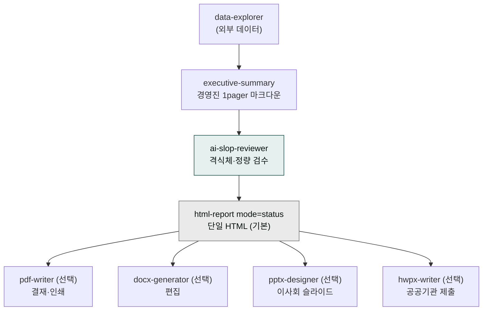

# moai-bi

> 경영진·이사회·투자자에게 보낼 1페이지 요약을 자동 생성하고, **단일 HTML 파일**로 묶어 카톡·이메일에 그대로 첨부할 수 있게 만드는 BI 플러그인입니다. 결재·이사회·공공기관 제출용은 pdf/docx/pptx/hwpx로 변환합니다.



## 무엇을 하는 플러그인인가

`moai-bi`는 한국 임원·이사회 표준에 맞춘 BI 리포트 풀스택입니다.

- **경영진 1pager**: 복잡한 분석·재무·운영 보고를 ≤500단어 1페이지로 변환
- **What / So What / Now What** 3-축 구조: 단순 요약이 아닌 **의사결정 옵션 + 권고안** 포함
- **K-IFRS 재무 지표 우선**: 매출·영업이익률·EBITDA·운전자본 등 한국 회계 기준
- **한국 통계 친화**: KOSIS·DART·공공데이터포털 데이터 직접 인용 가능
- **단일 HTML 기본 출력**: 카톡·이메일에 그대로 첨부 → 결재 라인 즉시 공유

## 기본 출력 = 단일 HTML 파일 (카톡 즉시 확인)

본 플러그인의 **모든 보고서는 기본적으로 `moai-content:html-report`로 단일 HTML 파일**을 만듭니다.

| 항목 | 정책 |
|---|---|
| 파일 수 | **1개** `.html` 파일 |
| 이미지 | 인라인 SVG 또는 base64 PNG |
| CSS | `<style>` 태그 인라인 (외부 프레임워크 0) |
| JS | `<script>` 태그 인라인 (필요 시) |
| 외부 의존성 | 한국어 폰트 CDN 1건만 예외 (Pretendard 등) |
| 공유 방법 | 카톡 첨부 / 이메일 첨부 / USB / 오프라인 열람 모두 가능 |

다른 형식이 필요할 때는 동일한 마크다운에서 분기 변환합니다.

## 설치



1. `moai-core` 설치 후 `moai-bi` 옆의 **+** 버튼을 눌러 설치합니다.
2. 단일 HTML 렌더링을 위해 `moai-content`도 함께 설치하면 즉시 사용 가능합니다.
3. 변환 분기가 필요하면 `moai-office`(pdf/docx/pptx/hwpx 통합)를 추가 설치합니다.
4. 재무 데이터를 자동 인용하려면 `moai-finance`도 함께 설치하면 체이닝이 매끄러워집니다.


[GitHub 저장소](https://github.com/modu-ai/cowork-plugins/tree/main/moai-bi)를 클론한 뒤 `~/.claude/plugins/`에 배치합니다.



## 핵심 스킬

| 스킬 | 용도 | 기본 출력 |
|---|---|---|
| `executive-summary` | 경영진 1페이지 요약 자동 생성 | `html-report (mode=status)` 단일 HTML |

KPI·코호트·재무 변동 분석은 [`moai-finance`](../moai-finance/) `variance-analysis`·[`moai-data`](../moai-data/) `data-visualizer`와 체이닝해 `executive-summary`로 1pager로 압축합니다.

## 대표 체인 (HTML 기본 + 변환 옵션)

**기본: 재무 → 카톡 공유용 단일 HTML**

```text
moai-finance:variance-analysis
  → moai-bi:executive-summary
  → moai-core:ai-slop-reviewer
  → moai-content:html-report (mode=status)
  → 1개 .html 파일 (카톡 첨부 가능)
```

**변환 1: HTML → 결재용 PDF**

```text
... → html-report → moai-office:pdf-writer → .pdf
```

**변환 2: HTML → 이사회 슬라이드**

```text
... → html-report → moai-office:pptx-designer → .pptx (1매)
```

**변환 3: HTML → 편집 가능한 DOCX**

```text
... → html-report → moai-office:docx-generator → .docx
```

**변환 4: HTML → 공공기관 제출 HWPX**

```text
... → html-report → moai-office:hwpx-writer → .hwpx
```

## 한국 임원 보고 특화

- **격식체 우선**: `…합니다` 종결, 이사회·감사 보고 어조에 맞춤
- **정량 우선**: 모든 주장에 수치·출처 결합 (서술형 형용사 최소화)
- **의사결정 옵션 명시**: A/B/C 옵션 + 각 옵션의 리스크·기대효과 요약
- **K-IFRS·DART**: 한국 회계 기준에 맞춘 재무 지표 표기
- **한국어 폰트 인라인**: Pretendard 등 가독성 폰트를 HTML에 결합

## 빠른 사용 예


> 지난 분기 마케팅 성과 보고서(20페이지)를 임원 1pager로 줄여서 카톡으로 보낼 수 있는 단일 HTML로 만들어줘.
> 형식: What/So What/Now What, 격식체, 핵심 수치 5개 + 의사결정 옵션 3개 + 권고안



> DART 공시한 우리 회사 분기 보고서를 이사회용 HTML 1pager + PPT 1매로 동시에 만들어줘.
> K-IFRS 기준 매출·영업이익률·운전자본 변동 강조.



> 이번 주 weekly-report를 C레벨 보고로 압축해서 HTML(카톡)·PDF(결재)·HWPX(공공) 세 가지로 한 번에.


## 다음 단계

- [`moai-content`](../moai-content/) — `html-report` 단일 HTML 렌더러 (본 플러그인의 기본 출력 엔진)
- [`moai-office`](../moai-office/) — pdf/docx/pptx/hwpx 변환 분기
- [`moai-finance`](../moai-finance/) — K-IFRS·세무 데이터 소스
- [`moai-business`](../moai-business/) — 시장조사·전략 보고서 체이닝
- [`moai-pm`](../moai-pm/) — 주간보고 자동화

---

### Sources

- [modu-ai/cowork-plugins README](https://github.com/modu-ai/cowork-plugins)
- [moai-bi 디렉터리](https://github.com/modu-ai/cowork-plugins/tree/main/moai-bi)
- [Thariq Shihipar — The Unreasonable Effectiveness of HTML](https://thariqs.github.io/html-effectiveness/) (html-report 사상 출처)
- KOSIS 국가통계포털, DART 전자공시시스템
