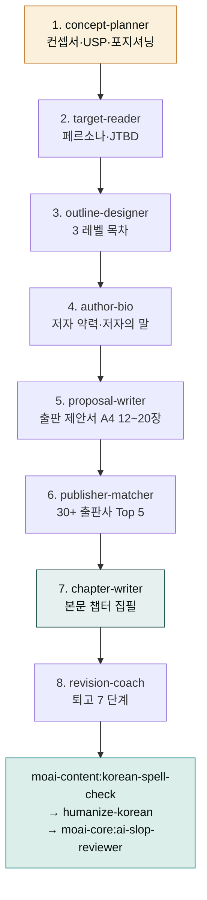

# moai-book

> 한 줄 자연어 한 마디로 컨셉서 → 페르소나 → 목차 → 저자 약력 → 출판 제안서 → 출판사 매칭 → 본문 집필 → 퇴고까지 8 단계 풀스택을 처리합니다. 실용서·인문·기술·소설 4 장르 자동 분기, 한빛·길벗·웅진·민음사·문학동네·창비·다산북스·휴머니스트 등 한국 주요 출판사 컨벤션 내장. 



## 무엇을 하는 플러그인인가

`moai-book`은 한국 출판사 제출용 원고를 처음부터 끝까지 책임지는 풀스택 플러그인입니다. 도서 컨셉서·타깃 독자 페르소나·목차 설계·저자 약력·출판 제안서·출판사 매칭·본문 챕터·퇴고 — 8 단계가 단일 플러그인 안에서 체이닝됩니다.

실용서·인문·기술서·소설 **4 장르 자동 분기**가 모든 스킬에 내장되어 있어, 장르를 한 번만 지정하면 이후 단계는 그 장르의 한국 출판사 컨벤션(어미·시점·문체·인용 패턴·표기 규칙)을 자동으로 따릅니다.

한국출판문화산업진흥원(KPIPA) 국민독서실태조사, 국립국어원 한글 맞춤법·외래어 표기법, 도서정가제(신간 18개월 정가 + 최대 10% + 5% 적립), 교보문고·알라딘·예스24 베스트셀러 통합 차트가 데이터 소스로 통합되어 있습니다.

## 설치



1. `moai-core` 설치 후 `moai-book` 옆의 **+** 버튼을 눌러 설치합니다.
2. 함께 권장: `moai-content` (정밀 윤문·맞춤법) — 퇴고 후처리 체인에 필수.


[GitHub 저장소](https://github.com/modu-ai/cowork-plugins/tree/main/moai-book)를 클론한 뒤 `~/.claude/plugins/`에 배치합니다.



## 핵심 스킬 (8 단계 순서)

| 단계 | 스킬 | 용도 | 대표 출력 |
|---|---|---|---|
| 1 | `book-concept-planner` | 도서 컨셉서·USP 3축·시장 포지셔닝·자비 vs 투고 의사결정 | 한 줄(15자)/30자/300자 요약 + 포지셔닝 매트릭스 |
| 2 | `book-target-reader` | 타깃 독자 페르소나·JTBD 3 차원·페인포인트 매트릭스 | 4축 카드 + 페인 4 분면(긴급·핵심·잠재·희귀) + 5인 인터뷰 검증 |
| 3 | `book-outline-designer` | 부·장·꼭지 3 레벨 목차 + 5요소 챕터 시놉시스 | 200자 원고지 분량 배분 + 페르소나 여정 4단계 검증 |
| 4 | `book-author-bio` | 저자 약력·저자의 말·SNS 채널별 변형 | 3 신뢰 신호 + 3 길이(50·200·500자) + 저자의 말 500-800자 |
| 5 | `book-proposal-writer` | 출판사 투고 제안서 A4 12-20장 | 출판기획서 5섹션 + 샘플 챕터 + 마케팅 플랜 5 카테고리 |
| 6 | `book-publisher-matcher` | 30+ 한국 출판사 Top 5 우선순위 추천 | 4 차원 평가(장르 40%·규모 25%·계약 20%·채널 15%) + 차순위 시나리오 |
| 7 | `book-chapter-writer` | 챕터 본문 집필 — 꼭지 단위 5 요소 | 훅 10%·본문 70%·클라이맥스 10%·정리 5%·연결 5% + 200자 원고지 카운트 |
| 8 | `book-revision-coach` | 퇴고·교열 7 단계 점검 | 어법·문체·논리·인용·분량·시각자료·일관성 + 6 일관성 차원 |

## 4 장르 자동 분기

| 장르 | 문체 프리셋 | 추천 출판사 |
|---|---|---|
| **실용서** | 명확한 단문·번호 매김·체크리스트·인용 ≥3종 | 웅진·다산북스·길벗·메가스터디북스 |
| **인문서** | 사색형 장문·인용·고전 참조·결론형 마무리 | 민음사·문학동네·창비·휴머니스트·은행나무·돌베개 |
| **기술서** | 코드블록·도표·정확한 용어·실습 단계 | 한빛미디어·인사이트·제이펍·길벗 IT |
| **소설** | 1·3인칭 시점·장면·대사·심리 묘사·전개 곡선 | 민음사·문학동네·창비·문학과지성사·자음과모음 |

## 한국 출판 컨텍스트 (2026 기준)

- **KPIPA**: 한국 출판 시장 데이터·국민독서실태조사·표준 양식
- **국립국어원**: 한글 맞춤법·외래어 표기법·우리말 우선 가이드
- **도서정가제**: 신간 18개월 정가 + 최대 10% 가격할인 + 5% 적립
- **베스트셀러 통합**: 교보문고·알라딘·예스24 3사 통합 권장
- **한국 출판사 30+**: IT(한빛·인사이트·제이펍·길벗 IT) · 실용(웅진·다산북스·길벗·메가스터디북스) · 인문(민음사·문학동네·창비·휴머니스트·은행나무·돌베개) · 문학(문학과지성사·자음과모음) · 아동(비룡소·사계절·창비 어린이)
- **신인 등단 경로**: 문학동네신인상·창비신인상·민음 신인 발굴 + 한국출판문화상·한국과학기술도서상
- **자비 출판 5 대안**: 부크크(POD)·텀블벅 출판 펀딩·인디고·카카오 브런치북·출판사 자비

## 대표 체인

**한국 출판사 투고 풀스택 (필수 후처리 포함)**

```text
book-concept-planner
  → book-target-reader
  → book-outline-designer
  → book-author-bio
  → book-proposal-writer
  → book-publisher-matcher
  → book-chapter-writer
  → book-revision-coach
  → moai-content:korean-spell-check
  → moai-content:humanize-korean       # AI 티 정밀 윤문 (필수)
  → moai-core:ai-slop-reviewer         # 최종 검수 (필수)
```

**자비 출판(부크크·텀블벅) 빠른 트랙**

```text
book-concept-planner
  → book-outline-designer
  → book-chapter-writer (반복)
  → book-revision-coach
  → moai-content:humanize-korean
  → moai-core:ai-slop-reviewer
```

**제안서만 작성(이미 본문 있음)**

```text
book-target-reader
  → book-author-bio
  → book-proposal-writer
  → book-publisher-matcher
```

## 사용 예시


> AI 영어 회화 앱 운영 후기를 책으로 묶고 싶어. 30·40대 직장인 타깃.


→ `book-concept-planner` 자동 호출 → AskUserQuestion(장르·자비/투고·분량) → 컨셉서·USP·포지셔닝 → `book-target-reader`로 이어짐.


> 실용서 원고 다 썼는데 어느 출판사에 보내야 할지 모르겠어.


→ `book-publisher-matcher` 자동 호출 → 장르·분량·저자 약력 입력 → 30+ 출판사 4차원 평가 → Top 5 + 차순위 시나리오.

## 주의·제한

- **이 플러그인은 한국 출판 시장에 특화**되어 있습니다. 해외 출판은 권장 출판사·도서정가제·KPIPA 통계 등 한국 컨텍스트가 적용되지 않으니 주의하세요.
- 8 스킬 모두 cowork-plugins frontmatter 정책 준수 (metadata 블록 0건, version 단일 필드).
- 외부 참고 자료 원문 비유·표현 직접 인용 0건 — 자체 재구성 후 한국 출판사 컨벤션으로 변환.
- 퇴고 단계에서 `moai-content:humanize-korean` + `moai-core:ai-slop-reviewer`는 **필수** — AI 티 잔존 시 출판사 거절 사유가 됩니다.
