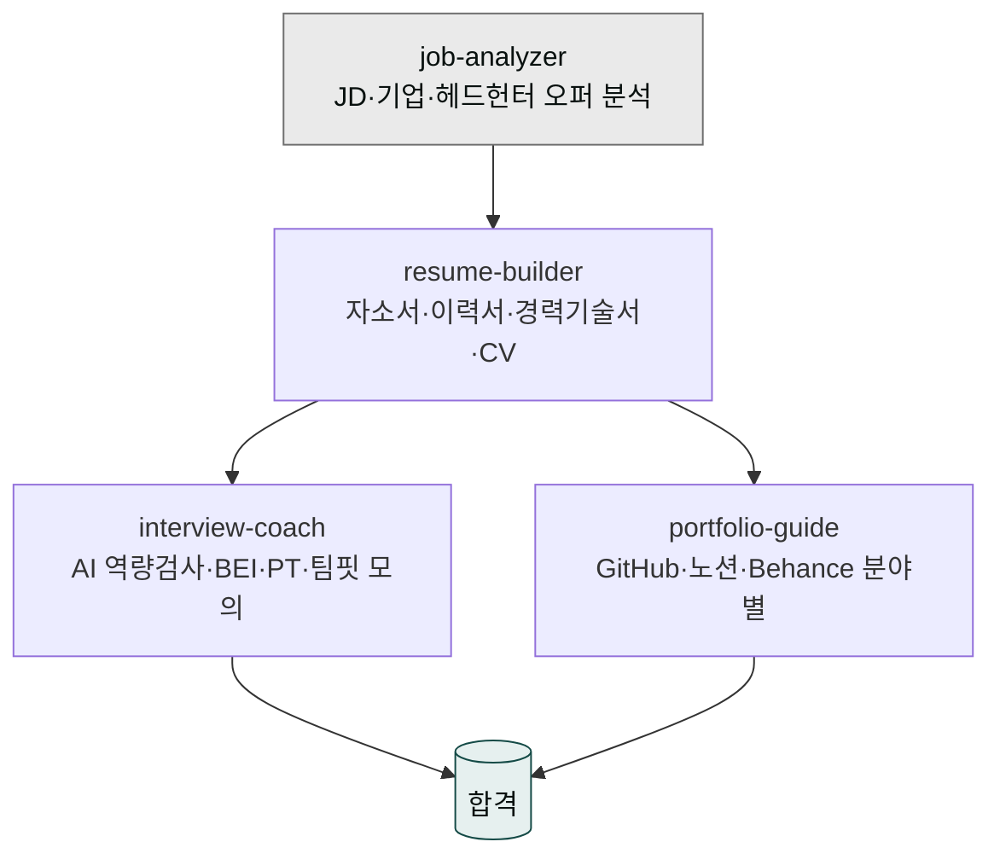
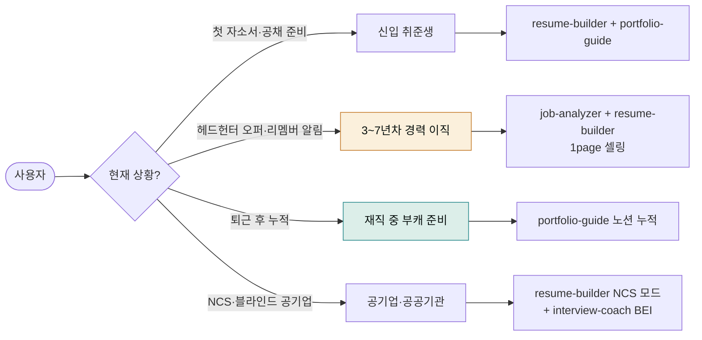

# moai-career

> 신입 취준생부터 4~7년차 경력 이직자·재직 중 부캐 준비자까지 같은 4 스킬로 커버합니다. 2026 한국 채용 시장의 **팀핏·핀셋 채용·AI 리터러시** 전환에 맞춰 재설계되었습니다.



## 무엇이 바뀌었나 — 2026 한국 채용 시장 키워드

| 영역 | ~2025 | 2026 (본 플러그인 반영) |
|---|---|---|
| 적합성 | 컬처핏 (조직 전체) | **팀핏** — 실제 함께 일할 팀 단위 |
| 규모 | 대규모 공채 | **소규모 핀셋(정밀) 채용** |
| 경로 | 정기 공채 중심 | **수시채용 + 타깃 기반** |
| 평가 | 학벌·자격증·스펙 | **스킬·프로젝트·포트폴리오 증거** |
| AI | 보조 도구 | **AI 에이전트 소싱 + AI 리터러시·진정성 검증** |
| 지원자 경험 | 일방 통보 | **탈락자 피드백·코칭 제공** (공정채용 가이드) |

핀셋 채용 시대에는 "1점 차로 떨어지는" 게 아니라 "그 자리에 처음부터 들어가지 못하는" 구조라 **지원 이전 단계**의 JD 분해·기업 분석·1page 셀링이 합격을 결정합니다.

## 누가 쓰면 좋은가



## 설치



1. `moai-core` 설치 후 `moai-career` 옆의 **+** 버튼을 눌러 설치합니다.
2. 산출물 저장(이력서 PDF/Word)용으로 `moai-office`도 함께 설치하면 좋습니다.


[GitHub 저장소](https://github.com/modu-ai/cowork-plugins/tree/main/moai-career)를 클론한 뒤 `~/.claude/plugins/`에 배치합니다.



## 핵심 스킬 (4개)

| 스킬 | 한 줄 설명 | 누구에게 |
|---|---|---|
| `resume-builder` | 자소서(KKK-STAR)·이력서(USP+CAR)·경력기술서·영문 CV·링크드인. 2026 ATS·AI 진정성 검증 회피 가드 | 전체 |
| `job-analyzer` | JD 분해·키워드 매칭·기업 리서치(DART+잡플래닛+블라인드+사람인 공고 이력)·헤드헌터 오퍼 검증 | 경력 이직 우선 |
| `interview-coach` | AI 역량검사·BEI·PT·토론·임원·**팀핏** 면접 — 모의 면접 루프 + 역질문 15종 | 전체 |
| `portfolio-guide` | 개발(GitHub·기술 블로그)·디자인(Figma·Behance)·마케팅·기획 분야별 + **검색되는 노션 포트폴리오** | 재직자 누적·신입 첫 구축 |

## 한국 채용 환경 특화 (8가지)

- **팀핏 평가 대응** — interview-coach가 조직 전체 컬처핏이 아닌 **함께 일할 팀의 업무 스타일·갈등 대응** 질문을 별도 모드로 처리합니다.
- **AI 진정성 검증 회피** — 챗GPT/제미나이 흔적이 남는 표현(추상 형용사·결론 클리셰·"~한 경험이 있습니다")을 자동 감지·재작성합니다.
- **블라인드 채용** — 학력·나이·사진·출신 마스킹 옵션.
- **NCS 기반 직무 매칭** — 공기업 직무기술서 양식 자동 변환.
- **수시채용·핀셋 대응** — 동일 회사 다른 직무·과거 6~12개월 채용 이력으로 회사 현재 우선순위 추출.
- **헤드헌터 흐름** — 사람인 출신 헤드헌터 오퍼 검증 + 영문/국문 이력서 병행 + 희망 연봉 ±20% 가이드.
- **자소서 분량 최적화** — 500/1000/1500자별 KKK-STAR 비율 자동.
- **공정채용 피드백 수용** — 탈락 후 받은 피드백을 다음 지원에 누적 반영.

## 채용 플랫폼별 활용 가이드 (2026)

| 플랫폼 | 강점 | 본 플러그인 활용 포인트 |
|---|---|---|
| **사람인** (MAU 921만) | 생산·제조·물류·서비스·중소 사무직, **헤드헌터 오퍼 최다** | job-analyzer로 헤드헌터 오퍼 JD·연봉대 검증 |
| **잡코리아** (MAU 761만) | 사무·경력·IT·마케팅, 대기업·중견 선호 | resume-builder 대기업 톤 + 공채 달력 연계 |
| **원티드** (MAU 61만 IT 집중) | 네카라쿠배·토스·우아한형제들 등 IT/스타트업 | portfolio-guide 노션·GitHub 가중치, 1page 셀링 |
| **리멤버** (MAU 506만, 시니어) | 연봉 5천만+ 상위 30% 경력직 프리미엄 | resume-builder 경력기술서 + 1page 셀링 시트 |
| **잡플래닛·블라인드** | 기업 리뷰·연봉·내부 분위기 | job-analyzer 조직문화 사실/의견 분리 분석 |

## 대표 체인

**신입 취준 풀패키지 (대기업 공채)**

```text
job-analyzer(JD+기업분석) → resume-builder(자소서·이력서) → ai-slop-reviewer
                              ↓
                        portfolio-guide(스펙·프로젝트)
```

**경력 이직 풀패키지 (수시채용·헤드헌터)**

```text
job-analyzer(JD+DART+잡플래닛) → resume-builder(경력기술서·1page 셀링)
                                   ↓
                             interview-coach(임원·팀핏)
```

**AI 면접 + 인성검사 대비**

```text
job-analyzer(기업 인재상) → interview-coach(AI 역량검사 모드 + 모의 루프 3회)
```

**재직자 누적 포트폴리오 (검색되는 노션)**

```text
portfolio-guide(노션 구조 6섹션) → docx-generator(이력서 PDF/Word) → ai-slop-reviewer
```

## 빠른 사용 예 (한 줄 요청 + 시스템 자동 인터뷰)

> 매번 옵션을 직접 작성할 필요 없습니다. 짧게 요청하면 시스템이 직무·기업·경력·글자수 등을 인터뷰로 수집합니다. ([사용 패턴 가이드](../../cowork/patterns/) 참조)


> 삼성전자 DX부문 SW 엔지니어 자소서 4문항 써줘


→ 시스템 인터뷰: 전공·인턴·프로젝트·글자수 → `job-analyzer → resume-builder → ai-slop-reviewer` 자동 체인


> 헤드헌터가 토스 PM 오퍼 줬어. 검토부터 면접 준비까지


→ 멀티턴: JD 분석 → 매칭 점수 → 1page 셀링 → 임원·팀핏 모의 면접


> 원티드에 노출되는 1page 노션 포트폴리오. 백엔드 5년차


→ `portfolio-guide` 6 섹션 구조 + GitHub 핀 프로젝트 가이드


> 공기업 NCS 자소서 1500자. 한국전력 사무 직군


→ NCS 직무기술서 양식 자동 + 블라인드 마스킹 + 공공가치 톤

## 다른 플러그인과의 경계

| 헷갈리는 영역 | 사용해야 할 스킬 |
|---|---|
| 채용 담당자(HR) 관점 JD·면접 설계 | `moai-hr/employment-manager` |
| HR의 NCS 기반 이력서 평가 | `moai-hr/resume-screener` |
| 정부 청년·창업 지원사업 신청서 | `moai-business/kr-gov-grant` |
| B2B 영업 제안서 | `moai-sales/proposal-writer` |
| 링크드인·블로그 등 퍼스널 브랜딩 콘텐츠 누적 | `moai-marketing` + `moai-content` |
| 코딩테스트 알고리즘 풀이 | 본 플러그인 범위 밖 (LeetCode·프로그래머스 등) |

## 다음 단계

- [`moai-office`](../moai-office/) — 이력서·포트폴리오 PDF/Word 저장
- [`moai-marketing`](../moai-marketing/) — 링크드인·퍼스널 브랜딩
- [`moai-content`](../moai-content/) — 블로그·기술 글 누적
- [`moai-hr`](../moai-hr/) — 채용 담당자 측 워크플로우

---

### Sources

- [modu-ai/cowork-plugins](https://github.com/modu-ai/cowork-plugins)
- [moai-career 디렉터리](https://github.com/modu-ai/cowork-plugins/tree/main/moai-career)
- [원티드 — 채용 트렌드 2026: 컬처핏을 넘어 팀핏](https://blog.wantedlab.com/hr/report/hr-trend-report-2026)
- [한경잡앤조이 — 2026 채용트렌드: 소규모 질적 채용](https://magazine.hankyung.com/job-joy/article/202512290531d)
- [ZDNet Korea — 기업 70% 올해 사람 뽑는다 (사람인 327개사)](https://zdnet.co.kr/view/?no=20260218142701)
- [사람인 vs 잡코리아 채용 공고 비교 2026](https://mykoreawork.com/ko/blog/saramin-jobkorea-paid-posting-comparison-2026)
