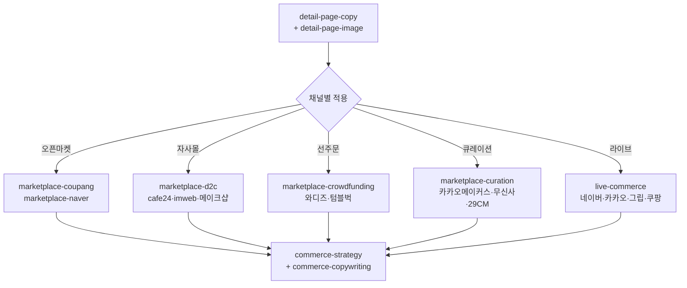

# moai-commerce

> 한국 이커머스 운영의 전 사이클을 한 플러그인에 담은 **35개 스킬** 묶음입니다. 시장조사부터 고객 분석·상품명·상세페이지·채널 메시지·통합 전략·광고 최적화·마진/LTV 설계·자동화 진단·법규 준수·프로모션·재구매·이미지 파이프라인·리뷰 통합·VOC·구독·인플루언서·식약처 안전까지 자연어 한 줄 입력으로 자동 체인 호출됩니다.

## 무엇을 하는 플러그인인가

`moai-commerce`는 월 매출 100만-10억 규모의 스마트스토어·자사몰·오픈마켓 셀러가 실제로 마주치는 작업을 다룹니다.

- **상세페이지 자동화**: 13섹션 감정여정 카피(Hero→Pain→Problem→Story→Solution→How→Proof→Authority→Benefits→Risk→Compare→Filter→CTA) + 1080×12720 단일 PNG 자동 합성. `--mode diagnose`(7단계 진단 점수) / `--mode copy`(페르소나 2세트, 비율 25/50/25 강제)
- **시장·고객·전략 분석**: 시장조사 4 MCP, JTBD 9 + 페르소나 3, 상품명 3안+검증, NCM 메시지 15종, 통합 전략 1장
- **운영 데이터 통합**: `commerce-morning-brief`(어제 주문·신규 문의·트렌드·ROAS 4영역) + `commerce-order-summary`(스마트스토어+카페24+아임웹 채널 통합)
- **5개 판매 채널 가이드**: 쿠팡·네이버 스마트스토어/11번가/G마켓/옥션, 카페24/아임웹/메이크샵 자사몰, 와디즈/텀블벅 크라우드펀딩, 카카오 메이커스/무신사/29CM 큐레이션, 네이버/카카오/그립/쿠팡 라이브 커머스
- **광고·수익 구조**: 쿠팡 광고 풀세트 최적화, 마진·엔드 ROAS 자동 계산, CAC→LTV 6대 지표 설계, 광고 의존도 30%→11-15% 6개월 로드맵
- **CRM·법규·재구매**: 정통망법 광고/정보성 메시지 자동 게이트(과태료 회피), 앱 푸시 4원칙, 재구매 골든타임 3구간
- **D2C 풀스택**: 멀티채널 리뷰 통합 분석, VOC 5단계 우선순위, 구독 4 모델, 인플루언서 5 티어, 충성 100명 부트스트랩, 시즌 캘린더 30+ 이벤트
- **상품 사진·이미지 파이프라인**: ProductDNA 추출, 추가 촬영 브리프, character-mgmt → image-gen → video-gen → 채널 변환 4단계 오케스트레이터
- **식약처 안전**: 의약품·식품 통합 조회 (e약은요·건강기능식품 인정현황·검사부적합·회수)

이미지 생성은 `moai-media:nano-banana`(Gemini 3 Image)·`media-gpt-image2-builder`(GPT Image 2)로 위임하며, 합성은 Pillow 기반 자체 스크립트로 처리하므로 외부 패키지 설치가 필요 없습니다. 모든 텍스트 산출물은 `ai-slop-reviewer`로 자동 체이닝됩니다.

## 설치



1. `moai-core` 설치 후 `moai-commerce` 옆의 **+** 버튼을 눌러 설치합니다.
2. 이미지 합성을 사용하려면 `moai-media`도 설치하고 `GEMINI_API_KEY`를 등록합니다 ([CONNECTORS.md](https://github.com/modu-ai/cowork-plugins/blob/main/moai-media/CONNECTORS.md)).


[GitHub 저장소](https://github.com/modu-ai/cowork-plugins/tree/main/moai-commerce)를 클론한 뒤 `~/.claude/plugins/`에 배치합니다.



## 핵심 스킬 (35개)

### 시장·고객·전략 분석 (6)

| 스킬 | 역할 | 대표 출력 |
|---|---|---|
| `commerce-market-research` | 시장조사 통합 — 거시·경쟁·검색 3축 데이터 수집 | 시장 리포트 1장 + 포지셔닝 5축 + 새 카테고리 창출 vs 경쟁 |
| `commerce-jtbd-persona` | 고객 분석 — `--mode jtbd`: JTBD 9개 + 심리적 필요 4종 / `--mode persona`: 페르소나 3명 8필드 + 타겟 온도 4단계 | JTBD 매트릭스 또는 페르소나 카드 |
| `commerce-product-naming` | 상품명 3안 — 공식 4요소(브랜드+카테고리+키워드+차별점) + 매핑 + 금지 키워드 9종 | 검색·CTR·브랜드 3안 + 25자·금지어 검증 |
| `commerce-channel-message` | 채널별 메시지 — 6 심리 방아쇠 + 인지 편향 9종 + NCM(Need→Channel→Moment→Message→CTA) | 검색·광고·CRM × 5종 = 15종 메시지 |
| `commerce-integrated-strategy` | 통합 전략 1장 — 자동화 4단계 + 3 Phase 로드맵 + HITL Golden Rule | 매출 향상 전략 1장 + 실행 우선순위 Top 3 |
| `commerce-strategy` | 채널 믹스·가격·프로모션 캘린더·리텐션·KPI 통합 | 단계별(런칭/성장/안정) 전략 |

### 상세페이지·이미지·사진 (4)

| 스킬 | 역할 | 대표 출력 |
|---|---|---|
| `detail-page-copy` | 13섹션 감정여정 카피 + `--mode diagnose`(7단계 점수) / `--mode copy`(페르소나 2세트, 비율 25/50/25) | 섹션별 카피 + 혜택 언어 3단계 변환법 |
| `detail-page-image` | 13섹션 이미지 프롬프트 → nano-banana 호출 → Pillow 합성 | 1080×12720 단일 PNG |
| `product-photo-brief` | ProductDNA 추출 + 부족한 컷 식별 + 추가 촬영 브리프 | 13섹션 컷 매핑 + 촬영 리스트 |
| `commerce-product-image-pipeline` | 상품 이미지·영상 풀스택 오케스트레이터 — character-mgmt → image-gen(Soul) → video-gen(DOP) → channel-ad-packager 4단계 자동 호출 | 이미지 5축(Hero·Lifestyle·Detail·Use-case·Result) + 영상 모션 + 채널 변환 + 비용 ₩2,300-4,000/상품 |

### 운영 데이터 통합 (2)

| 스킬 | 역할 | 대표 출력 |
|---|---|---|
| `commerce-morning-brief` | 어제 주문·신규 문의·트렌드·ROAS 4영역 1줄 통합 | 매장 아침 브리핑 1줄 |
| `commerce-order-summary` | 스마트스토어 + 카페24 + 아임웹 채널 통합 신규 주문 1줄 | 채널 통합 주문 1줄 |

### 광고·마진·자동화 (3)

| 스킬 | 역할 | 대표 출력 |
|---|---|---|
| `coupang-ad-optimizer` | 쿠팡 광고 풀세트 최적화 — 3 캠페인 분류(검색/비검색)·엔드 ROAS·자동규칙 3종 | 월 매출 분석 + 최적화 로드맵 + 자동규칙 설정 가이드 |
| `commerce-margin-calculator` | 마진·엔드 ROAS 자동 계산 — 채널별 수수료(스마트스토어 5.94%·쿠팡 10.6%·카페24 2-3%·아임웹 0-2.5%)·부가세·결제수수료·쿠폰 자동 반영 | 채널별 실적립 마진율 + ROAS 계산표 |
| `commerce-automation-audit` | 6대 영역(A-F) 자동화 진단 + 3분류(반복/판단/창의)·우선순위 점수·3 Phase 로드맵·5 KPI·HITL Golden Rule(80% 자동화 + 10배 검수) | 자동화 진단 리포트 + 우선순위 점수 + 3 Phase 로드맵 |

### CRM·LTV·법규 (3)

| 스킬 | 역할 | 대표 출력 |
|---|---|---|
| `commerce-ltv-cac-architect` | CAC→재구매율→구매주기→ARPU→공헌이익→LTV 6대 지표 + LTV/CAC ratio·Payback·광고 의존도 진단 | 손익분기 ROAS + 광고 의존도 30%→11-15% 6개월 로드맵 + 한국 D2C 벤치마크 |
| `commerce-push-planner` | 앱 푸시 4원칙(왜/언제/누구에게/어떻게) + Timely·Personal·Actionable + 카피 변형 3안 | 한국 30+ 브랜드 레퍼런스(토스·배민·오늘의집 등) + 클릭률 예측 |
| `commerce-marketing-compliance-kr` | 정통망법 광고·정보성 메시지 자동 게이트 — 6대 점검(광고성 판정·옵트인·야간 21시-익일 8시 차단·(광고) 표기·무료 수신거부·발신자 정보) | BLOCK/PASS 판정 + 위반 조항(제50조·제76조). 과태료 1회 최대 3,000만원 회피 |

### 프로모션·재구매 (2)

| 스킬 | 역할 | 대표 출력 |
|---|---|---|
| `commerce-promotion-planner` | 3대 프로모션 기획법(이슈화·얼리버드·한정) — 브랜드 단계 × 목표 매트릭스 + 명목·스토리·혜택 3종 세트 + 벤치마킹 케이스 3개 | 노션 템플릿 8섹션 + 비플레인 '듣보잡' 12배 매출 케이스 매뉴얼 |
| `commerce-repurchase-timer` | 재구매 골든타임 3구간(리마인드 0.8T / 데드라인 1.1T / 휴면 1.5T) + 채널·인센티브 강도 + 리드 스코어링 8개 행동 | 한국 10 카테고리 표준 주기 매트릭스 + 리텐션 cohort 분석 가이드 |

### D2C·CRM·트렌드 (7)

| 스킬 | 역할 | 대표 출력 |
|---|---|---|
| `commerce-review-aggregator` | 멀티채널 리뷰 통합 분석 — 네이버 스마트스토어·쿠팡·자사몰·YouTube·인스타그램 5채널 → 감정·키워드·인사이트·액션플랜 4단 분석 | 채널별 수집 가이드(API·CSV·Graph API) + 우선순위 액션 5개 |
| `commerce-voc-triage` | VOC 우선순위 판별 — 3축 분류(고객 핏 ×1-3 / 빈도 ×1-3 / 핵심 가치 ×1-3) + KTAS 응급실 5단계 매핑 | 등급별 응답 톤·내용 가이드 (Level 1 즉시 <1시간 / Level 5 <1주) |
| `commerce-subscription-strategist` | 구독 비즈니스 설계 — 5가지 질문 자기진단 + 4 모델(소비재/경험/관계/맞춤) + 한국 시장 적합성 진단 | 락인 vs 이탈 방지 메시지 매트릭스 6단계 |
| `commerce-influencer-collab` | 인플루언서·UGC 협업 — 5 티어(메가/매크로/마이크로/나노/메가나노) × 비용·전환율 + 뒷광고 회피 6항목(표시광고법·공정위) | UGC 리그램 가이드 + 5축 굿즈 기획. 과태료 5,000만원 회피 |
| `commerce-early-fan-builder` | 신생 브랜드 충성 100명 부트스트랩 — 5원칙(광고 0원·1:1 손편지·UGC 100%·비공개 채널·추천) + 30일 로드맵 | 핵심 지표(재구매율 80%+·평균 10명 추천·LTV/CAC ratio 3+) |
| `commerce-trend-namer` | 네이버 데이터랩 트렌드 변환 — 카테고리별 급상승 검색어·시즌 트렌드 | 상품명 변형 3안 + 해시태그 30개 + 블로그 제목 SEO 3안 |
| `commerce-season-calendar` | 연간 시즌 캘린더 — 한국·글로벌 30+ 이벤트(설날·발렌타인·졸업·휴가·추석·빼빼로·블프·솽스이·크리스마스) + 카테고리별 매출 피크 | 분기 캠페인 사전 준비 계획(D-30/D-60/D-90/D-120) |

### 채널 가이드 (5)

| 스킬 | 역할 | 대표 출력 |
|---|---|---|
| `marketplace-coupang` | 쿠팡 정책·검색최적화·우수상품·로켓배송 가이드 | 채널 적합성 검토 |
| `marketplace-naver` | 네이버 스마트스토어 + 11번가/G마켓/옥션 통합 가이드 | 4개 오픈마켓 정책 적용 |
| `marketplace-d2c` | 카페24·아임웹·메이크샵 자사몰(D2C) 운영 가이드 | 도메인·결제·디자인·SEO 통합 |
| `marketplace-crowdfunding` | 와디즈·텀블벅 크라우드펀딩 프로젝트 기획 | 페이지 카피·영상 시놉시스·리워드 |
| `marketplace-curation` | 카카오 메이커스·무신사·29CM 큐레이션 입점 가이드 | 입점 제안서 + 브랜드 콘셉트 정렬 |

### 마케팅·라이브·안전 (3)

| 스킬 | 역할 | 대표 출력 |
|---|---|---|
| `commerce-copywriting` | 광고·톡톡·푸시·이메일·카트이탈 카피 | 채널·길이·톤 맞춤 카피 |
| `live-commerce` | 네이버 쇼핑라이브·카카오·그립·쿠팡 라이브 가이드 | 30/60분 진행 스크립트 |
| `mfds-safety` | 식약처(MFDS) 의약품·식품 안전 통합 — e약은요·건강기능식품 인정현황·검사부적합·회수 | Red flag 우선 안내 + API 조회 결과 |

## 채널 커버리지



## 대표 체인

**상세페이지 풀 자동화 (시장 분석 → 카피 → 합성 이미지)**

```text
commerce-market-research → commerce-jtbd-persona(persona) → commerce-product-naming
→ detail-page-copy(diagnose) → detail-page-copy(copy) → detail-page-image
→ marketplace-coupang(또는 naver) → ai-slop-reviewer
```

**광고 운영 최적화 (쿠팡 + 마진 + 자동화 진단)**

```text
commerce-margin-calculator → coupang-ad-optimizer → commerce-automation-audit
→ commerce-ltv-cac-architect → commerce-integrated-strategy
```

**자사몰 신규 런칭**

```text
commerce-strategy → detail-page-copy → detail-page-image → marketplace-d2c
→ commerce-copywriting → ai-slop-reviewer
```

**크라우드펀딩 신상품 사전판매**

```text
product-photo-brief → marketplace-crowdfunding → detail-page-copy → ai-slop-reviewer
```

**라이브 방송 1회분**

```text
live-commerce → commerce-copywriting(라이브 카피) → ai-slop-reviewer
```

**CRM 발송 게이트 (법규 준수)**

```text
commerce-push-planner → commerce-marketing-compliance-kr → (PASS 시 발송)
```

**리뷰·VOC 통합 액션**

```text
commerce-review-aggregator → commerce-voc-triage → commerce-promotion-planner
```

## 빠른 사용 예 (한 줄 요청 + 시스템 자동 인터뷰)

> 옵션을 매번 직접 작성할 필요 없습니다. 짧은 한 줄로 요청하면 시스템이 카테고리·가격대·USP·채널 등을 인터뷰로 수집합니다. ([사용 패턴 가이드](../../cowork/patterns/) 참조)


> 무선 이어폰 상세페이지 만들어줘


→ 시스템 인터뷰: 카테고리·가격대·USP·주요 채널 → 자동 체인 (`detail-page-copy → detail-page-image → marketplace-coupang → ai-slop-reviewer`)


> 쿠팡 광고 최적화 진단해줘


→ 시스템 인터뷰: 월매출·광고비·핵심 SKU → `commerce-margin-calculator → coupang-ad-optimizer → commerce-ltv-cac-architect` 자동 체인


> 와디즈에 사전판매할 휴대용 커피머신 프로젝트 페이지 기획해줘


→ 시스템 인터뷰: 목표 금액·펀딩 기간·리워드 단계 → `product-photo-brief → marketplace-crowdfunding → detail-page-copy` 자동 체인


> 우리 브랜드 충성 고객 100명 만드는 전략 짜줘


→ 시스템 인터뷰: 카테고리·현재 LTV·예산 → `commerce-early-fan-builder → commerce-subscription-strategist → commerce-push-planner` 자동 체인

## `mfds-safety` — 식약처 의약품·식품 안전

식품의약품안전처(MFDS) 공식 OpenAPI를 통해 의약품과 식품의 안전 정보를 통합 조회합니다. 헬스/F&B 커머스 상품 검수, 회수·부적합 이력 점검, 소비자 안전 안내에 활용합니다. 의약품 `mfds-drug-safety`와 식품 `mfds-food-safety`를 한 스킬로 통합했습니다.

### Red Flag 정책 (HARD)

사용자가 증상·복용/섭취 상황을 말하면 **반드시 인터뷰로 먼저 되묻고**, 다음 red flag 발견 시 API 조회보다 **즉시 119·응급실·의료진 안내**가 우선합니다.

- 호흡곤란, 의식저하, 입술·혀 붓기, 심한 발진
- 혈변, 심한 탈수, 심한 복통/고열, 지속되는 구토/흉통

본 스킬은 **진단·처방·복용 지시**를 하지 않습니다. 공식 문서에 있는 효능·주의·상호작용·기능성 문구만 근거로 요약합니다.

### 조회 가능 데이터 + 식품안전나라 서비스 코드

서비스 코드는 NomaDamas k-skill 명세 기준입니다. 식약처 통합 진입점은 [식의약 데이터 포털 (data.mfds.go.kr)](https://data.mfds.go.kr) 이며, 식품안전나라 OpenAPI는 [foodsafetykorea.go.kr/apiMain.do](https://www.foodsafetykorea.go.kr/apiMain.do) 에서 발급받습니다.

| 카테고리 | 서비스 코드 | 항목 |
|---|---|---|
| 의약품 | (data.go.kr) | e약은요(효능·사용법·주의사항·상호작용), 안전상비의약품 |
| 건강기능식품 — 기능성 원료 | I-0040 | 기능성 원료 인정현황 |
| 건강기능식품 — 개별인정형 | I-0050 | 개별 인정 원료의 1일 섭취량·기능성·주의사항 |
| 건강기능식품 — 품목제조 신고 | I0030 | 신고된 제품의 원재료·기능성·기준규격 |
| 검사부적합 (국내) | I2620 | 국내 유통 식품 부적합 판정 이력 |
| 회수·판매중지 | I0490 | 식품안전나라 공개 회수 목록 |

### 사용 측 준비

- **사용자 측 API 키 불필요** — NomaDamas hosted 프록시가 `DATA_GO_KR_API_KEY`, `FOODSAFETYKOREA_API_KEY` 보유
- self-host가 필요하면 `KSKILL_PROXY_BASE_URL` 환경변수로 대체

### 출처 어트리뷰션

본 스킬은 **NomaDamas/k-skill** (MIT) 의 `mfds-drug-safety`와 `mfds-food-safety`를 통합 포팅했습니다. 공식 데이터 출처:

- [식품의약품안전처](https://www.mfds.go.kr)
- [식품안전나라 OpenAPI](https://www.foodsafetykorea.go.kr)
- [공공데이터포털](https://www.data.go.kr)

## 다음 단계

- [`moai-content`](../moai-content/) — 블로그·뉴스레터 결합 콘텐츠 마케팅
- [`moai-media`](../moai-media/) — 추가 이미지·영상·음성 생성
- [`moai-marketing`](../moai-marketing/) — SEO 감사·캠페인 기획·성과 보고
- [`moai-business`](../moai-business/) — 사업계획서·시장조사·재무모델

---

### Sources

- [modu-ai/cowork-plugins README](https://github.com/modu-ai/cowork-plugins)
- [moai-commerce 디렉터리](https://github.com/modu-ai/cowork-plugins/tree/main/moai-commerce)
- 채널별 공식 가이드: 쿠팡 셀러센터, 네이버 스마트스토어 센터, 카페24 매뉴얼, 와디즈 메이커 가이드, 무신사 셀러 정책 등
- [NomaDamas/k-skill](https://github.com/NomaDamas/k-skill) — MIT — `mfds-drug-safety`, `mfds-food-safety` 원본 (v2.0.0, 통합)
- [식의약 데이터 포털 (data.mfds.go.kr)](https://data.mfds.go.kr) — 식약처 OpenAPI 통합 진입점
- [식품안전나라 OpenAPI (foodsafetykorea.go.kr/apiMain.do)](https://www.foodsafetykorea.go.kr/apiMain.do) — 키 발급
- [공공데이터포털 (data.go.kr)](https://www.data.go.kr) — e약은요·안전상비의약품·부적합 식품 API
