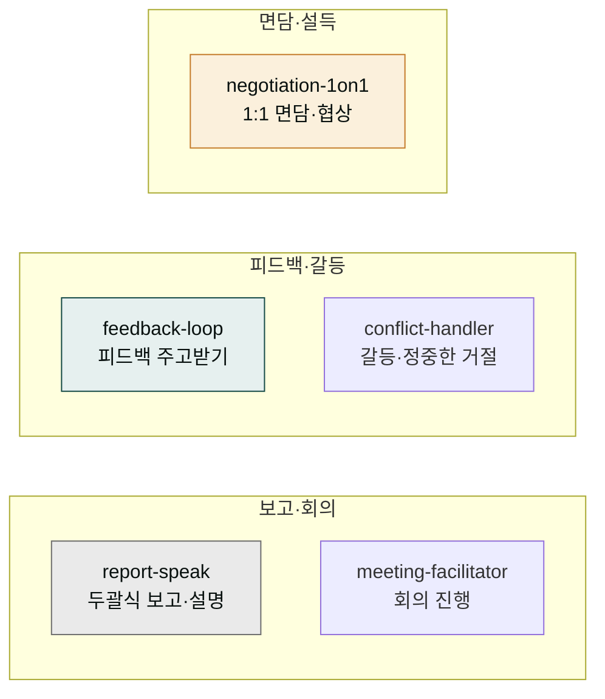

# moai-comms

> 직장에서 매일 부딪히는 사람 사이의 소통을 돕는 5개 소프트스킬을 제공합니다.



## 무엇을 하는 플러그인인가

`moai-comms`는 상사에게 결론부터 꽂히게 보고하는 법, 산으로 가는 회의를 결론까지 끌고 가는 진행, 부정적 피드백을 소화하고 건설적으로 전달하는 법, 까다로운 동료와 거리를 지키며 일하는 법, 면담·요청·정중한 거절·협상까지 직장 대인 커뮤니케이션 전반을 돕습니다. 기술이 아니라 **태도와 구조**로 풀어가는 소프트스킬 모음으로, 의지가 아니라 말의 순서·요청 구조를 바꿔 해결하는 데 초점을 둡니다.

공식 인사 면담·성과평가 피드백은 [`moai-hr`](../moai-hr/)가, 문서·이메일 글쓰기는 [`moai-office`](../moai-office/)·[`moai-content`](../moai-content/)가 맡고, 사람 사이의 실시간 소통은 `moai-comms`로 역할이 분리됩니다.

## 설치



1. `moai-core` 설치 후 `moai-comms` 옆의 **+** 버튼을 눌러 설치합니다.


[GitHub 저장소](https://github.com/modu-ai/cowork-plugins/tree/main/moai-comms)를 클론한 뒤 `~/.claude/plugins/`에 배치합니다.



## 핵심 스킬 (5개)

| 스킬 | 용도 |
|---|---|
| `report-speak` | 결론 먼저·두괄식 보고, 상사 유형별 보고 방식, 상대 뇌에 꽂히는 설명, 핵심 요약 |
| `meeting-facilitator` | 아젠다 설계, 산으로 가는 회의 방지, 의사결정 끌어내기, 회의록·후속 액션 |
| `feedback-loop` | 부정적 피드백 소화, 피드백 회피 극복, 건설적 피드백 전달(SBI), 중간 피드백 요청 |
| `conflict-handler` | 소통빌런 유형별 대응, 정중한 거절, 감정 분리, 직장 관계 거리 두기 |
| `negotiation-1on1` | 1:1 면담 준비, 설득 구조 설계, 요청·부탁·정중한 거절, 협상 태도 |

## 한국 직장 커뮤니케이션 특화

- **수평·하이브리드 근무, 메신저 보고** 맥락을 반영한 2026년 직장 화법
- **상사 유형별** 보고·대응 프레임 (디테일형·결론형·관계형 등)
- **구조로 푸는 소프트스킬** — 의지가 아니라 말의 순서·요청 구조를 바꿔 해결
- **감정과 사안 분리** — 갈등을 인격이 아니라 행동·사안 단위로 다루기

## 대표 체인

**중요한 보고 준비**

```text
report-speak(결론·구조 설계) → conflict-handler(까다로운 상사 대비) → meeting-facilitator(보고 회의 진행)
```

**피드백 면담 준비**

```text
feedback-loop(피드백 정리) → negotiation-1on1(면담 대화 설계)
```

**까다로운 요청 풀기**

```text
conflict-handler(상황·유형 진단) → negotiation-1on1(요청·거절 구조)
```

## 사용 예시


> 내일 팀장님한테 프로젝트 지연 보고해야 하는데 어떻게 말해야 깔끔할까?


→ `report-speak` 자동 호출 → 두괄식 결론 구조 → 상사 유형별 보고 톤 → 30초 안에 전달되는 보고 스크립트.


> 이번 회의가 자꾸 산으로 가는데 아젠다랑 진행을 어떻게 잡지?


→ `meeting-facilitator` 자동 호출 → 아젠다 설계 → 발산·수렴 진행 가이드 → 의사결정·후속 액션 정리.


> 자꾸 떠넘기는 동료한테 기분 안 상하게 거절하는 법 알려줘


→ `conflict-handler` 자동 호출 → 소통빌런 유형 진단 → 감정 분리 → 정중한 거절 화법.

## 다른 플러그인과의 경계

| 비슷해 보이지만 다른 영역 | 사용해야 할 스킬 |
|---|---|
| 공식 인사 면담·성과평가·평가 피드백 | [`moai-hr`](../moai-hr/) `performance-review` |
| 보고서·기획서·이메일 글쓰기·문서 작성 | [`moai-office`](../moai-office/) · [`moai-content`](../moai-content/) |
| 마케팅 카피·콘텐츠 글쓰기 | [`moai-content`](../moai-content/) 계열 |
| 개인 목표·습관·회고 등 자기관리 | [`moai-productivity`](../moai-productivity/) |
| 영업 제안·계약 협상 문서 | [`moai-business`](../moai-business/) |

## 다음 단계

- [`moai-productivity`](../moai-productivity/) — 개인 목표·습관·자기관리
- [`moai-hr`](../moai-hr/) — 공식 인사·성과평가

---

### Sources

- [modu-ai/cowork-plugins](https://github.com/modu-ai/cowork-plugins)
- [moai-comms 디렉터리](https://github.com/modu-ai/cowork-plugins/tree/main/moai-comms)
