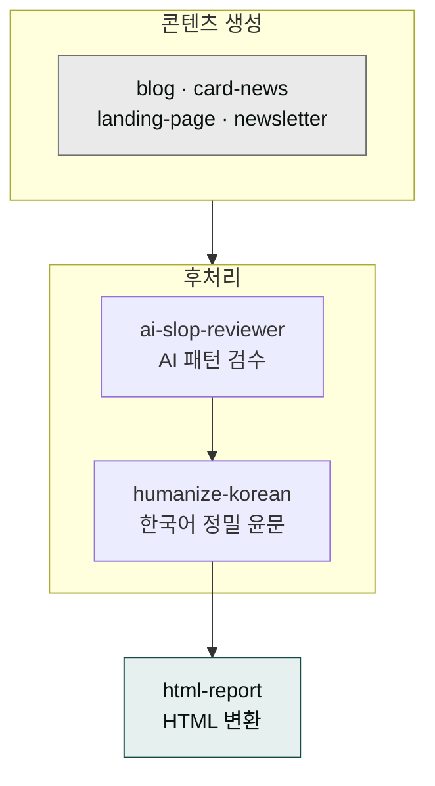

# moai-content

> 한국 마케팅·콘텐츠 실무에 최적화된 15개 스킬을 제공합니다. 네이버 블로그·티스토리·인스타그램·LinkedIn·카카오 채널까지 플랫폼별 알고리즘 차이를 반영하고, 마크다운 보고서 HTML 변환(`html-report`)·한국어 맞춤법 검수(`korean-spell-check`)·한국어 AI 티 윤문(`humanize-korean`)을 모두 포함합니다. 한국 이커머스 상세페이지 기획·구조·전략 설계는 `detail-page-planner`가 전담합니다.



## 무엇을 하는 플러그인인가

`moai-content`는 한국 디지털 마케팅 채널의 실제 운영 노하우를 반영해 설계된 텍스트 콘텐츠 생성 플러그인입니다. 단순히 글을 만드는 데 그치지 않고, 네이버 C-Rank·D.I.A. 알고리즘이나 인스타그램의 카드뉴스 길이 기준 등 채널별 베스트 프랙티스를 본문 구조에 반영합니다.

블로그 포스트·카드뉴스·랜딩페이지·뉴스레터·**상세페이지 기획**·상세페이지·SNS·카피라이팅·미디어 기획·한국어 맞춤법·**한국어 AI 티 정밀 윤문**·**마크다운 보고서 HTML 변환**까지 15개 스킬이 도메인별로 분리되어 있어, 필요한 채널만 선택해 호출할 수 있습니다.

별도 API 키 없이 사용 가능하며, WordPress 자동 업로드를 원하면 WordPress MCP 연결이 필요합니다.

## 설치



1. `moai-core` 설치 후 `moai-content` 옆의 **+** 버튼을 눌러 설치합니다.


[GitHub 저장소](https://github.com/modu-ai/cowork-plugins/tree/main/moai-content)를 클론한 뒤 `~/.claude/plugins/`에 배치합니다.



## 핵심 스킬

| 스킬 | 용도 | 대표 출력 |
|---|---|---|
| `blog` | 네이버·티스토리·브런치·WordPress·Ghost 블로그 포스트 | 플랫폼별 SEO 최적화 본문 |
| `card-news` | 인스타그램·페이스북 카드뉴스·캐러셀 | 슬라이드별 카피 + 이미지 프롬프트 |
| `landing-page` | 단독 전환 목적 랜딩 페이지 | HTML (Tailwind) + 카피 |
| `detail-page-planner` | 한국 이커머스 상세페이지 기획·구조·전략 설계. 5대 기획 모듈 + 4유형 오프닝 분기 | Brief(원 메시지·오프닝·본문 뼈대·채널·이미지 체크리스트) |
| `product-detail` | 네이버 스마트스토어·쿠팡 상세페이지 | 상세 HTML + 이미지 프롬프트 |
| `newsletter` | 이메일 뉴스레터 (stibee·mailchimp 스타일) | HTML + 제목 A/B 안 |
| `copywriting` | 광고 헤드라인·슬로건·CTA | 3-5개 대안 카피 |
| `social-media` | 릴스·쇼츠·스레드·X·LinkedIn 포스트 | 플랫폼별 버전 |
| `media-production` | 유튜브·팟캐스트 기획, 콘텐츠 캘린더 | 기획서·큐시트 |
| `korean-spell-check` | 바른한글(부산대) 한국어 맞춤법·띄어쓰기 최종 검수 | 원문/교정안/이유 |
| `humanize-korean` | 한국어 AI 티 정밀 윤문 — 10대 카테고리 × 40+ 패턴 SSOT, 의미 100% 보존, A/B/C/D 등급 | final.md (윤문본) + summary.md (메트릭·등급) |
| `html-report` | 마크다운 보고서 → 단일 파일 HTML — Thariq HTML-effectiveness, 인라인 SVG + vanilla JS, 12-25KB 산출물 | .html 파일 (자체 완결형) |

## 한국 시장 특화 포인트

- 네이버 **C-Rank·D.I.A. 알고리즘**을 반영한 본문 구조
- **GEO(생성형 검색 최적화)** 시대에 맞춘 FAQ·스키마 마크업 권장
- 인스타그램 **2026년 알고리즘** 변화 대응 캐러셀 길이 기준
- 네이버 블로그·티스토리의 **SEO 점수** 체크포인트 내장

## 대표 체인

**블로그 발행 파이프라인**

```text
blog → ai-slop-reviewer → (선택) moai-media:higgsfield-image
```

**쇼핑몰 상세페이지**

```text
product-detail → moai-media:higgsfield-image → ai-slop-reviewer
```

**카드뉴스 시리즈**

```text
card-news → moai-media:higgsfield-image → ai-slop-reviewer
```

## 빠른 사용 예

```text
네이버 블로그에 '프리랜서 3.3% 원천징수' 주제로 2000자 분량 글 써줘.
키워드는 '원천징수 신고', '종합소득세'.
```

```text
> 인스타그램 6슬라이드 카드뉴스로 정부 지원금 신청 방법 만들어줘.
```

## `korean-spell-check` (한국어 맞춤법 검수)

부산대학교 인공지능연구실과 ㈜나라인포테크가 공동 개발한 **바른한글** 공개 검사 표면을 이용해 한국어 문장을 최종 검수합니다. 2024년 10월 기존 "부산대학교 한국어 맞춤법 검사기"에서 **바른한글**로 정식 리브랜딩되었으며, 구 도메인 `speller.cs.pusan.ac.kr`은 폐기되고 [`nara-speller.co.kr`](https://nara-speller.co.kr/speller/)로 통합되었습니다. 블로그·뉴스레터·카피·계약서 등 텍스트 산출물의 마지막 단계에서 사용합니다.

### 권장 체인 위치 — `ai-slop-reviewer` 직후

### AI 글에서 기계 티를 빼는 두 단계 — ai-slop → humanize 체인

AI가 쓴 글을 읽다 보면 어딘가 기계 맛이 납니다. "혁신적인 솔루션", "첫째, 둘째, 마지막으로" 같은 반복, "많은 사람들은~" 같은 뭉툭한 일반화가 대표적입니다. 이런 흔적을 **AI 슬롭(AI slop, AI가 찍어낸 티 나는 텍스트)**이라 부르고, 이걸 사람 글처럼 다시 다듬는 작업을 **휴머나이즈(humanize, 사람화)**라고 합니다. cowork는 이 두 작업을 순서대로 묶어 **후처리 체인**으로 돌립니다.

비유하자면 번역물을 두 번 손보는 것과 같습니다. 1차 통역사가 대강 옮긴 뒤, 2차 교정자가 문맥을 다듬는 식입니다. 먼저 `ai-slop-reviewer`가 과장 수식어·기계 접속어·모호한 일반화 같은 **일반적인 AI 패턴**을 찾아 빼고 사람 톤으로 정리합니다. 예를 들어 "획기적으로 개선된 혁신적인 플랫폼"이라는 문장은 "쓰기 편해진 플랫폼" 정도로 줄입니다. 그 뒤 `humanize-korean`이 한국어 특유의 결을 잡습니다 — 영어식 번역투("…를 통해"), 남발하는 한자어 명사화, 정체 없는 관용구("시사하는 바가 크다"), 형식 명사 결말("…인 것이다") 같은 **한국어 SSOT 40개 이상의 패턴**을 정량 메트릭으로 찾아 수술합니다.

왜 두 단계로 나누는지가 핵심입니다. 1차는 "글의 뼈대에서 AI 냄새를 빼는" 단계이고, 2차는 "한국어 결로 살을 채우는" 단계입니다. `humanize-korean`은 의미 100% 보존을 원칙으로 삼아 사실·수치·고유명사·직접 인용은 한 글자도 바꾸지 않고, 변경률이 30%를 넘으면 경고, 50%를 넘으면 되레 롤백까지 합니다 — 과윤문을 막기 위해서입니다. 마지막엔 A/B/C/D 등급까지 매겨줘 "이 글이 얼마나 사람 같은지"를 숫자로 확인합니다. 이 체인을 거친 글은 배포 전 마지막으로 사람이 한 번 읽어주면 끝입니다.

```text
{콘텐츠 생성 스킬} → ai-slop-reviewer → korean-spell-check → 사용자 최종 검토
```

`ai-slop-reviewer`는 AI 패턴(과한 형용사·반복·번역체)을 검수하고, `korean-spell-check`는 규칙 기반 띄어쓰기·맞춤법을 잡습니다 — 차원이 다릅니다.


📊 [다이어그램으로 보기](/diagrams/ai-slop-humanize.html) — 브라우저에서 바로 열립니다. 편집은 [`ai-slop-humanize.drawio`](/diagrams/ai-slop-humanize.drawio)를 [app.diagrams.net](https://app.diagrams.net)에서 여세요.

### Policy first

- 공개 웹 검사기(`nara-speller.co.kr`)는 **비상업·저빈도** 사용 정책을 명시합니다.
- 본 스킬은 **사용자 주도 최종 검수**용이며, 대량 배치·SaaS 백엔드 연동·상업 서비스 무단 재판매에는 사용하지 않습니다.
- 1500자 청크 분할 + 청크 간 1초 휴지로 conservative 호출.

### 출처 어트리뷰션

본 스킬은 **NomaDamas/k-skill** (MIT) 의 `korean-spell-check`를 cowork에 포팅했습니다.

- **공개 검사 표면**: [바른한글 (nara-speller.co.kr)](https://nara-speller.co.kr/speller/) — 신버전(권장)
- **이전 버전 (form POST 자동화 호환)**: [old_speller](https://nara-speller.co.kr/old_speller/)
- **개발 주체**: 부산대학교 인공지능연구실 + ㈜나라인포테크 공동 개발 (1991년 권혁철 교수 시작, 2001년 웹 서비스 개시, 2024-10 리브랜딩)
- 한컴오피스 한글 2018부터 내장 검사기로 채택, 잡코리아·사람인 취업 포털 탑재

## `humanize-korean` (한국어 AI 티 정밀 윤문)

한국 번역학계가 정립한 8유형 번역투 계보를 토대로 cowork이 자체 저작한 한국어 정밀 윤문 스킬입니다. 영어권 humanizer(QuillBot·Hix·Undetectable AI)가 약한 **한국어 고유 패턴** — 번역투, 영어 인용 과다, 결말 공식, hedging, 형식명사 — 을 정량 메트릭과 SSOT 분류 체계로 수술적으로 제거합니다. **v2.21.0부터는 한국적 정서·결 K 카테고리(양성 축)**를 더해 '빼기'를 넘어 '한국적 결로 채우기'까지 아울렀습니다.

### 4대 철칙 (위반 시 즉시 롤백)

1. **의미 불변** — 사실·주장·수치·고유명사·직접 인용은 100% 원문 보존
2. **근거 기반** — 탐지된 span에만 수술적 수정. 탐지 없는 구간은 건드리지 않음
3. **장르 유지** — 칼럼을 문학으로, 리포트를 에세이로 옮기지 않음
4. **과윤문 금지** — 변경률 30% 초과 시 경고, 50% 초과 시 강제 중단·롤백

### 10대 카테고리 × 40+ 패턴 SSOT

| ID | 대분류 | 대표 서브 패턴 |
|----|-------|---------------|
| A | 번역투 | `…를 통해`, `…에 대해`, `…에 있어서`, 이중 피동 `…되어진다`, `가지고 있다` |
| B | 영어 인용·용어 과다 | 한글+괄호 영어 매번, 직역 가능한 영어 그대로 |
| C | 구조적 AI 패턴 | 이모지 남발, 콜론 부제 헤딩 반복, 연결어미 뒤 쉼표 |
| D | AI 특유 관용구 | "결론적으로", "시사하는 바가 크다", "본질적으로", hype 어휘, 결말 공식 |
| E | 리듬 균일성 | 문장 길이 표준편차 8 미만 |
| F | 한자어 명사화 | -성/-적/-화 밀도 12회+ |
| G | hedging | `…로 보인다`, `…할 수 있을 것으로 보인다` |
| H | 접속사 남발 | 문두 "또한·따라서·즉·나아가" 5회+ |
| I | 형식명사 과다 | `…인 것이다`, `…다는 뜻이다`, 권고형 결말 |
| J | 시각 장식 | 헤딩 강조 남발, 따옴표 5회+, 불릿 리스트 (칼럼·리포트 한정) |

### K 카테고리 — 한국적 정서·결 양성 축 (v2.21.0 추가)

A~J가 **음성(제거) 축** — "AI 티"를 빼는 데 집중 — 이라면, **K는 양성(지향) 축**으로 "한국적 정서·결로 채우는" 역할을 합니다. 빼기에서 멈추지 않고 온도·절제·호흡·아크를 더해 사람이 쓴 글의 결로 만듭니다.

| K | 양성 패턴 | 내용 |
|---|----------|------|
| K-1 | 정서온도 | 안전한 일반성 ↔ 체온·구체. 예시의 온도 조절 |
| K-2 | 절제·곡언 | 과장을 절제로, 곡언(두루 말하기)으로 순화 |
| K-3 | 구어 호흡·여백 | 호흡·여백·말끝 (장르 가드 강함) |
| K-4 | 정서 아크 | 담화 단위 감정 흐름 |

본진에도 **E-8**(다어절 띄어쓰기 기계적 균일성, S2)·**E-7 보강**(3단계 화계 선택)·머리말 **모델별 번역투 시그니처 힌트**를 추가했습니다. 학술 근거: Park & Han 2026 LREAD(arXiv:2601.19913) · translationese(arXiv:2602.16469) · KatFish 2025 교차. 자체 저작·학술 원전 직접 인용. **메트릭·테스트 무변경**(parity 안전) — 기존 윤문 결과는 동일합니다.

### 권장 체인 위치 — `ai-slop-reviewer` 직후

```text
{콘텐츠 생성 스킬} → ai-slop-reviewer (1차 일반 후처리)
                  → humanize-korean (2차 한국어 정밀 윤문, A/B/C/D 등급)
                  → 사용자 최종 검토
```

`ai-slop-reviewer`는 일반 AI 슬롭(영어 표현, 일반 패턴)을 1차 정리하고, `humanize-korean`은 한국어 SSOT(번역투/관용구/형식명사 등 40+ 패턴)를 2차 정밀 윤문 + 정량 메트릭 + 등급 판정합니다.

### 핵심 가드

- **변경률 30% 초과 → 경고**, **50% 초과 → 강제 중단·전체 롤백**
- **자체검증 6항** — 윤문 직후 보존성·register·장르 이탈·잔존 S1·인공 표현 자가 점검
- **A/B/C/D 등급** — 자동 판정, 등급 C/D는 정밀 검증 권고
- **고유명사·수치·날짜·인용 100% 보존** (Do-NOT 리스트)

### 정량 메트릭

`metrics.py`(Python 3.13 표준 라이브러리만, 외부 의존 0) 으로 사전·사후 측정:
- 문장 수, 평균 문장 길이, 길이 표준편차
- 연결어미+쉼표 빈도(C-11 KatFish 시그널)
- 한자어 -성/-적/-화 밀도(F-4)
- 종결어미 분포(I 카테고리)
- 문두 접속사 빈도(H-1)

카테고리별 개선율(%)을 자동 계산해 등급 판정에 반영합니다.

### 사용 예시

```text
> 이 ChatGPT 초안 자연스럽게 윤문해줘. 한국어 AI 티 제거해서 사람이 쓴 것처럼.
→ humanize-korean Fast 모드
→ _workspace/{run_id}/final.md (윤문본 + HTML 주석 요약)
→ summary.md (등급 B / 자체검증 6/6 / 변경률 18%)
```

```text
> 이 칼럼 humanize-korean으로 정밀 윤문해줘. 장르: 칼럼, 강도: 적극, 최소심각도: S1
→ S1 패턴만 강도 적극으로 수술적 제거
→ 등급 A 목표
```

### Policy first

- 외부 API 호출 0건 (로컬 완결)
- 사용자 측 API 키 발급 불필요
- 정밀 모드 설계 노트는 `references/strict-pipeline-spec.md`에 정리 (현재 미사용, 향후 독립 워크플로 확장용)

### 출처 어트리뷰션

본 스킬은 한국 번역학계가 정립한 8유형 번역투 계보와 학술 원전(KatFish, Toral 2019 등)을 토대로 cowork이 100% 자체 저작했습니다. taxonomy·rewriting-playbook·quick-rules·metrics.py·baseline.json·test_metrics.py·scholarship.md는 모두 자체 저작 콘텐츠이며, 외부 라이브러리 코드·예문·산문을 포함하지 않습니다(언어 개념·학술 원전은 저작권 비대상으로 직접 인용).

- **학술 기반**: 한국 번역학계 8유형 번역투 계보 (김정우 2007, 이근희 2005 등)
- **메트릭 원전**: KatFish (Park et al.), Toral 2019 (arXiv:1907.00900) — post-editese 정량 신호
- **저작·라이선스**: cowork 자체 저작 (NC-ND 1.0)

## `drawio-diagram` (편집 가능한 draw.io 다이어그램 렌더러)

자연어 설명을 **편집 가능한 `.drawio` XML**과 **단일 HTML**(draw.io CDN 뷰어 `viewer-static.min.js`, Apache-2.0) 두 산출물로 렌더합니다. mermaid가 텍스트→자동 레이아웃으로 빠른 플로우·시퀀스에 강하다면, 이 스킬은 **정교한 셰이프·수동 레이아웃·클라우드 아이콘·편집 가능한 원본**이 필요할 때 씁니다. `html-report` 디자인 토큰·폰트를 공유해 Cowork 산출물 전반과 시각 일관성을 유지합니다.

> **CLI 설치 불필요**: 원본 [Agents365-ai/drawio-skill](https://github.com/Agents365-ai/drawio-skill)(MIT)은 PNG export에 draw.io 데스크톱 CLI가 필요합니다. 이 스킬은 CDN 뷰어로 렌더해 Cowork 관리 환경에서 추가 설치 없이 동작합니다.

### 6개 프리셋

| 프리셋 | 용도 |
|--------|------|
| `erd` | 엔티티-관계(DB 스키마) — 테이블 셰이프, PK/FK, 1:N 관계 |
| `uml-class` | 클래스 다이어그램 — 3-구획 박스, 상속·연관 |
| `sequence` | 시퀀스 — 라이프라인, 활성 막대, 동기/비동기 메시지 |
| `architecture` | 시스템·클라우드 — 그룹 컨테이너, 컴포넌트, 클라우드 셰이프 |
| `ml-pipeline` | ML/딥러닝 파이프라인 — 데이터·전처리·모델·평가 흐름 |
| `flowchart` | 프로세스 플로우차트 — 시작/끝, 처리, 판단, 분기 |

### 산출물

`<cwd>/diagrams/` 아래 두 파일을 같은 slug로 생성합니다.

- `<slug>-<YYYYMMDD>.drawio` — 편집용 원본(draw.io app.diagrams.net에서 열기)
- `<slug>-<YYYYMMDD>.html` — 브라우저 즉시 열람용(CDN 뷰어 임베드, 뷰어 실패 시 XML 텍스트 보존)

### 책임 경계 — mermaid vs drawio-diagram

| 상황 | 추천 |
|------|------|
| 빠른 텍스트 플로우·시퀀스·간단 ER | mermaid(learning-material·html-report) |
| 정교한 셰이프·클라우드 아이콘·편집 가능 원본 | drawio-diagram |
| 데이터 수치 차트 | moai-data:data-visualizer / ECharts |

`moai-tutor:learning-material`은 이 스킬의 `.drawio` 도식을 ```drawio` 블록으로 조건부 임베드합니다(mermaid 보완용). 자세한 임베드 규격·단일 HTML 래핑은 [`references/cdn-viewer.md`](https://github.com/modu-ai/cowork-plugins/blob/main/moai-content/skills/drawio-diagram/references/cdn-viewer.md) 참조.

### 출처·라이선스

- **영감 원본**: [Agents365-ai/drawio-skill](https://github.com/Agents365-ai/drawio-skill)(MIT, © 2026 Agents365-ai) — 6 프리셋 구성·셰이프 해상을 참고해 MoAI 환경에 맞게 재구현. 본 스킬 SKILL.md·presets.md·cdn-viewer.md는 MoAI 자체 저작이며 원본 코드를 복사하지 않았습니다.
- **렌더 뷰어**: draw.io `viewer-static.min.js`(Apache-2.0). CDN 런타임 로딩(브라우저가 직접 로드)으로 저장소 NC-ND 라이선스와 무관합니다.

## `html-report` (마크다운 보고서 → 단일 파일 HTML 변환기)

Thariq Shihipar의 **"The Unreasonable Effectiveness of HTML"** 철학을 기반으로, 마크다운 보고서를 단일 파일 HTML로 변환하는 스킬입니다. **외부 JS/CSS 프레임워크 의존성 0**, 인라인 SVG + vanilla JS로 12-25KB 초경량 산출물을 만듭니다.

### 6개 보고서 모드

| 모드 | 용도 | 대상 산출물 |
|-----|------|-------------|
| status | 주간 현황 / 태스크 리스트 | 팀 주간 보고, 진행 상황 공유 |
| incident | 포스트모템 / 우발 대응 | 장애 보고서, 사후 정리 |
| plan | 구현 계획 / 사업 계획 | 기획서, 제안서, 로드맵 |
| explainer | 기능 설명 / 개념 해설 | 튜토리얼, 개념 문서, 가이드 |
| financial | 재무 보고 / 수익 동향 | 재무제표, 실적 보고 |
| pr | PR 서사 / 관계자 알림 | 보도자료, 공지사항 |

### 핵심 특징
## P1 컨슈머 호환성이란 무엇인가요?

`html-report`는 산출물 용도에 따라 여러 "모드"를 제공합니다. 그중 **P1 컨슈머 호환성**이란, **최종 사용자(컨슈머)에게 그대로 전달할 수 있도록 렌더링·한글 폰트·인쇄·체인 연동을 모두 검증 마친 모드**를 뜻합니다. 여기서 "컨슈머"는 외부 담당자를 의미합니다. 즉 회사 바깥의 고객, 임원, 투자자, 소상공인처럼 이 산출물을 받아보는 사람입니다.

비유하자면, 레스토랑 주방에서 만든 음식이 "나가기 전 위생 검사를 통과한 메뉴"인지 확인하는 것과 같습니다. `html-report`가 요리라면, P1 호환은 "손님 상에 올려도 되는가"를 점검한 상태입니다. 통과한 모드는 별도 설정 없이 바로 컨슈머 산출물로 직행합니다.

현재 **4종이 P1 검증을 통과**했습니다. `executive-summary`는 임원·대표에게 한 페이지로 보내는 경영 요약용이고, `financial-statements`는 재무팀과 투자자 공시에 쓰는 숫자 중심 재무제표, `sbiz365-analyst`는 소상공인 분석 리포트, `daily-briefing`은 팀 채널에 매일 공유하는 아침 브리핑입니다. 반면 `status`·`incident`처럼 내부 팀만 보는 용도는 컨슈머(외부 사용자) 산출물이 아니므로 P1 검증 범위에서 제외됩니다. 요약하면 "P1 = 외부로 나가도 검증된, 안심하고 쓸 수 있는 모드"입니다.

- **인라인 SVG + vanilla JS**: 12-25KB 산출물, 페이지 로딩 거의 무영향
- **한글 폰트 매핑**: Pretendard (기본), Noto Serif KR (serif), Noto Sans KR (sans), 조선일보명조, KoPubWorld 명조, JetBrains Mono (코드)
- **인쇄 친화**: `@media print` 자동 적용, 페이지 나누기 최적화
- **CSS 변수 8종**: `--ivory`, `--slate`, `--clay`, `--oat`, `--olive`, `--sans`, `--serif`, `--mono`
- **P1 컨슈머 호환성**: executive-summary, financial-statements, sbiz365-analyst, daily-briefing 4종 검증 완료


📊 [다이어그램으로 보기](/diagrams/p1.html) — 브라우저에서 바로 열립니다. 편집은 [`p1.drawio`](/diagrams/p1.drawio)를 [app.diagrams.net](https://app.diagrams.net)에서 여세요.

### 권장 체인 위치 — 텍스트 산출물 마지막 단계

```text
{텍스트 생성 스킬} → ai-slop-reviewer (1차 일반 후처리)
                  → humanize-korean (2차 한국어 정밀 윤문)
                  → html-report mode=<X> (HTML 변환, 인쇄 친화)
```

`html-report`는 보고서 산출물의 **마지막 단계**에서 HTML 포맷 변환용으로 사용합니다. 기존 체인(블로그 발행 등)에는 영향을 주지 않습니다.

### 사용 예시

```text
> 주간 현황 보고서 HTML로 변환해줘. mode: status
→ .moai/workspace/html-report/{run_id}/report.html
→ 12-25KB 단일 파일, 브라우저에서 바로 열기
```

```text
> 이 재무제표 인쇄 친화적으로 변환해줘. mode: financial, font_stack: serif
→ Noto Serif KR 적용, A4 인쇄 최적화
→ PDF 내보내기 가능
```

### Thariq Shihipar "The Unreasonable Effectiveness of HTML"

이 스킬의 핵심 아키텍처 아이디어는 Thariq Shihipar의 블로그 포스트에서 영감을 받았습니다. HTML의 **단순함, 보편성, 웹 표준 준수**라는 철학을 기반으로, 복잡한 프레임워크 없이도 강력한 문서를 만들 수 있음을 보여줍니다.

- **원본 글**: [The Unreasonable Effectiveness of HTML](https://thariq.substack.com/p/the-unreasonable-effectiveness-of)
- **핵심 메시지**: "HTML은 이미 문서용으로 최적화된 언어입니다. 다른 도구가 필요하지 않습니다."

### 출처 어트리뷰션

본 스킬의 핵심 아키텍처 아이디어는 Thariq Shihipar의 블로그에서 영감을 받았습니다.

- **원본 글**: [Thariq Shihipar "The Unreasonable Effectiveness of HTML"](https://thariq.substack.com/p/the-unreasonable-effectiveness-of)
- **핵심 라이선스**: 원본 글은 퍼블릭 도메인, 본 스킬은 cowork-plugins MIT 라이선스

## 다음 단계

- [`moai-media`](../moai-media/) — 이미지·영상 동시 생성
- [`moai-marketing`](../moai-marketing/) — SEO 감사·캠페인 기획과 결합
- [v2.1.x 릴리스 노트](../../releases/v2.1/) — humanize-korean 도입 상세

---

### Sources

- [modu-ai/cowork-plugins README](https://github.com/modu-ai/cowork-plugins)
- [moai-content 디렉터리](https://github.com/modu-ai/cowork-plugins/tree/main/moai-content)
- [NomaDamas/k-skill](https://github.com/NomaDamas/k-skill) — MIT — `korean-spell-check` 원본
- [바른한글 (nara-speller.co.kr)](https://nara-speller.co.kr) — 공개 검사 표면
