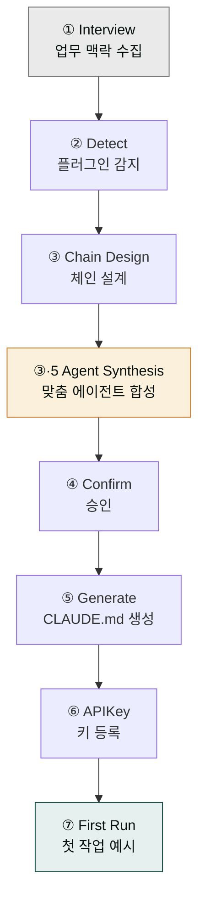

# moai-core

> `cowork-plugins` 전체의 기반이 되는 코어 플러그인입니다. **다른 플러그인을 사용하기 전에 반드시 먼저 설치**하세요.

## 무엇을 하는 플러그인인가

`moai-core`는 `cowork-plugins` 마켓플레이스의 모든 도메인 플러그인이 공유하는 인프라를 제공합니다. 프로젝트별 작업 지침(`CLAUDE.md`)을 자동 생성하고 프로젝트 맞춤 에이전트까지 합성하는 `/project` 마법사, 모든 텍스트 산출물의 마지막 단계에서 AI 패턴을 다듬어주는 `ai-slop-reviewer`, 버그·기능 요청을 GitHub Issues로 바로 등록하는 `feedback` 스킬, Drive·Notion·Higgsfield·OpenAI **4커넥터 인증·환경변수·트러블슈팅 통합 가이드** `mcp-connector-setup`을 포함한 **총 8개 스킬**이 포함되어 있습니다.

`ai-slop-reviewer`는 모든 한국어 텍스트 산출물(블로그·뉴스레터·계약서·사업계획서·이메일 등)의 체인 마지막 단계에서 호출되어, 과장된 수식어·기계적 접속어·모호한 일반화 같은 AI 글쓰기 패턴을 진단하고 사람 톤으로 다듬어줍니다.

`/project` 한 번이면 설치된 `moai-*` 플러그인을 자동 감지해 산출물별 스킬 체인을 설계하고, **v2.21.0부터는 코디네이터 에이전트까지 동적 스캔**(`agents/*.md` frontmatter 인벤토리)해 멀티스텝 체인을 에이전트 우선으로 매핑합니다. 200라인 이내의 `CLAUDE.md`를 프로젝트 루트에 생성하고, 자격 조건을 갖춘 워크플로우에 한해 프로젝트 맞춤 sub-agent를 `.claude/agents/`에 합성합니다. (`/project init`은 레거시 별칭으로 계속 동작합니다.)

## 설치



1. Cowork에서 `modu-ai/cowork-plugins` 마켓플레이스를 추가합니다.
2. `moai-core` 옆의 **+** 버튼을 눌러 설치합니다.


[GitHub 저장소](https://github.com/modu-ai/cowork-plugins/tree/main/moai-core)를 클론한 뒤 `~/.claude/plugins/`에 배치합니다.



## 핵심 스킬 (8개)

| 스킬 | 용도 | 자동 호출 트리거 |
|---|---|---|
| `project` | 프로젝트 초기화·맞춤 에이전트 합성·상태·API 키·카탈로그 관리 (`/project`, `/project status`, `/project apikey`, `/project catalog`; `/project init`은 레거시 별칭) | "프로젝트 초기화", "CLAUDE.md 만들어줘", "전담 에이전트로 만들어줘" |
| `ai-slop-reviewer` | 텍스트 산출물의 AI 패턴 진단·수정 | "AI 티 나는 부분 고쳐줘", "사람이 쓴 것처럼 수정해줘" |
| `feedback` | 버그 리포트·기능 요청을 GitHub Issues로 자동 등록 | "/project feedback", "버그 신고", "기능 요청" |
| `ai-diagnostic` | AI 시스템 진단, 성능 모니터링, 오류 분석 | "AI 동작이 이상해", "성능 체크해줘" |
| `mcp-connector-setup` | Drive·Notion·Higgsfield·OpenAI **4커넥터** 인증·환경변수·트러블슈팅. Windows MAX_PATH·한글 파일명 30자·`computer://` 링크 오류 대응. 셋업 완료 체크리스트(4커넥터 인증 + 1회 호출 성공) | "MCP 커넥터 연결", "Drive 인증 방법", "Higgsfield 키 발급", "Windows MAX_PATH 오류" |
| `skill-builder` | 새 스킬 생성, 기존 스킬 수정, 스킬 템플릿 관리 (v1.5.x: skill-forge 후속) | "새 스킬 만들어줘", "스킬 템플릿 제공해줘", "/harness" |
| `skill-template` | 스킬 구조 템플릿, 프롬프트 엔지니어링 가이드 | "스킬 구조 알려줘", "템플릿 참고할게" |
| `skill-tester` | 스킬 테스트, 검증, 품질 보증 | "이 스킬 테스트해줘", "검증 프로세스 설계해줘" |

## `/project` 흐름

### 프로젝트에 딱 맞는 전담 에이전트를 만들어주는 기능

**서브에이전트(sub-agent)**란 AI가 스스로 불러 쓰는 "작업 담당 조수"입니다. 블로그를 쓰는 스킬 하나, 발표자료를 만드는 스킬 하나처럼 단일 일을 하는 도구를 넘어, "사업계획서를 완성해 줘"처럼 여러 단계를 묶어 한 번에 끝내는 역할을 합니다.

`moai-core`의 `/project` 마법사는 **"이 프로젝트에선 어떤 산출물을, 얼마나 자주 만드나"**를 몇 가지 질문으로 파악한 뒤, 설치된 `moai-*` 플러그인에 이미 딸려 온 담당 조수(코디네이터 에이전트)가 있는지 먼저 살핍니다. 있으면 그것을 그대로 씁니다. 예컨대 "사업계획서 만들어줘"라고 하면 `moai-business` 플러그인에 들어있는 `business-plan-coordinator`가 기획→시장분석→검수→발표자료까지 알아서 엮어 줍니다.

문제는 **기존 조수가 아무도 담당하지 않는 일**입니다. 이때 v2.21.0부터는 그 빈자리를 채우는 전담 에이전트를 새로 짜서 `.claude/agents/` 폴더에 기록합니다. 단, 무조건 만드는 게 아니라 (1) 반드시 거쳐야 할 정해진 단계가 있거나, (2) 여러 결과물을 동시에 찍어내야 하거나, (3) 사용자가 매일처럼 반복하는 일일 때만 만듭니다. 그냥 한두 단계짜리 단순 작업은 굳이 에이전트를 새로 만들지 않고, 기존 스킬 몇 개를 차례로 부르는 것으로 충분하다고 판단합니다.

핵심은 **"있는 것부터 쓰고, 정말 비어 있는 자리만 새로 합성한다"**는 절제입니다. 덕분에 프로젝트마다 "이 팀은 재무 리포트를 주로 뽑으니까 재무 담당 조수를 한 명 더 두자" 식으로 맞춤 인력을 배치하는 효과를 얻으면서도, 에이전트가 불필요하게 늘어나는 혼란은 막습니다. 새로 합성된 에이전트는 다음 세션(또는 `/reload-plugins`)부터 "재무 리포트 조립해 줘" 같은 자연어 한 줄로 바로 불러 쓸 수 있습니다.



1. **Interview** — 최대 3개 질문으로 이번 프로젝트의 업무 맥락 수집 (이름·회사는 묻지 않음)
2. **Detect** — 설치된 `moai-*` 플러그인 자동 감지 (화이트리스트 동적 도출)
3. **Chain Design** — 산출물별 스킬 체인 설계 (예: 사업계획서 → `strategy-planner → docx-generator → ai-slop-reviewer`)
4. **Agent Synthesis (Phase 3.5)** — 고정 다단계·병렬 fan-out·빈번 반복 등 자격 조건을 갖춘 워크플로우에 한해 프로젝트 맞춤 sub-agent를 `.claude/agents/`에 합성 (새 세션에서 활성화, 플러그인 번들보다 우선순위 높음)
5. **Confirm** — AskUserQuestion으로 체인·에이전트 설계 최종 승인
6. **Generate** — `CLAUDE.md` 자동 생성 (200라인 이내)
7. **APIKey** — 선택된 플러그인이 요구하는 키만 프로젝트 격리 저장
8. **First Run** — 첫 작업 예시 3개 제안


📊 [다이어그램으로 보기](/diagrams/moai-core-subagent-synthesis.html) — 브라우저에서 바로 열립니다. 편집은 [`moai-core-subagent-synthesis.drawio`](/diagrams/moai-core-subagent-synthesis.drawio)를 [app.diagrams.net](https://app.diagrams.net)에서 여세요.

## `ai-slop-reviewer` 이해하기

AI가 작성한 글에는 공통된 패턴이 있습니다.

- 과장된 수식어("혁신적인", "획기적인", "업계 최고의")
- 기계적 접속어("첫째", "둘째", "마지막으로"가 과하게 반복)
- 모호한 일반화("많은 사람들은…")
- 불필요한 요약 반복

`ai-slop-reviewer`는 이러한 패턴을 **진단**하고, **수정 텍스트**를 제시하며, **주요 변경사항**을 리포트로 남깁니다. `cowork-plugins`의 모든 텍스트 스킬 체인은 이 단계로 종료하는 것이 권장됩니다.

## 대표 체인

```text
(도메인 스킬)
  → (포맷 변환 스킬, 예: docx-generator)
  → ai-slop-reviewer   ← 필수
```

코드·데이터·차트 같은 **비텍스트 산출물**은 `ai-slop-reviewer`를 스킵합니다.

## 빠른 사용 예

```text
/project
```

```text
이 블로그 글에서 AI 티 나는 부분 고쳐줘.
```

```text
MCP 커넥터 4개 연결 방법 알려줘 — Drive·Notion·Higgsfield·OpenAI
```
→ `mcp-connector-setup` 🆕

## `mcp-connector-setup`

Drive·Notion·Higgsfield·OpenAI 4커넥터를 Cowork에 연결하는 단계별 가이드입니다. 커넥터별 인증 절차·환경변수 설정·트러블슈팅을 한 곳에서 다루며, 셋업 완료 체크리스트는 **4커넥터 모두 인증 성공 + 1회 호출 성공**입니다.

**트러블슈팅 커버리지**:
- Windows MAX_PATH (260자 제한) 오류
- 한글 파일명 30자 초과 오류
- `computer://` 링크가 열리지 않는 경우
- API 키 만료·rate limit·OAuth 토큰 갱신
- Higgsfield Secret Key 발급 절차 (워크스페이스 사전 비용 충전 1.5배 권장)

## 다음 단계

- [빠른 시작](../quick-start/) — 실제 프로젝트 초기화 전 과정
- [Cowork 플러그인 사용](../../cowork/plugins/)

---

### Sources

- [modu-ai/cowork-plugins README](https://github.com/modu-ai/cowork-plugins)
- [moai-core 디렉터리](https://github.com/modu-ai/cowork-plugins/tree/main/moai-core)
