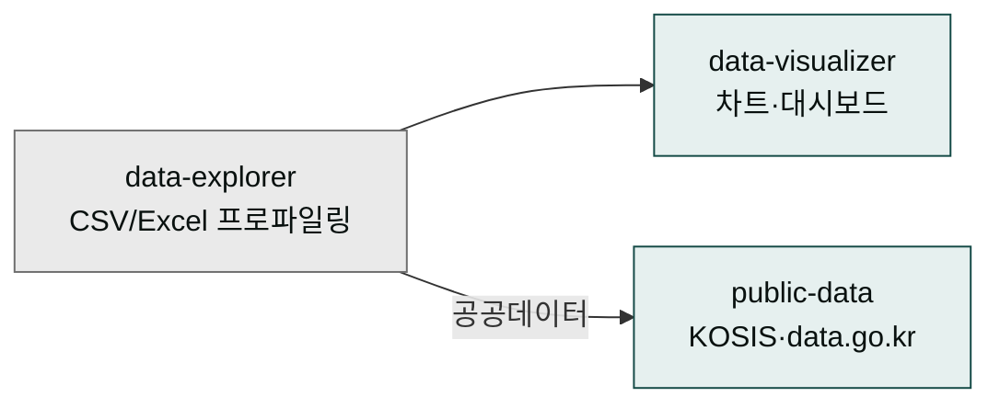
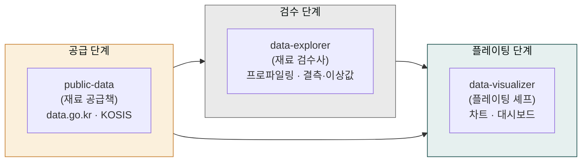
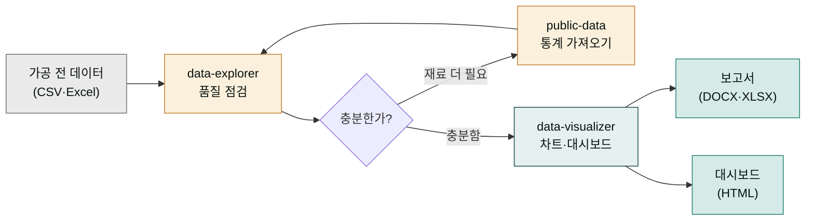

# moai-data

> CSV·Excel 탐색부터 공공데이터·통계청 API까지 3개 스킬을 제공합니다.



## 무엇을 하는 플러그인인가

`moai-data`는 데이터를 다루는 세 개의 스킬을 묶은 주방 같은 곳입니다. 요리에 비유하면 이해가 쉽습니다. 시장에서 사 온 재료(CSV·Excel 파일)를 그대로 요리에 올릴 수는 없습니다. 먼저 재료를 펼쳐서 상한 부분(결측값·이상값)과 이상하게 섞인 것을 가려내고, 필요하면 재료를 더 사 오고, 마지막에 보기 좋은 요리로 담아냅니다. `moai-data`의 세 스킬이 바로 이 세 역할을 나눠 맡습니다.

먼저 **`data-explorer`는 재료 검수사**입니다. 내가 가진 파일 전체를 한 번 훑어서 어떤 데이터가 들었는지 요약해 줍니다. 이 '한 번 훑어서 요약하는 작업'을 전문 용어로 **프로파일링**이라 부릅니다. 검수사는 빠져 있는 값(결측값), 다른 값들과 너무 동떨어진 값(이상값), 그리고 값들끼리 서로 어떻게 연결되어 있는지(상관관계)까지 찾아냅니다. 다음으로 **`public-data`는 재료 공급책**입니다. 정부 창고인 공공데이터포털(data.go.kr)과 통계청 KOSIS에서 필요한 통계 자료를 직접 납품받아 옵니다. 마지막으로 **`data-visualizer`는 플레이팅 셰프**입니다. 검증된 재료를 차트와 대시보드라는 보기 좋은 요리로 담아냅니다. 세 스킬이 나뉘어 있는 까닭은, 하나가 모든 일을 다 하면 결과가 대충 나오기 때문입니다. 검수 → 공급 → 플레이팅으로 나누면 각 단계마다 제 몫을 다해 완성도가 올라갑니다.



## 설치



1. `moai-core` 설치 후 `moai-data` 옆의 **+** 버튼을 눌러 설치합니다.
2. (선택) 공공데이터 조회용 API 키를 `.moai/credentials.env`에 등록합니다.


[GitHub 저장소](https://github.com/modu-ai/cowork-plugins/tree/main/moai-data)를 클론한 뒤 `~/.claude/plugins/`에 배치합니다.



## 핵심 스킬

| 스킬 | 용도 |
|---|---|
| `data-explorer` | CSV/Excel 프로파일링, 결측값·이상값·상관관계 |
| `public-data` | 공공데이터포털(data.go.kr)·KOSIS 통계청 OpenAPI |
| `data-visualizer` | Mermaid·Chart.js 인터랙티브 차트, 대시보드 |

## 필수 API 키 (선택)

API 키가 처음이신가요? 도서관에 비유하면 쉽습니다. 공공데이터포털과 KOSIS는 데이터가 가득한 '자료실'이고, API 키는 그 자료실에 들어가는 '출입증'입니다. 출입증이 있어야 `public-data` 스킬이 자료실 안의 통계를 꺼내올 수 있습니다. 출입증은 data.go.kr과 KOSIS 사이트에서 회원가입 후 무료로 발급받는 열쇠일 뿐, 비용도 결제 정보도 아닙니다. 발급받은 열쇠 문자열을 `.moai/credentials.env` 파일에 적어두기만 하면 `public-data`가 알아서 사용합니다.

출입증이 없어도 포기할 필요는 없습니다. 자료실 밖에서 머무는 선택지가 있습니다. 내 손에 이미 있는 파일(CSV·Excel)만 분석하려면 `data-explorer`와 `data-visualizer`만으로 충분합니다. 즉 이 표의 두 변수는 '선택'입니다. 공공 통계가 필요할 때만 발급받으면 됩니다.

| 변수 | 용도 | 발급처 |
|---|---|---|
| `DATA_GO_KR_KEY` | 공공데이터포털 | [data.go.kr](https://www.data.go.kr) |
| `KOSIS_KEY` | 통계청 OpenAPI | [KOSIS](https://kosis.kr) |

## 데이터가 보고서가 되는 과정

세 스킬이 따로따로 존재한다는 건, 가공되지 않은 원시 데이터가 어떤 길을 거쳐 최종 보고서나 대시보드로 나가는지 흐름으로 이해해야 쓸모가 보입니다. 조리 라인에 비유하면 한 방향으로 흐르는 한 줄의 컨베이어 벨트입니다. 가공 전 데이터(재료)가 들어와서 검수를 거치고, 필요하면 재료를 더 가져오거나 시각화를 거쳐, 마침내 보고서나 대시보드(완성 요리)로 나갑니다. 이 흐름을 **체인**이라고 부릅니다. 체인이란 건 그냥 "요리 순서를 정해 차례로 진행"한다는 뜻입니다. 아래 그림처럼 화살표를 따라가면 왜 스킬 세 개가 필요한지 한눈에 잡힙니다.



## 대표 체인

**데이터 탐색 보고서**

```text
data-explorer → data-visualizer → docx-generator
```

**공공통계 분석**

```text
public-data → data-explorer → xlsx-creator
```

**대시보드 HTML**

```text
data-visualizer  (HTML + Chart.js 단독)
```

(숫자·차트이므로 `ai-slop-reviewer` 생략)

## 빠른 사용 예


> KOSIS에서 최근 10년 서울 1인 가구 추이 가져와서 라인차트 만들어줘.



> customers.csv에서 이상값 찾고 데이터 품질 보고서 만들어줘.


## 다음 단계

- [`moai-business`](../moai-business/) — 전략 분석과 결합
- [`moai-office`](../moai-office/) — 최종 문서화

---

### Sources

- [modu-ai/cowork-plugins](https://github.com/modu-ai/cowork-plugins)
- [moai-data 디렉터리](https://github.com/modu-ai/cowork-plugins/tree/main/moai-data)
