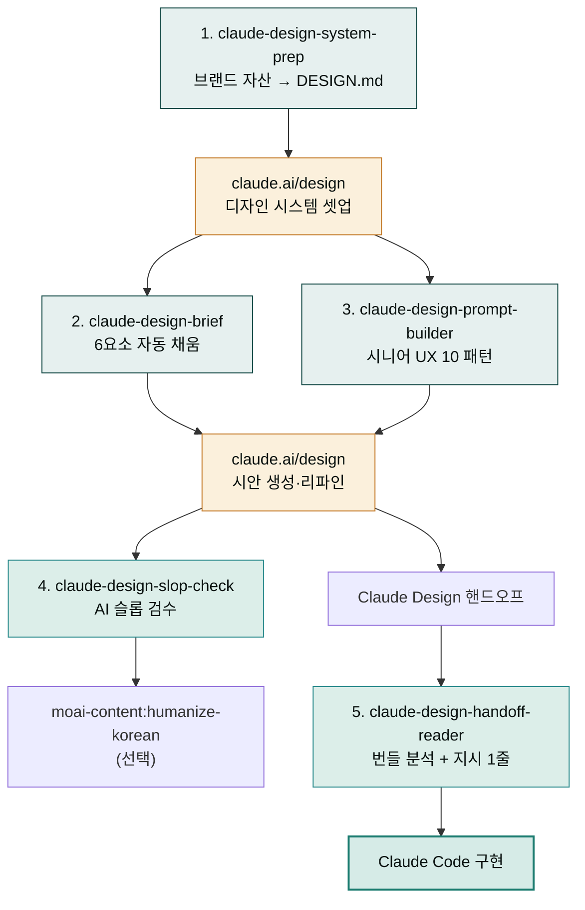

# moai-design

> [claude.ai/design](https://claude.ai/design)에서 디자인을 만들 때 그 **앞과 뒤를 받쳐 주는** Cowork 플러그인입니다. Claude Design 자체를 대체하지 않습니다 — 더 좋은 입력을 만들어 주고, 결과물을 잘 활용하도록 돕습니다.

## 무엇을 하는 플러그인인가

Claude Design은 강력하지만 **입력 품질이 결과 품질을 결정**합니다. 디자인 시스템을 셋업하지 않고 막연한 프롬프트를 던지면 "AI 티"가 나는 평균값 디자인이 나옵니다.

이 플러그인은 그 입력 단계를 정돈하고, 결과물의 출력 단계를 다듬어 줍니다. Cowork 채팅에서 자연어로 호출하면 AskUserQuestion으로 필요한 정보를 모은 뒤 **claude.ai/design 채팅에 그대로 붙여 넣을 수 있는 산출물**을 만들어 줍니다.

배경 지식은 docs-site의 [클로드 디자인 섹션 10페이지](../../claude-design/)에 정리되어 있습니다.

## 설치



1. `moai-core` 설치 후 `moai-design` 옆의 **+** 버튼을 눌러 설치합니다.
2. 함께 권장: `moai-content` (humanize-korean 체이닝) — slop-check 후 한국어 카피 자연화에 사용합니다.
3. 함께 권장: `moai-marketing` (brand-identity) — system-prep 전 브랜드 정체성이 모호할 때.


[GitHub 저장소](https://github.com/modu-ai/cowork-plugins/tree/main/moai-design)를 클론한 뒤 `~/.claude/plugins/`에 배치합니다.



## 핵심 스킬 5 단계

| 단계 | 스킬 | 사용 시점 | 결과물 |
|---|---|---|---|
| 1 | [`claude-design-system-prep`](https://github.com/modu-ai/cowork-plugins/tree/main/moai-design/skills/claude-design-system-prep) | 디자인 시스템 셋업 직전 | 업로드용 DESIGN.md + 자산 정리 가이드 |
| 2 | [`claude-design-brief`](https://github.com/modu-ai/cowork-plugins/tree/main/moai-design/skills/claude-design-brief) | Claude Design 프롬프트 작성 단계 | 6요소(Project·Audience·Pages·Tone·Reference·Constraints) 복붙용 프롬프트 |
| 3 | [`claude-design-prompt-builder`](https://github.com/modu-ai/cowork-plugins/tree/main/moai-design/skills/claude-design-prompt-builder) | 특정 UX 영역(IA·온보딩·접근성 등) 작업 | 시니어 UX 10 패턴 중 적합 프롬프트 |
| 4 | [`claude-design-slop-check`](https://github.com/modu-ai/cowork-plugins/tree/main/moai-design/skills/claude-design-slop-check) | Claude Design 카피 결과물 검수 | AI 슬롭 패턴 리포트 + 수정안 3개 |
| 5 | [`claude-design-handoff-reader`](https://github.com/modu-ai/cowork-plugins/tree/main/moai-design/skills/claude-design-handoff-reader) | Claude Design → Claude Code 직전 | 번들 요약 + Claude Code 지시 1줄 |

## 시나리오별 빠른 시작

### 시나리오 1 — 디자인 시스템 처음 셋업

Cowork에서 `/claude-design-system-prep` 호출 → 자사 웹사이트 URL + 로고 파일 + 잘 만든 PPTX 1개 입력 → DESIGN.md 자동 생성 → 그 폴더를 [claude.ai/design](https://claude.ai/design)에 업로드 → Published 토글 ON.

### 시나리오 2 — 첫 시안 만들기

Cowork에서 `/claude-design-brief` 호출 → "마케팅 자동화 SaaS 가격 페이지" 같이 한 줄 입력 → AskUserQuestion으로 누락 요소 보완 → 완성된 프롬프트를 Claude Design 채팅에 복붙.

### 시나리오 3 — 접근성·폼 같은 특정 영역

Cowork에서 `/claude-design-prompt-builder` 호출 → "접근성 점검" 키워드 → 패턴 8(Level Access 시니어 컨설턴트) 자동 선택 → CONTEXT만 보완 → 완성된 프롬프트.

### 시나리오 4 — Claude Code로 핸드오프

Claude Design에서 "Hand off to Claude Code" → 번들 다운로드 → Cowork에서 `/claude-design-handoff-reader` 호출 + 번들 경로 입력 → 요약 + Claude Code 지시 1줄 자동 생성 → Claude Code에 붙여넣기.

### 시나리오 5 — 결과 카피 검수

Claude Design에서 생성된 카피를 Cowork의 `/claude-design-slop-check`에 붙여넣기 → "Reimagine your" "혁신적인" 같은 슬롭 패턴 검출 → 수정안 3개 → (선택) `moai-content:humanize-korean`으로 한국어 카피 자연화.

## docs-site 가이드와의 관계

이 플러그인의 5개 스킬은 docs-site의 [클로드 디자인 섹션](../../claude-design/)에서 정리한 운영 원칙·베스트 프랙티스를 자동화한 것입니다. 깊은 배경 지식은 다음 페이지를 참고하세요.

| 스킬 | 관련 페이지 |
|---|---|
| claude-design-system-prep | [디자인 시스템 설정](../../claude-design/design-system/) ★ |
| claude-design-brief | [시작하기](../../claude-design/getting-started/) · [베스트 프랙티스](../../claude-design/best-practices/) |
| claude-design-prompt-builder | [리파인먼트](../../claude-design/refinement/) — 시니어 UX 10 패턴 전문 |
| claude-design-slop-check | [베스트 프랙티스](../../claude-design/best-practices/) — AI 슬롭 회피 |
| claude-design-handoff-reader | [내보내기·핸드오프](../../claude-design/export-handoff/) — 번들 내부 구조 |

## 관련 플러그인

| 플러그인 | 함께 쓰는 시점 |
|---|---|
| [`moai-content:humanize-korean`](../moai-content/) | slop-check 후 한국어 카피 자연화 |
| [`moai-content:landing-page`](../moai-content/) | Claude Design 대안 — 코드 기반 랜딩 페이지 |
| [`moai-marketing:brand-identity`](../moai-marketing/) | system-prep 전 브랜드 정체성 정의 |
| [`moai-product:ux-designer`](../moai-product/) | Claude Design과 별개의 UX 분석 (Nielsen·WCAG) |
| [`moai-product:ux-researcher`](../moai-product/) | 사용자 리서치 단계 |
| [`moai-office:pptx-designer`](../moai-office/) | Claude Design 결과를 PPTX로 후처리 |
| [`moai-core:ai-slop-reviewer`](../moai-core/) | 일반 텍스트 산출물의 AI 슬롭 검수 |

## 라이선스

MIT · 2026

---

### Sources

- [클로드 디자인 섹션 (이 docs-site의 10 페이지 가이드)](../../claude-design/)
- [Introducing Claude Design by Anthropic Labs](https://www.anthropic.com/news/claude-design-anthropic-labs)
- [Using Claude Design for prototypes and UX (Anthropic Tutorial)](https://claude.com/resources/tutorials/using-claude-design-for-prototypes-and-ux)
- [Set up your design system in Claude Design](https://support.claude.com/en/articles/14604397-set-up-your-design-system-in-claude-design)
- [Claude Design admin guide](https://support.claude.com/en/articles/14604406-claude-design-admin-guide-for-team-and-enterprise-plans)
- [10 Advanced Prompts for Claude Design](https://pasqualepillitteri.it/en/news/1486/claude-design-prompts-senior-ux-designer-guide)
- [Claude Design Starter Guide (Claudia + AI)](https://claudiaplusai.substack.com/p/claude-design-starter-guide-and-examples)
