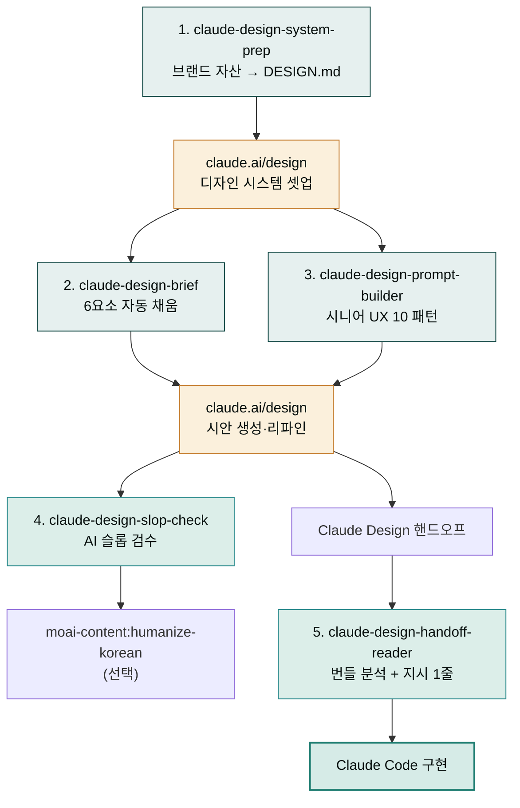
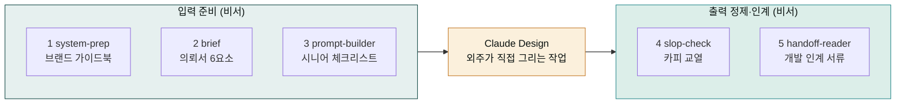

# moai-design

> [claude.ai/design](https://claude.ai/design)에서 디자인을 만들 때 그 **앞과 뒤를 받쳐 주는** Cowork 플러그인입니다. Claude Design 자체를 대체하지 않습니다 — 더 좋은 입력을 만들어 주고, 결과물을 잘 활용하도록 돕습니다.

## 무엇을 하는 플러그인인가

Claude Design은 강력하지만 **입력 품질이 결과 품질을 결정**합니다. 디자인 시스템을 셋업하지 않고 막연한 프롬프트를 던지면 "AI 티"가 나는 평균값 디자인이 나옵니다.

이 플러그인은 그 입력 단계를 정돈하고, 결과물의 출력 단계를 다듬어 줍니다. Cowork 채팅에서 자연어로 호출하면 AskUserQuestion으로 필요한 정보를 모은 뒤 **claude.ai/design 채팅에 그대로 붙여 넣을 수 있는 산출물**을 만들어 줍니다. 플러그인은 Claude Design 워크플로우를 받쳐 주는 **다섯 단계의 스킬**과, 별도 축으로 HTML 산출물에 브랜드 무드를 입히는 **design-system-library 라이브러리**(스킬 포함 총 6개)로 이루어져 있습니다.

## 이 플러그인으로 무엇을 할 수 있나

외주 디자이너(Claude Design)에게 작업을 맡긴다고 상상해 봅시다. 그냥 "예쁘게 만들어 주세요"라고만 하면 디자이너는 내 회사가 어떤 색을 쓰는지, 어떤 말투를 쓰는지 알 수 없어 뻔하고 평범한 결과물을 가져옵니다. 반면 작업 전에 브랜드 가이드북을 책상 위에 펼쳐두고, 의뢰서를 깔끔하게 써주고, 특정 영역은 시니어의 체크리스트를 골라주면 결과물의 수준이 확 달라집니다. 이 플러그인은 바로 그 **비서 역할**을 합니다.

다섯 스킬은 한 방향으로 이어지는 하나의 흐름입니다. (1) `system-prep`은 회사 웹사이트·로고·기존 발표자료에서 "우리 색깔은 이거, 글꼴은 이거"라는 브랜드 가이드북을 자동으로 뽑아 정리해 줍니다. (2) `brief`는 "이런 페이지를 이런 톤으로 만들어 달라"는 의뢰서를 빈칸 없이 깔끔하게 써줍니다. (3) `prompt-builder`는 접근성·폼 같은 특정 영역에 시니어 디자이너의 체크리스트를 골라줍니다. (4) `slop-check`는 외주가 가져온 시안의 카피를 붉은 펜으로 교열합니다. (5) `handoff-reader`는 최종 결과물을 개발팀에 넘길 인계 서류를 써줍니다. Claude Design 자체를 대체하지 않고, 그 **앞(입력)과 뒤(출력)를 받쳐 주는** 보조 파이프라인(작업이 한 방향으로 흘러가는 연결선)이라는 점이 이 플러그인의 핵심입니다.

## 다섯 스킬이 한 방향으로 흐르는 모습

앞선 그림이 5개 스킬과 Claude Design 내부 단계를 함께 담고 있어 세부적으로는 좋지만, "플러그인이 끼어드는 지점이 어디인지"를 한눈에 보기에는 노드가 많습니다. 아래는 본질만 남긴 단순 버전입니다. 왼쪽 세 스킬(`system-prep`·`brief`·`prompt-builder`)은 외주 디자이너에게 넘기기 전 **의뢰서를 준비하는 비서**, 가운데 Claude Design은 **외주 디자이너가 직접 그리는 작업 자체**, 오른쪽 두 스킬(`slop-check`·`handoff-reader`)은 시안이 나온 뒤 **결과물을 정제하고 개발팀에 인계하는 비서**입니다. 플러그인은 양끝의 비서 역할만 할 뿐, 가운데 그림을 그리는 일은 Claude Design 본체가 합니다.

배경 지식은 docs-site의 [클로드 디자인 섹션 10페이지](../../claude-design/)에 정리되어 있습니다.

## 설치



1. `moai-core` 설치 후 `moai-design` 옆의 **+** 버튼을 눌러 설치합니다.
2. 함께 권장: `moai-content` (humanize-korean 체이닝) — slop-check 후 한국어 카피 자연화에 사용합니다.
3. 함께 권장: `moai-marketing` (brand-identity) — system-prep 전 브랜드 정체성이 모호할 때.


[GitHub 저장소](https://github.com/modu-ai/cowork-plugins/tree/main/moai-design)를 클론한 뒤 `~/.claude/plugins/`에 배치합니다.



## 핵심 스킬 5 단계

| 단계 | 스킬 | 사용 시점 | 결과물 |
|---|---|---|---|
| 1 | [`claude-design-system-prep`](https://github.com/modu-ai/cowork-plugins/tree/main/moai-design/skills/claude-design-system-prep) | 디자인 시스템 셋업 직전 | 업로드용 DESIGN.md + 자산 정리 가이드 |
| 2 | [`claude-design-brief`](https://github.com/modu-ai/cowork-plugins/tree/main/moai-design/skills/claude-design-brief) | Claude Design 프롬프트 작성 단계 | 6요소(Project·Audience·Pages·Tone·Reference·Constraints) 복붙용 프롬프트 |
| 3 | [`claude-design-prompt-builder`](https://github.com/modu-ai/cowork-plugins/tree/main/moai-design/skills/claude-design-prompt-builder) | 특정 UX 영역(IA·온보딩·접근성 등) 작업 | 시니어 UX 10 패턴 중 적합 프롬프트 |
| 4 | [`claude-design-slop-check`](https://github.com/modu-ai/cowork-plugins/tree/main/moai-design/skills/claude-design-slop-check) | Claude Design 카피 결과물 검수 | AI 슬롭 패턴 리포트 + 수정안 3개 |
| 5 | [`claude-design-handoff-reader`](https://github.com/modu-ai/cowork-plugins/tree/main/moai-design/skills/claude-design-handoff-reader) | Claude Design → Claude Code 직전 | 번들 요약 + Claude Code 지시 1줄 |

## 시나리오별 빠른 시작

### 디자인 시스템은 왜 먼저 셋업해야 하나

요리사에게 "한국식 비빔밥을 만들어 달라"고 할 때 냉장고에 어떤 재료와 양념이 있는지 미리 알려주지 않으면 제대로 된 비빔밥이 나오지 않습니다. 디자인도 마찬가지입니다. Claude Design은 "우리 회사 색깔이 무엇인지, 글꼴은 무엇인지, 버튼은 어떤 모양인지"를 알아야 우리 브랜드에 맞는 결과물을 만듭니다. 이 레시피북 역할을 하는 것이 **디자인 시스템**이며, 플러그인에서는 `DESIGN.md`라는 파일 한 장으로 저장합니다.

`system-prep`은 회사 웹사이트 주소·로고 파일·잘 만들어진 기존 발표자료(PPTX)에서 이 레시피북을 자동으로 뽑아 정리해 줍니다. 손으로 일일이 색상 코드와 글꼴 이름을 적지 않아도 됩니다. 완성된 `DESIGN.md`를 Claude Design에 업로드하고 **Published 토글**(스위치처럼 켜고 끄는 설정)을 켜 두면, 이후 모든 시안이 우리 브랜드 가이드를 기준으로 만들어집니다. 이 단계를 건너뛰고 곧바로 시안을 요청하면 "어디서 본 듯한" 평균값 디자인이 나오는 가장 흔한 이유가 됩니다.

### 시나리오 1 — 디자인 시스템 처음 셋업

Cowork에서 `/claude-design-system-prep` 호출 → 자사 웹사이트 URL + 로고 파일 + 잘 만든 PPTX 1개 입력 → DESIGN.md 자동 생성 → 그 폴더를 [claude.ai/design](https://claude.ai/design)에 업로드 → Published 토글 ON.

### 시나리오 2 — 첫 시안 만들기

Cowork에서 `/claude-design-brief` 호출 → "마케팅 자동화 SaaS 가격 페이지" 같이 한 줄 입력 → AskUserQuestion으로 누락 요소 보완 → 완성된 프롬프트를 Claude Design 채팅에 복붙.

### 시나리오 3 — 접근성·폼 같은 특정 영역

Cowork에서 `/claude-design-prompt-builder` 호출 → "접근성 점검" 키워드 → 패턴 8(Level Access 시니어 컨설턴트) 자동 선택 → CONTEXT만 보완 → 완성된 프롬프트.

### 시나리오 4 — Claude Code로 핸드오프

Claude Design에서 "Hand off to Claude Code" → 번들 다운로드 → Cowork에서 `/claude-design-handoff-reader` 호출 + 번들 경로 입력 → 요약 + Claude Code 지시 1줄 자동 생성 → Claude Code에 붙여넣기.

### AI 슬롭(slop)이란 왜 검수해야 하는가

번역기를 거친 글이 어딘가 어색한 것처럼, AI가 만든 카피와 디자인에도 뻔한 상투구절이 섞여 나옵니다. "Reimagine your", "혁신적인", "원터치로", "더 나은 내일을" 같은 표현은 누가 써도 비슷하게 튀어나오는 기계적인 문구입니다. 이렇게 어딘가 본 듯한, AI의 존재가 느껴지는 티를 **슬롭**(slop)이라고 부릅니다. 슬롭이 섞인 카피는 읽는 사람의 머리에 남지 않고, 브랜드의 개성도 흐려집니다.

`slop-check`는 교정 선생님이 빨간 펜으로 상투적 표현에 밑줄을 치는 것과 같습니다. Claude Design이 만들어 낸 카피를 붙여 넣으면, 슬롭 패턴을 찾아내고 각각에 대해 "이렇게 바꿔 보세요" 수정안을 3개씩 내줍니다. 검수 한 번을 거치는 것만으로 카피가 훨씬 사람스러워집니다. 한국어 카피는 이어서 `moai-content:humanize-korean`으로 한 번 더 다듬으면 더 자연스럽게 완성됩니다.

### 시나리오 5 — 결과 카피 검수

Claude Design에서 생성된 카피를 Cowork의 `/claude-design-slop-check`에 붙여넣기 → "Reimagine your" "혁신적인" 같은 슬롭 패턴 검출 → 수정안 3개 → (선택) `moai-content:humanize-korean`으로 한국어 카피 자연화.

## 75개 브랜드 디자인 시스템 라이브러리 (design-system-library)

[`design-system-library`](https://github.com/modu-ai/cowork-plugins/tree/main/moai-design/skills/design-system-library)는 Claude·ClickHouse·Clay 기본 3테마부터 Notion·Linear·Stripe·Vercel·Figma·Sentry 등 **75개 글로벌 브랜드 디자인 시스템** 토큰(색·타이포·radius·spacing)을 단일 진실 원천으로 보관하는 라이브러리입니다. 위 5단계 워크플로우와는 별개 축으로, **HTML 산출물에 브랜드 무드를 입히는** 용도입니다.

| 기본 테마 | 무드 | 적합 산출물 |
|------|------|------|
| `claude` | warm editorial (cream + coral) | 보고서·사업계획서·편집성 문서 |
| `clickhouse` | high-contrast engineering (다크 + 전기 노랑) | 기술 리포트·데이터 대시보드·API 문서 |
| `clay` | playful B2B (6-color saturated cards) | 랜딩·마케팅·제품 소개 |

**두 소비 경로**:

| 경로 | 동작 |
|------|------|
| `html-report` + `design_system` 파라미터 | 지정한 브랜드 토큰 → Tailwind Play CDN config + shadcn vanilla 컴포넌트로 단일 HTML 렌더 |
| `claude-design-system-prep` | 사용자가 지정한 시스템(또는 브랜드 무드 매칭)을 DESIGN.md 합성 소스로 로드 → Claude Design 핸드오프 지침 |

`design_system`을 지정하지 않으면 기존 `html-report` 0의존 템플릿이 그대로 쓰입니다(하위 호환). 전체 75개 시스템(56개 풍부 분석 + 19개 경량 토큰)을 보관하며, 기본 3테마(claude·clickhouse·clay)는 Tailwind 매핑이 검증됐고 19개 경량 토큰은 typography 스케일 등 후속 보완이 예정돼 있습니다. 상세 토큰과 전체 카탈로그는 [SKILL.md](https://github.com/modu-ai/cowork-plugins/blob/main/moai-design/skills/design-system-library/SKILL.md)와 [`systems/registry.md`](https://github.com/modu-ai/cowork-plugins/blob/main/moai-design/skills/design-system-library/systems/registry.md)를 참조하세요.

## docs-site 가이드와의 관계

이 플러그인의 워크플로우 5단계 스킬은 docs-site의 [클로드 디자인 섹션](../../claude-design/)에서 정리한 운영 원칙·베스트 프랙티스를 자동화한 것입니다. (`design-system-library`는 브랜드 토큰 라이브러리로 별도 축입니다.) 깊은 배경 지식은 다음 페이지를 참고하세요.

| 스킬 | 관련 페이지 |
|---|---|
| claude-design-system-prep | [디자인 시스템 설정](../../claude-design/design-system/) ★ |
| claude-design-brief | [시작하기](../../claude-design/getting-started/) · [베스트 프랙티스](../../claude-design/best-practices/) |
| claude-design-prompt-builder | [리파인먼트](../../claude-design/refinement/) — 시니어 UX 10 패턴 전문 |
| claude-design-slop-check | [베스트 프랙티스](../../claude-design/best-practices/) — AI 슬롭 회피 |
| claude-design-handoff-reader | [내보내기·핸드오프](../../claude-design/export-handoff/) — 번들 내부 구조 |

## 관련 플러그인

| 플러그인 | 함께 쓰는 시점 |
|---|---|
| [`moai-content:humanize-korean`](../moai-content/) | slop-check 후 한국어 카피 자연화 |
| [`moai-content:landing-page`](../moai-content/) | Claude Design 대안 — 코드 기반 랜딩 페이지 |
| [`moai-marketing:brand-identity`](../moai-marketing/) | system-prep 전 브랜드 정체성 정의 |
| [`moai-product:ux-designer`](../moai-product/) | Claude Design과 별개의 UX 분석 (Nielsen·WCAG) |
| [`moai-product:ux-researcher`](../moai-product/) | 사용자 리서치 단계 |
| [`moai-office:pptx-designer`](../moai-office/) | Claude Design 결과를 PPTX로 후처리 |
| [`moai-core:ai-slop-reviewer`](../moai-core/) | 일반 텍스트 산출물의 AI 슬롭 검수 |

## 라이선스

MIT · 2026

---

### Sources

- [클로드 디자인 섹션 (이 docs-site의 10 페이지 가이드)](../../claude-design/)
- [Introducing Claude Design by Anthropic Labs](https://www.anthropic.com/news/claude-design-anthropic-labs)
- [Using Claude Design for prototypes and UX (Anthropic Tutorial)](https://claude.com/resources/tutorials/using-claude-design-for-prototypes-and-ux)
- [Set up your design system in Claude Design](https://support.claude.com/en/articles/14604397-set-up-your-design-system-in-claude-design)
- [Claude Design admin guide](https://support.claude.com/en/articles/14604406-claude-design-admin-guide-for-team-and-enterprise-plans)
- [10 Advanced Prompts for Claude Design](https://pasqualepillitteri.it/en/news/1486/claude-design-prompts-senior-ux-designer-guide)
- [Claude Design Starter Guide (Claudia + AI)](https://claudiaplusai.substack.com/p/claude-design-starter-guide-and-examples)
