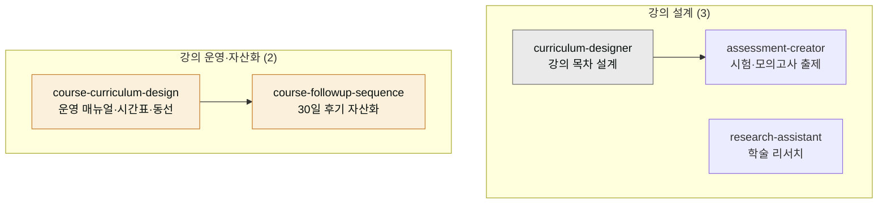
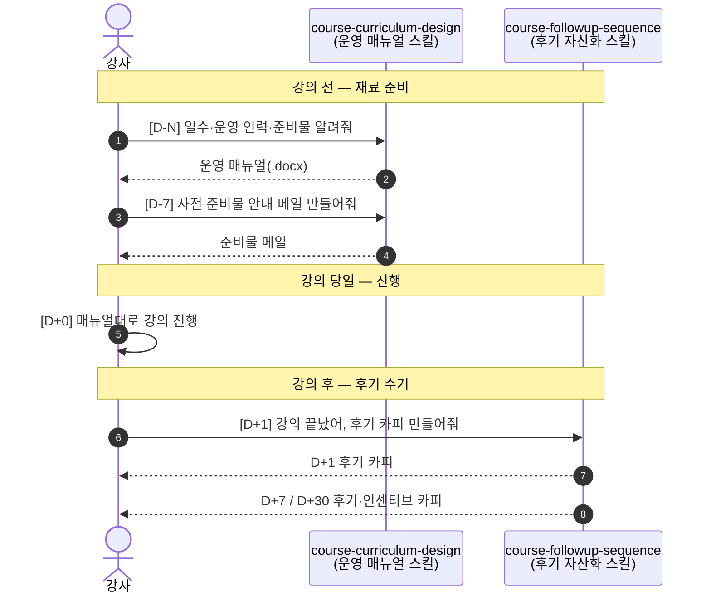

# moai-education

> 강사·교수·교사를 위한 **교육 콘텐츠 풀스택 5개 스킬**. 커리큘럼 설계부터 시험 출제, 학술 리서치, 강의·수업·연수·워크숍 운영 매뉴얼, 수강 후 후기 자산화까지 한 플러그인에서 처리합니다.



## 이 플러그인으로 무엇을 할 수 있나

`moai-education`을 한마디로 말하면 **한 학기 치 강의를 한 권의 '강의 운영 요리책(cookbook)'으로 만들어주는 도구**입니다. 강사가 매 학기마다 손으로 반복하던 다섯 가지 수작업을 플러그인 하나가 한 번에 잡아줍니다.

요리책에 빗대어 보면 이해가 쉽습니다. 먼저 **재료 손질 단계**에서 커리큘럼(강의 목차와 학습 목표)을 설계합니다. 그다음 **시식 문제를 내는 단계**에서 학습자가 실력을 점검할 모의고사와 퀴즈를 출제합니다. 세 번째로 **레시피 카드를 정리하는 단계**에서는 강의 일정표, 강사 동선, 사전 준비물 같은 운영 매뉴얼을 만듭니다. 마지막으로 강의가 끝난 뒤 **식사 후 감사장과 후기를 요청하는 단계**에서 30일간 후기를 모아 강의를 개선하는 자료로 쌓습니다. 즉 강의 시작 전 준비부터 끝난 뒤 한 달까지, 요리책 한 권이 전 과정을 커버하는 셈입니다.

여기에 **학술 리서치**(논문 자료 조사·문헌 검토) 기능까지 더해져, 교수·강사가 논문이나 심화 수업 자료를 준비할 때도 같은 플러그인 안에서 처리할 수 있습니다.

## 무엇을 하는 플러그인인가

`moai-education`은 강사·교수·교사가 운영하는 모든 교육 활동을 자동화합니다. 강의 목차·학습 목표·역량 갭 분석, 시험·퀴즈·모의고사, 자격증·공무원 시험 대비, 학술 리서치·문헌 검토·논문 구조부터 **단기 특강·사내 연수·다일 워크숍·정규 학기 강좌의 운영 실무 매뉴얼**(시간표·강사 동선·D-N 사전 준비물·환경 체크리스트·리스크 Plan B), **수강 후 30일 후기 자산화 시퀀스**(D+1·D+3·D+7·D+14·D+30 카피 5종)까지 교육 콘텐츠 제작과 운영 전반을 커버합니다.

대상 사용자:
- 온·오프라인 강의를 운영하는 강사·프리랜서 강사
- 대학·대학원 수업을 진행하는 교수·시간강사
- 학교·학원 수업을 운영하는 교사·학원 강사
- 사내 연수·집체교육을 운영하는 HRD 담당자
- 평생교육원·HRD-Net·K-MOOC 운영자

## 설치



1. `moai-core` 설치 후 `moai-education` 옆의 **+** 버튼을 눌러 설치합니다.


[GitHub 저장소](https://github.com/modu-ai/cowork-plugins/tree/main/moai-education)를 클론한 뒤 `~/.claude/plugins/`에 배치합니다.



## 핵심 스킬 (5개)

### 강의 설계·시험 출제·학술 리서치 (3)

| 스킬 | 용도 |
|---|---|
| `curriculum-designer` | 온라인·오프라인 강의 목차·학습 목표·역량 갭 분석, 외국어 학습 전략 |
| `assessment-creator` | 시험·퀴즈·모의고사, 자격증·공무원 대비 |
| `research-assistant` | 학술 리서치, 문헌 검토, 논문 구조 |

### 강의·연수 운영 실무 (2)

| 스킬 | 용도 | 출력 |
|---|---|---|
| `course-curriculum-design` | 일자별 시간표(1일·다일·주간 모드 지원) + 강사·조교 동선표 + D-N 사전 준비물 메일 + 환경·설비 체크리스트 + 리스크 Plan B 5건+ | `moai-office:docx-generator` 자동 체이닝 → Word(.docx) |
| `course-followup-sequence` | 강의 종료 후 30일 후기 카피 5종(D+1·D+3·D+7·D+14·D+30) + 인센티브·자산화 시퀀스 | 후기 카피 5종 + 발송 가이드 |

## 대표 체인

**강의 커리큘럼 + 교안**

```text
curriculum-designer → docx-generator → pptx-designer → ai-slop-reviewer
```

**자격증 모의고사 키트**

```text
assessment-creator → xlsx-creator(문제지) → docx-generator(해설)
```

**강의·연수·워크숍 운영 풀 사이클**

```text
[D-N]   course-curriculum-design → moai-office:docx-generator(.docx 운영 매뉴얼)
[D-7]   사전 준비물 안내 메일 발송 (course-curriculum-design --output prep-mail)
[D-1]   course-curriculum-design (시간표·동선표 출력)
[D+0]   강의 진행 (1일 특강·다일 워크숍·8/16주 정규 강좌)
[D+1~D+30]  course-followup-sequence → moai-content:copywriting
              → ai-slop-reviewer → moai-content:korean-spell-check
```

### 강의 당일을 기준으로 날짜를 세는 이유

위 체인에 쓰인 `[D-N]`, `[D+0]`, `[D+30]` 표기는 **강의 당일을 D+0(그냥 'D'라고도 씁니다)으로 잡고, 그 앞뒤 날짜를 세는 수업 일정표**입니다. 예를 들어 강의가 6월 20일이라면 D+0은 6월 20일, D-7은 일주일 전인 6월 13일, D+30은 한 달 뒤인 7월 20일이 됩니다. 이렇게 당일을 기준으로 날짜를 표기하면 강의가 언제든 일정만 바꿔 넣으면 똑같은 준비 흐름을 재사용할 수 있어서 실무에서 널리 씁니다.

이 날짜 표기가 중요한 이유는, 각 스킬이 **산출물을 만들어 다음 스킬로 넘겨주는 파이프라인**(한 방향으로만 흐르는 연결선)이기 때문입니다. 강의 전(D-N 단계)에 `course-curriculum-design`이 만든 운영 매뉴얼과 사전 준비물 메일이 있어야, 강의 당일(D+0)에 강사가 그 매뉴얼대로 진행할 수 있습니다. 그리고 강의가 무사히 끝난 뒤(D+1~D+30)에야 `course-followup-sequence`가 돌면서 후기를 거둬들일 수 있습니다. 순서가 뒤바뀌면 — 예를 들어 강의 전에 후기 메일부터 보내면 — 아직 강의도 안 했는데 후기를 달라는 꼴이 됩니다.

아래 시퀀스 다이어그램은 강사와 각 스킬이 시간 순서대로 어떻게 주고받는지를 보여줍니다.




## 빠른 사용 예 (한 줄 요청 + 시스템 자동 인터뷰)

> 매번 옵션을 직접 작성할 필요 없습니다. 짧은 한 줄로 요청하면 시스템이 강의 형식·일수·대상·운영 인력을 인터뷰로 수집합니다.


> "ChatGPT 실무 활용" 8주 과정 커리큘럼 짜줘


→ 시스템 인터뷰: 수준·시수·대상·산출물 → `curriculum-designer` 자동 호출


> 정보처리기사 실기 모의고사 50문항 + 해설 만들어줘


→ `assessment-creator` 자동 호출


> 사내 AI 활용 2일 워크숍 운영 매뉴얼 만들어줘


→ 시스템 인터뷰: 일수·세션 수·운영 인력·사전 안내 시점 → `course-curriculum-design` 자동 호출


> 강의 끝났어, D+1 후기 카피 만들어줘


→ 시스템 인터뷰: 강의명·발송 채널·인센티브 → `course-followup-sequence` 자동 호출

## 다음 단계

- [`moai-research`](../moai-research/) — 학술 리서치 결합
- [`moai-content`](../moai-content/) — 강의 홍보 콘텐츠 + 후기 카피 후처리
- [`moai-office`](../moai-office/) — Word·PPT·Excel 최종 산출물
- [`moai-media`](../moai-media/) — 강의 홍보 영상·이미지 생성

---

### Sources

- [modu-ai/cowork-plugins](https://github.com/modu-ai/cowork-plugins)
- [moai-education 디렉터리](https://github.com/modu-ai/cowork-plugins/tree/main/moai-education)
