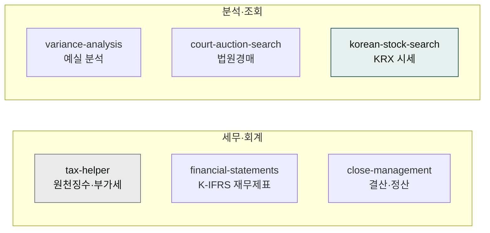
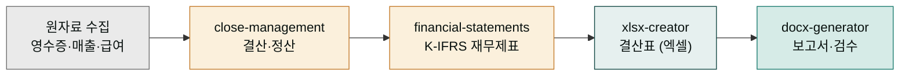

# moai-finance

> 한국 세법·회계 기준 6개 스킬을 제공합니다.



## 무엇을 하는 플러그인인가

집에서 가계부를 쓸 때를 떠올려 보세요. 영수증을 한 곳에 모으고, 달이 바뀌면 지출을 정리하며, 연말에는 세금 신고를 위해 항목을 합산하고, 지난달과 이번 달을 비교해 돈이 늘었는지 줄었는지 살핍니다. `moai-finance`는 바로 이 일을 사업 규모에 맞춰 해주는 **사업용 가계부이자 세무사 보조**입니다. 영수증·매출 같은 원자료(처리하기 전의 가공 안 된 기본 자료)를 한곳에 모으고, 달·분기·연도가 바뀔 때 정리(결산)하며, 세금 신고 절차를 안내하고, 세운 예산과 실제 실적을 겹쳐 보여 사업 상태를 읽어줍니다.

전문 용어는 한 줄씩 풀어 설명하면 이렇습니다. **원천징수**란 돈을 받을 때 세금을 미리 떼어 내는 것(프리랜서 수입의 3.3%)이고, **K-IFRS**는 회사의 재무 상태를 정해진 규칙으로 표현하는 국제 회계 기준이며, **4대보험**은 국민연금·건강보험·고용보험·산재보험을 묶어 부르는 말로 직원 급여에서 매월 공제됩니다. **결산**은 일정 기간의 거래를 모아 장부를 마감하는 작업, **예실 분석**은 세운 예산(예)과 실제 결과(실)를 비교해 차이를 살피는 일입니다. 이 플러그인은 이런 한국 기준의 재무·세무 실무를 자동화합니다.



재무 실무는 원자료를 모으는 단계에서 시작해 결산으로 정리하고, 재무제표와 결산표로 모양을 갖춘 뒤 보고서로 마무리되는 한 줄의 흐름입니다. 이 플러그인의 6개 스킬은 각각 저 흐름의 한 단계를 맡고 있어, 필요할 때 차례로 이어 쓰면 됩니다.

`moai-finance`는 프리랜서 3.3% 원천징수, 종합소득세·부가가치세 신고, 홈택스 절차, K-IFRS 재무상태표·손익계산서·현금흐름표 작성, 월·분기·연간 결산과 4대보험 정산, 예산 대비 실적 분석까지 한국 기준 재무·세무 실무를 자동화합니다. 2026년 K-IFRS 제1118호 변경사항과 4대보험 요율·노동법 최신값이 반영되어 있습니다.

## 설치



1. `moai-core` 설치 후 `moai-finance` 옆의 **+** 버튼을 눌러 설치합니다.


[GitHub 저장소](https://github.com/modu-ai/cowork-plugins/tree/main/moai-finance)를 클론한 뒤 `~/.claude/plugins/`에 배치합니다.



## 핵심 스킬 (6개)

| 스킬 | 용도 |
|---|---|
| `tax-helper` | 3.3% 원천징수, 종합소득세, 부가가치세, 홈택스 절차 |
| `financial-statements` | K-IFRS 재무상태표·손익계산서·현금흐름표 |
| `close-management` | 월·분기·연간 결산, 4대보험 정산, 급여 마감 |
| `variance-analysis` | 예산 대비 실적, 매출·비용·이익 분산, KPI 추적 |
| `court-auction-search` | 대법원 법원경매정보 매각공고·사건번호 단건 조회 |
| `korean-stock-search` | KRX 상장 종목 검색·기본정보·일별 시세 |

## 한국 기준 최신화

- **2026년 K-IFRS 제1118호** 변경사항 반영
- **4대보험 요율·노동법** 최신값
- 홈택스 신고 일정 자동 안내

## 대표 체인

**월말 결산**

```text
close-management → xlsx-creator(결산표) → docx-generator(결산 보고서)
```

**예실 분석 보고**

```text
variance-analysis → xlsx-creator → docx-generator → ai-slop-reviewer
```

## 빠른 사용 예


> 프리랜서 3.3% 원천징수 영수증 12장 합계 계산해줘. 종합소득세 예상 세액도.



> 이번 분기 재무상태표 K-IFRS 기준으로 엑셀로 만들어줘.


## `court-auction-search` (법원경매 매각공고)

대법원이 운영하는 공식 **법원경매정보**(`courtauction.go.kr`)의 매각공고와 사건정보를 read-only로 조회합니다. 자산 처분·경매 투자·실사 검토에 사용합니다.

### Throttling — 매우 중요

관공서 민원 창구를 떠올려 보세요. 같은 질문을 연달아 쏟아붓거나 번호표 없이 새치기하면 창구 직원이 "잠깐만요, 이 분은 좀 쉬게 해 주세요"라며 창구를 닫아버립니다. 경매 사이트도 비슷합니다. 너무 빠르게 연속 조회가 이어지면 "이 사용자는 좀 쉬게 해 달라"며 약 1시간 동안 IP를 차단해 버립니다. 그래서 한 번 물어보고 2초 정도 숨을 고르고 다음 질문을 하는 것이 사이트에 대한 예의이자 스스로를 보호하는 안전장치입니다.

사이트는 자동화 호출에 매우 민감해 **빠른 연속 조회 시 IP가 약 1시간 차단**될 수 있습니다.

- 호출 간 최소 **2초** 지연
- 기본 세션 budget **10회**
- 차단 발생 시 자동 retry 금지(차단 연장 위험), 즉시 멈추고 사용자에게 안내

### Honest framing (사용자에게 항상 알려야 할 사실)

1. 데이터는 **공고 시점 기준**이며 정정·취하·연기로 변경될 수 있습니다.
2. **실제 입찰 전에는 법원 원문을 재확인**해야 합니다.
3. 본 스킬은 **read-only**입니다. 입찰서 자동 작성·자동 제출은 절대 미지원.

### 데이터 출처와 크롤링 윤리 (HARD)

법원경매정보 사이트(`courtauction.go.kr`)는 **공식 공개 OpenAPI를 제공하지 않습니다**. 본 스킬은 사이트 내부 WebSquare JSON XHR endpoint를 직접 호출하는 방식이며, 사이트 공개 데이터를 사용자가 브라우저에서 보는 형태로 가공해 돌려줍니다.

- 호출은 read-only이며 **사이트 부하를 주지 않도록** 호출 간 2초 지연 + 세션당 10회 budget을 강제합니다.
- 자동화 호출이 부담스러우면 사이트 운영기관(법원행정처) 문의 후 사용을 권장합니다.
- 한국 등기 관련 공식 OpenAPI가 필요하면 [등기정보광장 (data.iros.go.kr)](https://data.iros.go.kr)을 참고하세요(다른 도메인 — 등기 데이터, 경매 아님).

### 출처 어트리뷰션

본 스킬은 **NomaDamas/k-skill** (MIT) 의 `court-auction-notice-search`를 cowork에 포팅했습니다. 데이터는 [대법원 법원경매정보](https://www.courtauction.go.kr) 사이트의 공개 정보입니다.

## `korean-stock-search` (KRX 시세)

KRX(한국거래소) 상장 종목 검색·기본정보·일별 시세를 조회합니다. moai-business의 DART(공시)를 보완하는 시세 데이터로 활용합니다.

### 지원 시장

KOSPI · KOSDAQ · KONEX

### 사용 측 준비

- **사용자 측 `KRX_API_KEY` 발급 불필요** — NomaDamas hosted 프록시가 보유
- self-host가 필요하면 `KSKILL_PROXY_BASE_URL`로 대체

### 데이터 갱신과 보유 기간

- **갱신 주기**: 일 1회 (영업일 하루 뒤 13시 이후 갱신, 예: 금요일 데이터는 차주 월요일)
- **데이터 보유 기간**: 2010년 이후
- **실시간 호가·체결 미제공** — 일별 snapshot만 제공

### Disclaimer (HARD)

본 스킬은 **read-only 조회 전용**이며 **투자 자문이 아닙니다**. 답변 말미에 "KRX 공식 데이터 기준 / 투자 조언 아님" 고지를 항상 남깁니다.

### 출처 어트리뷰션

본 스킬은 **NomaDamas/k-skill** (MIT) 의 `korean-stock-search`를 cowork에 포팅했습니다. 원 저작자 설계 참고는 [`jjlabsio/korea-stock-mcp`](https://github.com/jjlabsio/korea-stock-mcp) 이며, 공식 데이터 출처는 [KRX Open API](https://openapi.krx.co.kr) 입니다.

## 다음 단계

- [`moai-office`](../moai-office/) — 결산표·보고서 포맷
- [`moai-operations`](../moai-operations/) — 운영 지표 결합

---

### Sources

- [modu-ai/cowork-plugins](https://github.com/modu-ai/cowork-plugins)
- [moai-finance 디렉터리](https://github.com/modu-ai/cowork-plugins/tree/main/moai-finance)
- [NomaDamas/k-skill](https://github.com/NomaDamas/k-skill) — MIT — `court-auction-notice-search`, `korean-stock-search` 원본
- [jjlabsio/korea-stock-mcp](https://github.com/jjlabsio/korea-stock-mcp) — MIT — KRX MCP 설계 참고
- [대법원 법원경매정보](https://www.courtauction.go.kr) — 공식 데이터 출처
- [KRX Open API](https://openapi.krx.co.kr) — 공식 데이터 출처
